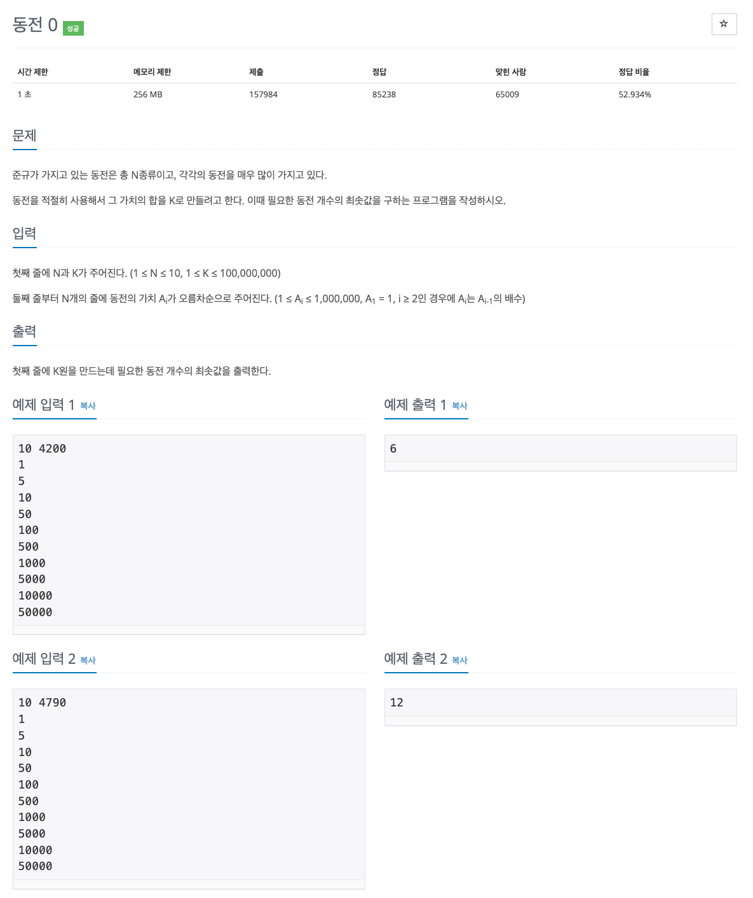

## [동전 0](https://www.acmicpc.net/problem/11047)

### 요구사항


### 문제풀이
* 시간 제한 1초, 메모리 제한 256MB로 시간 제한과 메모리 제한에 구애받는 문제는 아니다.
* N은 10보다 작거나 같고, K는 100,000,000보다 작거나 같은데 즉, 완전탐색을 해도 시간제한에 걸리지 않는다.
* 해당 문제는 `최선의 선택지를 선택`하는 것으로 그리디 알고리즘 문제인 것을 알 수 있다.
* 주어진 동전을 합쳐서 K의 값을 구해야하는데 이는 단순히 K보다 작은 동전들을 조합해서 가장 적은 수의 동전으로 결과 값을 도출해야 한다.

### 코드
* 과거 코드
```java
import java.util.Scanner;

public class Main {

    public static void main(String[] args) {
        Scanner sc = new Scanner(System.in);

        int N = sc.nextInt();
        int K = sc.nextInt();
        int[] A = new int[N];

        for (int i = 0; i < N; i++) {
            A[i] = sc.nextInt();
        }

        int count = 0;

        for (int i = N - 1; i >= 0; i--) {
            if (A[i] <= K) { // 현재 동전의 가치가 K보다 작거나 같으면 구성에 추가
                count += (K / A[i]);
                K = K % A[i]; // K를 현재 동전을 사용하고 남은 금액으로 갱신
            }
        }

        System.out.println(count);
    }
}
```
* 현재 코드
```kotlin
import java.io.BufferedReader
import java.io.InputStreamReader
import java.util.*

fun main() {
    val br = BufferedReader(InputStreamReader(System.`in`))
    val st = StringTokenizer(br.readLine())

    val n = st.nextToken().toInt()
    var k = st.nextToken().toInt()

    val coins = IntArray(n) {
        br.readLine().toInt()
    }

    var result = 0

    for (i in n - 1 downTo 0) {
        result += k / coins[i]
        k %= coins[i]
    }

    println(result)
}
```