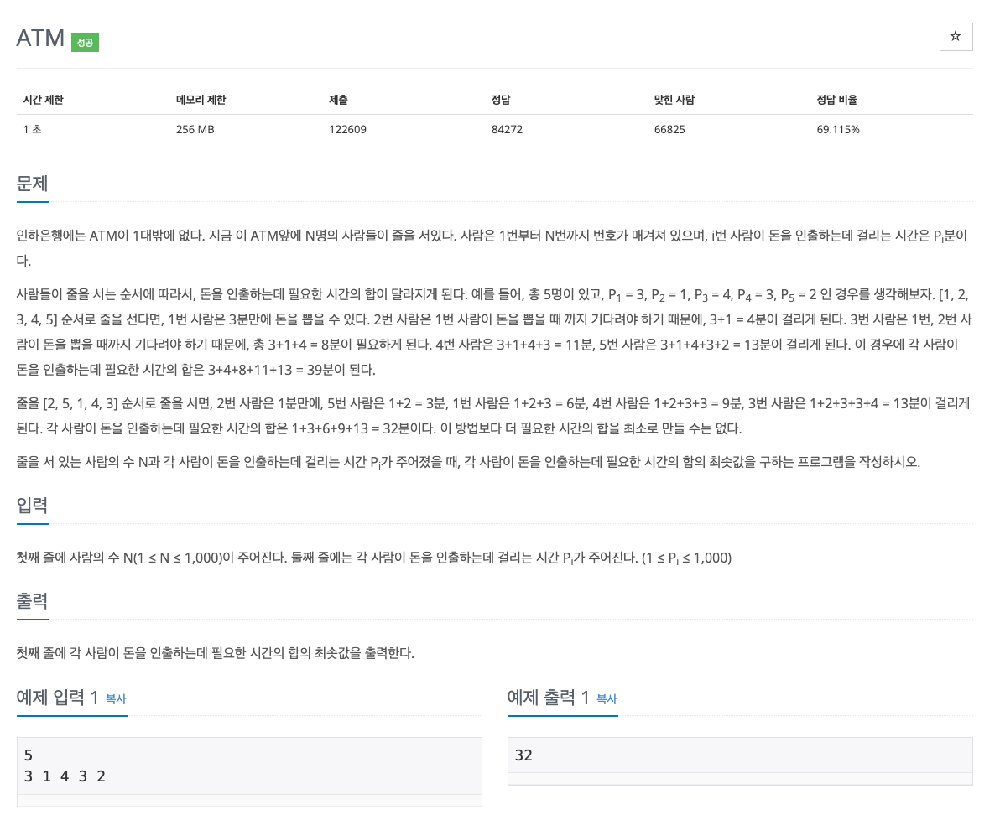

## [ATM](https://www.acmicpc.net/problem/11399)

### 요구사항


### 문제풀이
* 시간 제한 1초, 256MB이며 N 값은 1,000 이하로 시간 복잡도에 제약이 걸린 문제는 아니다.
* ATM은 1대이고 순차적으로 인출을 하는데, 누적합으로 계산되기 때문에 시간이 적게 걸리는 사람이 앞에 설 수록 시간의 합이 적어진다.
* 즉, 정렬을 한번하고 모든 값을 순차적으로 더해주면 된다.

### 코드
```
import java.io.BufferedReader
import java.io.InputStreamReader
import java.util.StringTokenizer

fun main() {
    val br = BufferedReader(InputStreamReader(System.`in`))

    val n = br.readLine().toInt()
    val arr = IntArray(n)

    val st = StringTokenizer(br.readLine())

    for (i in 0 until n) {
        arr[i] = st.nextToken().toInt()
    }

    arr.sort()

    var previous = 0
    var result = 0

    for (i in arr.indices) {
        result += previous + arr[i]
        previous += arr[i]
    }

    println(result)
}
```