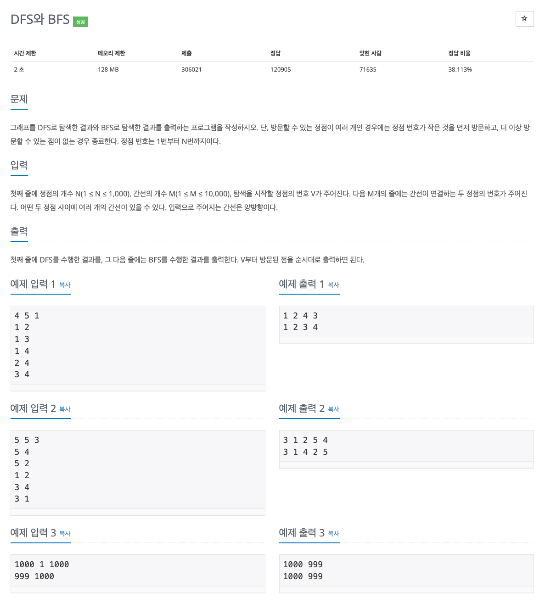

## [DFS와 BFS](https://www.acmicpc.net/problem/1260)

### 요구사항


### 문제풀이
* 시간 제한 2초, 메모리 제한 128MB, 정점의 개수 1,000개 이하, 간선의 개수 10,000개 이하로 연산 횟수를 O(N²)로 시간 제한이 걸린 문제는 아니다.
* DFS는 깊이 우선 탐색, BFS는 너비 우선 탐색으로 둘 다 그래프 문제에 나오는 유형이다. 
* DFS는 루트 노드(혹은 다른 임의의 노드)에서 시작해서 다음 분기로 넘어가기 전에 해당 분기를 완벽하게 탐색하는 방법으로 보통 스택, 재귀로 구현하고 미로 같은 문제에 어울린다.
* BFS는 인접한 노드를 먼저 탐색하고 시작 정점에서 먼저 방문하고 멀리 떨어져 있는 정점을 나중에 방문하는 순회 방법으로 LinkedList, 큐로 구현하는 방식이 많으며, 최단 경로를 구하는 문제에 어울린다.
* 단순히 모든 정점을 방문하는 문제의 경우 두 가지 방법으로 모두 풀 수 있으나 검색 속도는 BFS가 빠르고, 구현 방법은 DFS가 좀 더 간단하다.

### 코드
* 과거 코드
```java
import java.util.*;

public class Main {

    static boolean visited[];

    static ArrayList<Integer>[] A;

    public static void main(String[] args) {
        Scanner sc = new Scanner(System.in);

        int N = sc.nextInt(); // 노드 개수
        int M = sc.nextInt(); // 에지 개수
        int Start = sc.nextInt(); // 시작점

        A = new ArrayList[N + 1];

        for (int i = 1; i <= N; i++) {
            A[i] = new ArrayList<Integer>();
        }

        for (int i = 0; i < M; i++) {
            int S = sc.nextInt();
            int E = sc.nextInt();
            A[S].add(E);
            A[E].add(S);
        }
        // 번호가 작은 것을 먼저 방문하기 위해 정렬하기
        for (int i = 1; i <= N; i++) {
            Collections.sort(A[i]);
        }

        visited = new boolean[N + 1]; // 방문 배열 초기화하기
        DFS(Start);
        System.out.println();

        visited = new boolean[N + 1]; // 방문 배열 초기화하기
        BFS(Start);
        System.out.println();
    }

    public static void DFS(int Node) { // DFS 구현하기
        System.out.print(Node + " ");

        visited[Node] = true;

        for (int i : A[Node]) {
            if (!visited[i]) {
                DFS(i);
            }
        }
    }

    private static void BFS(int Node) { // DFS 구현하기
        Queue<Integer> queue = new LinkedList<Integer>();
        queue.add(Node);

        visited[Node] = true;

        while (!queue.isEmpty()) {
            int now_Node = queue.poll();

            System.out.print(now_Node + " ");

            for (int i : A[now_Node]) {
                if (!visited[i]) {
                    visited[i] = true;
                    queue.add(i);
                }
            }
        }
    }
}
```
* 현재 코드
```kotlin
import java.io.BufferedReader
import java.io.BufferedWriter
import java.io.InputStreamReader
import java.io.OutputStreamWriter
import java.util.LinkedList
import java.util.Queue
import java.util.StringTokenizer

fun main() {
    val br = BufferedReader(InputStreamReader(System.`in`))
    val bw = BufferedWriter(OutputStreamWriter(System.out))
    val st = StringTokenizer(br.readLine())
    val n = st.nextToken().toInt()
    val m = st.nextToken().toInt()
    val v = st.nextToken().toInt()

    val graph = Array<Node?>(n + 1) { null }
    var visited = BooleanArray(n + 1)
    val sb = StringBuilder()

    for (i in 0 until m) {
        val st2 = StringTokenizer(br.readLine())
        val from = st2.nextToken().toInt()
        val to = st2.nextToken().toInt()

        if (graph[from] == null) {
            graph[from] = Node(to)
        } else {
            graph[from]!!.insert(Node(to))
        }
        if (graph[to] == null) {
            graph[to] = Node(from)
        } else {
            graph[to]!!.insert(Node(from))
        }
    }

    visited = BooleanArray(n + 1)
    dfs(v, graph, visited, sb)
    sb.append('\n')

    visited = BooleanArray(n + 1)
    bfs(v, graph, visited, sb)

    bw.write(sb.toString().trim())
    bw.flush()
    bw.close()
}

fun bfs(v: Int, graph: Array<Node?>, visited: BooleanArray, sb: StringBuilder) {
    val queue: Queue<Int> = LinkedList()
    queue.add(v)
    visited[v] = true
    sb.append("$v ")

    while (queue.isNotEmpty()) {
        val cur = queue.poll()

        var tmp = graph[cur]
        while (tmp != null) {
            if (!visited[tmp.idx]) {
                sb.append("${tmp.idx} ")
                visited[tmp.idx] = true
                queue.add(tmp.idx)
            }
            tmp = tmp.next
        }
    }
}

fun dfs(cur: Int, graph: Array<Node?>, visited: BooleanArray, sb: StringBuilder) {
    visited[cur] = true
    sb.append("$cur ")

    var tmp = graph[cur]
    while (tmp != null) {
        if (!visited[tmp.idx]) {
            dfs(tmp.idx, graph, visited, sb)
        }
        tmp = tmp.next
    }
}

class Node(var idx: Int) {
    var next: Node? = null

    fun insert(node: Node) {
        if (idx > node.idx) {
            val tmp = idx
            idx = node.idx
            node.idx = tmp
            node.next = next
            next = node
        } else if (next == null) {
            next = node
        } else {
            next!!.insert(node)
        }
    }
}
```