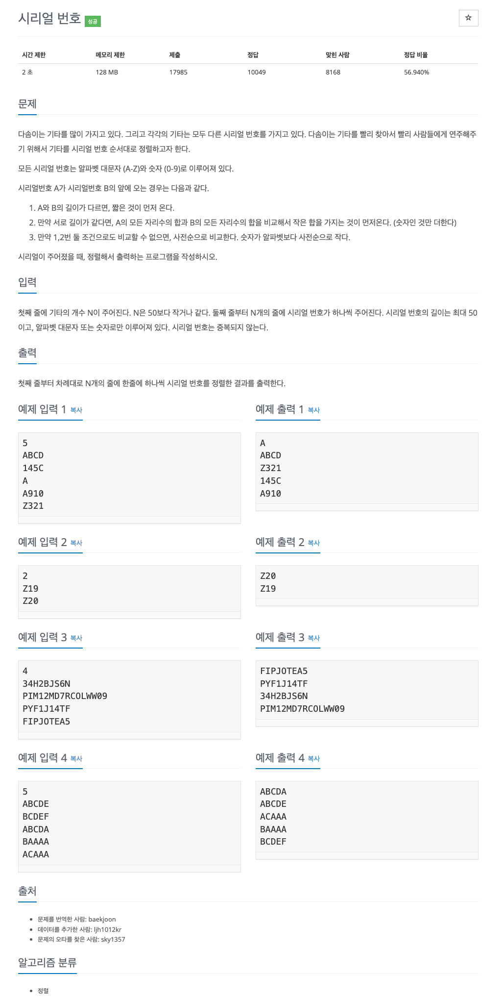

## [시리얼 번호](https://www.acmicpc.net/problem/1431)


### 문제풀이
* 주어진 입력 값들은 특정한 요구 조건에 따라서 정렬을 하고 순차적으로 출력해야한다.
* 정렬 순서 조건은 문자열의 길이, 숫자 합, 사전 순으로 정렬을 한다.

### 코드
* 1차 코드 (208ms)
* 직접 구현한 Comparator의 경우 문자열이 길거나 비교할 문자열의 수가 많을 때 성능 저하를 초래할 수 있다.
* 코틀린에서 효율적인 정렬?
  * Kotlin 표준 라이브러리의 sortWith, compareBy와 thenBy
    * sortWith와 compareBy를 사용하면, Kotlin의 정렬 로직을 효율적으로 활용
    * compareBy와 thenBy는 성능이 좋고, 최적화된 알고리즘을 사용하여 비교 작업을 수행
```
import java.io.BufferedReader
import java.io.BufferedWriter
import java.io.InputStreamReader
import java.io.OutputStreamWriter

fun main() {
    val bufferedReader = BufferedReader(InputStreamReader(System.`in`))
    val bufferedWriter = BufferedWriter(OutputStreamWriter(System.out))

    val n = bufferedReader.readLine().toInt()

    val guitars = Array(n) {
        bufferedReader.readLine()
    }

    guitars.sortWith(Comparator { a, b ->
        if (a.length != b.length) {
            return@Comparator a.length - b.length
        }

        val sumA = a.filter { it.isDigit() }.sumOf { it - '0' }
        val sumB = b.filter { it.isDigit() }.sumOf { it - '0' }
        if (sumA != sumB) {
            return@Comparator sumA - sumB
        }

        a.compareTo(b)
    })

    guitars.forEach {
        bufferedWriter.write(it)
        bufferedWriter.newLine()
    }

    bufferedWriter.flush()
    bufferedReader.close()
    bufferedWriter.close()
}
```
* 2차 코드
```
import java.io.BufferedWriter
import java.io.OutputStreamWriter
import java.util.Arrays

fun main() = with(System.`in`.bufferedReader()) {
    val n = readLine().toInt()
    val arr = Array(n) { readLine() }

    Arrays.sort(arr, compareBy<String> { it.length }
        .thenBy { it.sumOf { char -> if (char.isDigit()) char - '0' else 0 } }
        .thenBy { it })

    BufferedWriter(OutputStreamWriter(System.out)).use { writer ->
        arr.forEach { writer.write("$it\n") }
    }
}
```