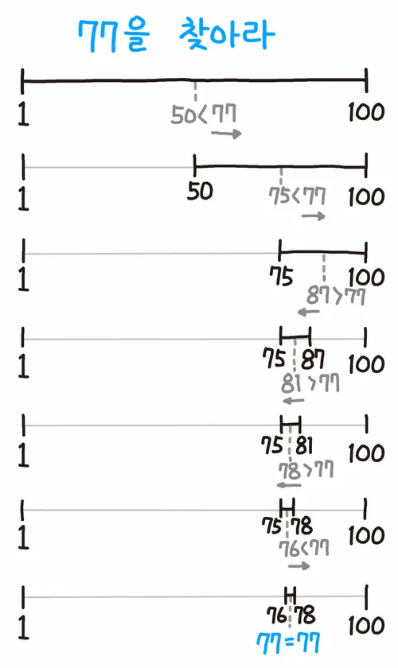

## [랜선 자르기](https://www.acmicpc.net/problem/1654)


### 문제풀이
* 주어진 랜덤한 길이의 랜선을 N개를 만들어야할 때 최적의 랜선 길이를 구해야한다.
* 브루트 포스를 통해서 완전탐색을 하고 1부터 값을 증가시켜서 최대 랜선 길이만큼 탐색을 진행해볼 수 있다.
* 하지만 주어진 랜선의 길이는 으로 2,147,483,647의 값이기 때문에 완전 탐색으로 할 경우 시간 초과가 발생한다.
* 보통 이 경우 이분(이진) 탐색을 통해서 문제를 해결해야 한다.
  * 정렬된 배열 또는 리스트에서 특정 값을 효율적으로 찾기 위한 알고리즘이고 선형탐색에 비해 빠른 탐색 속도를 제공한다.
  * 리스트의 중간 부분에 찾는 원소가 있는지 확인하고, 없으면 위쪽에 있는지 아래쪽에 있는지 판단하여 맨 앞부터 검색하거나 중간부터 검색한다.



### 코드
* 1차 코드
```
import java.io.BufferedReader
import java.io.BufferedWriter
import java.io.InputStreamReader
import java.io.OutputStreamWriter
import java.util.*

fun main() {
    val br = BufferedReader(InputStreamReader(System.`in`))
    val st = StringTokenizer(br.readLine())

    val k = st.nextToken().toInt()
    val n = st.nextToken().toInt()
    val arr = Array(k) { br.readLine().toLong() }

    var low = 1L
    var high = arr.max()

    while (low <= high) {
        val mid = (low + high) / 2
        var count = 0L

        for (i in arr.indices) {
            count += arr[i] / mid
        }

        if (count >= n) {
            low = mid + 1
        } else {
            high = mid - 1
        }
    }

    BufferedWriter(OutputStreamWriter(System.out)).use { writer ->
        writer.write((low - 1).toString())
    }
}
```
* 2차 코드
```
import java.io.BufferedReader
import java.io.BufferedWriter
import java.io.InputStreamReader
import java.io.OutputStreamWriter
import java.util.*

fun main() {
    val br = BufferedReader(InputStreamReader(System.`in`))
    val st = StringTokenizer(br.readLine())

    val K = st.nextToken().toInt()
    val N = st.nextToken().toInt()

    val arr = IntArray(K)
    var max = Int.MIN_VALUE.toLong()
    for (i in 0 until K) {
        arr[i] = br.readLine().toInt()
        max = maxOf(max, arr[i].toLong())
    }

    var low = 0L
    var high = max + 1
    var ans = Int.MIN_VALUE.toLong()

    while (low + 1 < high) {
        val mid = (low + high) / 2
        var result = 0L

        for (i in 0 until K) {
            result += arr[i] / mid
        }

        if (result >= N) {
            ans = maxOf(ans, mid)
        }

        if (result < N) {
            high = mid
        } else {
            low = mid
        }
    }

    BufferedWriter(OutputStreamWriter(System.out)).use { bw ->
        bw.write("$ans\n")
    }
}
```