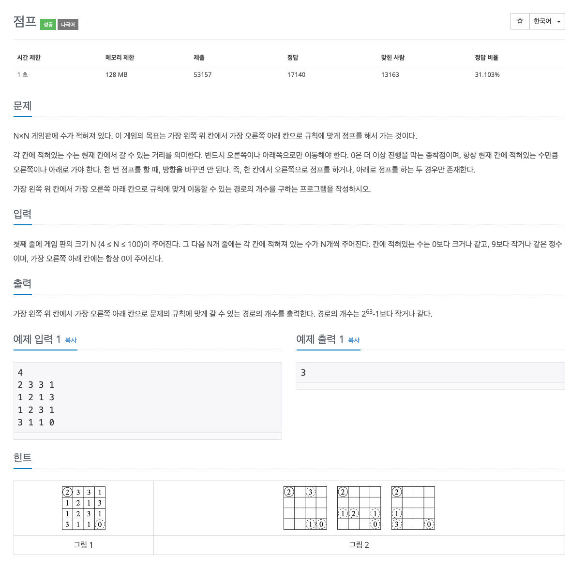

## [점프](https://www.acmicpc.net/problem/1890)

### 요구사항



### 문제풀이
* 특정한 규칙을 가진 보드에서 목표 지점까지 갈 수 있는 모든 경로의 개수를 동적 계획법(DP)을 사용해서 계산해야 한다.
* 보드 위에서 이동 규칙에 따라 오른쪽 또는 아래쪽으로 점프하고, 마지막 칸까지 도달하는 경로가 몇개인지 계산하는 문제이다.
* 코드는 크게 어렵지 않지만, 점화식을 세울 때 각 칸에 적힌 숫자만큼 오른쪽 또는 아래쪽으로 이동할 수 있고, 목표는 시작점 (0, 0)에서 도착점 (n-1, n-1)까지 도달하는 모든 가능한 경로의 개수를 구하고 이동할 수 있는 경로는 동적 계획법을 사용해 dp 배열을 채워가며 누적해나가는 방식으로 풀 수 있다는 걸 알 수 있다.
* 점프 규칙과, 초기화와 종료 조건 및 큰 수 처리를 예상해야 한다.


### 코드
```
import java.io.BufferedReader
import java.io.InputStreamReader
import java.util.StringTokenizer

fun main() {
    val br = BufferedReader(InputStreamReader(System.in))

    val n = br.readLine().toInt()
    val board = Array(n) { IntArray(n) }
    val dp = Array(n) { LongArray(n) }

    for (i in 0 until n) {
        val st = StringTokenizer(br.readLine())
        for (j in 0 until n) {
            board[i][j] = st.nextToken().toInt()
        }
    }

    dp[0][0] = 1

    for (i in 0 until n) {
        for (j in 0 until n) {
            val jump = board[i][j]
            if (jump == 0) { break }
            if (j + jump < n) dp[i][j + jump] += dp[i][j]
            if (i + jump < n) dp[i + jump][j] += dp[i][j]
        }
    }

    println(dp[n - 1][n - 1])
}
```