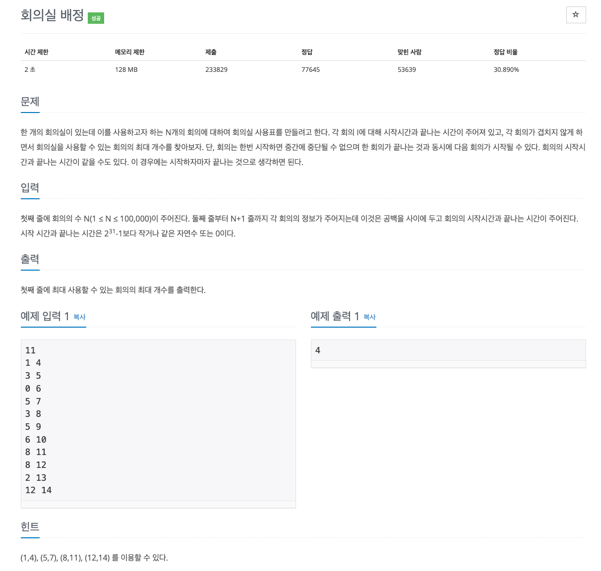

## [회의실 배정](https://www.acmicpc.net/problem/1890)

### 요구사항



### 문제풀이
* 최대한 많은 회의를 진행하기 위해 특정한 회의실 스케줄을 최적으로 찾아야 하고, 회의의 시작 시간과 종료 시간이 주어질 때, 서로 겹치지 않으면서 가장 많은 회의를 배치할 수 있는 방법 찾아야 한다.
* 회의 정보와 관련된 데이터를 저장한 후 종료 시간 순으로 정렬, 종료 시간이 같이 않을 때 시작 시간을 기준으로 정렬, 순차 탐색 시간이 겹치지 않는 회의가 나오면 선택
* 슈도코드 작성한 뒤 구체화하기

### 코드
* 과거 코드
```
import java.util.Arrays;
import java.util.Comparator;
import java.util.Scanner;

public class Main {
    public static void main(String[] args) {
        Scanner sc = new Scanner(System.in);

        int N = sc.nextInt();
        int[][] A = new int[N][2];

        for (int i = 0; i < N; i++) {
            A[i][0] = sc.nextInt();
            A[i][1] = sc.nextInt();
        }

        Arrays.sort(A, new Comparator<int[]>() {
            @Override
            public int compare(int[] S, int[] E) {
                if(S[1] == E[1]) { // 종료시간이 같을때
                    return S[0] - E[0];
                }
                return S[1] - E[1];
            }
        });

        int count = 0;
        int end = -1;
        
        for (int i = 0; i < N; i++) {
            if (A[i][0] >= end) { // 겹치지 않는 다음 회의가 나온 경우
                end = A[i][1]; // 종료 시간 업데이트하기
                count++;
            }
        }
        System.out.println(count);
    }
}
```
* 현재 코드 (크게 다르지 않으나, 읽기 성능을 향상)
```
import java.util.Arrays

fun read(): Int {
    var n = System.`in`.read() and 15
    var c: Int
    while (System.`in`.read().also { c = it } > 32) {
        n = (n shl 3) + (n shl 1) + (c and 15)
    }
    return n
}

fun main() {
    val n = read()
    val arr = Array(n) { IntArray(2) }

    for (i in 0 until n) {
        arr[i][0] = read()
        arr[i][1] = read()
    }

    // 회의 종료 시간이 가장 빠른 것을 앞으로, 종료 시간이 같다면 시작 시간이 빠른 것을 앞으로 정렬
    Arrays.sort(arr) { a, b -> if (a[1] != b[1]) a[1] - b[1] else a[0] - b[0] }

    var result = 1
    var endtime = arr[0][1]

    // 회의 종료 시간 이후 가장 빨리 시작하는 회의를 찾으며 진행
    for (i in 1 until n) {
        if (arr[i][0] >= endtime) {
            result++
            endtime = arr[i][1]
        }
    }

    println(result)
}
```