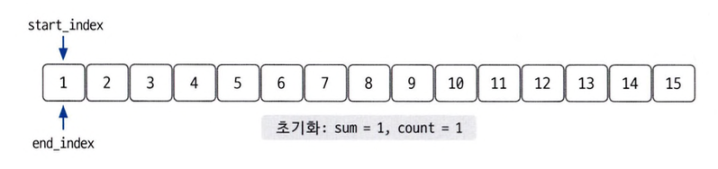

## [수들의 합 2](https://www.acmicpc.net/problem/2003)

### 문제풀이
* N개로 이루어진 수열의 값을 i번 째부터 j번 째까지 수의 합이 M이 되는 경우의 수를 출력하면 된다.
* 해당 문제의 시간 제한의 0.5초, 수열의 크기는 N은 최대 10,000개이고 단순히 값을 구하기 위해서는 O(n²)을 나타낸다.
* 100,000,000번의 최대 계산이 필요하고, 이를 해결하기 위해서 별도의 방법을 사용해야 한다.
* 시간 복잡도를 분석해서 사용할 알고리즘의 범위를 줄여야 하고, O(n)의 시간 복잡도 알고리즘을 사용해야 한다.
* 보통 `연속된 자연수의 합을 구하는 것`은 시작 인덱스와 종료 인덱스를 지정하여 연수된 수를 표현하기 때문에 투 포인터 알고리즘을 사용한다.
* (백준 2018번 풀어보기)


#### 투 포인터 알고리즘 이동 원칙
* sum > N: sum = sum - start_index; start_index++;
* sum < N: end_index++; sum = sum + end_index;
* sum == N: end_index++; sum = sum + end_index; count++;

### 코드
```
import java.io.BufferedWriter
import java.io.InputStreamReader
import java.io.OutputStreamWriter
import java.util.StringTokenizer

fun main() {
    val br = BufferedReader(InputStreamReader(System.`in`))
    var st = StringTokenizer(br.readLine())

    val n = st.nextToken().toInt()
    val m = st.nextToken().toInt()

    st = StringTokenizer(br.readLine())

    val arr = IntArray(n).apply {
        repeat(n) {
            this[it] = st.nextToken().toInt()
        }
    }

    var left = 0
    var right = 0
    var sum = 0
    var result = 0

    while (right <= n) {
        if (sum >= m) {
            sum -= arr[left++]
        } else {
            if (right == n) {
                break
            }
            sum += arr[right++]
        }

        if (sum == m) {
            result++
        }
    }

    BufferedWriter(OutputStreamWriter(System.out)).use { bw ->
        bw.write(result.toString())
    }
}
```