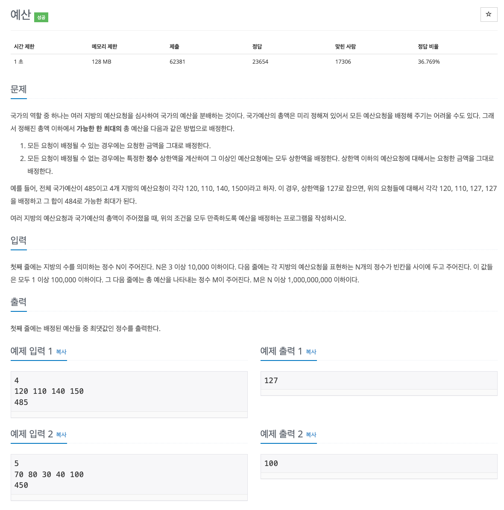

## [예산](https://www.acmicpc.net/problem/2512)


### 문제풀이
* 시간 제한 1초, 메모리 제한 128MB고 N은 10,000이하 M은 100,000,000이하다, 단순히 브루트 포스를 사용하면 시간 제한을 넘길 거라고 예측되기 때문에 다른 알고리즘을 풀어야한다.
* 문제의 지문을 읽어보면 주어진 숫자(예산) 안에서 특정한 값을 찾아야하는 문제기 때문에 이분 탐색에 어울린다.
* 해당 문제는 `주어진 범위에서 원하는 조건을 만족하는 가장 알맞은 값을 찾는 문제`를 통해서 파라메트릭 서치를 사용한다.

### 코드
```
import java.io.BufferedReader
import java.io.BufferedWriter
import java.io.InputStreamReader
import java.io.OutputStreamWriter
import java.util.*

fun main() {
    val bufferedReader = BufferedReader(InputStreamReader(System.`in`))

    val n = bufferedReader.readLine().toInt()

    var left = 0
    var right = 0

    val st = StringTokenizer(bufferedReader.readLine())

    val arr = IntArray(n).apply {
        repeat(n) {
            val value = st.nextToken().toInt()
            this[it] = value
            right = Math.max(right, value)
        }
    }

    val m = bufferedReader.readLine().toInt()

    while (left <= right) {
        val mid = (left + right) / 2
        var budget = 0L

        for (i in 0 until n) {
            budget += if (arr[i] > mid) mid
            else arr[i]
        }
        if (budget <= m) {
            left = mid + 1
        } else {
            right = mid - 1
        }
    }

    BufferedWriter(OutputStreamWriter(System.out)).use { bw ->
        bw.write(right.toString())
    }
}
```