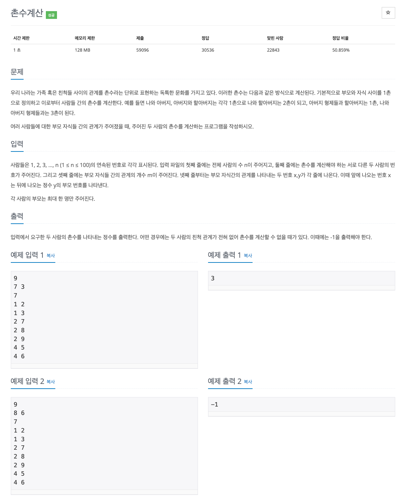

## [촌수계산](https://www.acmicpc.net/problem/2644)

### 요구사항



### 문제풀이
* BFS 또는 DFS 로 풀어야하는 문제이고, 속도를 높이기 위해서 BFS 로 풀었다.
* 첫 번째 줄에는 전체 사람의 수, 두 번째 줄에는 촌수를 계산하는 서로 다른 두 사람의 번호, 셋째 줄에는 부모 자식들의 관계를 나타내는 개수를 그 이후로는 부모 자식간의 관계를 나타내는 번호를 표시한다 (앞에 나오는 숫자가 뒤에 나오는 숫자의 부모 번호를 의미), 각 사람의 부모는 최대 한명이다.
* 관계를 모두 그래프 값에 저장한 뒤 BFS 를 통해서 각 관계들의 값을 계산한다.
* 안접하고 방문하지 않은 노드인 경우 탐색을 하고, 큐에 다시 추가한다, 그리고 관계를 저장하는 배열에 촌수를 + 1을 증가시킨다.
* 두 번째 줄의 시작되는 값으로 부터 출발해서 모든 인접 노드를 계산하면 결국 자식의 노드의 방문한 값이 나오게 된다.

### 코드
```kotlin
import java.util.*
import java.io.*

fun main() {
    val br = BufferedReader(InputStreamReader(System.`in`))

    val n = br.readLine().toInt()
    val dist = IntArray(n + 1)
    val graph = Array(n + 1) { IntArray(n + 1) }

    val st = StringTokenizer(br.readLine())
    val start = st.nextToken().toInt()
    val end = st.nextToken().toInt()

    val line = br.readLine().toInt()

    repeat(line) {
        val edge = StringTokenizer(br.readLine())
        val a = edge.nextToken().toInt()
        val b = edge.nextToken().toInt()
        graph[a][b] = 1
        graph[b][a] = 1
    }

    bfs(start, graph, dist)

    println(if (dist[end] == 0) -1 else dist[end])
}

fun bfs(start: Int, graph: Array<IntArray>, dist: IntArray) {
    val queue: Queue<Int> = LinkedList()
    queue.add(start)

    while (queue.isNotEmpty()) {
        val current = queue.poll()

        for (i in graph.indices) {
            if (graph[current][i] == 1 && dist[i] == 0) {
                queue.add(i)
                dist[i] = dist[current] + 1
            }
        }
    }
}
```