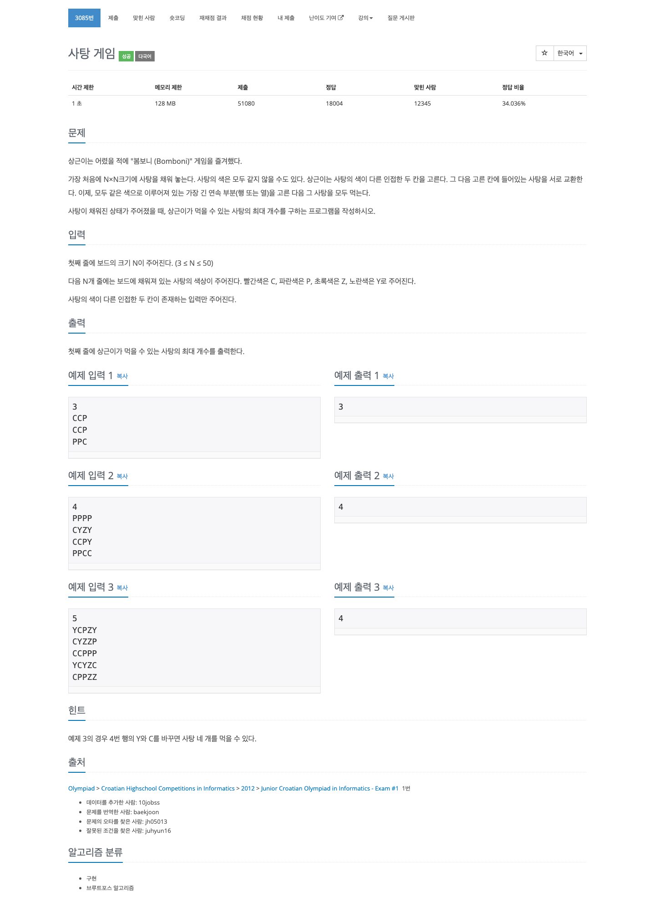

## [사탕 게임](https://www.acmicpc.net/problem/3085)


#### 문제풀이
* 시간 제한 1초, 메모리 128MB, 주어진 N 값은 50 이하다.
* N * N 의 경우 최대 50 * 50을 의미하기 때문에 단순히 계산해볼 때 상하좌우 모든 계산이 들어가도 5^4이기 때문에 20,000,000 이하기 때문에 충분하다.
* 지문을 보면 인접한 두 칸을 고르기 때문에, 오른쪽과 아래쪽을 스왑하면서 비교를 진행한다.

### 코드
```
import java.io.BufferedReader
import java.io.InputStreamReader

fun main() {
    val br = BufferedReader(InputStreamReader(System.`in`))
    val n = br.readLine().toInt()
    val arr = Array(n) { br.readLine().toCharArray() }
    var max = 0

    for (i in 0 until n) {
        for (j in 0 until n) {
            if (j < n - 1) {
                swap(arr, i, j, i, j + 1)
                max = maxOf(max, getMax(arr, i, j))
                max = maxOf(max, getMax(arr, i, j + 1))
                swap(arr, i, j, i, j + 1)
            }
            if (i < n - 1) {
                swap(arr, i, j, i + 1, j)
                max = maxOf(max, getMax(arr, i, j))
                max = maxOf(max, getMax(arr, i + 1, j))
                swap(arr, i, j, i + 1, j)
            }
        }
    }

    println(max)
}

fun getMax(arr: Array<CharArray>, y: Int, x: Int): Int {
    var col = 0
    var row = 0
    val tmp = arr[y][x]

    for (j in x + 1 until arr.size) {
        if (arr[y][j] != tmp) break
        col++
    }
    for (j in x - 1 downTo 0) {
        if (arr[y][j] != tmp) break
        col++
    }

    for (i in y + 1 until arr.size) {
        if (arr[i][x] != tmp) break
        row++
    }
    for (i in y - 1 downTo 0) {
        if (arr[i][x] != tmp) break
        row++
    }

    return maxOf(col + 1, row + 1)
}

fun swap(arr: Array<CharArray>, i: Int, j: Int, i2: Int, j2: Int) {
    val tmp = arr[i][j]
    arr[i][j] = arr[i2][j2]
    arr[i2][j2] = tmp
}
```