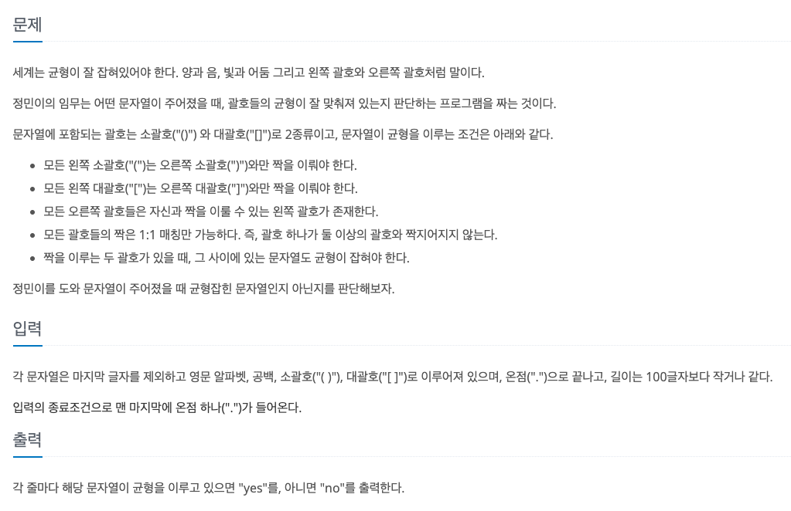

## [iSharp](https://www.acmicpc.net/problem/3568)
### 요구사항


* 시간 제한 1초, 메모리 제한 128MB, 길이는 100글자 이하

### 문제풀이
* 특정 조건에 부합하는 문자가 시작됬을 때 끝나는 조건도 특정 조건에 부합하는 문자로 종료되어야 한다.
* 즉, 스택으로 문제를 풀어야하며 후입선출 LIFO 를 사용하는 전형적인 문자열 문제이다.
* 괄호를 열 때 스택에 추가를 하고, 닫는 괄호일 때 스택에서 제거를 한다.
* 하지만, 스택이란 자료구조가 편하게 풀수는 있지만 알고리즘 상에서 정말 빠른가는 아니기 때문에 배열로 스택을 구현해서 문제를 풀었다.

### 코드
* 1차 시도
```
import java.io.BufferedReader
import java.io.BufferedWriter
import java.io.InputStreamReader
import java.io.OutputStreamWriter
import java.util.Stack

fun main() {
    val bufferedReader = BufferedReader(InputStreamReader(System.`in`))
    val bufferedWriter = BufferedWriter(OutputStreamWriter(System.out))

    while (true) {
        val str = bufferedReader.readLine() ?: break
        if (str == ".") break

        val stack = Stack<String>()
        val sentence = str.toCharArray()

        for (char in sentence) {
            val word = char.toString()
            when (word) {
                "(" -> stack.push(word)
                "[" -> stack.push(word)
                ")" -> {
                    if (stack.isNotEmpty() && stack.peek() == "(") {
                        stack.pop()
                    } else {
                        stack.push(word)
                    }
                }

                "]" -> {
                    if (stack.isNotEmpty() && stack.peek() == "[") {
                        stack.pop()
                    } else {
                        stack.push(word)
                    }
                }
            }
        }

        if (stack.isEmpty()) {
            bufferedWriter.write("yes\n")
        } else {
            bufferedWriter.write("no\n")
        }
    }

    bufferedWriter.flush()
    bufferedReader.close()
}
```
* 2차 시도
```
import java.io.BufferedReader
import java.io.BufferedWriter
import java.io.InputStreamReader
import java.io.OutputStreamWriter

fun main() {
    val br = BufferedReader(InputStreamReader(System.`in`))
    val bw = BufferedWriter(OutputStreamWriter(System.out))

    while (true) {
        val input = br.readLine() ?: break
        if (input == ".") break

        bw.write(isBalance(input))
    }

    bw.flush()
    bw.close()
}

fun isBalance(s: String): String {
    val stack = CharArray(s.length)
    var index = -1

    for (char in s) {
        when (char) {
            '(', '[' -> {
                if (index + 1 < stack.size) {
                    stack[++index] = char
                }
            }
            ')' -> {
                if (index >= 0 && stack[index] == '(') {
                    index--
                } else {
                    return "no\n"
                }
            }
            ']' -> {
                if (index >= 0 && stack[index] == '[') {
                    index--
                } else {
                    return "no\n"
                }
            }
        }
    }

    return if (index == -1) "yes\n" else "no\n"
}
```