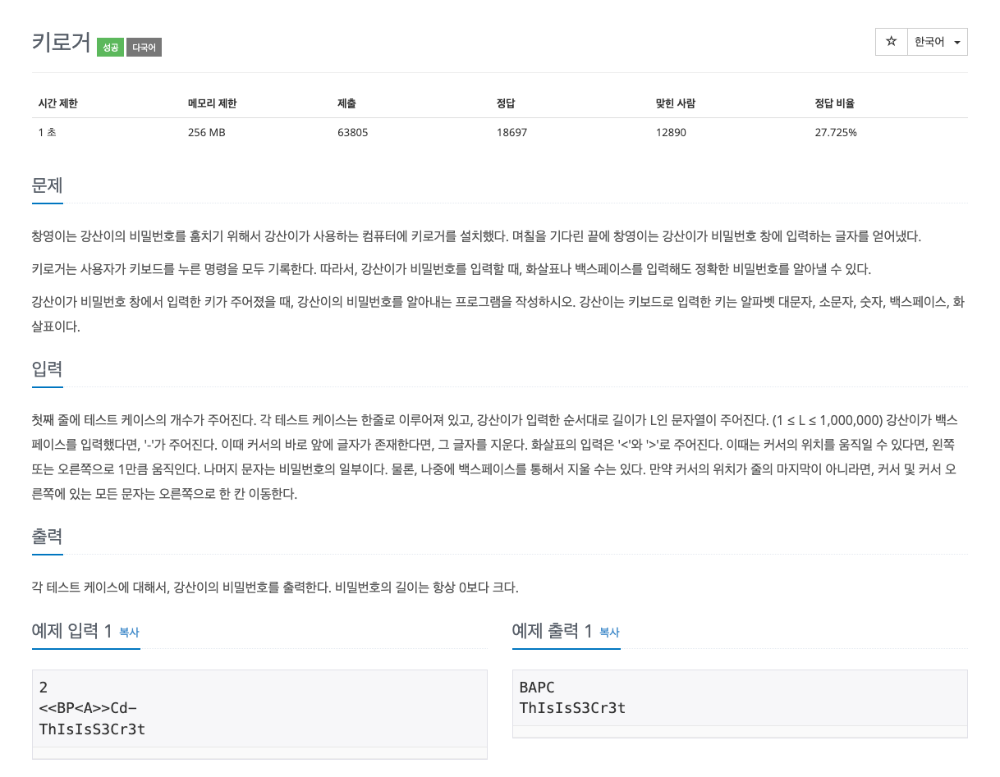

## [키로거](https://www.acmicpc.net/problem/5397)
### 요구사항


### 문제풀이
* 시간 제한 1초, 메모리 제한 256MB 로 문자열의 길이는 1,000,000이기 때문에 단순 문자열 계산으로 이루어질 경우 시간 초과가 나올 확률이 크다.
* 케이스를 보면 입력은 단순히 삽입, 그리고 < 와 > 이동에 따라 커서가 이동하면서 중간의 삽입 연산이 이루어진다.
* 즉 커서의 위치에 따라 스택을 단순히 2개로 구현해 합쳐주면 결과 값이 나온다는 걸 알 수 있다.
* 하지만, 스택의 경우 문제를 단순화해서 풀 수 있지만, 속도가 빠르진 못해서 배열 연산을 통해서 풀면 속도를 좀 더 보장할 수 있다.

### 코드
* 1차 코드
```
import java.io.BufferedReader
import java.io.InputStreamReader
import java.util.Stack

fun main() {
    val bufferedReader = BufferedReader(InputStreamReader(System.`in`))
    val t = bufferedReader.readLine().toInt()

    repeat(t) {
        val input = bufferedReader.readLine()
        val leftStack = Stack<Char>()
        val rightStack = Stack<Char>()

        for (char in input) {
            when (char) {
                '<' -> if (leftStack.isNotEmpty()) rightStack.push(leftStack.pop())
                '>' -> if (rightStack.isNotEmpty()) leftStack.push(rightStack.pop())
                '-' -> if (leftStack.isNotEmpty()) leftStack.pop()
                else -> leftStack.push(char)
            }
        }

        val password = StringBuilder()

        while (leftStack.isNotEmpty()) {
            rightStack.push(leftStack.pop())
        }
        while (rightStack.isNotEmpty()) {
            password.append(rightStack.pop())
        }

        println(password.toString())
    }
}
```
* 2차 코드
```
import java.io.BufferedReader
import java.io.InputStreamReader

fun main() {
    val br = BufferedReader(InputStreamReader(System.`in`))
    val t = br.readLine().toInt()
    val sb = StringBuilder()

    for (tc in 0 until t) {
        var cursor = -1
        var tempCursor = -1

        val str = br.readLine()
        val len = str.length

        val right = CharArray(1000000)
        val left = CharArray(1000000)

        for (i in 0 until len) {
            val ch = str[i]

            when (ch) {
                '<' -> if (cursor != -1) left[++tempCursor] = right[cursor--]
                '>' -> if (tempCursor != -1) right[++cursor] = left[tempCursor--]
                '-' -> if (cursor != -1) cursor--
                else -> right[++cursor] = ch
            }
        }

        for (i in 0..cursor) {
            sb.append(right[i])
        }
        while (tempCursor != -1) {
            sb.append(left[tempCursor--])
        }
        sb.append('\n')
    }
    println(sb)
}
```