# 10장 실시간 게임 순위표

## 1. 문제 이해 및 설계 범위 확정
```
Q1. 순위표의 점수는 어떻게 계산하나요?
→ 사용자는 경기에서 승리 시 포인트를 얻고 포인ㅌ로 점수를 계산하면 됩니다, 사용자는 경기에서 이길 때마다 1점의 포인트를 추가로 획득합니다.

Q2. 모든 플레이어가 순위표에 포함되어야 하나요?
→ 네

Q3. 한 순위표는 얼마 동안이나 유효한가요?
→ 매달 새로운 토너먼트를 시작할 때마다 새로운 순위표를 만듭니다.

Q4. 상위 10명의 사용자만 신경 써도 되나요?
→ 상위 10명의 사용자와 특정 사용자의 순위를 순위표에 표시할 수 있어야 하고, 시간이 된다면 어떤 사용자보다 4순위 위 또는 아래에 있는 사용자들까지 반화하는 방법도 논의해보죠.

Q5. 토너먼트에 참가하는 사용자는 몇 명인가요?
→ 평균 일간 활성 사용자 수(DAU) 500만 명, 월간 활성 사용자 수(MAU) 2,500만 명으로 가정하겠습니다.

Q6. 토너먼트 기간 동안 평균 몇 경기가 진행되나요?
→ 각 선수는 하루 평균 10경기를 치릅니다.

Q7. 순위표가 실시간이어야 하나요?
→ 실시간 또는 실시간에 가깝게 결과를 표시했으면 좋겠고, 누적된 결과 이력을 보여주는 것은 바람직하지 않습니다.
```

### 기능 요구사항
* 순위표에 상위 10명의 플레이어를 표시한다.
* 특정 사용자의 순위를 표시한다.
* 어떤 사용자보다 4순위 위와 아래에 있는 사용자를 표시한다. (보너스 문제)

### 비기능 요구사항
* 점수 업데이트는 실시간으로 순위표에 반영한다.
* 일반적인 확장성, 가용성 및 안정성 요구사항

### 개략적 규모 추정
* 초당 평균 50명의 사용자가 게임을 플레이한다.
  * 24시간동안 게임 중인 사용자 수가 고르게 분포된다고 가정
  * DAU는 500만 명으로 가정
* 최대 250명의 사용자를 감당할 수 있어야 한다.
  * 최대 부하는 평균의 5배로 가정
* 사용자 점수 획득 QPS는 500 가량, 최대 QPS는 2500 가량이다.
  * 한 사용자가 하루 평균 10개의 게임을 플레이한다고 가정
  * 500 * 5 (최대 부하 5배)
* 상위 10명 순위표 가져오기 QPS는 약 50이다.
  * 각 사용자가 하루에 한 번 게임을 연다고 가정
  * 상위 10명 순위표는 사용자가 처음 게임을 열 때만 표시한다고 가정

## 2. 개략적 설계안 제시 및 동의 구하기

### API 설계
* 개략적인 수준에서 대략 세 가지 API가 필요하다.

> POST /v1/scores
* 사용자가 게임에서 승리하면 순위표에서 사용자의 순위를 갱신한다.

> GET /v1/scores
* 순위표에서 상위 10명의 플레이어를 가져온다.

> GET /v1/scores/{:user_id}
* 특정 사용자의 순위를 가져온다.

### 개략적 설계안
* 게임 서비스는 사용자가 게임을 플레이할 수 있도록 한다.
* 순위표 서비스는 순위표를 생성하고 표시하는 역할을 담당한다.

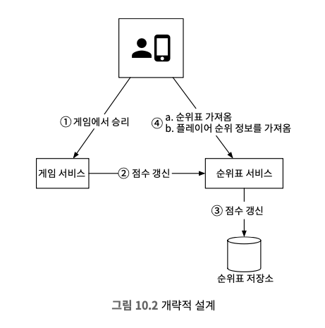

1. 사용자가 게임에서 승리하면 클라이언트는 게임 서비스에 요청을 보낸다.
2. 게임 서비스는 해당 승리가 정당하고 유효한 것인지 확인한 다음 순위표
서비스에 점수 갱신 요청을 보낸다.
3. 순위표 서비스는 순위표 저장소에 기록된 해당 사용자의 점수를 갱신한다.
4. 해당 사용자의 클라이언트는 순위표 서비스에 직접 요청하여 다음과 같은
데이터를 가져온다.
   * 상위 10명 순위표
   * 해당 사용자 순위

> 클라이언트가 순위표 서비스와 직접 통신해야 하나?
* 클라이언트가 점수를 정하는 방식이다.
* 사용자가 프락시를 설치하고 점수를 마음대로 바꾸는 `중간자 공격(main-in-the-middle attack)`을 할 수 있기 때문에 보안상 안전하지 않다.
* 점수는 서버가 설정해야 안전하다.

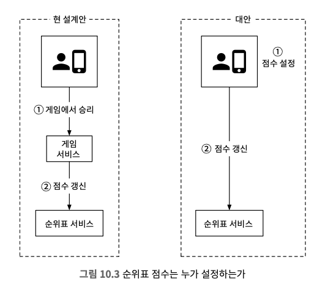

> 게임 서비스와 순위표 서버 사이에 메시지 큐가 필요한가?
* 해당 데이터가 다른 곳에서도 이용되거나 여러 기능을 지원해야 한다면(순위표 서비스, 분석 서비스, 푸시 알림 서비스 등) 카프카에 데이터를 넣는 것이 합리적일 수 있다.
* 본 설계안은 메시지 큐를 포함시키지 않았다.

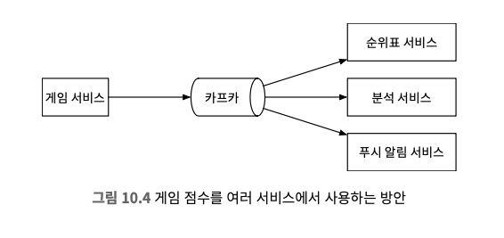

### 데이터 모델

> 관계형 데이터베이스
* 규모 확정성이 그다지 중요하지 않고 사용자 수가 많지 않은 경우에 관계형 데이터베이스를 이용할 가능성이 높다.
* 월별 순위표는 사용자 ID와 점수 열을 갖는 테이블로 표현할 수 있다.
  * 승리 시 신규 사용자에게 1점을 주고, 기존 사용자에겐 원래 점수에 1점을 더한다.
  * 순위를 결정하기 위해서 점수에 따라 테이블을 내림차순으로 정렬한다.
* 데이터가 많지 않을 때는 효과적이지만 레코드가 수백만개 정도로 많아지면 성능이 너무 나빠진다.
  * 지속적으로 변화하는 대량의 정보를 신속하게 처리하지 못해서 수백만 개 레코드에 순위를 매기려면 수십초 정도가 걸려서 실시간 애플리케이션에 적합하지 않다.
  * 데이터가 지속적으로 변경되기 때문에 캐시 도입도 불가능하다.
  * 일괄 작업으로 수행하면 RDS를 사용하는 것도 가능실시간 순위를 보여준다는 요구사항에 적합하지 않다.
  * 색인을 추가해 LIMIT 절을 사용해 스캔할 페이지를 제한해도 규모 확정성에 좋지 않고 순위표 상단에 있지 않은 사용자 순위를 간단히 찾을 수 없다.

#### 사용자가 점수를 딴 경우
* 해당 월의 순위표에 해당 사용자의 레코드가 없다면 새로운 레코드를 만들어 넣는다.
  ```
  INSERT INTO leaderboard (user_id, score) VALUEs ('mary1934’, 1);
  ```
* 이미 레코드가 있는 경우 점수 데이터를 갱신한다.
  ```
  UPDATE leaderboard set score=score + 1 where user_id='mary1934';
  ```

#### 특정 사용자 순위 검색
* 위표 테이블을 점수 기준으로 정렬한 다음 순위를 매긴다.
  ```
  SELECT (@rownum := @rownum + 1) AS rank, user_id, score FROM leaderboard
  ORDER BY score DESC;
  ```

> 레디스
* 메모리에서 동작하므로 빠른 읽기 및 쓰기가 가능하고, 순위표 시스템 설계를 해결하는데 이상적인 `정렬 집합(sorted set)`이라는 자료형을 제공한다.
* 


#### 정렬 집합이란?
* 정렬 집합은 집합처럼 고유한 원소를 저장하되, 각 원소에 점수를 연결해 이를 기준으로 오름차순 정렬하는 자료형이다. 
* 순위표와 잘 맞고 내부적으로 해시 테이블과 스킵 리스트를 사용하는데 해시 테이블은 각 사용자의 점수를 저장하고, 스킵 리스트는 특정 점수를 받은 사용자 목록을 저장해 점수 기준 정렬을 지원한다.
* 점수와 사용자 열이 있는 내림차순 정렬된 테이블로 생각할 수 있다.

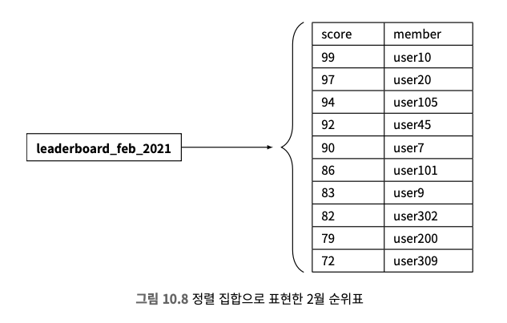

#### 시간 복잡도와 연산 속도 향상
연결 리스트의 삽입, 삭제, 검색 연산은 시간 복잡도가 \(O(n)\)인데, 이를 개선하기 위해 스킵 리스트를 사용한다.
스킵 리스트는 이진 검색처럼 빠르게 중간 지점에 도달할 수 있도록 여러 단계의 색인(index)을 추가합니다. 각 색인은 이전 색인보다 한 단계 더 많은 노드를 건너뛰며, 총 노드 수가 \(n\)일 때 색인 추가는 \(n - 1\)이 될 때까지 반복하며 데이터 양이 많아질수록 스킵 리스트의 속도 개선 효과는 더욱 두드러진다.

정렬 집합은 삽입이나 갱신 시 자동으로 모든 원소가 정렬되며, 연산의 시간 복잡도가 \(O(\log(n))\)이므로 관계형 데이터베이스보다 효율적이지만 관계형 데이터베이스에서 특정 사용자의 순위를 계산하려면 중첩 질의를 사용해야 하므로, 성능이 떨어질 수 있습니다.

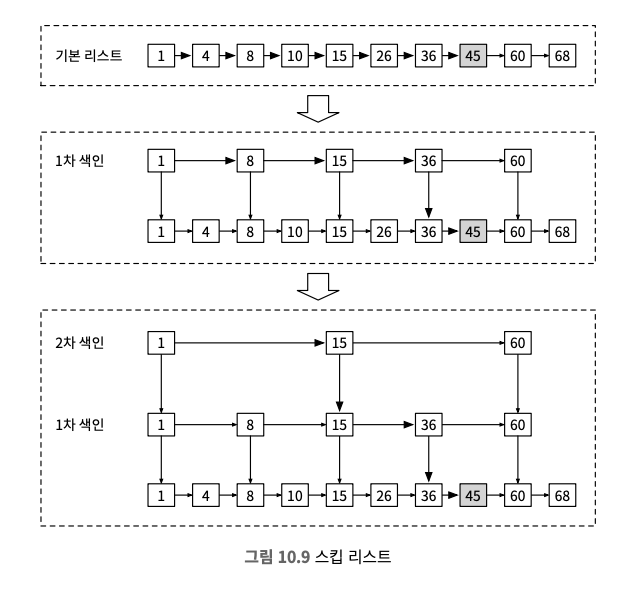

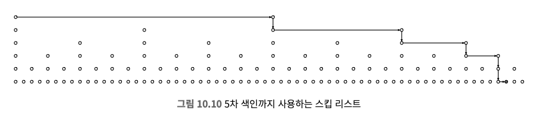

#### 레디스 정렬 집합을 사용한 구현
* ZADD: 기존에 없던 사용자를 집합에 삽입한다.
* ZINCRBY: 사용자 점수를 지정된 값만큼 증가시킨다.
* ZRANGE/ZREVRANGE: 점수에 따라 정렬된 사용자 중에 특정 범위에 드는 사용자들을 가져온다.
* ZRANK/ZREVRANK: 오름차순/내림차순 정렬하였을 때 특정 사용자의 위치를 가져온다.

#### 정렬 집합을 사용한 구현의 동작 원리
1. 사용자가 점수를 획득한 경우
   * 매월 새로운 순위표를 위한 정렬 집합을 만들고 이전 순위표는 이력 데이 터 저장소로 보낸다.
   * 사용자는 경연에서 승리하면 1점을 얻는다.
   * ZINCRBY를 호출하여 순위표상의 사용자 점수를 1만큼 증가시키거나, 아직 순 위표 세트에 없는 경우에는 해당 사용자를 순위표 집합에 추가
   * `ZINCRBY <키> <증분> <사용자>`
   * `ZINCRBY leaderboard_feb_2021 1 'mary1934'`

2. 사용자가 순위표 상위 10명을 조회하는 경우
   * 가장 높은 점수를 받은 사용자부터 내림차순으로 정렬한 결과를 가져와야 하므로 ZREVRANGE를 호출한다.
   * 각 사용자의 현재 점 수도 가져와야 하므로 MITHISCORES 속성도 전달한다.
   * `ZREVRANGE leaderboard_feb_2021 0 9 WITHSCORES`

3. 사용자가 자기 순위를 조회하는 경우
   * ZREVRANK를 호출하면 특정 사용자의 순위를 가져올 수 있다.
   * 내림차순으로 정렬한 결과를 기준으로 순위를 매겨야 하므로 ZRANK는 사용하지 않는다.
   * `ZREVRANK leaderboard_feb_2021 'mary1934'`

4. 특정 사용자 순위를 기준으로 일점 범위 내 사용자를 질의하는 경우
   * ZREVRANGE를 활용하면 특정한 사용자 전/후 순위 사용자 목록을 얻어낼 수 있다.
   * 사용자 Mal-Low007의 랭크가 361이고 그 전/후 순위 플레이이 4명씩을 가져오려면 `ZREVRANGE leaderboard_feb_2021 357 365` 명령어를 통해서 처리하면 된다.

> 저장소 요구사항
* 최소한 사용자 ID와 점수는 저장해야 한다.
* 최악의 시나리오는 2,500만명 모두 최소 한 번 이상 게임에서 승리해서 월 순위표에 올라야 하는 경우 약 650MB(26바이트 * 2,500만)의 저장공간이 레디스 캐시에 필요하지만 최신 레디스 서버 한 대만으로 충분히 저장할 수 있다.
* 데이터 영속성의 경우 노드에도 장애는 발생할 수 있고, 데이터를 디스크에 영속적으로 보관하는 옵션도 지원하지만 디스크에서 데이터를 읽어 대규모 레디스 인스턴스 재시작 시 시간이 오래 걸리기 때문에 보통 읽기 사본을 두는 식으로 구성한다.
* 관계형 테이블을 사용할 경우 2개의 테이블(사용자 및 점수)이 필요하다
  * 경연 기록과 같은 다른 게임 기능 구현에 활용할 수 있다.
  * 인프라 장애 발생 시 레디스 순위표를 복구하는 데에도 활용할 수 있다.
* 최적의 방안은 가장 자주 검색되는 상위 10명의 사용자 정보를 캐시하는 것이다.

## 3. 상세 설계

### 클라우드 서비스 사용 여부

> 자체 서비스를 이용하는 방안
* 매월 정렬 집합을 생성하여 해당 기간의 순위표를 지정하고, 집합에 사용자 및 점수 정보를 저장한다. (사용자 세부 정보는 MySQL에 저장)
* 순위표를 가져올 때 API 서버는 순위 데이터와 더불어 데이터베이스에 저장된 사용자 이름과 프로필 이미지도 가져온다.

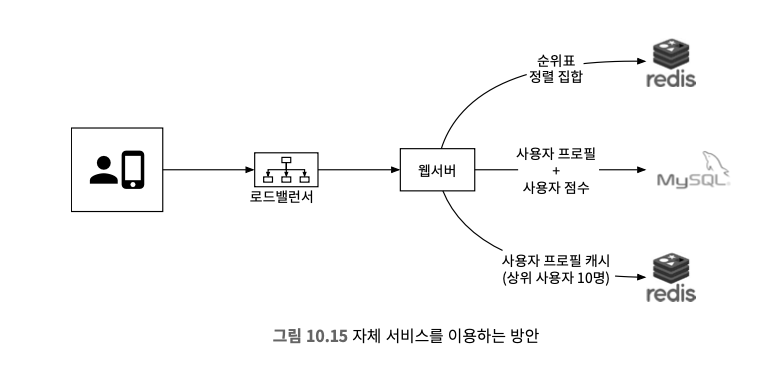

> 클라우드 서비스를 이용하는 방안
* 아마존 API 게이트웨이, AWS 람다를 사용한다.
* API 게이트웨이를 사용하면 RESTRUl API의 HTTP 엔드포인트를 정의하고 아무 백엔드 서비스에나 연결할 수 있고 AWS 람다는 서버리스 컴퓨팅 플랫폼으로 서버를 직접 준비하거나 관리할 필요 없이 코드를 실행할 수 있다.
* 람다를 사용하면 서버 인스턴스를 만들지 않아도 질의를 실행해 레디스를 호출할 수 있도록 하는 클라이언트를 제공하며 DAU(daily active users) 성장세에 맞춰 자동으로 서비스 규모를 확장할 수 있다.

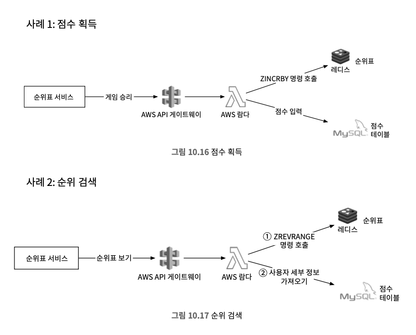

### 레디스 규모 확장
* 500백만 DAU라면 한대로도 충분하지만 100배인 5억 DAU를 처리한다고 생각하면 최악의 경우 250,000 QPS의 질의를 처리할 수 있어야 한다.
* 규모를 감당하기 위해 샤딩이 필요하다.

#### 데이터 샤딩 방안
> 고정 파티션
* 순위표에 등장하는 점수의 범위에 따라 파티션을 나누는 방안이다.
* 기능이 제대로 동작하려면 순위표 전반에 점수가 고르게 분포되어야 한다.
* 특정 사용자의 점수를 입력하거나 갱신할 때는 그 사용자가 어느 샤드에 있는지 알아야 한다. 이 정보를 MySQL 질의를 통해 계산할 수도 있지만, 사용자 ID와 점수 관계를 저장하는 2차 캐시를 사용하면 성능이 더 높아진다.
* 사용자의 점수가 높아져 다른 샤드로 옮겨야 할 경우, 기존 샤드에서 해당 사용자를 제거한 후 새 샤드로 옮겨야 한다.
* 특정 사용자의 순위를 조회하려면 해당 샤드 내의 순위뿐만 아니라 그 샤드보다 높은 점수를 포함하는 모든 샤드의 사용자 수를 알아야 하며, info keyspace 명령으로 특정 샤드의 사용자 수를 빠르게 확인할 수 있다.

> 해시 파티션
* 레디스 클러스터를 사용하는 것이고 사용자들의 점수가 특정 대역에 과도하게 모여있는 경우 효과적이다.
* 레디스 클러스터는 여러 노드에 데이터를 자동으로 샤딩하는 방법을 제공하고 각각의 키가 특정한 해시 슬롯(hash slot)에 속하도록 하는 샤딩 기법을 사용한다.
  * 총 16384개 해시 슬롯
  * CRC16(key) % 16384의 연산을 수 행하여 어떤 키가 어느 슬롯에 속하는지 계산
  * 모든 키를 재분배 하지 않아도 클러스터에 쉽게 노드를 추가하거나 제거

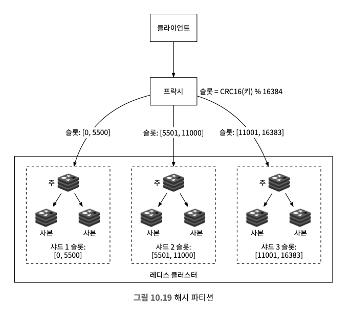

* 모든 샤드에 사용자를 질의하는 절차를 병렬화하면 지연 시간을 줄일 수 있지만, 상위 k개를 반환해야 하는 경우나 느린 파티션에서 데이터를 다 읽고 나서 계산할 수 있거나 특정 사용자의 순위를 결정할 간단한 방법이 없기 때문에 고정 파티션 방안을 사용한다.

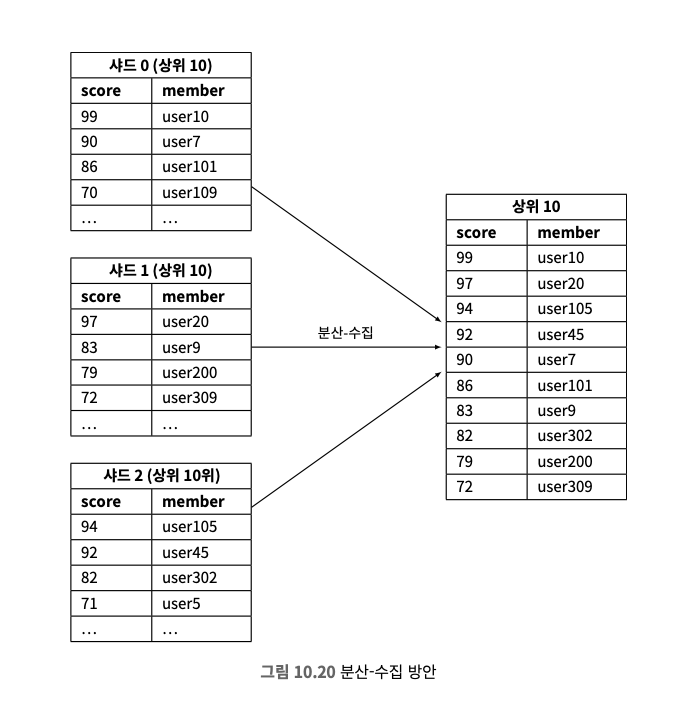

#### 레디스 노드 크기 조정
* 레디스 노드 크기를 조정할 때는 쓰기 작업이 많은 애플리케이션에 많은 메모리가 필요한데 장애 발생 시 스냅숏을 생성하는 데 필요한 모든 쓰기 연산을 감당하기 위해서이다.
* 쓰기 연산이 많은 경우, 메모리를 두 배로 할당하는 것이 안전하다.
* 레디스는 redis-benchmark라는 도구로 성능 벤치마킹을 지원하며, 여러 클라이언트가 동시에 질의를 실행하는 상황을 시뮬레이션하여 초당 요청 처리량을 측정할 수 있다.

### 대안으로 NoSQL을 사용
* 대안으로는 다음과 같은 데이베이스가 이상적이다.
  * 쓰기 연산에 최적화되어 있다.
  * 같은 파티션 내의 항목을 점수에 따라 효율적으로 정렬 가능하다.
* 좋은 후보로는 DynamoDB, 카산드라, MongoDB 등이 있지만 DynamoDB를 예로 든다.
* 순위표와 사용자 테이블을 비정규화해서 필요한 모든 정보를 담는 방식은 레코드가 많아지면 상위 점수를 찾기 위해 전체 테이블을 뒤저야 하므로 사용자가 많아지면 성능이 떨어져서 규모 확정이 어렵지만 game_name#{year-month}을 파티션 키로, 점수를 정렬 키로 사용하면 해당 문제를 피할 수 있다.

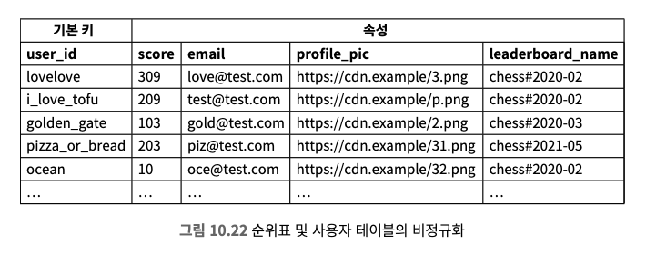

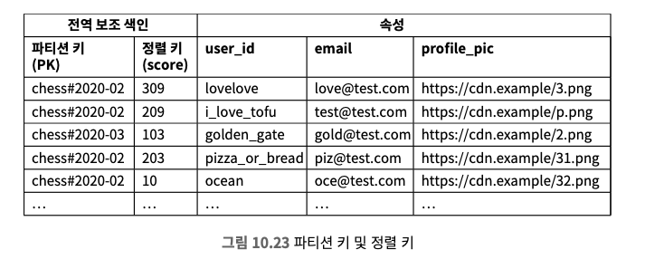

* DynamoDB는 안정 해시를 사용해 데이터를 분산하지만, 최근 데이터가 특정 파티션에 집중될 경우 핫 파티션 문제가 발생할 수 있다.
* 해결책으로 **쓰기 샤딩(write sharding)**을 사용해 데이터를 여러 파티션으로 분할하고 파티션 번호를 파티션 키에 추가할 수 있다. 하지만 이 방법은 읽기 및 쓰기 작업을 복잡하게 하므로 신중히 검토해야 한다.
* 파티션 수는 **쓰기 볼륨이나 DAU**에 따라 결정하며, 파티션이 많아지면 부하는 줄지만 최종 순위표 작성 시 복잡도가 증가할 수 있다. 벤치마킹을 통해 파티션 수의 장단점을 분석하는 것이 필요하다.
* 상위 10명의 사용자를 가져오려면 **'분산-수집'** 방법을 사용해 각 파티션에서 상위 결과를 가져온 후 애플리케이션에서 정렬한다.
* 전체 순위 대신 사용자의 **상대적 순위(백분위수)**를 계산할 수 있다. 각 샤드의 점수 분포가 유사하다고 가정하면 크론 작업을 통해 백분위수별 점수를 캐싱해 효율적으로 상대적 순위를 계산할 수 있다.

## 4. 마무리
* MySQL을 사용한 간단한 솔루션은 확장성 문제로 제외했고, 정렬 집합을 활용한 순위표 구현과 여러 Redis 캐시 샤딩으로 DAU 5억까지 확장 가능한 방법을 검토했다. 
* 또한 NoSQL 데이터베이스 활용 방안도 제안되었다.

> 추가 검토할 주제
1. 동점자 순위 판정: Redis 해시를 사용하여 사용자 ID와 점수를 매핑하고, 타임스탬프로 동점자의 순위를 매긴다.
2. 시스템 장애 복구: MySQL에 기록된 사용자 승리 타임스탬프를 기반으로 ZINCRBY 명령어를 이용해 오프라인 복구가 가능하다.