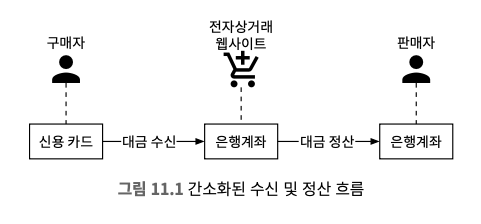
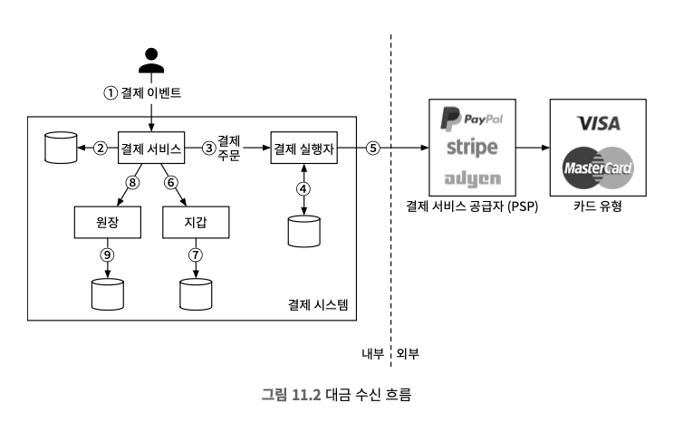
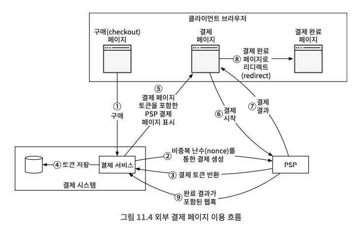
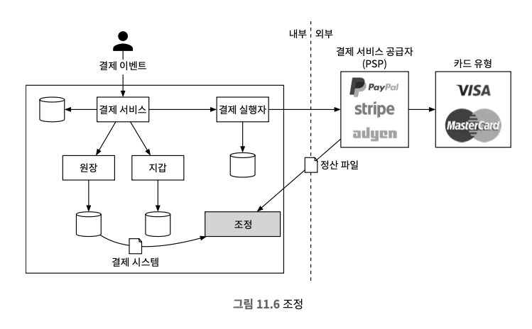
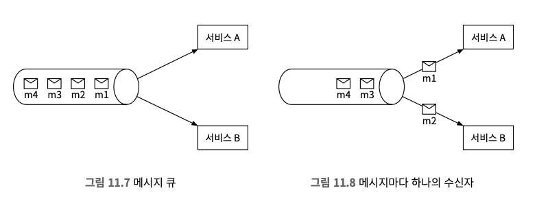
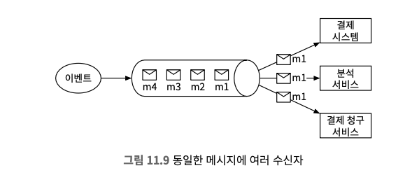
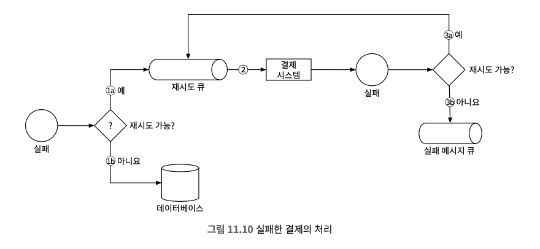

# 11장 결제 시스템
* 전자상거래의 인기는 폭발적으로 증가했고, 안정적이고 확장 가능하며 유연한 결제 시스템은 필수이다.
* 결제 시스템은 금전적 가치의 이전을 통해 금융 거래를 정산하는 데 사용되는 모든 시스템으로 얼핏 보기에는 이해하기 쉽지만, 작업하기 부담스런 시스템이기도 하다.

## 1. 문제 이해 및 결제 시스템
```
Q1. 어떤 결제 시스템을 만들어야 하나요?
→ 아마존닷컴과 같은 전자상거래 애플리케이션을 위한 결제 백엔드를 구축한다고 가정하고 고객이 아마존에서 주문을 하면 결제 시스템은 돈의 흐름에 대한 모든 것을 처리해야 합니다.

Q2. 어떤 결제 방법을 지원해야 하나요? (신용 카드, 페이팔, 은행 카드)
→ 실생활에서 사용 가능한 모든 옵션을 지원해야 하지만 이번 면접에선 신용 카드 결제만 처리해봅시다.

Q3. 신용 카드 결제 처리를 직접 해야 하나요?
→ 스트라이프, 브레인트리, 스퀘어 같은 전문 결제 서비스 업체를 사용합시다.

Q4. 신용 카드 데이터를 시스템에 저장해야 하나요? 
→ 보안 및 법규 준수에 대한 요건이 아주 까다로운 관계로 카드 번호를 시스템에 직접 저장하지 않고 민감한 신용 카드 데이터 처리는 결제 처리 업체에 의존합니다.

Q5. 전 세계를 대상으로 해야하고, 다양한 통화 및 국제 결제를 지원해야 하나요?
→ 전 세계적으로 사용될 수 있는 애플리케이션이지만 이번 면접에선 하나의 통화만 사용한다고 가정합니다.

Q6. 하루의 몇 건의 결제가 이루어지나요?
→ 하루 100만 건의 거래가 이루진다고 가정하겠습니다.

Q7. 아마존과 같은 전자상거래 사이트에서 매월 판매자에게 대금을 지급하는 절차를 지원해야 하나요?
→ 네

Q8. 다른 주의사항이 있을까요?
→ 결제 시스템은 많은 내부 시스템(계정, 분석 등) 및 외부 서비스(결제 서비스 공급자)와 연동하고 한 서비스에서 장애가 발생하면 서비스 간 상태가 달라지는 일이 벌어질 수 있기 때문에 조정 작업을 수행하고 불일치하는 부분이 발견되면 교정해야 하는데 필수 요건입니다.
```

### 기능 요구사항
* 대금 수신(pay-in) 흐름: 결제 시스템이 판매자를 대신하여 고객으로부터 대금을 수령한다.
* 대금 정산(pay-out) 흐름: 결제 시스템이 전 세계의 판매자에게 제품 판매 대금을 송금한다.

### 비기능 요구사항
* 신뢰성 및 내결함성: 결제 실패는 신중하게 처리해야 한다.
* 내부 서비스와 외부 서비스 간의 조정 프로세스: 시스템 간의 결제 정보가 일치하는지 비동기적으로 확인한다.

### 개략적인 규모 추정
* 하루 100만 건의 트랜잭션을 처리해야 한다 (1,000,000 건의 트랜잭션 / 10⁵초 = 초당 10건의 TPS)
* 일반적인 데이터베이스에서 별 문제 없이 처리 가능한 양이기 때문에 처리 대역폭 대신 결제 트랜잭션의 정확한 처리에 초점을 맞춰야 한다.

## 2. 개략적 설계안 제시 및 동의 구하기
* 결제 흐름은 자금의 흐름을 반영하기 위해 크게 두 단계로 나눠진다.
  * 대금 수신 흐름
  * 대금 정산 흐름



### 대금 수신 흐름


#### 결제 서비스
* 결제 서비스는 사용자로부터 결제 이벤트를 수락하고 결제 프로세스를 조율한다.
* 위험 확인을 통과한 결제만 처리한다.
* 위험 확인 서비스는 매우 복잡하고 고도로 전문화되어 있으므로 제 3자 제공업체를 이용한다.

#### 결제 실행자
* 결제 실행자는 결제 서비스 공급자(PSP)를 통해 결제 주문 하나를 실행한다.
* 하나의 결제 이벤트에는 여러 결제 주문이 포함될 수 있다.

#### 결제 서비스 공급자
* 결제 서비스 공급자(PSP)는 A계정에서 B계정으로 돈을 옮기는 역할을 담당한다.
* 예제의 경우 구매자의 신용카드 계좌에서 돈을 인출하는 역할을 맡는다.

#### 카드 유형
* 카드사는 신용 카드 업무를 처리하는 조직이다.
* 카드 유형으로는 마스터카드, 디스커버리 등이 있고 카드 생태계는 매우 복잡하다.

#### 원장
* 원장(leader)은 결제 트랜잭션에 대한 금융 기록이다.
* 원장 시스템은 전자상거래 웹사이트의 총 수익을 계산하거나 향후 수익을 예측하는 등, 결제 후 분석에서 매우 중요한 역할을 한다.

#### 지갑
* 지갑에는 판매자(merchant)의 계정 잔액을 기록한다.
* 특정 사용자가 결제한 총 금액을 기록할 수 있다.

> 일반적인 결제 흐름
1. 사용자가 '주문하기' 버튼을 클릭하면 결제 이벤트가 생성되어 결제 서비스로 전송된다.
2. 결제 서비스는 결제 이벤트를 데이터베이스에 저장한다.
3. 때로는 단일 결제 이벤트에 여러 결제 주문이 포함될 수 있다. 한 번 결제로 여러 판매자의 제품을 처리하는 경우가 그 예다. 전자상거래 웹사이트에서 한 결제를 여러 결제 주문으로 분할하는 경우, 결제 서비스는 결제 주문마다 결제 실행자를 호출한다.
4. 결제 실행자는 결제 주문을 데이터베이스에 저장한다.
5. 결제 실행자가 외부 PSP를 호출하여 신용 카드 결제를 처리한다.
6. 결제 실행자가 결제를 성공적으로 처리하고 나면 결제 서비스는 지갑을 갱 신하여 특정 판매자의 잔고를 기록한다.
7. 지갑 서버는 갱신된 잔고 정보를 데이터베이스에 저장한다.
8. 지갑 서비스가 판매자 잔고를 성공적으로 갱신하면 결제 서비스는 원장을 호출한다.
9. 원장 서비스는 새 원장 정보를 데이터베이스에 추가한다.

### 결제 서비스 API
> POST /v1/payments
* 결제 이벤트를 실행한다.

<p>표 11.1 결제 이벤트 실행을 위한 API 인자</p>
<table>
  <thead>
    <tr>
      <th>필드</th>
      <th>설명</th>
      <th>자료형</th>
    </tr>
  </thead>
  <tbody>
    <tr>
      <td>buyer_info</td>
      <td>구매자 정보</td>
      <td>json</td>
    </tr>
    <tr>
      <td>checkout_id</td>
      <td>해당 결제 이벤트를 식별하는 전역적으로 고유한 ID</td>
      <td>string</td>
    </tr>
    <tr>
      <td>credit_card_info</td>
      <td>암호화된 신용 카드 정보 또는 결제 토큰. PSP마다 다른 값.</td>
      <td>json</td>
    </tr>
    <tr>
      <td>payment_orders</td>
      <td>결제 주문 목록</td>
      <td>list</td>
    </tr>
  </tbody>
</table>

<p>표 11.2 payment_orders</p>
<table>
  <thead>
    <tr>
      <th>필드</th>
      <th>설명</th>
      <th>자료형</th>
    </tr>
  </thead>
  <tbody>
    <tr>
      <td>seller_account</td>
      <td>대금을 수령할 판매자</td>
      <td>string</td>
    </tr>
    <tr>
      <td>amount</td>
      <td>해당 주문으로 전송되어야 할 대금</td>
      <td>string</td>
    </tr>
    <tr>
      <td>currency</td>
      <td>주문에 사용된 통화 단위</td>
      <td>string (ISO 4217)</td>
    </tr>
    <tr>
      <td>payment_order_id</td>
      <td>해당 주문을 식별하는 전역적으로 고유한 ID</td>
      <td>string</td>
    </tr>
  </tbody>
</table>

> GET /v1/payments/{:id}
* payment_order_id가 가리키는 단일 결제 주문의 실행 상태를 반환한다.

### 결제 서비스 데이터 모델
* 결제 서비스에는 결제 이벤트와 결제 주문 두 개의 테이블이 필요하고, 성능은 가장 중요한 고려사항이 아닌 대신 다음 사항에 중점을 둔다.
  * 안정성이 검증되었는가? 즉, 다른 대형 금융 회사에서 수년(가령 5년 이상) 동안 긍정적인 피드백을 받으며 사용된 적이 있는가?
  * 모니터링 및 데이터 탐사(investigation)에 필요한 도구가 풍부하게 지원되는가?
  * 데이터베이스 관리자(DBA) 채용 시장이 성숙했는가? 다시 말해 숙련된 DBA를 쉽게 채용할 수 있는가? 아주 중요하게 고려해 봐야 할 요소다.
* 일반적으로 NoSQL/NewSQL 보다는 ACID 트랜잭션을 지원하는 전통적인 관계형 데이터베이스를 선호한다.

<p>표 11.3 결제 이벤트</p>
<table>
    <tr>
        <th>이름</th>
        <th>자료형</th>
    </tr>
    <tr>
        <td>checkout_id</td>
        <td>string PK</td>
    </tr>
    <tr>
        <td>buyer_info</td>
        <td>string</td>
    </tr>
    <tr>
        <td>seller_info</td>
        <td>string</td>
    </tr>
    <tr>
        <td>credit_card_info</td>
        <td>카드 제공업체에 따라 다르다</td>
    </tr>
    <tr>
        <td>is_payment_done</td>
        <td>boolean</td>
    </tr>
</table>

<p>표 11.4 결제 주문</p>
<table>
    <tr>
        <th>이름</th>
        <th>자료형</th>
    </tr>
    <tr>
        <td>payment_order_id</td>
        <td>string PK</td>
    </tr>
    <tr>
        <td>buyer_account</td>
        <td>string</td>
    </tr>
    <tr>
        <td>amount</td>
        <td>string</td>
    </tr>
    <tr>
        <td>currency</td>
        <td>string</td>
    </tr>
    <tr>
        <td>checkout_id</td>
        <td>string FK</td>
    </tr>
    <tr>
        <td>payment_order_status</td>
        <td>string</td>
    </tr>
    <tr>
        <td>ledger_updated</td>
        <td>boolean</td>
    </tr>
    <tr>
        <td>wallet_updated</td>
        <td>boolean</td>
    </tr>
</table>

### 복식부기 원장 시스템
* 원장 시스템에는 복식부기(double-entry)라는 아주 중요한 설계 원칙이 있다.
* 복식부기는 모든 결제 시스템에 필수 요소이며 정확한 기록을 남기는 데 핵심적 역할을 한다.
  * 모든 결제 거래를 2개의 별도 원장 계좌에 같은 금액으로 기록한다.
  * 한 계좌에서는 차감이 이루어지고 다른 계좌에는 입금이 이루어진다.
* 복식부기 시스템에서 모든 거래 항목의 합계는 0이어야 하며 이 시스템을 활용하면 자금의 흐름을 시작부터 끝까지 추적할 수 있으며 결제 주기 전반에 걸쳐 일관성을 보장할 수 있다.

### 외부 결제 페이지
* 대부분의 기업은 신용 카드 정보를 내부에 저장할 경우 미국의 PCI DSS 같은 복잡한 규정을 준수해야 하기 때문에 신용 카드 정보를 내부에 저장하지 않는다.
* 신용 카드 정보를 취급하지 않기 위해 기업들은 결제 서비스 공급자(PSP)에서 제공하는 외부 신용 카드 페이지를 사용한다.

### 대금 정산 흐름
* 대금 정산 흐름의 구성 요소는 대금 수신 흐름과 유사하지만 한가지 차이는 결제 서비스 공급자(PSP)를 사용하여 전자상거래 웹사이트 은행 계좌로 돈을 이체하는 대신 타사 정산 서비스를 사용해서 전자상거래 웹사이트 은행 계좌에서 판매자 은행 계좌로 돈을 이체한다.
* 일반적으로 결제 시스템은 대금 정산을 위해 티팔티와 같은 외상매입금 지급 서비스 제공업체를 이용하는데 대금 정산에도 다양한 부기 및 규제 요구사항이 존재하기 때문이다.

## 3. 상세 설계

### 결제 서비스 공급자(PSP) 연동
* 대부분의 회사는 다음 두 가지 방법 중 하나로 결제 시스템을 PSP와 연동한다.
  * 회사가 민감한 결제 정보를 안전하게 저장할 수 있다면 AP를 통해 PSP와 연동하는 방법
  * 복잡한 규정 및 보안 문제로 인해 민감한 결제 정보를 저장하지 않기로 결정한 경우, PSP는 카드 결제 세부 정보를 수집하여 PSP에 안전하게 저장할 수 있도록 외부 결제 페이지를 제공 (대부분의 기업이 택하는 접근법)

> 외부 결제 페이지 작동 방식
1. 사용자가 클라이언트 브라우저에서 **결제** 버튼을 클릭하고, 클라이언트는 결제 주문 정보를 담아 결제 서비스를 호출한다.
2. 결제 주문 정보를 수신한 결제 서비스는 결제 등록 요청을 PSP로 전송한다.
3. PSP는 결제 서비스에 토큰을 반환하고, 토큰은 UUID로 토큰을 통해서 결제 등록 및 결제 실행 상태를 확인할 수 있다.
4. 결제 서비스는 PSP가 제공하는 외부 결제 페이지를 호출하기 전에 토큰을 데이터베이스에 저장한다.
5. 토큰을 저장하고 나면 클라이언트에게 PSP가 제공하는 외부 결제 페이지를 표시하며 모바일 애플리케이션은 일반적으로 이를 위해 PSP SDK를 연동한다.
   * PSP의 자바스크립트 코드는 코토큰을 사용해 결제 요청에 대한 상세 정보를 검색하고, 이 과정을 통해서 사용자에게 받을 금액을 알아낸다.
   * 리디렉션 URL을 통해서 결제 완료 시 이동한다.
6. 사용자는 결제 서부 정보를 PSP의 웹 페이지에 입력한 다음 결제 버튼을 클릭한다.
7. PSP가 결제 상태를 반환한다.
8. 사용자는 리다이렉션 URL이 가리키는 웹 페이지로 보내지며, 보통 수신된 결제 상태가 URL에 추가된다.
9. 비동기적으로 PSP는 웹훅을 통해 결제 상태와 함께 결제 서비스를 호출한다.



> 위의 아홉 단계가 네트워크 문제로 실패할 수 있기 때문에 조정을 통해서 처리한다.

### 조정
* 시스템 구성 요소가 비동기적으로 통신하면 메세지가 전달되거나 응답이 반환된다는 보정이 없는데 이는 시스템 성능을 높이기 위해 비동기 통신을 자주하는 결제 관련 사업에 일반적인 문제다.
* 조정을 통해서 관련 서비스 간의 상태를 주기적으로 비교하여 일치하는지 확인한다.
* 조정 시스템은 정산 파일의 세부 정보를 읽어 원장 시스템과 비교한다.



* 조정은 결제 시스템의 내부 일관성을 확인할 수도 있다.
  * 어떤 유형의 문제인지 알고 있으며 문제 해결 절차를 자동화할 수 있는 경우: 원인과 해결 방법을 알고 있기 때문에 자동화 프로그램을 작성하는 것이 효율적이라 불일치 문제의 분류와 조정 작업 모두 자동화한다.
  * 어떤 유형의 문제인지는 알지만 문제 해결 절차를 자동화할 수 없는 경우: 불일치 원인과 해결 방법은 알지만 자동 조정 프로그램의 작성 비용이 너무 높은 경우 작업 대기열에 넣고 재무팀에서 수동으로 수정하도록 한다.
  * 분류할 수 없는 유형의 문제인 경우: 불일치가 어떻게 발생한지 알지 못하기 때문에 특별 작업 대기열에 넣고 재무팀에서 조사하도록 한다.

### 결제 지연 처리
* 결제 요청이 평소보다 오래 걸리는 사례가 존재한다.
  * PSP가 해당 결제 요청의 위험성이 높다고 보고 담당자 검토를 요구하는 경우
  * 신용 카드사가 구매 확인 용도로 카드 소유자의 추가 정보를 요청하는 3D 보안 인증 같은 추가 보호 장치를 요구하는 경우
* 결제 서비스는 처리하는 데 시간이 오개 걸리는 요청도 처리해야 한다. (구매 페이지가 외부 PSP에 호스팅되는 경우)
  * PSP는 결제가 대기 상태임을 알리는 상태 정보를 클라이언트에게 반환하고, 클라이언트는 이를 사용자에게 표시하며 고객이 현재 결제 상태를 확인할 수 있는 페이지를 제공한다.
  * PSP는 우리 회사를 대신하여 대기 중인 결제의 진행 상황을 추적하고, 상태가 바뀌면 PSP에 등록된 웹훅을 통해 결제 서비스에 알린다.
* 결제 요청이 최종적으로 완료되면 PSP는 방금 언급한 사전에 등록된 웹훅을 호출하고 결제 서비스는 내부 시스템에 기록된 정보를 업데이트하고 고객에게 배송을 완료한다.
* 일부 PSP는 웹훅을 통해 결제 서비스에 결제 상태 변경을 알리는 대신 결제 서비스로 하여금 대기 중인 결제 요청의 상태를 주기적으로 확인(polling)하도록 하기도 한다.

### 내부 서비스 간 커뮤니케이션
#### 동기식 통신
* 소규모 통신에선 잘 작동하지만 규모가 커지면 아래의 단점이 생긴다.
  * 성능 저하: 요청 처리에 관계된 서비스 가운데 하나에 발생한 성능 문제가 전체 시스템의 성능에 영향을 끼친다.
  * 장애 격리 곤란: PSP 등의 서비스에 장애가 발생하면 클라이언트는 더 이상 응답을 받지 못한다.
  * 높은 결합도: 요청 발신자는 수신자를 알아야만 한다.
  * 낮은 확장성: 큐를 버퍼로 사용하지 않고서는 갑작스러운 트래픽 증가에 대응할 수 있도록 시스템을 확장하기 어렵다.

#### 비동기 통신
* 비동기 통신은 크게 두 가지 범주로 나뉜다.
  * 단일 수신자
    * 각 요청은 하나의 수신자 또는 서비스가 처리한다.
    * 일반적으로 공유 메시지 큐를 사용해 구현하며 큐에 복수의 구독자가 있을 수 있지만 처리된 메시지는 큐에서 바로 제거된다.

    

  * 다중 수신자
    * 각 요청은 여러 수신자 또는 서버가 처리한다.
    * 카프카가 이런 시나리오를 잘 처리할 수 있고 소비자가 수신한 메시지는 카프카에서 바로 사라지지 않아서 동일한 메시지를 여러 서비스가 받아 처리할 수 있다.
    * 결제 시스템 구현에 적합한데 하나의 요청이 푸시 알림 전송, 재무 보고 업데이트, 분석 결과 업데이트 등 다양한 용도에 쓰일 수 있다.
  
    

### 결제 실패 처리
* 모든 결제 시스템은 실패한 결제를 적절히 처리해야 한다.

#### 결제 상태 추적
* 결제 주기의 모든 단계에서 결제 상태를 정확하게 유지하는 것은 매우 중요하며 실패 시 현재 상태를 파악해 재시도 또는 환불이 필요한지 여부를 결정한다.
* 결제 상태는 데이터 추가만 가능한 데이터베이스 테이블에 보관한다.

#### 재시도 큐 및 실패 메시지 큐
* 실패를 처리하기 위해서 재시도 큐와 실패 메시지 큐를 두는 것이 좋다.
  * 재시도 큐: 일시적 오류 같은 재시도 가능 오류는 재시도 큐에 보낸다.
  * 실패 메시지 큐: 반복적으로 처리에 실패한 메시지는 실패 메시지 큐로 보낸다.



> 우버의 카프카를 활용한 결제 시스템 안정성과 결함 내성 요건 참고

### 정확히 한 번 전달
* 고객에게 이중으로 청구하는 것은 심각한 문제기 때문에 결제 주문이 정확히 한 번만 실행되도록 결제 시스템을 설계해야 한다.
* 수학적으로 다음 요건이 충족되며 주어진 연산은 정확히 한 번 실행된다.
  * 최소 한 번은 실행된다.
  * 최대 한 번 실행된다.

#### 재시도
* 네트워크 오휴, 시간 초과로 결제 거래를 다시 시도해야 하는 경우 재시도 메커니즘을 활용해 최소 한 번 실행되도록 보장 가능하다.
* 일반적으로 사용되는 전략은 아래와 같다.
  * 즉시 재시도(imnediate retry): 클라이언트는 즉시 요청을 다시 보낸다.
  * 고정 간격(fixed interval) : 재시도 전에 일정 시간 기다리는 방안이다.
  * 증분 간격(incremental interval): 재시도 전에 기다리는 시간을 특정한 양 만큼 점진적으로 늘려 나가는 방안이다.
  * 지수적 백오프(exponential backoff)17: 재시도 전에 기다리는 시간을 직전 재시도 대비 두 배씩 늘려 나가는 방안. 예를 들어, 요청이 처음 실패하면 1초 후에 재시도하고, 두 번째로 실패하면 2초, 세 번째로 실패하면 4초를 기다린 후 재시도한다.
  * 취소(cancel): 요청을 철회하는 방안으로 실패가 영구적이거나 재시도를 하더라도 성공 가능성이 낮은 경우에 흔히 사용되는 방안이다.
* 적절한 재시도 전략 결정은 어렵고, 모든 상황에 맞는 해결책은 없기 때문에 지수적 백오프를 사용하는 것이 좋지만 지나친 재시도 전략은 부하를 유발하기 때문에 에러코드 반환 시 Retry-After 헤더를 같이 붙여 보내는 것이 좋다.

#### 멱등성
* 멱등성은 최대 한 번 실행을 보장하기 위한 핵심 개념으로 연산을 여러 번 실행하여도 최초 실행 결과가 그대로 보존되는 특성을 일컫는 말이며 API 관점에서 보자면 멱등성은 클라이언트가 같은 API 호출을 여러 번 반복해도 항상 동일한 결과가 나온다는 뜻이다.
* 클라이언트(웹 및 모바일 애플리케이션)와 서버 간의 통신을 위해서는 일반 적으로 클라이언트가 생성하고 일정 시간이 지나면 만료되는 고유한 값을 멱 등 키로 사용한다.
* 동일한 멱등 키로 동시에 많은 요청을 받으면 결제 서비스는 그 가운데 하나만
처리하고 나머지에 대해서는 429 Too Nany Requests 상태 코드를 반환한다. (데이터베이스의 고유 키 제약 조건을 활용)

### 일관성
* 결제 실행 과정에서 상태 정보를 유지 관리하는 여러 서비스가 호출되고 분산 환경에선 서비스 간 통신 실패로 데이터 불일치가 발생할 수 있다.
* 내부 서비스와 외부 서비스(PSP) 간의 데이터 일관성 유지를 위해서는 일반 적으로 멱등성과 조정 프로세스를 활용한다.
* 외부 서비스가 멱등 API를 지원하더라도 외부 시스템이 항상 옳다고 가정할 수는 없어서 조정 철차를 생략할 수 없다.
* 데이터를 다중화하는 정우에는 복제 지연으로 인해 기본 데이터베이스와 사 본 데이터가 불일치하는 일이 생길 수 있어서 일반적으로 두 가지 해결 방법이 존재한다.
  * 주 데이터베이스에서만 읽기와 쓰기 연산을 처리하는 방법의 경우 규모 확정이 떨어지고, 사본은 데이터 안정성 보장에만 활용되서 자원이 낭비된다.
  * 모든 사본이 항상 동기화되도록 하는 경우 팩서스, 래프트 같은 합의 알고리즘을 사용하거나 YugabyteDB, CockroachDB와 같은 합의 기분 분산 데이터베이스를 사용한다.

### 결제 보안
<p>표 11.6 결제 보안</p>
<table>
    <tr>
        <th>문제</th>
        <th>해결책</th>
    </tr>
    <tr>
        <td>요청/응답 도청 (request/response eavesdropping)</td>
        <td>HTTPS 사용</td>
    </tr>
    <tr>
        <td>데이터 변조 (data tempering)</td>
        <td>암호화 및 무결성 강화 모니터링</td>
    </tr>
    <tr>
        <td>중간자 공격 (man-in-the-middle attack)</td>
        <td>인증서 고정(certificate pinning)과 함께 SSL 사용</td>
    </tr>
    <tr>
        <td>데이터 손실</td>
        <td>여러 지역에 걸쳐 데이터베이스 복제 및 스냅샷 생성</td>
    </tr>
    <tr>
        <td>분산 서비스 거부 공격(DDoS)</td>
        <td>처리를 제한 및 방화벽</td>
    </tr>
    <tr>
        <td>카드 도난</td>
        <td>토큰화(tokenization). 실제 카드 번호를 사용하는 대신 토큰을 저장하고 결제에 사용</td>
    </tr>
    <tr>
        <td>PCI 규정 준수</td>
        <td>PCI DSS는 브랜드 신용 카드를 처리하는 조직을 위한 정보 보안 표준이다.</td>
    </tr>
    <tr>
        <td>사기(fraud)</td>
        <td>주소 확인, 카드 확인번호(CVV), 사용자 행동분석 등</td>
    </tr>
</table>

## 4. 마무리
* 모니터링: 결제 승인율, 서버 CPU 사용량 등 주요 지표 모니터링과 대시보드 구축
* 경보 시스템: 비정상 상황 발생 시 개발자에게 알림으로 신속 대응
* 디버깅 도구: 결제 실패 원인 분석을 위한 상태 및 기록 검토 도구
* 환율: 국제 결제 시 중요한 요소
* 지역별 결제 수단: 지역마다 사용 가능한 결제 수단의 차이
* 현금 결제: 인도, 브라질 등에서의 현금 결제 지원 필요성
* 구글/애플 페이 연동: 모바일 결제 서비스와의 통합
