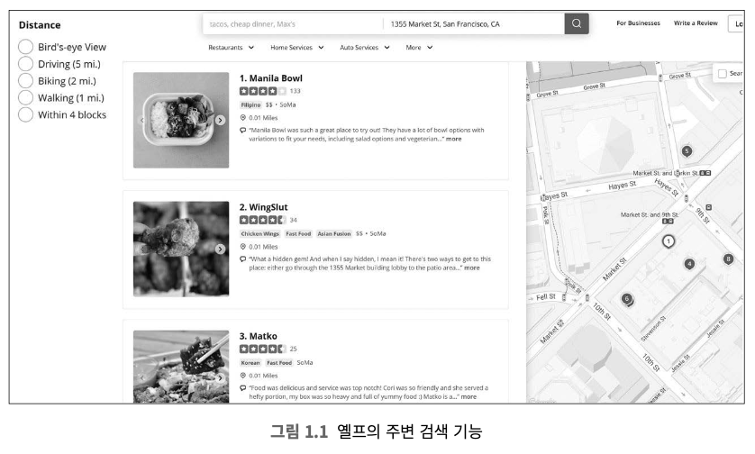
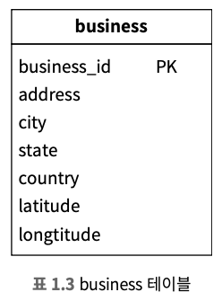
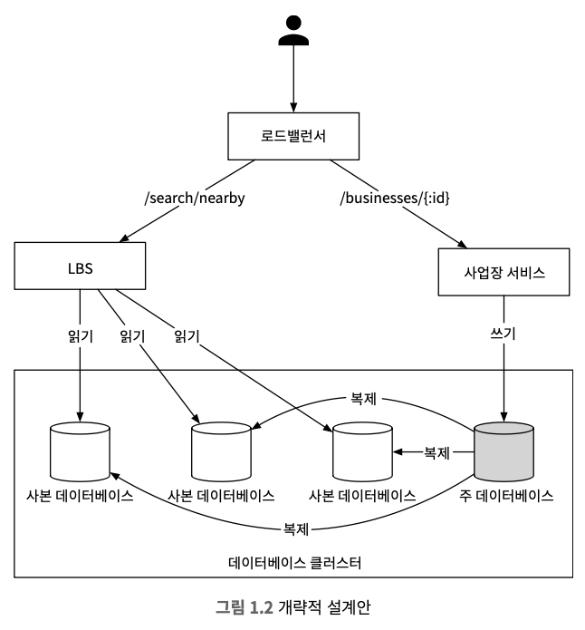

# 1장 근접성 서비스
* 근접성 서비스는 현재 위치에서 가까운 시설을 찾는데 이용된다.
* 옐프 앱의 경우 주변에 있는 좋은 식당 검색, 구글 맵의 경우에는 가까운 N개 주유소 검색 등의 기능 구현에 이용된다.


## 1단계 문제 이해 및 설계 범위 확정
* 인터뷰 시간 내에 설계할 수는 없기 때문에 질문을 던져 설계 범위를 좁혀야 한다.
```
Q1. 사용자가 검색 반경을 지정할 수 있어야 하나요?
→ 주어진 반경 내에의 사업장만 대상으로 하지만 시간이 남으면 주어진 범위 안에 사업장이 많지 않은 경우를 어떻게 처리할지 이야기 해본다.

Q2. 최대 허용 반경은 얼마인가요?, 20km로 가정해도 될까요?
→ 괜찮은 가정이다.

Q3. 사용자가 검색 반경을 변경할 수 있어야 하나요?
→ 0.5km, 1km, 2km, 5km, 20km

Q4. 사업장의 정보는 어떻게 관리되고, 사업장 정보 결과가 사용자에게 실시간으로 적용될까요?
→ 소유주가 시스템에 추가, 삭제, 갱신할 수 있고, 다음날까지 반영되어야 한다.

Q5. 이동 중에 앱이나 웹사이트를 이용하면 결과는 시간 흐름에 따라 달라져야 하는데 현재 위치 기준으로 유지하기 위해 화면을 자동 갱신해야 할까요?
→ 사용자의 이동속도는 빠르지 않기 때문에 상시적으로 페이지를 갱신할 필요는 없다.
```

### 기능 요구사항
* 문제 이해 및 질문을 던져 설계 범위를 좁힌 토대로 세 가지 핵심 기능에 집중한다.
1. 사용자의 위치(경도, 위도)와 검색 반경 정보에 매치되는 사업장 목록을 반환
2. 소유주가 사업장 정보를 추가, 삭제, 갱신할 수 있고 실시간으로 반영될 필요는 없다.
3. 고객은 사업장의 상세 정보를 볼 수 있다.

### 비기능 요구사항
* 요구사항을 토대로 소프트웨어 기능들에 대한 조건과 제약사항인 비기능을 요구사항을 도출하며, 면접관과 확인한다.
1. 낮은 응답 지연
2. 데이터 보호
3. 고가용성 및 규모 확장성

### 개략적 규모 추정
* 일단 능동 사용자(DAU)는 1억 명이고, 등록된 사업장 수는 2억이라고 가정한다.
```
QPS 계산
- 데이터베이스나 웹 서버 API 등에서 특정 작업이나 요청이 초당으로 얼마나 처리되는지를 나타내는 지표로 성능과 처리 능력을 평가하는 중요한 측정 지표
- 1일 = 24시간 X 60분 X 60초 = 86,400초, 대략 100,000
- 하루는 10⁵초라고 가정한다.
- 하나의 사용자는 하루에 5회 검색을 시도한다고 가정한다.
- QPS = (1억 X 5) / 10⁵ = 5,000
```

## 2단계 개략적 설계안 제시 및 동의 구하기
1. API 설계
2. 개략적 설계안
3. 주변 사업장 검색 알고리즘
4. 데이터 모델

### API 설계
* GET /v1/search/nearby
  * 특정 검색 기준에 맞는 사업장 목록을 반환한다.
  * 전달할 인자
    <table class="table">
        <thead>
            <tr>
                <th>필드</th>
                <th>설명</th>
                <th>자료형</th>
            </tr>
        </thead>
        <tbody>
            <tr>
                <td>latitude</td>
                <td>검색할 위도</td>
                <td>decimal</td>
            </tr>
            <tr>
                <td>longitude</td>
                <td>검색할 경도</td>
                <td>decimal</td>
            </tr>
            <tr>
                <td>radius</td>
                <td>선택적 인자, 생략할 경우 기본 값 5,000m</td>
                <td>int</td>
            </tr>
        </tbody>
    </table>
  * 반환되는 결과
    * business object는 사업장의 사진, 리뷰, 별점 등의 추가 정보가 필요할 수도 있다.
    ```
    {
        "total": 10, 
        "businesses":[{business object}]
    }
    ```

#### 사업장 관련 API
<table class="table">
    <thead>
        <tr>
            <th>API</th>
            <th>설명</th>
        </tr>
    </thead>
    <tbody>
        <tr>
            <td>GET /v1/businesses/:id</td>
            <td>특정 사업장의 상세 정보 반환</td>
        </tr>
        <tr>
            <td>POST /v1/businesses</td>
            <td>새로운 사업장 추가</td>
        </tr>
        <tr>
            <td>PUT /v1/businesses/:id</td>
            <td>사업장 상세 정보 갱신</td>
        </tr>
        <tr>
            <td>DELETE /v1/businesses/:id</td>
            <td>특정 사업장 정보 삭제</td>
        </tr>
    </tbody>
</table>

### 데이터 모델
#### 읽기/쓰기 비율
* 아래 두가지 기능으로 인해 읽기 연산은 자주 수행된다.
1. 주변 사업장 검색
2. 사업장 정보 확인
* 읽기 연산이 많은 시스템에는 MySQL같은 관계형 데이터베이스가 바람직할 수 있다.

#### 데이터 스키마
* business 테이블

* 지리적 위치 색인 테이블

### 개략적 설계
* 위치 기반 서비스와 사업장 관련 서비스로 구성된다.


#### 로드밸런서
* 유입 트래픽을 자동으로 여러 서비스에 분산시키는 컴포넌트
* DNS 진입점을 지정하고, URL 경로를 분석해 트래픽을 어느 서비스에 전달할지 결정

#### 위치 기반 서비스