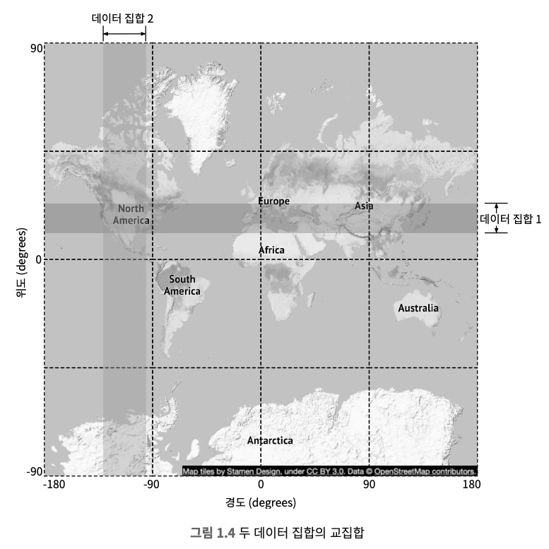
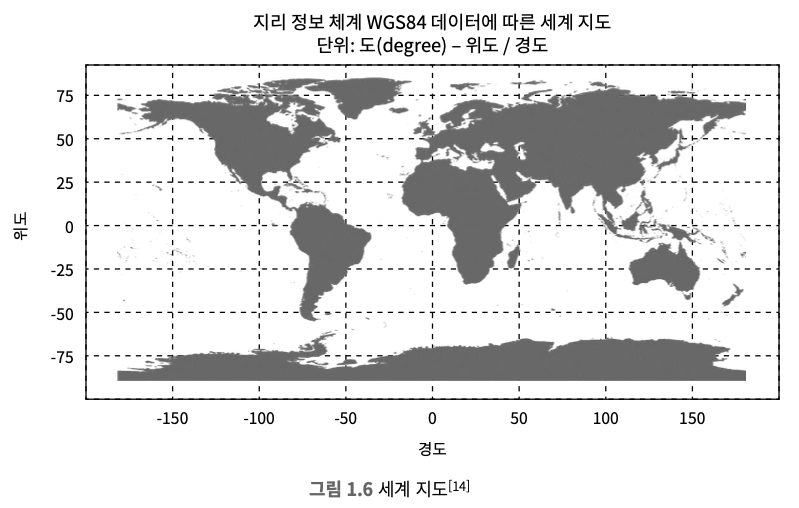
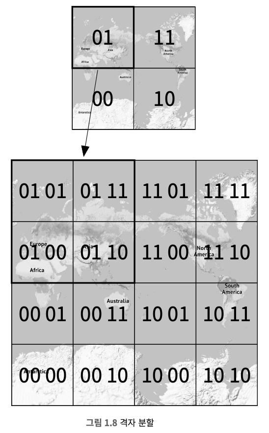
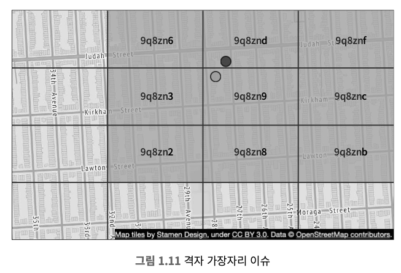
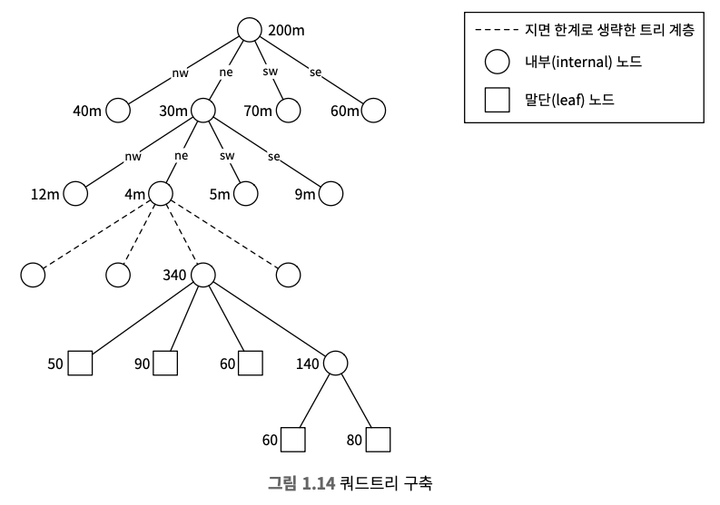
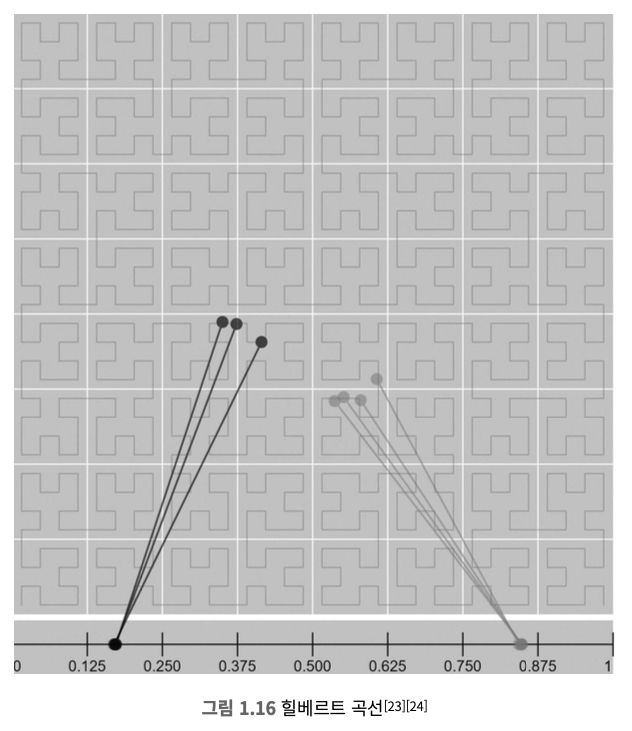
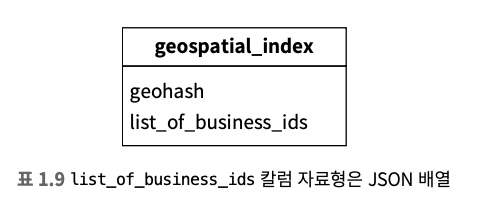
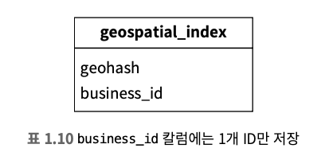
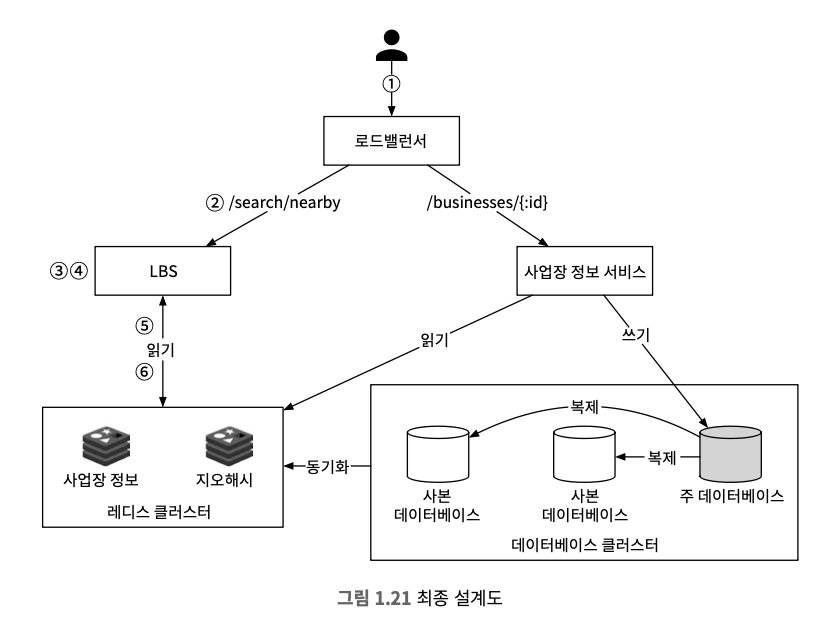

# 1장 근접성 서비스
* 근접성 서비스는 현재 위치에서 가까운 시설을 찾는데 이용된다.
* 옐프 앱의 경우 주변에 있는 좋은 식당 검색, 구글 맵의 경우에는 가까운 N개 주유소 검색 등의 기능 구현에 이용된다.


## 1단계 문제 이해 및 설계 범위 확정
* 인터뷰 시간 내에 설계할 수는 없기 때문에 질문을 던져 설계 범위를 좁혀야 한다.
```
Q1. 사용자가 검색 반경을 지정할 수 있어야 하나요?
→ 주어진 반경 내에의 사업장만 대상으로 하지만 시간이 남으면 주어진 범위 안에 사업장이 많지 않은 경우를 어떻게 처리할지 이야기 해본다.

Q2. 최대 허용 반경은 얼마인가요?, 20km로 가정해도 될까요?
→ 괜찮은 가정이다.

Q3. 사용자가 검색 반경을 변경할 수 있어야 하나요?
→ 0.5km, 1km, 2km, 5km, 20km

Q4. 사업장의 정보는 어떻게 관리되고, 사업장 정보 결과가 사용자에게 실시간으로 적용될까요?
→ 소유주가 시스템에 추가, 삭제, 갱신할 수 있고, 다음날까지 반영되어야 한다.

Q5. 이동 중에 앱이나 웹사이트를 이용하면 결과는 시간 흐름에 따라 달라져야 하는데 현재 위치 기준으로 유지하기 위해 화면을 자동 갱신해야 할까요?
→ 사용자의 이동속도는 빠르지 않기 때문에 상시적으로 페이지를 갱신할 필요는 없다.
```

### 기능 요구사항
* 문제 이해 및 질문을 던져 설계 범위를 좁힌 토대로 세 가지 핵심 기능에 집중한다.
1. 사용자의 위치(경도, 위도)와 검색 반경 정보에 매치되는 사업장 목록을 반환
2. 소유주가 사업장 정보를 추가, 삭제, 갱신할 수 있고 실시간으로 반영될 필요는 없다.
3. 고객은 사업장의 상세 정보를 볼 수 있다.

### 비기능 요구사항
* 요구사항을 토대로 소프트웨어 기능들에 대한 조건과 제약사항인 비기능을 요구사항을 도출하며, 면접관과 확인한다.
1. 낮은 응답 지연
2. 데이터 보호
3. 고가용성 및 규모 확장성

### 개략적 규모 추정
* 일단 능동 사용자(DAU)는 1억 명이고, 등록된 사업장 수는 2억이라고 가정한다.
```
QPS 계산
- 데이터베이스나 웹 서버 API 등에서 특정 작업이나 요청이 초당으로 얼마나 처리되는지를 나타내는 지표로 성능과 처리 능력을 평가하는 중요한 측정 지표
- 1일 = 24시간 X 60분 X 60초 = 86,400초, 대략 100,000
- 하루는 10⁵초라고 가정한다.
- 하나의 사용자는 하루에 5회 검색을 시도한다고 가정한다.
- QPS = (1억 X 5) / 10⁵ = 5,000
```

## 2단계 개략적 설계안 제시 및 동의 구하기
1. API 설계
2. 개략적 설계안
3. 주변 사업장 검색 알고리즘
4. 데이터 모델

### API 설계
* GET /v1/search/nearby
  * 특정 검색 기준에 맞는 사업장 목록을 반환한다.
  * 전달할 인자
    <table class="table">
        <thead>
            <tr>
                <th>필드</th>
                <th>설명</th>
                <th>자료형</th>
            </tr>
        </thead>
        <tbody>
            <tr>
                <td>latitude</td>
                <td>검색할 위도</td>
                <td>decimal</td>
            </tr>
            <tr>
                <td>longitude</td>
                <td>검색할 경도</td>
                <td>decimal</td>
            </tr>
            <tr>
                <td>radius</td>
                <td>선택적 인자, 생략할 경우 기본 값 5,000m</td>
                <td>int</td>
            </tr>
        </tbody>
    </table>
  * 반환되는 결과
    * business object는 사업장의 사진, 리뷰, 별점 등의 추가 정보가 필요할 수도 있다.
    ```
    {
        "total": 10, 
        "businesses":[{business object}]
    }
    ```

#### 사업장 관련 API
<table class="table">
    <thead>
        <tr>
            <th>API</th>
            <th>설명</th>
        </tr>
    </thead>
    <tbody>
        <tr>
            <td>GET /v1/businesses/:id</td>
            <td>특정 사업장의 상세 정보 반환</td>
        </tr>
        <tr>
            <td>POST /v1/businesses</td>
            <td>새로운 사업장 추가</td>
        </tr>
        <tr>
            <td>PUT /v1/businesses/:id</td>
            <td>사업장 상세 정보 갱신</td>
        </tr>
        <tr>
            <td>DELETE /v1/businesses/:id</td>
            <td>특정 사업장 정보 삭제</td>
        </tr>
    </tbody>
</table>

### 데이터 모델
#### 읽기/쓰기 비율
* 아래 두가지 기능으로 인해 읽기 연산은 자주 수행된다.
1. 주변 사업장 검색
2. 사업장 정보 확인
* 읽기 연산이 많은 시스템에는 MySQL같은 관계형 데이터베이스가 바람직할 수 있다.

#### 데이터 스키마
* business 테이블


* 지리적 위치 색인 테이블

### 개략적 설계
* 위치 기반 서비스와 사업장 관련 서비스로 구성된다.


#### 로드밸런서
* 유입 트래픽을 자동으로 여러 서비스에 분산시키는 컴포넌트
* DNS 진입점을 지정하고, URL 경로를 분석해 트래픽을 어느 서비스에 전달할지 결정

#### 위치 기반 서비스
* 사업장을 검색하는 서비스
* 읽기 요청만 발생하는 서비스
* QPS가 높고, 인구 밀집 지역일수록 심해진다.
* 무상태 서비스로 수평적 규모 확장이 쉽다.

#### 사업장 서비스
* 소유주가 사업장 정보를 생성, 갱신, 삭제
* 보통 쓰기 요청이고, QPS는 낮다.
* 고객이 사업장 정보를 조회하면 QPS가 높아진다.

#### 데이터베이스 클러스터
* 데이터베이스 클러스터는 주-부 데이터베이스 형태로 구성 가능하다.
* 주 데이터베이스는 쓰기 요청을 부 데이터베이스는 읽기 요청을 처리한다.
* 데이터는 주 데이터베이스에 기록된 후 부 데이터베이스로 복제되기 때문에 시간 지연이 있다.

#### 사업장 서비스와 LBS의 규모 확장성
* 무상태 서비스이므로 점심시간 등 집중적으로 몰리는 트래픽에 자동으로 버서를 추가하여 대응한다.
* 야간, 유휴 시간에는 서버를 삭제하도록 구성할 수 있다.
* 클라우드를 사용한다면 여러 지역, 여러 가용성 구역에 서버를 두어 시스템 가용성을 높일 수 있다.

### 주변 사업장 검색 알고리즘
* 많은 회사가 레디스 지오해시, PostGIS 확장을 설치한 포스트그레스 데이터베이스를 활용한다.
* 지리적 위치 색인이 어떻게 동작하는지 설명하는게 문제 풀이 능력과 기술적 지식을 갖추었음을 보이는게 좋다.
* 사고 프로세스를 검토한 다음, 각 방안에 타협적 측면이 존재하는지 논의한다.

### 방안 1. 2차원 검색
* 주어진 반경으로 그린 원 안에 놓인 사업장을 검색하는 방법이다.
* 가장 직관적이지만 지나치게 단순한 문제가 있다.
* 하지만, 테이블을 모두 읽어야해서 효율적이지 않고, 위도와 경도 컬럼에 색인을 만들어도 썩 좋아지지 않는다.
* 주어진 반경 내 사업장을 얻기위해 교집합을 구해야하고 데이터의 양 때문에 효울적일 수 없다.
  


### 색인을 만드는 방법
* 각 색인 법은 구현 방법은 다르지만 개략적인 아이디어는 같으며 지도를 작은 영역으로 분할하고 고속 검색이 가능하도록 색인을 만드는 것이다.
* 지오해시, 쿼드트리, 구글 S2가 가장 널리 사용되는 방안이다.
1. 해시 기반 방안
   * 균등 격자, 지오해시, 카르테시안 계층
2. 트리 기반 방안
   * 쿼드트리, 구글 S2, R트리

### 방안 2. 균등 격자
* 작은 격자 또는 구획으로 나누는 단순한 접근법이다.
* 격자마다 사업장 분포가 균등하지 않다는 문제가 있어서 데이터 분포가 균등하지 않다.
* 주어진 격자의 인접 격자를 찾기가 까다로울 수 있다.



### 방안 3. 지오해시
* 균등 격자보단 나은 방안이고, 2차원 위도 경도 데이터를 1차원 문자열로 변환한다.
* 지오해시 알고리즘은 비트를 하나씩 늘려서 재귀적으로 세계를 더 작은 격자로 분할한다.
* 지오해시는 12단계 정밀도를 갖고 정밀도가 격자 크기를 결정하며, 사용자가 지정한 반경으로 그린 원을 덮는 최소 크기 격자를 지오해시 길이를 구해야 한다.
    <table class="table">
        <thead>
            <tr>
                <th>반경</th>
                <th>격자 너비 X 높이</th>
            </tr>
        </thead>
        <tbody>
            <tr>
                <td>0.5km</td>
                <td>6</td>
            </tr>
            <tr>
                <td>1km</td>
                <td>5</td>
            </tr>
            <tr>
                <td>2km</td>
                <td>5</td>
            </tr>
            <tr>
                <td>5km</td>
                <td>4</td>
            </tr>
            <tr>
                <td>20km</td>
                <td>4</td>
            </tr>
        </tbody>
    </table>



#### 지오해시 격자 가장자리 관련 이슈 1
* 지오해시는 해시값의 공통 접두어가 격자들이 서로 더 가깝게 높이도록 보장한다.
* 다른 반쪽에 놓이는 경우 두 지오해시 가이에는 어떤 공통 접두어도 없기 때문에 접두어 기반 SQL 질의문을 사용하면 모든 사업장을 가져올 수 없다.

#### 지오해시 격자 가장자리 관련 이슈 2
* 공통 접두어 길이는 같지만, 서로 다른 격자에 높이는 경우이다.
* 해결책은 현재 격자를 비롯한 인접한 모든 격자의 사업장 정보를 가져오는 것이다.



#### 표시할 사업장이 충분하지 않은 경우
* 선택지 1. 주어진 반경 내 사업장만 반환한다. 
* 선택지 2. 검색 반경을 키운다.

### 방안 4. 쿼드트리
* 격자의 내용이 특정 기준을 만족할 때까지 2차원 공간을 재귀적으로 사분면 분할하는데 흔히 사용되는 자료 구조다.
* 격자 안에 N개의 사업장 수 이하가 될 때까지 분할하며, 트리 구조를 메모리 안에 만드는 것이다.
* 각각의 LBS 서버에 존재해야 하며, 서버가 시작하는 시점에 구축된다.



#### 쿼드트리 전부를 저장하는 데 사용되는 메모리
<table class="table">
    <thead>
        <tr>
            <th>이름</th>
            <th>크기</th>
        </tr>
    </thead>
    <tbody>
        <tr>
            <th colspan="2">말단 노드</th>
        </tr>
        <tr>
            <td>격자를 식별하는 데 사용될 좌상단과 우하단 꼭짓점 좌표</td>
            <td>32바이트 (8바이트 × 4)</td>
        </tr>
        <tr>
            <td>격자 내부 사업장 ID 목록</td>
            <td>ID당 8바이트 × 100</td>
        </tr>
        <tr>
            <td>합계</td>
            <td>832바이트</td>
        </tr>
        <tr>
            <th colspan="2">내부 노드</th>
        </tr>
        <tr>
            <td>격자를 식별하는 데 사용될 좌상단과 우하단 꼭짓점 좌표</td>
            <td>32바이트 (8바이트 × 4)</td>
        </tr>
        <tr>
            <td>하위 노드 4개를 가리킬 포인터</td>
            <td>32바이트 (8바이트 × 4)</td>
        </tr>
        <tr>
            <td>합계</td>
            <td>64바이트</td>
        </tr>
    </tbody>
</table>

* 데이터베이스 레코드가 이미 최댓값을 고려하여 분할되어 있기 때문에 값을 트리안에 저장하지 않아도 된다.
* 쿼드 트리 인덱스가 메모리를 많이 잡아먹지 않으므로 서버 한 대에 충분히 올릴 수 있고, 읽기 연산을 여러 대 쿼드트리 서버로 분산시키면 된다.

#### 쿼드트리 구축 소요 시간
* n/말단 노드에 지정한 사업장 ID log n/말단 노드에 지정한 사업장 ID
* 200m개의 사업장 정보는 몇분 정도가 소요된다.

#### 쿼드트리로 주변 사업장을 검색하기
1. 메모리에 쿼드트리 인덱스 구축
2. 검색 시작점이 포함된 말단 노드를 만날 때까지 트리의 루트 노드부터 탐색
3. 노드에 100개의 사업장이 있으면 해당 노드 반환, 아닌 경우 인접 노드 추가

#### 쿼드트리 운영 시 고려사항
* 서버를 시작하는 순간 트리를 구축하면 서버 시작 시간이 길어질 수 있다.
* 쿼드트리를 만들고 있는 동안 서버는 트래픽을 처리할 수 없기 때문에 동시에 너무 많은 서버에 배포하지 않도록 조심해야 한다.
* 새 버전 릴리즈를 하는 경우 블루 그린 배포 방안과 같은 배포 전략을 택하면 사업장 정보를 동시에 읽게 되어 시스템에 큰 부하가 걸린다.
* 사업장 추가/삭제 시 쿼드 트리 갱신 문제가 존재한다.
  * 점진적으로 갱신하는 방법할 수 있지만, 낡은 데이터가 반환될 수 있다.
  * 다음날 반영된다는 요구사항을 두어 밤 사이에 캐시를 일괄 갱신하면 되지만 캐시 서버에 부하가 가해진다.
  * 실시간으로 갱신할 수 있지만 설계가 복잡해지며 여러 스레드가 동시 접근하는 경우 락 매커니즘을 사용해야 한다.

### 방안 5. 구글 S2
* 메모리 기반으로 지구를 힐베르트 곡선이라는 공간 채움 곡선을 사용하여 1차원 색인화하는 방법이다.
* 힐베르트 곡선 상에 인접한 두 지점은 색인화 이후 1차원 공간 내에서도 인접한 위치에 있다.
* 1차원 공간 내에서의 검색은 2차원 공간에서의 검색보다 훨씬 더 효율적이다.



#### 지오펜스
* 세계 지리적 영역에서 설정한 가상의 경계이다.
* 스쿨 존이나 동네 경계와 같이 이미 존재하는 경계선들을 묶을 수 있다.
* 경계를 벗어나면 알림을 보내거나 사업장을 검색할 때 풍부한 기능을 제공 가능하다.

> 면접 시에는 지오해시나 쿼드트리 가운데 하나를 선택하길 추천한다, S2는 면접 시간 동안 분명하게 설명하기에는 까다롭다.

### 지오해시 VS 쿼드트리
<table class="table">
    <thead>
        <tr>
            <th>지오해시</th>
            <th>쿼드트리</th>
        </tr>
    </thead>
    <tbody>
        <tr>
            <td>구현과 사용이 쉽고, 트리 구축 미필요</td>
            <td>구현하기가 살짝 더 까다롭고, 트리 구축 필요</td>
        </tr>
        <tr>
            <td>지정 반경 이내 사업장 검색을 지원</td>
            <td>K번째로 가까운 사업장까지의 목록을 구할 수 있고, 내 위치에서 가까운 사업장 k개를 찾을 수 있다.</td>
        </tr>
        <tr>
            <td>정밀도를 고정하면 격자 크기도 고정되서 인구 밀도에 따라 동적 격자 크기 조정을 하기 위해서 복잡한 논리가 필요하다.</td>
            <td>인구 밀도에 따라 격자 크기를 동적으로 조정할 수 있다.</td>
        </tr>
        <tr>
            <td>색인 갱신이 쉬운데, 지오해시 값과 식별자 값이 동일한 열하나를 제거하면 된다.</td>
            <td>지오해시보다 색인 갱신이 까다롭고 트리 구조의 자료구조기 때문에 사업장 정보 삭제 시 루트 노드부터 말단 노드까지 트리를 순회해야 하며 다중 스레드 지원 시 락을 사용하기 때문에 구현이 복잡해진다.</td>
        </tr>
    </tbody>
</table>

## 3단계 상세 설계
1. 데이터베이스 규모 확장
2. 캐시
3. 지역 및 가용성 구역
4. 시간대 또는 사업장 유형에 따른 검색
5. 최종 아키텍처 다이어그램

### 데이터베이스 규모 확장성
#### 사업장 테이블
* 사업장 테이블은 한 서버에 담을 수 없을 수도 있어서 샤딩을 적용하기 좋은 후보다.
* 사업장 ID를 기준으로 샤딩한다.
* 부하를 고르게 분산할 수 있고, 운영적 측면에서 관리하기도 쉽다.

#### 지오해시 지리 정보 색인 테이블
* 방안 1. 지오해시에 연결되는 모든 사업장 ID를 JSON 배열로 만들어 열에 저장한다.
  


* 방안 2. 같은 지오해시에 속한 사업장 ID를 각각의 별도 열로 저장한다.



* 사업장 정보를 갱신하기 위해는 사업장 ID를 찾아야하는데 데이터를 전부 살펴야하고 병렬적으로 실행되는 갱신 연산 결과로 데이터가 소실되는 경우를 막기 위해서는 락을 사용해야 하기 때문에 복합 키로 사업장 정보를 추가하고 삭제하기 쉬운 `방안 2를 추천`한다.

#### 지리 정보 색인의 규모 확장
* 보관되는 데이터의 실제 크기를 고려하지 않고 성급하게 샤딩 방법을 결정하는 실수를 흔히 저지른다.
* 최신 데이터베이스 서버한대에 색인을 전부 수용할 수 있지만 읽기 연산의 빈도가 높다면 여러 데이터베이스 서버로 부하를 분산해야 한다.
* 지오해시 테이블은 샤딩을 해야하는 경우 애플리케이션 계층에서 구현해야 하기  때문에 이야기하지 않는 것이 좋다.
* 읽기 부하를 감당할 수 있는 사본 데이터베이스를 두는 방법을 추천한다.

### 캐시
* 캐시를 도입하기 전 정말 필요한가? 라는 질문을 던져야 한다.
  * 처리 부하가 읽기 중심이고 데이터베이스 크기는 작다면 한대에 수용이 가능하기 때문에 메모리 캐시를 사용할 때와 비슷하다.
  * 읽기 성능이 병목이라면 사본 데이터베이스를 증설해서 읽기 대역폭을 늘리면 된다.
* 캐시 도입을 의논할 때는 벤치마킹과 비용 분석에 각별히 주의해야 한다.

#### 캐시 키
* 직관적인 캐시 키는 사용자 위치의 위도 경도 정보지만, 위치 정보는 정확하지 않고 이동 시 위치 데이터가 변경된다.
* 사용자 위치 정보는 캐시키로 적절치 않고, 지오해시나 쿼드트리는 격자 내 모든 사업장이 같은 해시 값을 갖도록 만들 수 있기 때문에 문제를 효과적으로 처리한다.

#### 캐시 데이터 유형
* 메모리 요구량은 5GB으로 서버 한대에 충분할 것 같지만 고가용성을 보장하고 대륙 경계를 넘는 트래픽의 전송지연을 방지하기 위해선 레디스 클러스터를 지역별로 두고 동일한 데이터를 지역에 중복 저장해야 한다.
* 이런 종류의 레디스 캐시를 최종 설계 도면에선 지오해시라고 지칭한다.
<table class="table">
    <thead>
        <tr>
            <th>키</th>
            <th>값</th>
        </tr>
    </thead>
    <tbody>
        <tr>
            <td>지오해시</td>
            <td>해당 격자 내의 사업장 ID 목록</td>
        </tr>
        <tr>
            <td>사업장 ID</td>
            <td>사업장 정보 객체</td>
        </tr>
    </tbody>
</table>

### 지역 및 가용성 구역
* 위치 기반 서비스는 여러 지역과 가용성 구역에 설치한다.
  * 사용자와 시스템 사이의 물리적 거리를 최소한으로 줄인다.
  * 트래픽을 인구에 따라 고르게 분산하는 유연성을 확보할 수 있다.
  * 일본이나 한국과 같은 경우 인구 밀도가 높기 때문에 트래픽을 인구에 따라 유연하게 분산할 필요가 있다.
  * 지역에 따른 법에 맞는 운영이 가능하다.

### 시간대 혹은 사업장 유형별 검색
* 지오해시, 쿼드트리 같은 매커니즘을 통해 작은 격자들로 분할하면 검색 결과로 얻는 사업장 수는 상대적으로 적기 때문에 사업장 ID를 확보해 사업장 정보를 추출해서 영업시간, 사업장 유형에 따라 필터링한다.

### 최종 설계도


### 참고
* [Uber에서 사용하는 H3](https://www.youtube.com/watch?v=ay2uwtRO3QE)