# 2장 주변 친구
* 앱 사용자 가운데 본인 위치 정보 접근 권한을 허락한 사용자에 한해 인근의 친구 목록을 보여주는 시스템이다.
* 근접성 서비스의 경우 사업장 주소는 정적이지만, 주변 친구 위치는 자주 바뀔 수 있다.

## 1단계 문제 이해 및 설계 범위 확정
* 설계 시작 전에 질문을 던져 설계 범위를 좁혀야 한다.
```
Q1. 주변에 있다고할 수 있는 지리적 수치는 얼마인가요?
→ 5마일(약 8km)이지만, 수치는 설정이 가능해야 한다.

Q2. 두 사용자의 거리는 직선 거리라고 가정해도 될까요?, 실질적인 이동 거리는 늘어나는 상황이 존재합니다.
→ 적절한 가정입니다.

Q3. 얼마나 많은 사용자가 앱을 사용하나요? 10억명을 가정하고 10%정도가 기능을 활용한다고 생각해도 될까요?
→ 적절한 가정입니다.

Q4. 사용자의 이동 이력을 보관해두는 것이 좋을까요?
→ 이동 이력은 머신 러닝 등 다양한 용도로 사용될 수 있으니까 보관하는 것이 좋습니다.

Q5. 친구 관계의 사용자가 10분 이상 비활성 상태면 주변 친구 목록에 사라져야 하나요? 아니면 마지막 위치를 표시해야 하나요?
→ 사라지게 한다.

Q6. GDPR(General Data Protection Regulation), CCPA(California Consumer Privacy Act) 같은 사생활 및 데이터 보호법도 고려해야 하나요?
→ 풀이 과정이 복잡해질 수 있기 때문에 일단은 생각하지 않기로 합니다.
```

### 기능 요구사항
* 사용자가 모바일 앱에서 주변 친구를 확인할 수 있어야 한다.
* 목록에 보이는 항목에는 친구까지의 거리, 마지막으로 갱신된 시각이 표시되어야 한다.
* 친구 목록은 몇 초마다 한 번씩 갱신되어야 한다.

### 비기능 요구사항
* 낮은 지연 시간
  * 주변 친구의 위치 변화가 반영되는 데 오랜 시간이 걸리지 않아야 한다.
* 안정성
  * 시스템은 전반적으로 안정적이어야 하지만 몇 개 데이터가 유실되는 것은 용인할 수 있다.
* 결과적 일관성
  * 위치 데이터를 저장하기 위해 일관성을 지원하는 데이터 저장소를 사용할 필요는 없다.
  * 복제본의 데이터가 원본과 동일하게 변경되기까지 몇 초 정도 걸리는 것은 용인할 수 있다.

### 개략적 규모 추정
* 주변 친구는 5마일(약 8km) 반경 이내 친구로 정의한다.
* 친구 위치 정보는 30초 주기로 갱신하는데 사람이 걷는 속도가 3~4마일(4~6km/h) 정도로 걷기 때문에 30초 정도 이동해도 결과가 크게 달라지지 않는다.
* 평균적으로 매일 친구 검색 기능을 활용하는 사용자는 1억 명으로 가정한다.
* 동시 접속 사용자의 수는 일간 능동 사용자(Daily Active User, DAU) 수의 10%로 가정해서 천만 명이 동시에 시스템을 이용한다고 가정한다.
* 평균적으로 한 사용자는 400명의 친구를 갖는다고 가정하고, 그 모두가 주변 친구 검색 기능을 활용한다고 가정한다.
* 페이지당 20명의 주변 친구를 표시하고, 사용자의 요청이 있으면 더 많은 주변 친구를 보여준다.
```
QPS 계산
- 1억 DAU
- 동시 접속 사용자 = 10% X 1억 = 천만
- 사용자는 30초마다 자기 위치를 시스템에 전송
- 위치 정보 갱신 QPS = 천만 / 30 = ~334,000
```

## 2단계 개략적 설계안 제시 및 동의 구하기
1. 개략적 설계
2. API 설계
3. 데이터 모델

> 일반적으로 API 설계, 데이터 모델부터 살펴보지만 위치 정보를 모든 친구에게 전송해야 한다는 요구사항 때문에 단순한 HTTP 프로토콜을 사용하지 못하게 될 수도 있기 떄문에 개략적 설계안 부터 살펴봐야 한다.

### 개략적 설계안
* 사용자는 근방의 모든 활성 상태 친구의 새 위치 정보를 수신하고자 하기 때문에 `메시지의 효과적 전송을 가능케 할 설계안을 요구`한다.
* 이론적으론 P2P(peer-to-peer) 방식으로 해결 가능하지만 통신 연결 상태가 좋지 않거나 전력도 충분치 않아서 실용적인 아이디어는 아니다.
  * 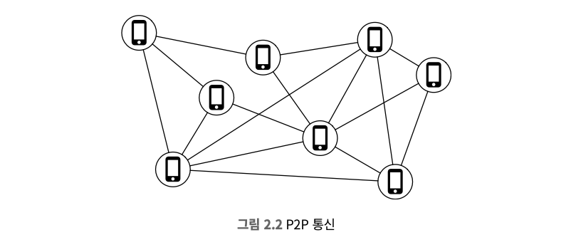
* 공용 백엔드를 두어서 사용자와 친구를 연결하며, 공용 백엔드는 아래 역할을 수행한다.
  * 모든 활성 상태 사용자의 위치 변화 내역을 수신한다.
  * 위치 변경 내역을 수신할 때마다 모든 활성 상태 친구를 찾아 친구들의 단말로 변경 내역을 전달한다.
  * 두 사용자 사이의 거리가 임계치보다 먼 경우 변경 내역을 전송하지 않는다.
  * 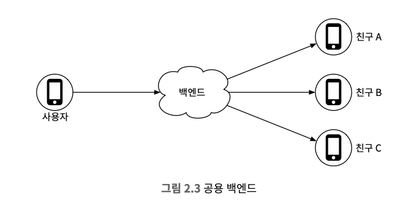
* 공용 백엔드를 둘 경우 아래와 같은 단점이 발생한다.
  * 활성 상태의 동시 접속 사용자가 천만 명이기 때문에 큰 규모에 적용하기 쉽지 않다.
  * 30초마다 갱신하면 초당 333,400번의 정보 갱신을 처리해야 한다.
  * 1명 당 400명의 친구를 갖고 그 중 10%가 활성화 상태라고 하면 초당 333,400 X 400 X 10% = 1400만 건의 위치 정보 갱신 요청을 처리해야 한다.
  * 위치 정보 갱신을 토대로 갱신 내역을 사용자 단말로 보내야 한다.
* 소규모 백엔드를 위한 개략적 설계안부터 만들고 더 큰 규모에 맞게 확장한다.
  * 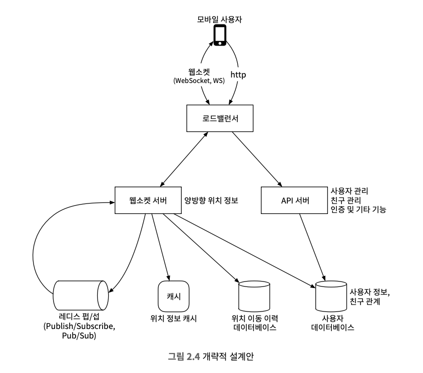

#### 로드 밸런서
* 부하를 고르게 분산하기 위해 트래픽을 서버들에 배분하는 역할을 한다.

#### RESTful API 서버
* 무상태 API 서버의 클러스터로 요청/응답 트래픽을 처리한다.
* 친구를 추가/삭제, 사용자 정보를 갱신하는 등의 부가적인 작업을 처리한다.

#### 웹소켓 서버
* 친구 위치 정보 변경을 실시간에 가깝게 처리하는 유상태 서버 클러스터이며 각 클라이언트는 한 대와 웹소켓 연결을 지속적으로 유지한다.
* 검색 반경 내 친구 위치가 변경되면 해당 연결을 통해 클라이언트로 전송된다.
* 클라이언트의 초기화도 담당하고, 모바일 클라이언트가 시작되면 온라인 상태인 모든 주변 친구 위치를 클라이언트로 전송하는 역할을 한다.

#### 레디스 위치 정보 캐시
* 활성 상태 사용자의 가장 최근 위치 정보를 캐시하는데 사용한다.
* 캐시 TTL이 지나면 비활성 상태로 바뀌고 캐시에서 삭제된다.

#### 사용자 데이터베이스
* 사용자 데이터, 사용자의 친구 관계 정보를 저장한다.
* RDBMS, NoSQL 둘 다 사용 가능하다.

#### 위치 이동 이력 데이터베이스
* 사용자의 위치 변동 이력을 보관한다.

#### 레디스 펍/섭 서버
* 초경량 메시지 버스로 새로운 채널을 생성하는 것은 아주 값싼 연산이다.
* 기가바이트급 메모리를 갖춘 최신 레디스 서버에는 수백만 개의 채널을 생성할 수 있다.
* 동작 순서는 아래와 같다.
1. 위치 정보 변경 이벤트는 사용자에게 배정된 펍/섭 채널에 발행
2. 위치가 바뀌면 해당 사용자의 모든 친구의 웹소켓 연결 핸들러가 호출
3. 각 핸들러는 위치 변경 이벤트를 수신할 친구가 활상태면 다시 계산
4. 새로 계산한 거리가 검색 반경 이내면 갱신된 위치와 갱신 시각을 웹소켓 연결로 친구의 클라이언트 앱으로 전송

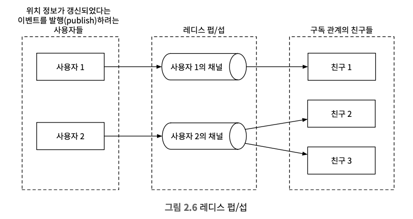

#### 주기적 위치 갱신
* 모바일 클라이언트는 웹소켓 연결을 통해 주기적으로 위치 변경 내역을 전송한다.
1. 위치가 변경된 사실을 로드 밸런서에 전송
2. 웹소켓 서버로 전송
3. 웹소켓 서버가 해당 이벤트 위치 이동 이력 데이터베이스에 저장
4. 웹소켓 서버가 위치를 위치 정보 캐시에 보관
5. 해당 사용자 채널에 새위치를 발행
6. 모든 구독자에게 브로드캐스트되고 웹소켓 연결 핸들러가 위치 변경 이벤트를 수신
7. 사용자와 구독자의 거리를 계산
8. 계산한 거리가 반경을 넘지 않으면 구독자의 클라이언트로 전송, 넘은 경우 미전송

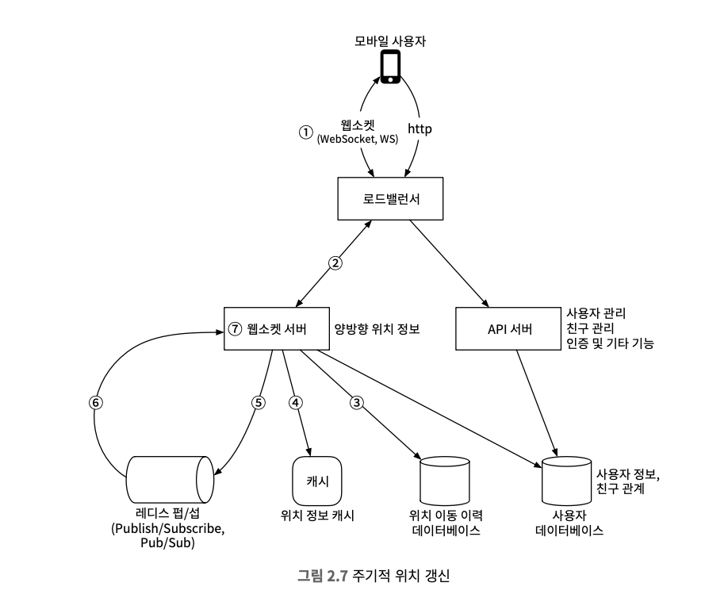

* 사례를 통해서 위치 변경 내역 전송한다.
1. 사용자의 위치가 변경되면 변경 내역은 연결된 웹소켓에 전송
2. 변경 내역이 레디스 펍/섭 서버 내의 사용자의 채널로 발행
3. 사용자의 채널의 구독자(친구 관계에 있는 모든 웹소켓 연결 핸들러)에게 브로드캐스트된다.
4. 위치 변경 내역을 사용자와 구독자 사이의 거리 검색 반경이 넘지 않는 경우에만 구독자 클라이언트로 전송된다.

> 채널의 모든 구독자에게 반복 적영되며, 평균 400명의 친구의 10% 가량이 온라인 상태이기 때문에 한 사용자당 위치가 바뀌면 40건 정도 전송이 발생한다. 

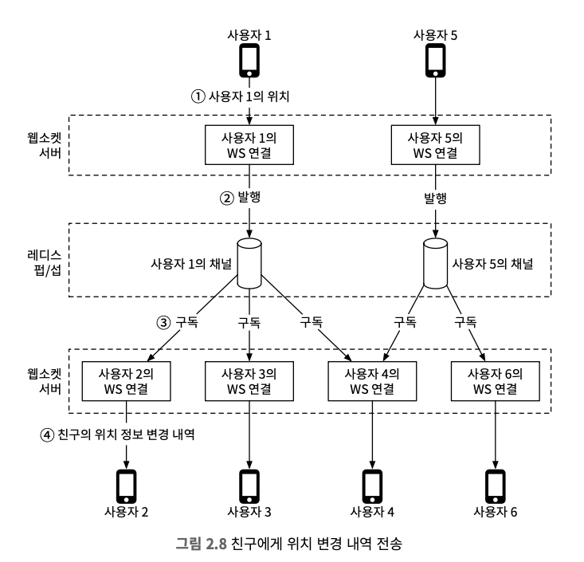

### API 설계
1. 주기적인 위치 정보 갱신
   * 위도, 경도, 시각 정보 전송
2. 클라이언트가 갱신된 친구 위치를 수신하는데 사용할 API
   * 친구 위치 데이터, 변경된 시각에 대한 타임스탬프 전송
3. 웹소켓 초기화 API
   * 위도, 경도, 시각 정보 전송
   * 자기 친구들의 위치 데이터 수신
4. 새 친구 구독 API
   * 친구 ID 전송
   * 최근의 위도, 경도, 시각 정보 수신
5. 구독 해지 API
   * 친구 ID 전송
6. HTTP 요청
   * 친구를 추가/삭제, 사용자 정보 갱신 등의 작업

### 데이터 모델
#### 위치 정보 캐시
* 레디스를 통해서 주변 친구 기능을 켠 활성 상태 친구의 최근 위치를 보관한다.
* 키는 사용자 ID, 값은 {위도, 경도, 시각}

#### 위치 정보 저장에 데이터베이스를 사용하지 않는 이유
* 주변 친구 기능으 `현재 위치`만을 이용하기 때문에 하나만 보관하면 된다.
* TTL을 통해서 사용자 정보를 자동 제거할 수 있다.
* 위치 정보에 대해서 영속성을 보장할 필요가 없다.
* 캐시가 웝업될 떄까지 놓치는 경우가 있지만, 수용 가능한 문제이다.

#### 위치 이동 이력 데이터베이스
* 사용자의 위치 변경 이력을 테이블에 저장한다.
  * user_id, latitude, longitude, timestamp
* 막대한 쓰기 연산 부하를 감당할 수 있고, 수평적 규모 확장이 가능한 데이터베이스다.
  * 아파치 카산드라는 요구에 부합하는 부합
* RDBMS를 사용할 수는 있으나, 데이터 양이 너무 많기 때문에 샤딩이 필요하다.
* 사용자 ID를 기준으로 샤딩 방안이 기본이되며, 부하를 모든 샤드에 분산시킬 수 있고 운영 관리도 간편하다.

## 3단계 상세 설계
### 중요 구성요소별 규모 확장성
#### API 서버
* 구성된 클러스터 규모를 CPU 사용률, 부하, IO 상태에 따라 자동으로 늘리는 방법은 다양하다.→ AWS 오토스케일링 

#### 웹소켓 서버
* 웹소켓 서버는 유상태 서버이기 때문에 제거할 때는 기존 연결부터 종료될 수 있도록 해야하기 때문에 로드밸런스가 인식하는 노드 상태를 연결 종료 중으로 변경해야한다.
* 모든 연결이 종료된 뒤 서버를 제거해야하며, 유상태 서버 클러스터를 자동으로 확장하기 위해서는 좋은 로드밸런스가 있어야 한다.

#### 클라이언트 초기화
* 모바일 클라이언트 기동시 웹소켓 클러스터 내의 서버 가운데 하나와 지속성 웹소켓 연결을 맺고 오랜 시간 유지된다.
* 웹소켓 연결이 초기화되면 해당 모바일의 단말 위치 정보를 전송한다.
1. 캐시에 보관된 사용자 위치 갱신
2. 계산 과정을 위해서 연결 핸들러 내의 변수에 저장
3. 사용자 데이터베이스에서 모든 친구 정보 불러오기
4. 캐시에 모든 친구 위치를 한번에 불러오기
5. 친구, 사용자 사이의 거리를 계산하고 웹소켓 연결을 통해 클라이언트에 반환
6. 각 친구의 레디스 서버 펍/섭 채널을 구독
7. 사용자 현재 위치를 레디스 펍/섭 전용 채널을 통해 모든 친구에게 전송

#### 사용자 데이터베이스
* 사용자 상세 정보 데이터, 친구 관계 데이터가 보관된다.
* 한 대의 관계형 데이터베이스로는 감당할 수 없기 때문에 샤딩을 통해 관계형 데이터베이스를 수평적 규모 확장을 진행한다.

#### 위치 정보 캐시
* 활성화 상태 사용자의 위치 정보를 레디스롤 통해 캐시한다.
* TTL을 설정해 갱신될 때마다 초기화되며, 시스템이 가장 붐빌 때 천만 명의 사용자가 활성화되고 하나의 위치 정보 보관에 100바이트가 필요하다고 가정하면 수DB 이상의 메모리를 갖춘 레디스 서버 한대로 캐시할 수 있다.
* 천만 기준으로 전송되는 데이터가 초당 334K에 달하는데 고사양 서버를 써도 부담되기 때문에 사용자 ID를 기준으로 샤딩할 수 있다.
* 가용성을 높이기 위해선 샤드에 보관하는 위치 정보를 대기 노드에 복제해두고 주 노드에 장애가 발생 시 대기 노드를 주 노드로 승격시켜 장애시간을 줄인다.

#### 레디스 펍/섭 서버
* 위치 변경 내역 메시지의 라우팅 계층으로 활용된다.
* 채널 비용이 저렴하기 때문에 레디스 펍/섭을 선택됐다.
* 새 채널은 구독하려는 채널이 없을 때 생성하고, 채널 하나를 유지하기 위해서 구독자 관계 추적을 위한 해시 테이블, 연결 리스트가 필요하지만 소량의 메모리만 을 사용한다.
* 오프라인 사용자라 어떤 변경도 없는 채널은 생성된 이후 전혀 CPU를 사용하지 않는다.
1. 주변 친구 기능을 사용하는 사용자에게 채널을 하나씩 부여하며, 모든 친구의 채널과 구독 관계를 설정한다, 이러면 활성화로 바뀐 친구나 비활성화로 바뀐 친구의 채널을 구독하거나 빌활성화 상태가 친구의 채널을 중단하는 등의 작업이 필요없다. → 새로운 친구가 생기거나, 친구를 삭제했을 때 구독 관계를 정리해야하지 않을까?
2. 더 많은 메모리를 사용하지만 병목될 가능성은 낮고, `아키텍처를 단순하게 만들 수 있으면 많은 메모리를 투입할 가치는 충분`하다.

#### 사용되는 레디스 펍/섭 서버
* 메모리 사용량 
  * 200GB (1억 X 20바이트 X 100명의 친구 / 10⁹)
* CPU 사용량
  * 초당 1400만 건에 달하기 때문에 기가비트 네트워크 카드를 탑재한 서버 한대의 구독자 수가 100,000이라고 가정하면 레디스 서버의 수는 1400만 / 100,000 = 140대로 추정된다.
  * 보수적인 수치로 필요한 서버의 수는 더 적을 수 있다.
* 레디스 펍/섭 서버의 병목은 메모리가 아닌 CPU다.
* 규모를 감당하기 위해선 분산 레디스 펍/섭 클러스터가 필요하다.

#### 분산 레디스 펍/섭 서버 클러스터
* 채널은 서로 독립적이기 때문에 사용자 ID를 기준으로 펍/섭 서버들을 샤딩한다.
* 서비스 탐색 컴포넌트를 도입해 문제를 풀어내는데 etcd, 주키퍼가 널리사용된다.
1. 가용한 서버 목록을 유지하는 기능 및 목록을 갱신하는데 필요한 UI 또는 API
2. 클라이언트가 값에 명시된 레디스 펍/섭 서버에서 발생한 변경 내역을 구독할 수 있는 기능

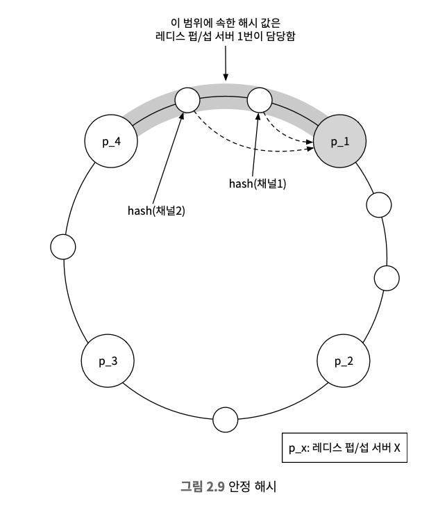

* 변경 내역 발행 과정
1. 해시 링을 참조해 메시지를 발행할 레디스 펍/섭 서버를 선정하고 서비스 탐색 컴포넌트에 보관되어 있으나, 성능을 위해서 웹소켓 버서에서 캐시하는 것도 생각해볼 수 있다.
2. 웹소켓 서버는 사용자 채널에 위치 정보 변경 내역을 발행
3. 구독할 채널이 존재하는 레디스 펍/섭 서버를 찾는 과정도 동일

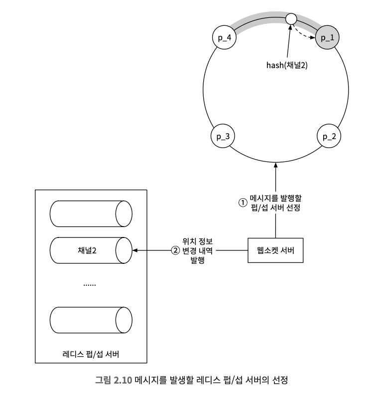

#### 레디스 펍/섭 서버 클러스터의 규모 확장 고려사항
* 트래픽 패턴에 따라 크기를 늘리거나 줄이는 건 무상태 서버로 구성된 클러스터에 널리 사용되는데 위험성이 낮고 비용을 절감하기 좋기 때문이다.
* 하지만 펍/섭 서버는 채널에 대한 상태 정보를 보관하는데 특정한 채널을 담당하던 펍/섭 서버를 교체하거나 해시 링에서 제거하는 경우 모든 구독자에게 알려야하기 때문에 펍/섭은 유상태 서버라고 볼 수 있다.
* 유상태 서버 클러스터는 어느정도 여유를 두고 오버 프로비저닝하는 것이 보통이다.

#### 운영 고려사항
* 펍/섭 서버에 장애가나면 온콜 엔지니어에게 경보를 발송한다.
* 온콜 담당자는 서비스 탐색 컴포넌트의 해시 링 키에 매달린 값을 갱신하여 장애가 발생한 노드를 대기 중인 노드와 교체한다.

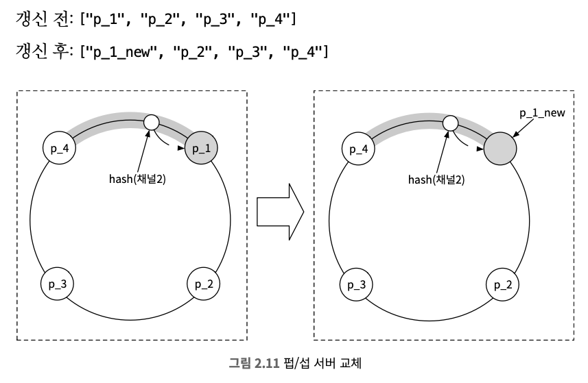

### 친구 추가/삭제
* 해당 클라이언트에 연결된 웹소켓 서버의 연결 핸들러에 알려야 새 친구의 펍/섭 채널을 구독할 수 있기 때문에 새 친구가 추가되면 콜백을 앱에 등록할 수 있다.
* 콜백이 호출되면서 웹소켓 서버로 새 친구의 펍/섭 채널을 구독하라고 메세지를 보내고 활성화인 경우에 응답 메세지에 담아 보낸다.
* 친구가 삭제되는 경우에도 마찬가지로 콜백을 활용한다.

### 친구가 많은 사용자
* 최대로 맺을 수 있는 친구의 상한이 있다고 가정하며, 친구 관계는 양방향이고 팔로워는 제외하기 때문에 인플루언서는 존재할 수 없다.
* 수천명의 친구를 구독하는데 펍/섭 구독 관계는 클러스터 내의 많은 웹소켓 서버에 분산되어 있기 때문에 핫스팟 문제는 발생하지 않는다.
* 많은 친구를 둔 사용자의 채널이 조금 더 많은 부하를 감당할 수 있지만 헤비 유저들이 분산된다고 가졍하면 크게 고려하지 않아도 된다.

### 주변의 임의 사용자
* 무작위로 보여준다고 가정했을 때 기존 설계를 훼손하지 않을려면 지오해시에 따라 펍/섭 채널 풀을 두는 것이다.
* 지오해시를 격자로 나눈 뒤 격자마다 채널을 하나씩 만들어 둔다.

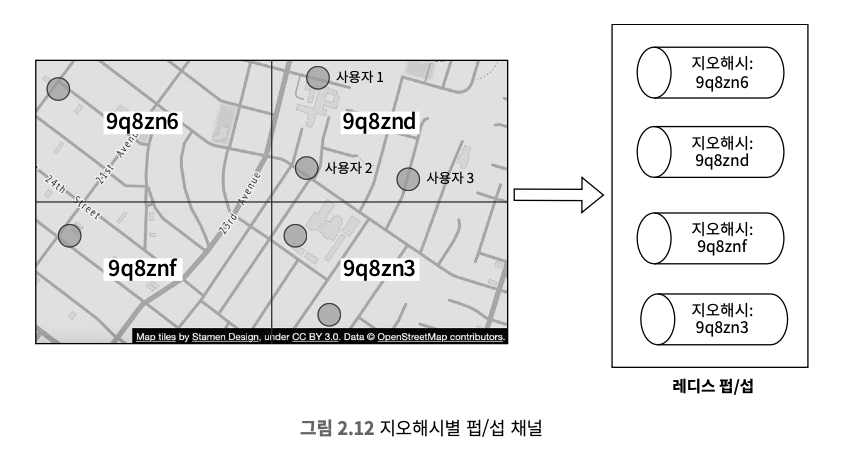

* 격자 내의 모든 사용자는 할당된 채널을 구독한다.

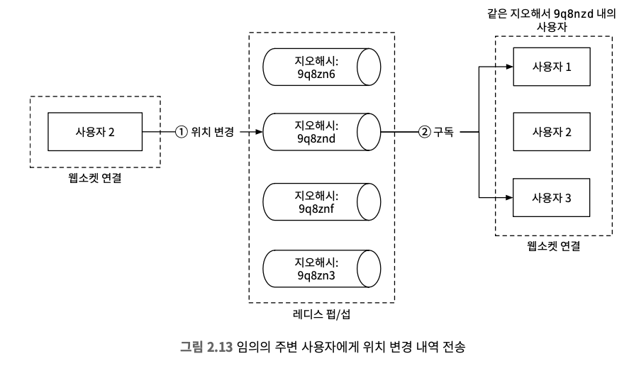

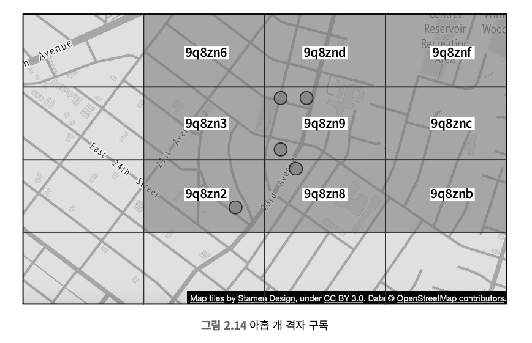

### 레디스 펍/섭 외의 대안
* 고도로 분산된 병렬 애플리케이션을 위해 고안된 프로그래밍이자 런타임 환경인 얼랭이 좋은 솔루션이 될 수있다.
* 레디스 펍/섭 클러스터는 분산 얼랭 애플리케이션으로 대체할 수 있다.

## 4단계 마무리
* 해당 설계의 핵심 컴포넌트는 아래와 같다.
  * 웹소켓
  * 레디스
  * 레디스 펍/섭
* 소규모에서 규모가 커짐에 따른 해결책 및 잠재적 성능 병목 문제 그 외의 기능에 대한 설계안도 살펴봤다.

### 참고
* https://d2.naver.com/helloworld/809802?ref=codenary
* https://channel.io/ko/blog/real-time-chat-server-2-redis-pub-sub