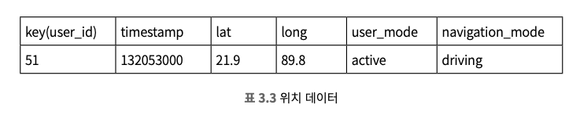
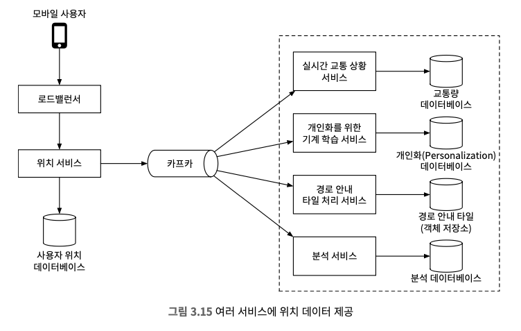

# 3장 구글 맵
* 구글 맵은 위성 이미지, 거리 뷰, 실시간 교통 상황, 경로 계획 등 다양한 서비스를 제공한다.
* 사용자가 목적지와 경로를 찾을 수 있도록 도우며 2021.03 기준 DAU는 10억 명, 전 세계 99% 지역의 지도를 제공하고, 정확한 실시간 위치 정보를 제공하기 위해 매일 2500만 건의 업데이트를 반영한다.
* 구글 맵은 엄청나게 복잡한 제품이기에 어떤 기능에 초점을 맞춰야 하는지 확인해야 한다.

## 1단계 문제 이해 및 설계 범위 확정
* 설계 시작 전에 질문을 던져 설계 범위를 좁혀야 한다.
```
Q1. 일간 능동 사용자 수는 몇으로 가정해야 할까요?
→ 10억 DAU를 가정하면 됩니다.

Q2. 어떤 기능에 초점을 맞춰야 하나요? 방향 안내, 경로 안내, 예상 도착 시간(ETA) 등 기능이 많습니다.
→ 위치 갱신, 경로 안내, ETA, 지도 표시

Q3. 도로 데이터는 어느 정도 규모인가요? 도로 데이터를 확보했다고 가정해도 될까요?
→ 도로 데이터는 다양한 경로를 확보해 두었다고 가정하고, 수 TB 수준의 가공되지 않은 데이터입니다.

Q4. 교통 상황도 고려해야 할까요?
→ 네, 교통 상황은 도착 시간을 최대한 정확하게 추정하는 데 아주 중요합니다.

Q5. 어떻게 이동되는지 고려해야 할까요? 운전 또는 걷기, 대중교통도 이요할 수도 있을 것 같습니다.
→  경유지를 여러 곳 설정할 수 있으면 좋겠지만 일단은 신경쓰지 않도록 합시다.

Q6. 사업장 위치 및 사진도 표시할 수 있어야할까요? 그렇다면 사진은 최대 몇장을 허용해야 할까요?
→ 이번에는 고려하지 않겠습니다.
```

### 기능 요구사항
* 사용자 위치 갱신
* 경로 안내 서비스(ETA 서비스 포함)
* 지도 표시

### 비기능 요구사항 및 제약사항
* 정확도 → 사용자에게 잘못된 경로를 안내 X
* 부드러운 경로 표시 → 화면에 아주 부드럽게 표시되고 갱신
* 데이터 및 배터리 사용량 → 가능한 최소한의 데이터와 배터리 사용
* 일반적으로 널리 통용된 가용성 및 규모 확정성 요구사항을 만족

### 지도 101
#### 측위 시스템
* 세계는 축을 중심으로 회전하는 구이며 측위 시스템은 구 표면 상의 위치를 표현하는 세계를 말한다.
* 위경도 기반 측위 시스템의 경우 위도는 얼마나 북쪽/남쪽인지 경도는 얼마나 동쪽/서쪽인지를 나타낸다.


#### 3차원 위치의 2차원 변환
* `3차원 구 위의 위치를 2차원 평면에 대응시키는 절차를 지도 투영법 또는 도법`이라 부른다.
* 도법은 다양하며 각각 장단점을 가지지만 모든 투영법은 실제 지형의 기하학적 특성을 왜곡한다는 공통점을 가진다.
* 구글 맵은 웹 메르카토르 도법을 택하고 있다.
    * 네이버 맵은 주로 한국에서 사용하고 있는 UTMK 투영법을 변조한 네이버 자체 투영법 UTMK_NAVER을 사용하며, UTMK 투영법은 UTM 투영법을 한국의 지리적 특성에 맞게 조정된 방법이다.
    * 카카오 맵은 WCONG 투영법을 사용 중이며 지구를 평면에 나타내는 방법이다.


#### 지오코딩
* 주소를 지리적 측위 시스템의 좌표로 변환하는 프로세스이다.
* 반대로 위도와 경도를 주소로 변환하는 프로세스는 역 지오코딩이라 부른다.
* 지오코딩을 수행하는 한가지 방법은 인터폴레이션이며, GIS와 같은 다양한 시스템이 제공하는 데이터를 결합한다는 뜻이고 GIS는 도로망을 지리적 좌표 공간에 대응시키는 방법을 제공하는 여러 시스템 가운데 하나다.

#### 지오해싱
* 지도 위 특정 영역을 영문자와 숫자로 구성된 짧은 문자열에 대응시키는 인코딩 체계다.
* 2차원 평면 공간으로 표현된 지리적 영역 위의 격자를 더 작은 격자로 재귀적으로 분할해 나간다.


#### 지도 표시
* 지도를 화면에 표시하는데 가장 기본이 되는 개념은 타일이고, 지도 전부를 하나의 이미지가 아닌 작은 타일로 쪼개어 표시한다.
* 지도의 확대/축소를 지원하기 위해서 확대 수준에 따른 타일을 준비해야하며, 지도 확대 수준에 근하여 어떤 크기의 타일을 가져올지 고른다.

#### 경로 안내 알고리즘을 위한 도로 데이터 처리
* 대부분 경로 탐색 알고리즘은 데이크스트라(다익스트라) 알고리즘이나 A* 경로 탐색 알고리즘의 변종이다.
* 최적의 하나를 정하는 건 어려운 문제이며, 중요한 것은 모든 경로 탐색 알고리즘은 교차로를 노드로 도로는 노드를 잇는 선으로 표현하는 그래프 자료 구조를 가정한다.


* 대부분의 경로 탐색 알고리즘의 성능은 주어진 그래프 크기에 민감하기 때문에 좋은 성능을 보이려면 그래프를 관리 가능 단위로 분할할 필요가 있다.
* 전 세계 도로망을 작은 단위로 분할하는 방법 가운데 지도 표시에 사용하는 타일 기반 분할법과 유사하며 지오해싱과 비슷한 분할 기술을 적용해 각 격자 안의 도로망을 작은 격자 타일로 나눈다.
* 도로망을 언제든지 불러올 수 있는 경로 안내 타일로 분할해 놓으면 메모리 요구량을 낮출 수 있고 처리해야하는 경로의 양이 줄어들어 경로 탐색 성능이 좋아진다.


> 지도 타일은 PNG 이미지인 반면 경로 안내 타일은 도로 데이터로 이루어진 이진 파일이다.


#### 계층적 경로 안내 타일
* 경로 안내가 효과적으로 동작하기 위해선 필요한 수준의 구체성을 갖춘 도로 데이터가 필요하다.
* 보통 구체성 정도를 상, 중, 하로 구분해 세 가지 종류의 경로 안내 타일을 준비한다.
  * 상 → 크기가 아주 작고, 지압도 데이터만 둔다.
  * 중 → 더 넓은 지역을 커버하고, 관할구를 잇는 간선도로 데이터만 둔다.
  * 하 → 더 큰 영역을 커버하고, 도시와 주를 연결하는 주요 고속도로 데이터만 둔다.
* 각 타일에는 다른 정밀도 타일로 연결되는 선이 존재한다.


### 개략적 규모 추정
* 설계 초점이 모바일 단말로 데이터 사용량과 배터리 효율을 중요하게 따져야 한다.
* 참고할 도량형 변환 규칙
  * 1피트 = 0.3048미터
  * 1킬로미터 = 0.6214마일
  * 1킬로미터 = 1,000미터

#### 저장소 사용량
* 세 가지 종류의 데이터를 저장해야 한다.
  * 세계 지도
  * 메타데이터
  * 도로 정보

#### 세계 지도
* 확대 수준 별로 지도 타일을 한 벌씩 두어야 한다.
* 용량을 가늠하기 위해서 최대 확대 수준을 보는데 필요한 타일 개수를 따져봐야 한다.
* 세계 지도를 21번 확대 하여 볼 수 있으려면 약 4.4조개의 타일이 필요하고 한 장의 타일이 256 X 256 픽셀 압출 PNG(100KB)이라면 4.4조 X 100KB = 440PB 만큼의 저장 공간이 필요하다.
* 지도 표면 가운데 90%는 인간이 살지 않는 자연이기 때문에 이 지역은 높은 비율로 압축할 수 있어서 보수적으로 80% ~ 90% 가량의 저장 용량을 절감할 수 있어서 저장 공간은 44PB ~ 88PB로 줄어든다.


#### 서버 대역폭
* 서버 대역폭을 추정하기 위해서 어떤 유형의 요청을 처리해야 하는지 살펴야한다.
  * 경로 안내 요청은 클라이언트가 경로 안내 세션을 시작할 때 전송하는 메시지다.
  * 위치 갱신 요청으로 클라이언트가 경로 안내를 진행하는 동안 변경된 사용자 위치를 전송하는 메시지다.
* DAU는 10억이고 사용자는 평균적으로 주당 35분 사용한다고 가정하면 주당 350억분, 하루에 50억분이다.
* 3000억 건의 요청이 발생하고 3백만의 QPS에 해당하지만 클라이언트가 매초 새로운 GPS 좌표를 보낼 필요가 없을 수 있어서 요청을 클라이언트 쪽에서 모아두었다가 15초 또는 30초마다 한 번씩 쓰기 QPS를 낮출 수 있다.
* 본 설계안은 15초마다 한번씩 보낸다고 가정해 QPS는 20만, 최대 QPS는 평균치의 다섯배인 1백만으로 가정한다.

## 2단계 개략적 설계안 제시 및 동의 구하기
### 개략적 설계안
1. 위치 서비스
2. 경로 안내 서비스
3. 지도 표시


### 위치 서비스
* 사용자의 위치를 기록하는 역할을 담당한다.


* 기본 설계안은 클라이언트가 t초마다 자기 위치를 전송한다고 가정하며, t는 설정이 가능한 값이다.
* 주기적으로 위치 정보를 전송하면 데이터 스트림을 활용하여 시스템을 점차 개선, 실시간 교통 상황을 모니터링하는 용도, 새로 만들어진 도로나 폐쇄된 도로 탐색, 개인화된 경험을 제공하는데 활용, 실시간 정보에 가까워 ETA를 좀 더 정확하게 산출, 교통 상황에 따라 다른 경로를 안내할 수 있는 장점이 있다.
* 위치 이력을 클라이언트에 버퍼링해두었다가 일괄 요청을 하면 전송 빈도를 줄일 수 있다.


* 구글 맵과 같은 시스템은 요청빈도를 줄여도 많은 쓰기 요청을 처리해야하기 때문에 높은 쓰기 요청빈도와 최적화, 규모확장에 용이한 카산드라 같은 데이터베이스가 필요하고, 카프카 같은 스트림 처리 엔진을 활용해 위치 데이터를 로깅해야 한다.
* 통신 프로토콜은 HTTP를 keep-alive 옵션과 함께 사용하면 효율을 높일 수 있어서 좋은 선택이다.

### 경로 안내 서비스
* 합리적으로 빠른 경로를 찾아주는 역할을 담당한다.
* 결과에 드는 시간 지연은 감내할 수 있지만 정확도는 보장되어야 한다.
* API 요청으로 출발지와 목적지가 인자로 전달된다.
  * `GET /v1/nav?origin=1355+market+street,SF&destination=Disneyland`
  * [구글 맵 공식 API](https://developers.google.com/maps/get-started?hl=ko)
* 경로 재탐색이나 교통 상황 변화같은 문제는 고려하지 않았지만 적응형 ETA를 통해 해결할 수 있다.

### 지도 표시
* 확대 수준별로 지도 타일을 저장할려면 수백 PB가 필요하며, 확대 수준에 따라 필요한 타일을 서버에서 가져오는 접근법이 바람직하다.
* 클라이언트가 언제 지도 타일을 서버에서 가져오는 시나리오를 생각할 수 있다.
  * 사용자가 지도를 확대 또는 이동시키며 주변을 탐색
  * 경로 안내가 진행되는 동안 사용자의 위치가 현재 지도 타일을 벗어나 인접한 타일로 이동


#### 선택지 1
* 클라이언트가 보는 지도의 확대 수준에 근거하여 필요한 지도 타일을 즉석에서 만드는 방안
* 모든 지도 타일을 동적으로 만들어야하는 서버 클러스터에 심각한 부하가 걸린다.
* 캐시를 활용하기가 어렵다.

#### 선택지 2
* 확대 수준별로 미리 만들어 둔 지도 타일을 클라이언트에 전달하기만 하는 방법
* 각 지도 타일이 담당하는 지리적 영역은 분할법을 사용해 만든 고정된 사각형 격자로 표현되서 정직하다.


* 모바일 단말 사용자는 지도 타일 요청을 CDN에 보내고 타일이 CDN에 서비스된 적이 없으면 원본 서버에서 파일을 가져와 사본을 캐시에 보관한 뒤 다음 사용자에게 반환한다.
* POP에서 파일을 서비스하기 때문에 규모 확장에 용이하고 성능 측면에서 유리하다.
* 모바일 데이터 사용량을 줄이는 것은 중요하기 때문에 클라이언트에 캐시를 두면 데이터 사용량을 많이 줄일 수 있다.


##### 지도 표시 흐름도
1. 사용자가 타일 URL들을 가져오기 위해 지도 타일 서비스를 호출하며 요청은 로드밸런서로 전달
2. 로드밸랜서가 요청을 지도 타일 서비스로 전달
3. 지도 타일 서비스가 위치와 확대 수준을 입력을 삼아 9개의 타일을 URL로 계산해 클라이언트에 반환
4. 클라이언트가 해당 타일을 CDN을 통해 다운로드


## 3단계 상세 설계
* 데이터 모델
* 위치 서비스
* 경로 안내 서비스
* 지도 표시

### 데이터 모델
* 네 가지 데이터를 취급한다.
  * 경로 안내 타일
  * 사용자 위치
  * 지오코딩 데이터
  * 미리 계산해 둔 지도 타일 데이터

#### 경로 안내 타일
* 외부 도로 데이터 사용
  * 출처: 외부 사업자나 기관이 제공한 도로 데이터를 사용
  * 데이터 양: 수 테라바이트에 달하는 방대한 데이터
  * 내용: 도로와 메타데이터(이름, 관할구, 위도, 경도 등)
  * 지속적 개선: 애플리케이션이 사용자 위치 데이터를 지속적으로 수집하여 개선
* 데이터 가공
  * 초기 상태: 그래프 자료 구조 형태로 가공되지 않은 상태로, 경로 안내 알고리즘에 바로 사용 불가
  * 오프라인 데이터 가공 파이프라인: 경로 안내 타일 처리 서비스가 주기적으로 실행되어 도로 데이터를 경로 안내 타일로 변환
  * 변경사항 반영: 도로 데이터의 새로운 변경사항을 반영하여 업데이트
* 경로 안내 타일 구성
  * 해상도: 세 가지 해상도로 타일 생성
  * 타일 내용: 교차로와 도로 정보를 그래프의 노드와 선분으로 표현
  * 참조 정보: 다른 타일의 도로와 연결되는 경우 참조 정보 포함
* 저장 방식
  * 메모리와 데이터베이스: 메모리에 인접 리스트 형태로 보관하는 것은 비효율적이며, 데이터베이스는 비용 문제와 불필요한 기능 제공
  * 효율적 저장 방법:
    * 객체 저장소: S3 같은 객체 저장소에 파일 형태로 저장
    * 직렬화: 인접 리스트를 이진 파일 형태로 직렬화
    * 지오해시 분류: 타일을 지오해시 기준으로 분류하여 신속한 검색 가능
* 경로 안내 타일 사용
  * 캐싱: 경로 안내 서비스에서 파일을 적극적으로 캐싱

#### 사용자 위치 데이터
* 중요성 및 활용
  * 값진 데이터: 사용자 위치 정보는 매우 중요한 데이터
  * 갱신 및 구축: 도로 데이터 및 경로 안내 타일을 갱신하고, 실시간 교통 상황 데이터 및 교통 상황 이력 데이터베이스를 구축하는 데 사용
  * 지도 데이터 갱신: 데이터 스트림 프로세싱 서비스를 통해 위치 데이터를 처리하여 지도 데이터를 갱신
* 저장소 요구사항
  * 쓰기 연산 처리: 엄청난 양의 쓰기 연산을 잘 처리할 수 있어야 함
  * 수평적 확장성: 데이터베이스가 수평적 규모 확장이 가능해야 함
* 데이터베이스 선택
  * 카산드라: 이러한 요구사항을 잘 충족하는 데이터베이스로 카산드라가 적합
* 데이터베이스 레코드 형태
  * 레코드는 다음과 같은 형태를 가짐:
    * 사용자 ID
    * 위치 좌표 (위도 및 경도)
    * 타임스탬프
    * 기타 메타데이터 (예: 속도, 방향 등)


#### 지오코딩 데이터 베이스
* 주소를 위도/경도 쌍으로 변환하는 정보를 보관
* 레디스 처럼 빠른 읽기 연산을 제공하는 키-값 저장소가 적당하다.
* 출발지, 목적지 주소는 경로 계획 서비스에 전달 전 해당 데이터베이스를 통해 위도/경도 쌍으로 변환되야 한다.

#### 미리 만들어 둔 지도 이미지
* 지도 이미지 생성 및 캐싱
  * 요청 처리: 단말이 특정 영역의 지도를 요청하면 인근 도로 정보를 취합하여 모든 도로 및 관련 상세 정보가 포함된 이미지를 생성해야 함
  * 자원 소모: 계산 자원을 많이 사용하며, 중복 요청이 많음
  * 캐싱 전략: 이미지는 한 번만 계산하고 결과를 캐시하여 중복 요청을 처리
* 이미지 전송 및 저장
  * 확대 수준별 준비: 지도 이미지를 표시할 때 사용하는 다양한 확대 수준별로 미리 이미지를 생성
  * CDN 전송: 생성된 이미지를 CDN을 통해 전송
  * 원본 서버: CDN 원본 서버로 아마존 S3 같은 클라우드 저장소를 활용


### 서비스
#### 위치 서비스
* 위치 서비스 동작 방식
  * 데이터베이스 설계 초점: 데이터베이스 설계와 사용자 위치 정보 이용 방식에 초점을 맞춤
  * 키값 저장소 활용: 사용자 위치 데이터 저장에 키값 저장소 사용


* 요구사항
  * 쓰기 연산: 초당 백만 건의 위치 정보 업데이트가 발생, 쓰기 연산 지원이 탁월한 데이터베이스 필요
  * 데이터베이스 선택: NoSQL 키값 데이터베이스나 열 중심 데이터베이스(column-oriented database)가 적합
  * 가용성 중시: 사용자 위치는 계속 변화하며, 데이터 일관성보다는 가용성이 더 중요
  * CAP 정리: 일관성(Consistency), 가용성(Availability), 분할 내성(Partition tolerance) 중 가용성과 분할 내성에 집중
* 적합한 데이터베이스
  * 카산드라: 높은 가용성을 보장하며 막대한 규모의 연산을 감당할 수 있음
* 데이터베이스 키 설계
  * 키 구성: (user_id, timestamp)의 조합을 키로 사용
    * 값: 위도/경도 쌍 저장
    * user_id: 파티션 키 (partition key)
    * timestamp: 클러스터링 키 (clustering key)
  * 목적:
    * 특정 사용자의 최근 위치를 신속히 읽어내기 위해 user_id를 파티션 키로 사용
    * 같은 파티션 키를 갖는 데이터는 함께 저장되고 클러스터링 키 값에 따라 정렬
    * 특정 사용자의 특정 기간 내 위치도 효율적으로 읽어낼 수 있음



#### 사용자 위치 데이터 이용 방법
* 중요성 및 활용 용도
  * 중요 데이터: 사용자 위치는 매우 중요한 데이터로 다양한 용도로 활용 가능
  * 도로 상태 감지: 새로 개설되거나 폐쇄된 도로를 감지
  * 지도 데이터 개선: 지도 데이터의 정확성을 점차적으로 개선
  * 실시간 교통 현황 파악: 실시간 교통 상황을 파악하는 데 활용
* 메시지 큐를 통한 데이터 로깅
  * 카프카 사용: 사용자 위치 데이터를 데이터베이스에 기록하는 것과 별도로, 카프카 같은 메시지 큐에 로깅
  * 카프카의 장점: 응답 지연이 낮고 많은 데이터를 동시에 처리 가능, 실시간 데이터 피드 지원
* 서비스 활용
  * 데이터 스트림 활용: 개별 서비스는 카프카를 통해 전달되는 사용자 위치 데이터 스트림을 각자의 용도에 맞게 활용
  * 실시간 교통 상황 서비스: 데이터 스트림을 통해 실시간 교통량 데이터베이스를 갱신
  * 경로 안내 타일 처리 서비스: 새로 열린 도로나 폐쇄된 도로를 탐지하고, 변경 내역을 객체 저장소의 경로 안내 타일에 반영하여 지도 품질을 점진적으로 개선



### 지도 표시
* 구글의 설계안을 참조한 지도 타일을 미리 만들어 놓는 방법과 지도 표시 최적화 기법을 살펴본다.

#### 지도 타일 사전 계산
* 확대 수준별 타일 구성
  * 타일 생성 필요성: 사용자가 보는 지도 크기와 확대 수준에 맞춰 미리 타일을 만들어야 함
  * 확대 수준: 구글 맵과 유사하게, 본 설계안도 21단계 확대 수준을 지원
* 확대 수준별 타일 규칙
  * 확대 수준 0: 전 세계를 256 x 256픽셀 크기의 타일 하나로 표현
  * 확대 수준 1: 전체 타일 수가 동서 방향으로 두 배, 남북 방향으로 두 배 증가
    * 필요한 타일 수: 2 x 2장
    * 전체 해상도: 512 x 512픽셀
  * 확대 수준 2: 전체 타일 수가 동서 방향으로 두 배, 남북 방향으로 두 배 증가
    * 필요한 타일 수: 4 x 4장
    * 전체 해상도: 1024 x 1024픽셀
  * 규칙: 확대 수준을 1단계 올릴 때마다 전체 해상도가 이전 수준 대비 4배 증가
* 장점
  * 상세 정보 제공: 해상도 증가로 사용자에게 더 상세한 정보를 제공
  * 네트워크 효율성: 클라이언트는 설정된 확대 수준에 최적화된 크기의 타일만 다운로드하므로 네트워크 대역폭을 효율적으로 사용
  * 화면 표시: 화면에 한 번에 표시 가능한 지도 타일 개수는 변하지 않음

#### 최적화: 벡터 사용
1. 우수한 압축률
   * 벡터 타일: 벡터 정보(경로, 다각형 등)를 전송하면 이미지에 비해 압축률이 월등히 높음
   * 네트워크 대역폭 절약: 데이터 전송에 필요한 대역폭을 대폭 줄일 수 있음
2. 매끄러운 확대 경험
   * 래스터 이미지 문제: 기존의 래스터 방식 이미지에서는 확대 시 이미지가 늘어나고 픽셀이 도드라져 보이는 문제 발생
   * 벡터 이미지 장점: 벡터 이미지는 확대할 때 각 요소의 크기를 적절히 조정할 수 있어 매끄러운 확대 경험 제공
   * 시각적 품질: 확대 시 시각적 왜곡이 적고, 더 선명하고 부드러운 이미지를 제공
3. 향상된 사용자 경험
   * 동적 렌더링: 클라이언트 측에서 벡터 데이터를 실시간으로 렌더링할 수 있어, 다양한 확대 및 축소 수준에서의 성능 향상
   * 상호작용: 벡터 데이터는 다양한 사용자 상호작용(예: 클릭, 드래그)에 대해 더 유연하게 대응
* 요약
  * 압축률 향상: 벡터 타일은 이미지보다 높은 압축률을 제공하여 네트워크 대역폭 절약
  * 매끄러운 확대: 벡터 이미지는 확대 시 품질 저하 없이 부드러운 확대 경험 제공
  * 사용자 경험 개선: 동적 렌더링과 상호작용성 향상으로 더 나은 사용자 경험 제공

### 경로 안내 서비스
* 가장 빠른 경로를 안내하는 역할을 담당한다.


#### 지오코딩 서비스
* 주소를 위도와 경도 쌍으로 바꿔주는 서비스가 필요하며, 주소의 표현 방식은 다양할 수 있다는 점을 고려해야 한다.
* 경로 안내 서비스는 이 서비스를 호출해 출발지와 목적지 주소를 위도/경도 쌍으로 변환한 뒤 다른 서비스 호출에 이용한다.
* 요청
  * https://maps.googleapis.com/maps/api/geocode/json?address=1600+Amphit
heatre+Parkway,+Mountain+View,+CA
* 응답
  ```
    {
    "results" : [ {
    "formatted_address" : "1600 Amphitheatre Parkway, Mountain View, CA 94043, USA",
    "geometry" : { "location" : {
    "lat" : 37.4224764,
    "lng" : -122.0842499 },
    ... 생략
  ```

#### 경로 계획 서비스
* 현재 교통 상황과 도로 상태에 입각 하여 이동 시간 측면에서 최적화된 경로를 제안하는 역할을 담당
* 다른 서비스들과 통신하여 결과를 만든다.

#### 최단 경로 서비스
* 기능
  * 입력: 출발지와 목적지의 위도/경도
  * 출력: k개의 최단 경로
  * 기능적 범위: 교통이나 도로 상황을 고려하지 않고 도로 구조만을 기반으로 계산
  * 캐시 사용: 도로망 그래프는 거의 정적이므로 캐시를 활용하여 효율성 향상
* 알고리즘 개요
  * 경로 안내 타일: 객체 저장소에서 저장된 타일을 사용하여 A* 경로 탐색 알고리즘 실행
* 단계별 과정:
  * 1. 위도/경도 변환: 출발지와 목적지의 위치 정보를 지오해시로 변환
  * 2. 타일 조회: 출발지와 목적지의 지오해시를 바탕으로 해당 경로 안내 타일을 얻음
  * 3. 탐색 시작
    * 출발지 타일에서 시작하여 그래프 자료 구조 탐색
    * 필요에 따라 주변 타일을 객체 저장소에서 가져오거나 캐시에서 조회
    * 확대 수준이 다른 타일 간의 연결도 고려(예: 고속도로만 있는 큰 타일로 진입 가능)
    * 경로 확보: 최단 경로가 충분히 확보될 때까지 탐색 범위를 확장


#### 예상 도착 시간 서비스
* 경로 계획 서비스
  * 기능: 최단 경로 목록을 수신
  * 작업: 예상 도착 시간(ETA) 서비스를 호출하여 각 경로에 대한 소요 시간 추정치를 구함
* 예상 도착 시간(ETA) 서비스
  * 기능: 현재 교통 상황 및 과거 이력을 바탕으로 예상 도착 시간 계산
  * 기술: 기계 학습을 활용하여 예측
  * 문제점: 실시간 교통 상황뿐만 아니라 10분에서 20분 뒤의 교통 상황을 예측해야 함

#### 순위 결정 서비스
* 경로 계획 서비스
  * ETA 계산: 예상 도착 시간(ETA) 서비스를 호출하여 경로에 대한 소요 시간 추정치를 계산
  * 정보 전달: ETA 예상치를 포함한 관련 정보를 순위 결정 서비스(ranker)에 전달
* 순위 결정 서비스
  * 필터링: 사용자가 정의한 필터링 조건(예: 유료 도로 제외, 고속도로 제외)을 적용
  * 경로 정렬: 필터링 후 남은 경로를 소요 시간 순으로 정렬
  * 결과 반환: 최단 시간 경로 k개를 선정하여 경로 안내 서비스에 결과를 반환

#### 중요 정보 갱신 서비스들
* 역할
  * 목표: 카프카 위치 데이터 스트림을 구독하고 중요 데이터를 비동기적으로 업데이트하여 최신 상태를 유지
* 주요 서비스 사례
  * 1. 경로 안내 타일 처리 서비스
    * 기능: 도로 데이터에서 새로 발견된 도로와 폐쇄된 도로 정보를 반영하여 경로 안내 타일을 갱신
    * 효과: 최단 경로 서비스가 더 정확한 결과를 제공할 수 있게 됨
  * 2. 실시간 교통 상황 서비스
    * 기능: 활성화 상태의 사용자가 보내는 위치 데이터 스트림에서 교통 상황 정보를 추출
    * 효과: 추출된 정보를 실시간 교통 상황 데이터베이스에 반영하여 예상 도착 시간 서비스의 정확성 향상

#### 적응형 ETA와 경로 변경
* 문제
  * 현재 경로 안내를 받고 있는 사용자의 ETA를 교통 상황 변화에 따라 적응형으로 업데이트하는 것
* 접근 방식
  * 1. 사용자 추적
    * 모든 경로 안내를 받고 있는 사용자를 추적하며, 교통 상황 변화 시 ETA를 업데이트해야 함
  * 2. 교통 상황 변화의 영향
    * 교통 상황이 변경된 경로에 영향을 받는 사용자를 효율적으로 가려내야 함
    * 기존 방법: 모든 레코드를 전수 조사 (시간 복잡도: O(n x m))
    * 개선 방법
      * 사용자의 현재 경로와 관련 타일을 포함하는 상위 타일 정보로 데이터베이스를 구성
      * 교통 상황 변화가 있을 때 해당 타일을 포함하는 사용자만 갱신 (시간 복잡도: O(n))
  * 3. 교통 상황 개선 대응
    * 교통 상황이 회복된 경우, 사용자에게 더 짧은 ETA를 제공하기 위해 주기적으로 ETA 재계산 및 경로 재설정 알림


#### 전송 프로토콜
* 필요성
  * 경로 안내 중 경로 상황이 변경될 수 있으므로, 클라이언트에 안정적으로 데이터를 전송할 방법 필요
* 프로토콜 옵션
  * 모바일 푸시 알림: 메시지 크기 제한이 크고 웹 애플리케이션 지원 없음 (사용하지 않음)
  * 롱 폴링: 사용 가능하나 상대적으로 서버 부담이 크고 비효율적
  * 웹소켓: 양방향 통신 지원, 서버 부담이 상대적으로 적어 좋은 선택
  * 서버 전송 이벤트(SSE): 단방향 통신 지원
* 선택
  * 웹소켓: 양방향 통신이 필요하며, 경로 상황 변경에 대한 실시간 업데이트에 적합

### 최종 설계안
