# 4장 분산 메시지 큐
### 메시지 큐 사용 시 얻을 수 있는 이득
1. 결합도 완화
   * 컴포넌트 사이의 강한 결합이 사라져서 각각을 독립적으로 갱신 가능
2. 규모 확장성 개선
   * 생산자(producer)와 소비자(comsumer) 시스템 규모를 트래픽 부하에 맞게 독립적으로 설정할 수 있다.
3. 가용성 개선
   * 특정 컴포넌트 장애 시 다른 컴포넌트는 큐와 상호작용 가능
4. 성능 개선
   * 비동기 통신이 쉽게 가능

### 메시지 큐와 이벤트 스트리밍 플랫폼
* 카프카와 펄사는 이벤트 스트리밍 플랫폼이지만 메시지 큐도 스트리밍 기능을 추가하여 유사한 기능을 제공할 수 있다.
* RabbitMQ는 스트리밍 기능을 추가하면 메시지의 반복 소비와 데이터의 장기 보관이 가능해고 이벤트 스트리밍 플랫폼과 유사하게 동작한다, 또한 펄사도 분산 메시지 큐로도 사용할 수 있다.
* 데이터의 장기 보관, 메시지의 반복 소비 등의 기능을 갖춘 분산 메시지 큐는 일반적으로 이벤트 스트리밍 플랫폼에서 가능하지만, 이를 지원하는 분산 메시지 큐 설계는 복잡해지기 때문에 `전통적인 분산 메시지 큐 설계에 초점을 맞추면 설계가 단순`해질 수 있다.

## 1단계 문제 이해 및 설계 범위 확정
* 메시지를 큐에 보내고 큐에서 메시지를 꺼낼 수 있는 기본 기능 외에도 성능, 메세지 전달 방식, 데이터 보관 기간 등 고려할 사항이 존재한다.
```
Q1. 메시지 형태와 평균 크기는 어떻게 될까요? 또한 텍스트 메시지와 더불어 멀티미디어도 지원해야 할까요?
→ 텍스트 형태만 지원하면되며 크기는 수킬로바이트 수준입니다.

Q2. 메시지는 반복적으로 소비될 수 있어야 할까요?
→ 하나의 메시지를 여러 소비자가 수신하는 것이 가능해야 하지만 부가 기능입니다, 전통적인 메시지 큐는 받아간 메시지는 지워지기 때문에 전통적인 메시지 큐는 여러 소비자에게 반복적으로 전달할 수 없습니다.

Q3. 메시지는 큐에 전달된 순서대로 소비되어야 할까요?
→ 생산된 순서대로 소비되어야 하지만 이것또한 부가기능이며, 전통적인 분산 메시지 큐는 소비 순서는 보증하지 않아요.

Q4. 데이터의 지속성이 보장되어야 할까요? 그렇다면 기간은 어떻게 될까요?
→ 2주라고 가정합니다, 이 역시 부가 기능이며, 전통적인 분산 메시지 큐는 지속성 보관을 보증하지 않는다.

Q5. 지원해야 하는 생산자와 소비자 수는 어떻게 될까요?
→ 많으면 많을수록 좋습니다.

Q6. 최대 한번, 최소 한번, 정확히 한번 중에서 어떤 메시지 전달 방식을 지원해야할까요?
→ 최소 한번 방식을 반드시 지원해야하며 이상적으론 모두 다 지원 가능하지만 사용자가 설정 가능하도록 해야 합니다.

Q7. 목표로 삼아야할 대역폭과 단대단 지연 시간은 어떻게 도리까요?
→  로그 수집 등을 위해 사용할 수 있어야해서 높은 수준의 대역폭을 제공해야 하지만 일반적인 메시지 큐가 지원하는 전통적인 사용법도 지원해야하니 낮은 전송 지연도 필수입니다.
```

### 기능 요구사항과 비기능 요구사항
* 기능적 요구사항
  * 메시지 발행
    * 생산자는 메시지 큐에 메시지를 보낼 수 있어야 한다.
  * 메시지 수신
    * 소비자는 메시지 큐를 통해 메시지를 수신할 수 있어야 한다.
  * 메시지 수신 방식
    * 메시지는 반복적으로 수신할 수도 있어야 하고, 단 한 번만 수신하도록 설정할 수도 있어야 한다.
  * 이력 데이터 관리
    * 오래된 이력 데이터는 삭제될 수 있다.
  * 메시지 크기
    * 메시지 크기는 킬로바이트 수준이다.
  * 메시지 순서 보장
    * 메시지가 생산된 순서대로 소비자에게 전달될 수 있어야 한다.
  * 메시지 전달 보장 수준
    * 메시지 전달 방식은 최소 한 번, 최대 한 번, 정확히 한 번 가운데 설정할 수 있어야 한다.
* 비기능적 요구사항
  * 대역폭 및 지연 시간 선택
    * 높은 대역폭과 낮은 전송 지연 가운데 하나를 설정으로 선택 가능하게 하는 기능을 제공해야 한다.
  * 규모 확장성
    * 이 시스템은 특성상 분산 시스템일 수밖에 없다. 메시지 양이 급증해도 처리 가능해야 한다.
  * 지속성 및 내구성
    * 데이터는 디스크에 지속적으로 보관되어야 하며 여러 노드에 복제되어야 한다.

### 전통적 메시지 큐와 이벤트 스트리밍 플랫폼의 차이점
1. 메시지 보관 문제 중요성
* 전통적 메시지 큐 (예: RabbitMQ)
  * 메시지가 소비자에게 전달되기 충분한 기간 동안만 메모리에 보관
  * 처리 용량을 초과한 메시지는 디스크에 보관하지만, 그 용량은 이벤트 스트리밍 플랫폼보다 훨씬 낮음
* 이벤트 스트리밍 플랫폼 (예: Apache Kafka, Pulsar)
  * 메시지를 장기간 보관하는 기능이 중요
  * 대규모 데이터를 디스크에 장기간 저장할 수 있음
2. 메시지 전달 순서
* 전통적 메시지 큐
  * 메시지 전달 순서를 보존하지 않음
  * 생산된 순서와 소비된 순서가 다를 수 있음
* 이벤트 스트리밍 플랫폼
  * 메시지가 생산된 순서대로 소비자에게 전달될 수 있도록 설계
1. 설계 복잡성
* 전통적 메시지 큐
  * 설계가 단순함.
  * 메시지 보관 및 순서 보존 문제를 덜 중요하게 다룸
* 이벤트 스트리밍 플랫폼
  * 메시지 보관, 순서 보존, 대규모 데이터 처리 등 다양한 복잡한 요구사항을 만족해야 함

## 2단계 개략적 설계안 제시 및 동의 구하기
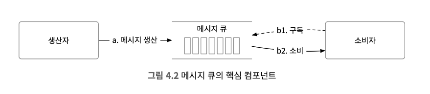
1. 생성자는 메세지를 메세지 큐에 발행
2. 소비자는 큐를 구독 (Subscribe) 하고 구독한 메세지를 소비
3. 생성자와 소비자 사이의 결합을 느슨하게하는 서비스로서 메세지 큐가 존재
4. 생성자와 소비자는 모두 클라이언트/서버 모델 관점에서 보면 클라이언트고 서버역할을 하는 것은 메세지 큐이며 이 클라이언트와 서버는 네트워크를 통해 통신

### 메세지 모델
* 메세지를 전달받는 방식을 의미

#### 일대일 모델 (Point-To-Point)
* `큐에 전송된 메세지는 오직 한 소비자만 가져갈 수 있다.` 전통적인 메세지 큐에서 흔히 발견되는 모델입니다. 소비자가 아무리 많아도 각 메세지는 오직 한 소비자만 가져갈 수 있다.
* 어떤 소비자가 메세지를 가져갔다는 사실을 큐에 알리면 (acknowledge) 해당 메세지는 큐에서 삭제된다.

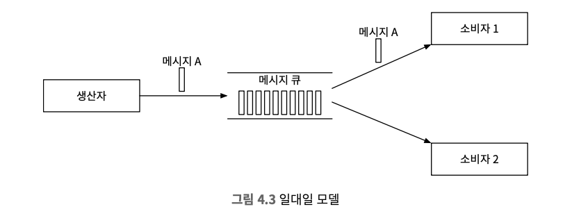

#### 발행-구독 모델 (Pub-Sub Model)
* 발행-구독 모델을 설명하려면 토픽(topic)이라는 새로운 개념을 도입해야 하며, `토픽은 메세지를 주제별로 정리하는 데 사용됩니다.` 각 토픽은 메세지 큐 서비스 전반에 고유한 이름을 가진다.
* `메세지를 보내고 받을 때는 토픽에 보내고 받게 됩니다. 이 모델에서 토픽에 전달된 메시지는 해당 토픽을 구독하는 모든 소비자에 전달된다.`

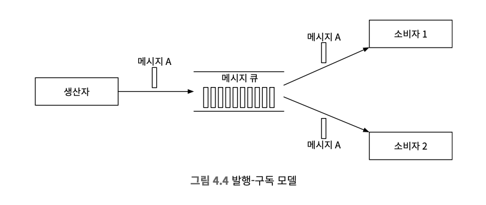

### 토픽, 파티션, 브로커
* 메세지는 토픽에 보관되며 토픽에 보관되는 데이터의 양이 커져서 서버 한대로 감당하기 힘든 상황이 나올 수 있다.
* 이러한 용량이 늘어날 때 해결하는 한가지 방법은 파티션(partition), 즉 샤딩(Sharding)을 활용하는 것이다.
* 토픽을 샤딩하는 것은 토픽을 여러 파티션으로 분할해서 메세지를 모든 파티션에 균등하게 나눠보내는 방식이다.

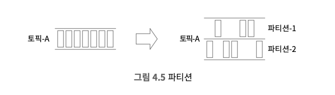

* 파티션은 메세지 큐 클러스터 내의 서버에 고르게 분산 배치하며, `파티션을 유지하는 서버는 보통 “브로커(broker)”`라고 부른다.
* 토픽 파티션을 브로커에 분산 하는 것이 높은 규모 확장성을 달성하는 비결입니다. (트래픽 분산) 토픽의 용량을 확장하고 싶으면 파티션 개수를 늘리면 되기 때문이다.
* 각 토픽 파티션은 FIFO(First In, First Out) 큐처럼 동작하고 `같은 파티션 안에서는 메세지 순서가 유지된다는 의미`이며, 파티션 내의 메세지 위치는 오프셋(offset)이라고 합니다.
* 생산자가 보낸 메세지는 해당 토픽의 파티션 가운데 하나로 보내진다. (어떤 파티션에게 보낼지는 누군가 조정)

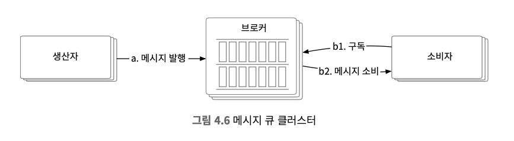

### 소비자 그룹
* 하나의 소비자 그룹은 여러 토픽을 구독 할 수 있다.
* 소비자 그룹이 오프셋을 별도로 관리하며 목적에 따라 나눌 수 있다.
* 같은 그룹 내의 소비자는 메세지를 병렬로 소비할 수 있다.

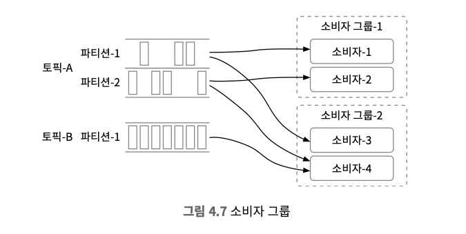

* 위 이미지 같이 데이터를 병렬로 읽으면 대역폭(throughput) 측면에서는 좋지만 같은 파티션 안에 있는 메세지를 순서대로 소비할 수는 없다, 하지만 `어떤 파티션의 메세지는 한 그룹 안에서는 오직 한 소비자만 읽을 수 있도록` 제약사항을 추가하면 이 문제를 해결할 수 있다.
* 하지만 한 그룹 내 소비자 수가 구독한 토픽의 파티션 수보다 크면 어떤 소비자는 해당 토픽에서 데이터를 읽지 못하게되지만 모든 소비자를 같은 소비자 그룹에 두면 같은 같은 파티션의 메세지는 오직 한 소비자만 가져갈 수 있으므로 `결국 일대일 모델에 수렴`하게된다.

> Publish-Subscribe 모델과 Point-To-Point 모델을 둘 다 해결 할 수 있는 개략적 설계

### 개략적 설계안
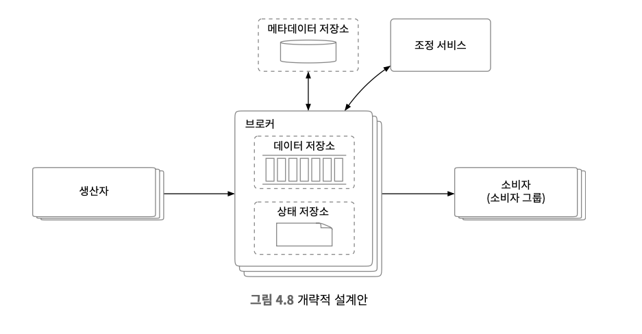


## 3단계 상세 설계
* 데이터의 장기 보관 요구사항을 만족하면서 높은 대역폭을 제공하기 위해 3가지 중요한 설계 결정을 해야한다.
1. 회전 디스크(rotational disk)의 높은 순차 탐색 성능과 현대적 운영체제가 제공하는 적극적 디스크 캐시 전략(aggresive disk caching strategy)를 잘 이용하는 디스크 기반 자료구조(on-disk data structure)를 활용
2. 메세지가 생산자부터 소비자에게 전달되는 순간까지 아무 수정 없이도 전송이 가능하도록 하는 메세지 자료구조를 설계
3. 일괄 처리(batching)을 우선하는 시스템 설계 (소규모 I/O가 많으면 높은 대역폭을 지원하기 어려움)

### 데이터 저장소
* Topic의 Partition에서 데이터를 어떻게 지속적으로 저장할 가장 좋은 방법을 선택하기 위해서는 큐의 트래픽 패턴을 살펴봐야한다.
1. 읽기와 쓰기가 빈번하게 일어난다.
2. 갱신/삭제 연상은 발생하지않는다.
3. 순차적인 읽기/쓰기가 대부분이다.

#### 선택지 1
> 선택지로 가장 대표적인 관계형 데이터베이스(RDBMS, NOSQL)를 생각해볼 수 있다.

* 토픽별로 테이블 또는 컬렉션을 만들고 메세지마다 새로운 레코드를 추가할 수 있지만 읽기 연산과 쓰기 연산이 동시에 대규모로 빈번하게 발생하는 상황을 잘 처리하는 데이터 베이스는 설계하기 어렵다고 알려져 있기에 요구사항은 충족하지만 시스템 병목이 될수도 있기 때문에 이상적인 방법은 아니다.

#### 선택지 2
> 쓰기 우선 로그 (Write-Ahead Log, WAL)로 새로운 항목이 추가되기만하는 일반 파일이며 보통 추가만 되는 로그가 WAL로 구현되있고 아파치 주키퍼라는 기술이 대표적이다.

* 접근 패턴이 순차적일 때 디스크는 아주 좋은 성능을 보이며 회전식 디스크 기반 저장장치는 큰 용량에 저렴한 가격에 제공되지만 `append만 한다는 관점에서는 유리하다고 판단되지만 읽기 작업이 유리하지는 않다.`
* 새로운 메세지는 파티션 꼬리부분에 추가되며 오프셋은 그 결과로 점진적으로 증가하게되며 오프셋은 그 결과로 점진적으로 증가하게된다, `읽기에 가장 쉬운 방법은 로그 파일 줄번호(line-number)를 오프셋으로 사용`하는 것이지만 `파일의 크기도 무한정 커질 수는 없으니, 세그먼트(segment) 단위로 나누는 것이 바람직`하다.

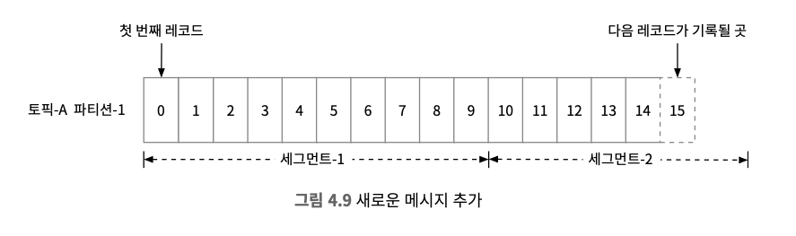

* 세그먼트를 사용하면 활성 상태의 세그먼트 파일에만 추가하고 일정 한계에 도달하면 새로운 세그먼트 파일을 만든다, 비활성 세그먼트 파일은 읽기 요청만 처리하며 낡은 세그먼트 파일은 삭제해 버릴 수 있다.

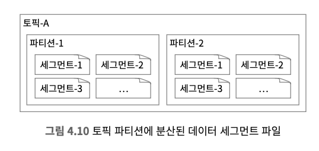

#### 디스크 성능 관련 유의사항
* 데이터 장기 보관에 대한 요구사항 때문에 이번 설계에서 디스크 드라이브를 활용하여 다량의 데이터를 보관하지만 회전식 디스크가 느리다는 것은 널리 퍼진 편견이고 `회전식 디스크가 정말로 느려지는 것은 데이터 접근 패턴이 무작위일 때이고 비용 구조도 훨씬 저렴`하다.
* RAID로 구성된 디스크 드라이브에서 읽기/쓰기 성능을 달성하는 건 어렵지 않고 현대적 운영체제는 디스크 데이터를 메모리에 아주 적극적으로 캐시하기하고 WAL도 OS가 제공하는 디스크 캐시 기능을 적극적으로 활용한다.

### 일괄 처리
* 일괄 처리는 시스템 성능에 아주 중요하며 중요한 이유는 다음과 같다.
1. 여러 메시지를 한 번의 네트워크 요청으로 전송할 수 있도록 하기 때문에 값비싼 네트워크 왕복 비용을 제거
2. 여러 메시지를 한 번에 로그에 기록하면 더 큰 규모의 순차 쓰기 연산이 발생하고 운영체제가 관리하는 디스크 캐시에서 더 큰 규모의 연속된 공간을 점유해 높은 접근 대역폭을 달성한다.


* 일괄 처리는 대역폭과 응답 지연 사이에서 타협점을 찾아야 한다.

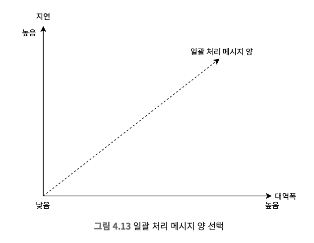

### 생산자 측 작업 흐름
* 라우팅 계층을 도입하여 `적절한 브로커에게 메시지`를 보내도록 한다, 브로커를 여러 개로 복제하여 운영하는 경우 `리더(leader) 브로커를 의미`한다.

#### Flow
1. 생산자는 우선 메시지를 라우팅 계층으로 보낸다.
2. 라우팅 계층은 메타데이터 저장소에서 사본 분산 계획을 읽어 자기 캐시에 보관한다.
   * 메시지가 도착하면 라우팅 계층에서 파티션-1의 리더 사본으로 보낸다.
3. 리더 사본이 메시지를 받고 해당 리더를 따르는 다른 사본은 해당 리더로부터 데이터를 받는다.
4. 충분한 수의 사본이 동기화되면 리더는 데이터를 디스크에 기록(commit)한다.
   * 데이터가 소비 가능 상태가 되는 시점, 기록이 끝나면 생산자에게 회신을 보낸다.

> 장애 감내가 가능한 시스템을 만들기 위해, 리더와 사본을 활용해야 한다.

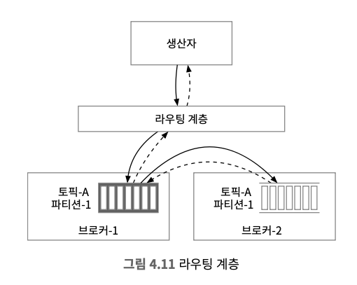

#### 라우팅 계층을 두었을 때의 단점
* 라우팅 계층을 도입함으로써 네트워크 노드가 하나 더 늘어나게 되므로 오버헤드가 발생하기 때문에 네트워크 전송 지연이 늘어난다.
* 일괄 처리가 가능하면 효율을 많이 높일 수 있는데, 이는 고려하지 않은 설계가 됬다.

#### 단점을 해결한 설계
* 변경
  * 라우팅 계층을 생산자 내부로 편입
  * 버퍼 도입
  * 생산자 클라이언트 라이브러리의 일부로 생산자에 설치
* 장점
  * 네트워크를 거치는 부분이 줄어들어서 전송 지연이 줄어든다.
  * 생산자는 메시지를 어느 파티션에 보낼지 결정하는 자신만의 로직을 가질 수 있다.
  * 전송할 메시지를 버퍼 메모리에 보관했다가 목적지로 일괄 전송 가능하기 때문에 대역폭이 높아진다, 하지만 그만큼 기다려야 하므로 응답 속도는 느려짐
  * 지연과 대역폭은 비례하므로, 생산자는 메시지 큐의 용도를 감안하여 일괄 처리 메시지 양을 조정해야 한다

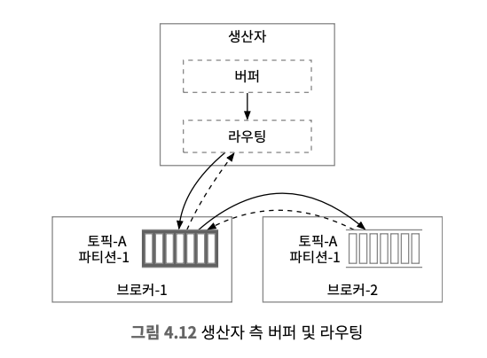

### 소비자 측 작업 흐름
* 소비자는 특정 파티션의 오프셋을 주고 해당 위치에서부터 이벤트를 묶어 가져온다.

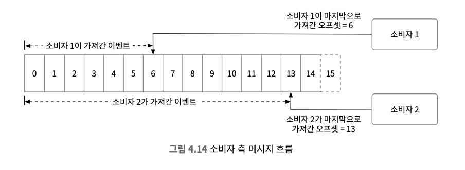

### 푸시(Push) VS 풀(Pull)
* 한 가지 중요하게 따져봐야할 것은, 브로커가 데이터를 소비자에게 보낼 것이냐 아니면 소비자가 브로커에서 가져가야할 지에 대한 결정이다.

#### 푸시(Push) 모델의 장점과 단점
* 장점
  * 낮은 지연 속도로 브로커는 메세지를 받는 즉시 소비자게에 보낼 수 있습니다.
* 단점
  * 소비자가 메세지를 처리하는 속도가 생산자가 메세지를 만드는 속도보다 느릴 경우, 소비자에게 큰 부하가 걸릴 가능성이 있다.
  * 생산자가 데이터 전송 속도를 좌우하므로, 소비자는 항상 그에 맞는 처리가 가능한 컴퓨팅 자원을 준비해 두어야한다.

#### 풀(Pull) 방식의 장점과 단점
* 장점
  * 메세지를 소비하는 속도는 소비자가 알아서 결정한다
  * 메세지를 소비하는 속도가 생산 속도보다 느려지면 소비자를 늘려 해결할 수도 있고 아니면 생산 속도를 따라 잡을 때까지 기다려도 된다.
  * 모든 메시지 혹은 설정된 최대 개수만큼을 한 번에 가져갈 수 있어서 일괄처리에 적합하다.
* 단점
  * 브로커에 메세지가 없어도 소비자는 계속 데이터를 끌어가려 시도하기 때문에 소비자 측 컴퓨팅 자원이 낭비되고 이 문제를 극복하기 위해 많은 메세지 큐가 롱 폴링(long polling) 모드를 지원해서 당장 가져갈 메세지가 없더라도 일정시간은 기다리도록 한다.

> 이러한 이유로 대부분의 메세지 큐는 푸시 모델 대신 풀 모델을 지원한다.

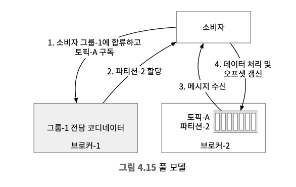

### 소비자 재조정
* 소비자 변경이 발생하는 케이스에 대해, 어떤 소비자가 어떤 파티션을 책임지는지 다시 정하는 프로세스
1. 새로운 소비자 합류
2. 기존 소비자가 그룹 탈퇴
3. 어떤 소비자에 장애 발생
4. 파티션 조정

> 코디네이터를 소비자에게 발생한 장애를 박동 신호가 사라지는 현상을 통해 감지하며, 다양한 장애 상황을 감지하면 재조정 프로세스를 시작하여 파티션을 재배치한다.

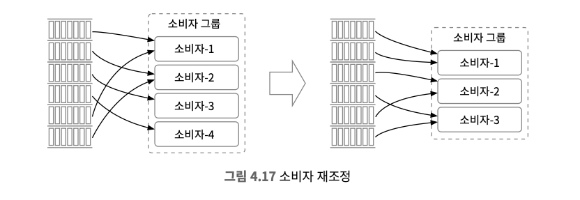

### 상태 저장소에 저장되는 정보
* 소비자에 대한 파티션의 배치 관계
* 각 소비자 그룹이 각 파티션에서 마지막으로 가져간 메시지의 오프셋
* 소비자 상태 정보 데이터가 이용되는 패턴
  * 읽기와 쓰기가 빈번하게 발생하지만 양은 많지 않다
  * 데이터 갱신은 빈번하게 일어나지만 삭제되는 일은 거의 없다
  * 읽기와 쓰기 연산이 무작위 패턴을 보인다
  * 데이터의 일관성이 중요하다

> 상태 데이터를 보관하는 데에는 데이터 일관성 및 높은 읽기/쓰기 속도에 대한 요구사항을 고려했을 때 주키퍼 같은 키/값 저장소를 사용하는 것이 바람직한다.

### 메타데이터 저장소
* 메타데이터 저장소에는 토픽 설정이나 속성 정보를 보관한다.
* 메타데이터는 자주 변경되지 않으며 양도 적다.
* `높은 일관성을 요구하는 경우 데이터 보관 주키퍼가 적절`하다.

### 주키퍼?
* `계층적 키/값 저장소 기능을 제공하는, 분산 시스템에 필수적인 서비스`이다.
* 분산 메시지 큐를 설계하는 데 아주 유용하며 분산 설정 서비스, 동기화 서비스, 이름 레지스트리 등으로 이용된다.

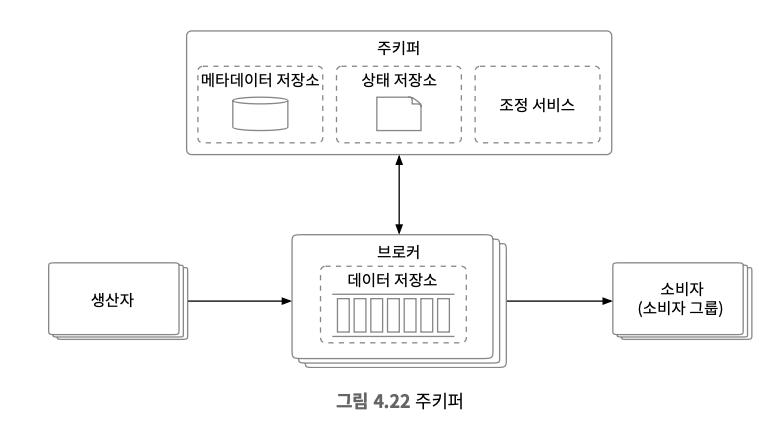

#### 주키퍼 도입 이후 달라진 점
* 메타데이터와 상태 저장소는 주키퍼를 이용해 구현한다.
* 브로커는 이제 메시지 데이터 저장소만 유지하면 된다.
* 주키퍼가 브로커 클러스터의 리더 선출 과정을 돕는다.

### 복제
* 분산 시스템에서 하드웨어 장애는 흔한 일이므로, 데이터의 영구적 보관과 높은 가용성을 보장하기 위해 복제(replication)를 활용할 수 있다.
* 생산자는 파티션에 메시지를 보낼 때 리더에게만 보내며, 다른 사본은 리더에서 새 메시지를 지속적으로 가져와 동기화한다.
* 사본을 파티션에 어떻게 분산할지 기술하는 것을 `사본 분산 계획(replica distribution plan)`이라고 한다.
* 조정 서비스 도움으로 브로커 노드 가운데 하나가 리더로 선출되면 리더 브로커 노드가 사본 분산 계획을 만들어 메타데이터 저장소에 보관한다.

> 데이터 중심 애플리케이션 설계 5장과 연관

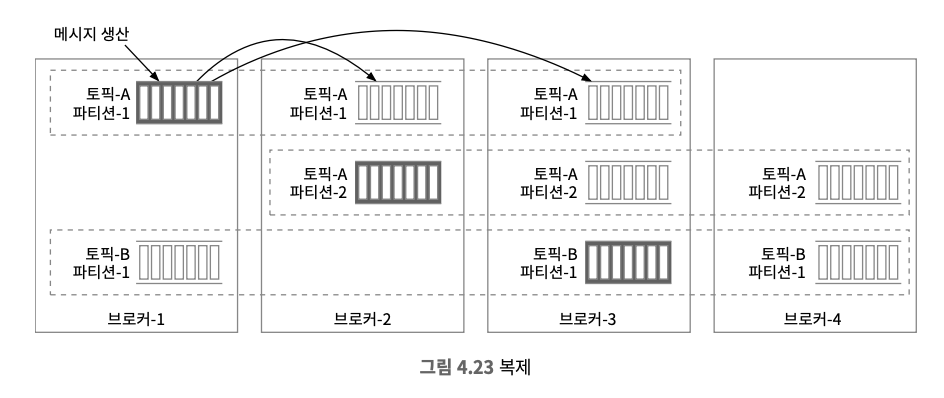

### 사본 동기화
* 동기화된 사본(In-Sync Replicas, ISR)은 리더와 동기화된 사본을 일컫는 용어로 동기화되었다는 토픽의 설정에 따라 달라진다.
* 리더는 항상 ISR 상태이며 리더 상태를 충분히 따라잡으면 ISR이 될 수 있다.
  * replica.lag.max.messages ≥ (단순 사본에 보관된 메시지 개수 - 리더)인 경우 ISR을 의미한다.
  * 각 파티션 담당 리더는 자기 사본들이 어느 메시지까지 가져갔는지 추적하여 ISR 목록을 관리한다
* 합의 오프셋은 해당 오프셋 이전에 기록된 모든 메시지가 이미 ISR 집합 내 모든 사본에 동기화가 끝났음을 의미한다.

> ISR이 되면 새로운 메시지를 가져올 수 있고 ISR 요건을 만족하는 사본에서는 메시지를 가져가지 않는다.

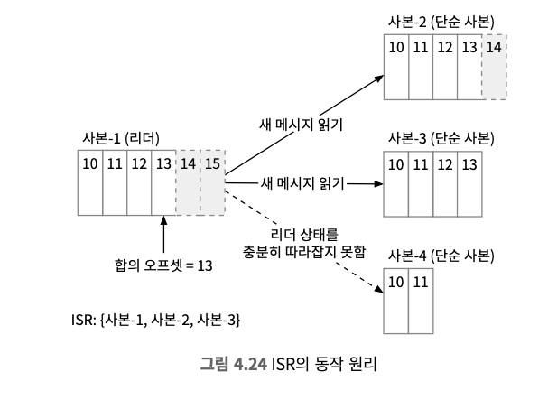

#### ACK=all
* 생산자는 모든 ISR이 메시지를 수신한 뒤에 ACK 응답을 받는다.
* 메시지를 보내기 위한 시간이 길어지지만, 메시지의 영속성 측면에서는 좋다.

#### ACK=1
* 생산자는 리더가 메시지를 저장하고 나면 바로 ACK 응답을 받는다
* 응답 지연이 개선되지만, ACK를 보낸 직후 리더에 장애가 생기면 해당 메시지는 사본에 반영되지 못하므로 소실된다.

#### ACK=0
* 생산자는 보낸 메시지에 대한 수신 확인 메시지를 기다리지 않고 계속 메시지를 전송하며 어떤 재시도도 하지 않는다.
* 낮은 응답 지연을 달성하기 위해 메시지 손실을 감수한다.
* 지표 수집, 데이터 로깅 등 처리해야 하는 메시지 양이 많고 데이터 손실에 상관 없는 경우에 적합하다.

### 규모 확장성
* 생산자
  * 그룹 단위의 조정에 가담할 필요가 없다.
  * 새로운 생산자를 추가/삭제할 수 있다.
* 소비자
  * 같은 소비자 그룹 내의 소비자가 새로 추가/삭제되거나 장애로 제거되어야 하는 경우 재조정 메커니즘이 맡아 처리한다.
  * 소비자 측의 규모 확장성과 결함 내성을 보장한다.
* 브로커
  * 브로커 노드가 추가/삭제될 때 사본을 재배치한다.
  * 브로커 컨트롤러로 하여금 한시적으로 시스템에 설정된 사본 수보다 많은 사본을 허용하도록 한다.
* 파티션
  * 파티션 수의 조정은 생산자와 소비자의 안정성에는 영향을 끼치지 않는다.
  * 파티션을 늘리면 간단히 토픽의 규모를 늘릴 수 있다.
  * 파티션이 제거되는 시점이 오면 생산자 그룹은 재조정 작업을 개시해야 한다.

### 메시지 전달 방식
* 최대 한 번(at-most once)
> 메시지가 전달 과정에서 소실되더라도 다시 전달되는 일은 없다.
  * 생산자는 ACK=0
  * 소비자는 메시지를 읽고 처리하기 전에 오프셋부터 갱신
* 최소 한 번(at-least once)
> 같은 메시지가 한 번 이상 전달될 수는 있으나 메시지 소실은 발생하지 않는다.
  * 생산자는 메시지를 동기/비동기적으로 보낼 수 있으며 ACK=1, ACK=all
  * 소비자는 데이터를 성공적으로 처리한 뒤에만 오프셋 갱신하지만 오프셋을 갱신하지 못하고 죽었다가 다시 시작하면 중복 처리될 여지가 있다.
* 정확히 한 번(exactly once)
> 중복을 허용하지 않으며, 구현에 이용할 서비스나 제3자 제품이 같은 INPUT에 대해 항상 같은 OUTPUT을 내도록 구현되어 있지 않은 애플리케이션에 특히 중요하다.
  * 가장 구현이 까다롭지만 지불, 매매, 회계 등 금융 관련 응용에 적합하다.

### 고급 기능
#### 메시지 필터링
1. 토픽 자체를 분리하는 방식
   * 매번 토픽을 만드는 방식이 번거롭다.
   * 같은 메시지가 여러 토픽에 중복되어 저장될 가능성 높아 비효율적이다. 
2. 소비자가 일단 모든 메시지를 받은 다음, 필요 없는 메시지는 버리는 방식
   * 유연성이 높지만 불필요한 트래픽에 의해 시스템 성능 저하가 우려된다.
3. 브로커에 구현할 필터링 로직을 메시지의 payload가 아닌 metadata 영역에 두어 브로커가 효율적으로 읽어갈 수 있도록 하는 방식
   * 필터링 하기 위해서 복호화, 역직렬화가 필요하면 브로커 성능이 저하된다.
   * 민감성 데이터가 포함되면 메시지를 읽으면 안된다.
   * 이를 해결하기 위해 메시지마다 tags를 두고 이를 통해 메시지 필터링하며 소비자가 어떤 태그를 가진 메시지를 구독할지 지정할 수 있게된다.

#### 메시지 지연 전송 및 예약 전송
* 소비자에게 보낼 메시지를 일정 시간 지연시켜야 하는 경우
  * 주문 결제 시스템을 예시로 들면, 30분 내로 결제가 이루어지지 않으면 주문 취소 처리, 이루어지면 메시지로 주문 완료 전송
* 임시 저장소 및 타이밍 기능
  * 토픽에 바로 저장하지 않고 브로커 내부의 임시 저장소에 넣어 두었다가 시간이 되면 토픽으로 옮기는 방식
  * 하나 이상의 특별 메시지 토픽을 임시 저장소로 활용할 수 있다.
  * 메시지 지연 전송 전용 메시지 큐를 사용하는 방안
  * 계층적 타이밍 휠을 사용하는 방안

## 4단계 마무리
### 고려사항
* 프로토콜과 분산 메시지 큐
  * 메시지 생산, 소비, 박동 메시지 교환 등의 모든 활동을 설명해야 한다.
  * 대용량 데이터를 효과적으로 전송할 방법 설명해야 한다.
  * 데이터의 무결성을 검증할 방법 기술해야 한다.
* 메시지 소비 재시도
  * 제대로 받아 처리하지 못한 메시지는 일정 시간 뒤에 다시 처리를 시도해야 한다.
  * 실패한 메시지를 재시도 전용 토픽에 보낸 후, 나중에 다시 소비하는 방식 등
* 이력 데이터 아카이브
  * 시간 기반 또는 용량 기반 로그 보관 메커니즘이 있을 때, 이미 삭제된 메시지를 다시 처리하길 원하는 소비자가 존재하는 경우에 요구되는 기능
  * 오래된 데이터는 HDFS 같은 대용량 저장소 시스템이나 객체 저장소에 보관해두는 것