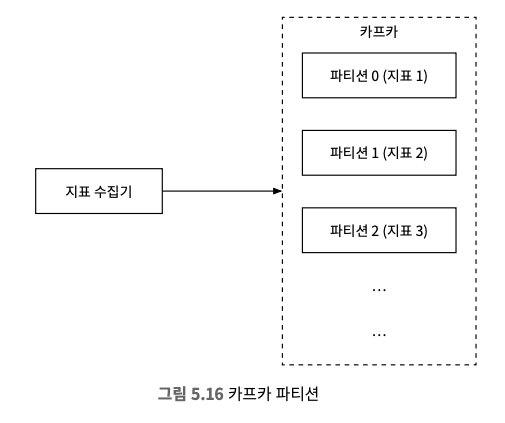

# 5장 지표 모니터링 및 경보 시스템
규모 확정이 용이한 지표 모니터링 및 경보 시스템의 설계안

## 1. 문제 이해 및 설계 범위 확정
* 인프라 지표에 관심이 있다면 웹 서버 에러 로그나 엑세스 로그에 초점을 맞춘 시스템을 만들면 곤란한다.
```
Q1. 시스템의 고객은 누구인가요?
→ 회사 내부에서 사용할 시스템이라고 합시다.

Q2. 어떤 지표를 수집해야 하나요?
→ 시스템 운영 지표를 수집해야 하고 CPU 부하, 메모리 사용률, 디스크 사용률 같은 저수준 운영체제 사용 지표일 수도 있고, 서버가 처리하는 초당 요청 수나 웹 서버 프로세스 개수 같은 고차원적 개념에 관련된 지표일 수 있지만 사업 지표는 이 시스템이 처리할 지표가 아닙니다.

Q3. 모니터링할 인프라 규모는 어느 정도입니까?
→ 일간 능동 사용자 수는 1억 명, 1000개의 서버 풀이 있고 풀마다 100개의 서버 하드웨어를 유지합니다.

Q4. 지표 데이터는 얼마나 오래 유지해야 하나요?
→ 1년 동안은 보관해야 한다고 합시다.

Q5. 데이터를 장기 보관 전용 저장소로 옮길 때 지표의 해상도를 낮추어도 괜찮을까요?
→ 새로 수집한 데이터는 7일 동안 보관하는 것으로 하고, 7일 뒤에는 1분 단위 데이터로 만들어 30일 동안 보관하고, 그 뒤에는 1시간 단위 데이터로 변환해서 보관하는 것으로 합시다.

Q6. 경보 채널로는 어떤 것들을 지원해야 할까요?
→ 이메일, 전화, 페이저듀티, 웹훅 등을 지원하는 것으로 합시다.

Q7. 에러 로그나 엑세스 로그 등에 대한 수집 기능도 제공해야 하나요?
→ 아니요.

Q8. 분산 시스템 추적 기능도 제공해야 하나요?
→ 필요 없습니다.
```

### 개략적 요구사항 및 가정
* 대규모 인프라를 모니터링 해야한다.
  * 일간 능동 사용자 수 1억 명
  * 서버 풀 1,000개, 풀당 서버 수 100개이고 서버당 100개의 운영 지표를 수집한다고 치면 모니터링해야 하는 지표의 수는 천만 개 수준
  * 데이터 보관 기간은 1년
  * 수집한 그대로 데이터를 보관하는 기간은 7일, 그 뒤에는 1분 단위 데이터로 변환한 후에 30일간 보관, 그 뒤에는 1시간 단위 데이터로 변환한 뒤에 1년간 보관
* 모니터링할 지표는 다양한데 아래와 같은 것이 존재한다.
  * CPU 사용률
  * 요청 수
  * 메모리 사용량
  * 메시지 큐 내의 메시지 수

### 비기능 요구사항
* 규모 확장성: 시스템은 늘어나는 지표 수와 경보의 양에 맞게 확장될 수 있어야 한다.
* 낮은 응답 지연: 대시보드와 경보를 신속하게 처리할 수 있도록, 질의에 대한 낮은 응답 지연을 보장해야 한다.
* 안정성: 높은 안전성을 제공하여 중요 경보를 놓치지 않도록 해야 한다.
* 유연성: 기술은 계속 변화하므로, 미래의 신기술을 쉽게 통합할 수 있도록 유연하게 변경 가능한 파이프라인을 이용해 구축한 시스템이어야 한다.

## 2. 개략적 설계안 제시 및 동의 구하기

### 기본적 사항
* 데이터 수집: 여러 출처로부터 지표 데이터를 수집한다.
* 데이터 전송: 지표 데이터를 지표 모니터링 시스템으로 전송한다.
* 데이터 저장소: 전송되어 오는 데이터를 정리하고 저장한다.
* 경보: 밀려오는 데이터를 분석하고, 이상 징후를 감지하고, 경보를 발생시킨다.
* 시각화: 데이터를 차트나 그래프 등으로 제공한다.

### 데이터 모델
* 지표 데이터는 통상 시계열(타임스탬프) 데이터 형태로 기록한다. 
* 시계열 각각에는 고유한 이름이 붙고, 선택적으로 레이블(label)을 붙이기도 한다.

> **사례 1. 프로덕션에서 사용 중인 서버 인스턴스의 특정 시간대의 CPU 부하를 알고 싶다고 가정한다.**


<table>
    <tr>
        <th>metric_name</th>
        <th>cpu.load</th>
    </tr>
    <tr>
        <td>labels</td>
        <td>host:i631, env:prod</td> 
    </tr>
    <tr>
        <td>timestamp</td>
        <td>1613707265</td>
    </tr>
    <tr>
        <td>value</td>
        <td>0.29</td>
    </tr>
</table>

* 시계열 데이터로 지표 이름(metric name), 레이블(host:i631,env:prod), 그리고 특정한 시각에 측정된 지표 데이터로 구성할 수 있다.

> **사례 2. 지난 10분간 특정 지역(us-west)에 위치한 모든 웹 서버의 CPU 부하 평균값을 알고 싶다고 가정한다.**

* 개념적으로 지표 이름이 CPU.load이고 레이블에 포함된 지역 이름이 us-west인 데이터를 저장소에서 가져와 평균값을 구하면 된다.
```
CPU.load host=webserver01,region=us-west 1613707265 50 
CPU.load host=webserver01,region=us-west 1613707265 62 
CPU.load host=webserver02,region=us-west 1613707265 43 
CPU.load host=webserver02,region=us-west 1613707265 53 
···
CPU.load host=webserver01,region=us-west 1613707265 76 
CPU.load host=webserver01,region=us-west 1613707265 83
```

* 모든 시계열 데이터는 다음 정보로 구성된다.
<table>
  <tr>
    <th>이름</th>
    <th>자료형</th>
  </tr>
  <tr>
    <td>지표 이름</td>
    <td>문자열</td>
  </tr>
  <tr>
    <td>태그/레이블 집합</td>
    <td>키:값 쌍의 리스트(List)</td>
  </tr>
  <tr>
    <td>지표 값 및 그 타임스탬프의 배열</td>
    <td>값, 타임스탬프 쌍의 배열(Array)</td>
  </tr>
</table>

> **데이터 접근 패턴**
* y축에 붙은 레이블은 하나의 시계열 데이터를 나타내고, x축에 붙은 레이블은 시간이다.


* 예제 시스템에 대한 쓰기 부하는 막대하고 읽기 부하는 일시적으로 치솟았다 사라지는(spiky)한 편이다.
* 시각화와 경보 서비스는 데이터베이스에 읽기 연산을 발생시켜서 그래프나 경보를 확인하는 패턴에 따라 읽기 연산은 일시적으로 증가한다.

### 데이터 저장소 시스템
> ❗️ 지표 모니터링 및 경보 시스템을 위한 저장소 시스템을 직접 설계하거나, MySQL 등의 범용 저장소 시스템을 사용하는 선택지는 추천하지 않는다.

* 범용 데이터베이스의 경우 이론적으로 시계열 데이터를 처리할 수 있지만 예제 설계안이 감당하려는 부하 규모에 맞추려면 전문가 수준의 튜닝이 필요하다.
  * 관계형 데이터베이스는 시계열 데이터 대상 연산에 좋은 성능을 보이지 못한다.
  * NoSQL은 시계열 데이터 처리에 사용될 수 있으나, 확장이 용이한 스키마 설계를 위해 해박한 내부 구조에 대한 배경지식이 필요하다.
* 시장에 시계열 데이터에 최적화된 저장소 시스템은 많고, 같은 양의 데이터를 더 적은 서버에 저장할 수 있는 이점도 있고, SQL보다 사용하기 쉬운 질의 인터페이스로 데이터 분석에도 용이하다.

> **시계열 데이터베이스 종류**
* OpenTSDB
  * 분산 시계열 데이터베이스로, Hadoop과 HBase에 기반
  * 하둡/HBase 클러스터를 구성하고 운영해야해서 다소 복잡
* MetricsDB
  * X(구 트위터)에서 사용
* Timestream
  * 아마존에서 출시 및 사용

> 가장 인기 있는 시계열 데이터베이스 종류 및 특징
* 종류
  * InfluxDB
  * Prometheus
* 특징
  * 다량의 시계열 데이터를 저장
  * 빠른 실시간 분석 지원
  * 메모리 캐시와 디스크 저장소를 함께 사용
  * 영속성 요건과 높은 성능 요구사항을 잘 만족 (8CPU 코어 + 32GM 램의 InfluxDB 서버 한 대로 초당 250,000회의 쓰기 연산 처리 가능)
  * 막대한 양의 시계열 데이터를 레이블 또는 태그 기준으로 집계하고 분석하는 기능을 제공

### 개략적 설계안


<table>
  <tr>
    <th>항목</th>
    <th>설명</th>
  </tr>
  <tr>
    <td>지표 출처 (metrics source)</td>
    <td>지표 데이터가 만들어지는 곳으로 애플리케이션 서버, SQL 데이터베이스, 메시지 큐 등 어떤 것이든 가능하다.</td>
  </tr>
  <tr>
    <td>지표 수집기 (metrics collector)</td>
    <td>지표 데이터를 수집하고 시계열 데이터에 기록하는 역할을 한다.</td>
  </tr>
  <tr>
    <td>시계열 데이터베이스 (time-series database)</td>
    <td>지표 데이터를 시계열 데이터 형태로 보관하는 저장소다. 다량의 시계열 데이터를 분석하고 요약하는 데 적합하도록 설계된 질의 인터페이스를 제공한다.</td>
  </tr>
  <tr>
    <td>질의 서비스 (query service)</td>
    <td>질의 서비스는 시계열 데이터베이스에 보관된 데이터를 질의하고 가져오는 과정을 돕는 서비스다. 좋은 시계열 데이터베이스를 골랐다면 이 서비스는 많은 일을 하지 않아도 된다. 심지어는 해당 데이터베이스의 질의 인터페이스로 대신할 수도 있다.</td>
  </tr>
  <tr>
    <td>경보 시스템 (alerting system)</td>
    <td>경보를 받아야 하는 다양한 대상으로 경보 알림을 전송하는 역할을 하는 시스템이다.</td>
  </tr>
  <tr>
    <td>시각화 시스템 (visualization system)</td>
    <td>지표를 다양한 형태의 그래프/차트로 시각화하는 기능을 제공하는 시스템이다.</td>
  </tr>
</table>

## 3. 상세 설계

### 지표 수집
* 특정한 지표를 수집할 때 데이터가 소실되어도 심각하지 않다.
* 클라이언트가 성공적으로 데이터가 전송했는지 신경쓰지 않아도 된다.


#### 풀 VS 푸시 모델
* **풀 모델**
  * 실행 중인 애플리케이션에서 주기적으로 지표 데이터를 가져오는 지표 수집기가 흐름의 중심이다.
  * 지표 수집기는 데이터를 가져올 서비스 목록을 알아야 한다.
    * 가장 간단한 방법은 모든 서비스 엔드포인트의 DNS/IP 정보를 담은 파일 두기
    * 서비스 탐색 기술(etcd, 아파치 주키퍼)을 활용해 수시로 변경되는 대규모 운영 환경에서 적용 가능
    * SDS에 각 서비스는 가용성 관련 정보를 기록하고, 서비스 엔드포인트 목록에 변화가 생길 때 지표 수집기에 통보
  * 풀 모델 기반 지표 수집 흐름
    * ① SDS에서 서비스 엔드포인트 설정 메타데이터 목록을 가져온다.
    * ② 사전에 합의된 HTTP 엔드포인트에서 지표 데이터를 가져온다.
    * ③ 서비스 엔드포인트 목록의 변화를 통지 받기 위한 변경 이벤트 알림 콜백을 서비스 탐색 컴포넌트에 등록할 수 있다.
  * 메타데이터 종류
  * 수천 대 서버가 만들어 내는 지표 데이터를 수집하려면 한 대의 서버로는 부족하기 때문에 지표 수집기 서버 풀을 만들어야 감당 가능하기 위해서 **안정 해시 링**을 이용해 메커니즘 구현
* **푸시 모델**
  * 지표 출처에 해당하는 서버(웹 서버, 데이터베이스 서버 등)가 직접 지표를 수집기에 전송하는 모델이다.
  * 모니터링 대상 서버에 **수집 에이전트**라고 부르는 소프트웨어를 설치한다.
    * 수집 에이전트는 해당 장비에서 실행되는 서비스가 생산하는 지표 데이터를 받아서 모아둔 후, 주기적으로 수집기에 전달
    * 간단한 카운터 지표의 경우 에이전트가 직접 집계 가능
  * 데이터 집계는 수집기에 보내는 데이터 양을 줄이는 효과적인 방법이다.
  * 지표 수집기가 지표 데이터를 제때 처리하지 못하는 상황을 방지하려, 지표 수집기 클러스터 자체도 자동 규모 확장이 가능하도록 구성하고 그 앞에 로드 밸런서를 두는 것이 좋다.


<table>
  <thead>
    <tr>
      <th>특징</th>
      <th>풀 모델</th>
      <th>푸시 모델</th>
    </tr>
  </thead>
  <tbody>
    <tr>
      <td>손쉬운 대응</td>
      <td>애플리케이션 서버에 /metrics 엔드포인 트를 두도록 강제하므로 필요하다면 언제 든 지표 데이터를 볼 수 있으며, 심지어 랩 톱에서도 가능하다. <strong>풀 모델이 더 낫다.</strong></td>
      <td></td>
    </tr>
    <tr>
      <td>상태 진단(health check)</td>
      <td>애플리케이션 서버가 풀 요청에 응답하지 않으면 바로 해당 서버에 장애가 발생한 것으로 진단할 수 있다. <strong>풀 모델 쪽이 쉽다.</strong></td>
      <td>지표 수집기가 지표를 받지 못하면 네트워크 장애가 원인인지 서버 장애가 원인인지 알기 어렵다.</td>
    </tr>
    <tr>
      <td>생존 기간이 짧은 프로세스</td>
      <td></td>
      <td>생명 주기가 짧은 일괄 작업 프로세스의 경우 수집기가 미처 지표를 끌어가기도 전 에 종료되어 버릴 수 있다. 그런 점에서는 푸시 모델이 낫다. 풀 모델도 푸시 게이트 웨이(push gateway)를 도입하면 해당 문제점을 해결할 수 있다.</td>
    </tr>
    <tr>
      <td>방화벽 등의 복잡한 네트워크 구성</td>
      <td>수집기 서버가 지표 데이터를 제대로 끌어 가려면 모든 /metrics 엔드포인트가 접근 가능하도록 구성되어야 한다. 데이터센터 를 여러 개 사용하는 경우에는 문제가 될 수 있다. 네트워크 인프라를 세심히 설계 해야 할 것이다.</td>
      <td>지표 수집기가 로드밸런서 및 자동 규모확장 클러스터 형태로 구성되었다면 어디 서 오는 지표라도 수집 가능하다. <strong>푸시 모델이 낫다.</string></td>
    </tr>
    <tr>
      <td>성능</td>
      <td>풀 모델은 일반적으로 TCP를 사용한다.</td>
      <td>푸시 모델은 보통 UDP를 사용한다. 푸시 모델의 지표 전송 지연이 더 낮다는 뜻이 다. 이에 대한 반론은 TCP 연결을 맺는 데 드는 오버헤드가 지표 데이터를 전송하는 것에 비해 낮다는 것이다.</td>
    </tr>
    <tr>
      <td>데이터 신빙성</td>
      <td>지표 데이터를 가져올 애플리케이션 서버의 목록이 이미 정의된 상태이므로 해당 서버에서 수집한 데이터는 믿을 수 있다.</td>
      <td>아무나 지표 수집기에 데이터를 보낼 수 있다는 문제가 있다. 지표 전송을 허용할 서버의 목록을 수집기 측에 유지하거나 인 증(authentication)을 강제하면 문제를 해결할 수 있다</td>
    </tr>
  </tbody>
</table>

### 지표 전송 파이프라인의 규모 확장
* 지표 수집기는 서버 클러스터 형태고 엄청난 양의 데이터를 받아 처리해야하는데 시계열 데이터베이스에 장애가 생기면 데이터 손실이 발생할 가능성이 있다.
* 데이터 손실을 방지하기 위해서 큐를 두면 문제를 해소할 수 있다.


* 스트림 처리 서비스가 해당 데이터를 받아 시계열 데이터베이스에 저장하는 접근법에는 몇 가지 장점이 있다.
  * 카프카는 고도로 안정적이고 규모 확장성이 뛰어난 분산 메시지 플랫폼이다.
  * 데이터 수집 컴포넌트와 처리 컴포넌트 사이의 결합도를 낮춘다.
  * 데이터베이스에 장애가 생겨도 카프카에 보관해두면 되기 때문에 데이터는 소실되지 않는다.


#### 카프카를 통한 규모 확장
* 대역폭 요구사항에 따라 파티션이 수를 설정한다
* 지표 이름에 따라 어떤 지표를 어느 파티션에 배치할지 결정하면 소비자는 지표 이름에 따라 데이터를 집계할 수 있다
* 태그/레이블에 따라 지표 데이터를 더욱 세분화한 파티션으로 나눈다
* 중요 지표가 먼저 처리될 수 있도록 지표를 분류하고 우선순위를 지정한다



#### 카프카의 대안
* 상용 규모의 카프카 시스템 구축은 쉽지 않고, 시장에는 큐 없이도 대규모 데이터 처리가 가능한 모니터링 시스템이 있다.
* 페이스북 메모리 기반 시계열 데이터베이스 시스템 **고릴라**가 존재하고, 일부 네트워크 장애가 발생해도 높은 수준의 쓰기 연산 가용성을 유지한다.
* 고릴라와 같은 시스템을 사용하면 큐 없이 안전성을 제공하는 대규모 데이터 처리가 가능한 모니터링 시스템을 제공할 수 있다.

### 데이터 집계 지점
> **수집 에이전트가 집계하는 방안**
* 클라이언트 측에서는 복잡한 집계 로직을 지원하기 어렵다.
* 어떤 카운터 값을 분 단위로 집계하여 지표 수집기에 보내는 정도 가능하다.

> **데이터 수집 파이프라인에서 집계하는 방안**
* 플링크 같은 스트림 프로세싱 엔진이 필요하다.
* 데이터베이스에는 계산 결과만 기록하므로, 실제로 기록되는 양은 엄청나게 줄어든다.
* 늦게 도착하는 지표 데이터의 처리가 어렵고, 원본 데이터를 보관하지 않아서 정밀도나 유연성 측면에서 손해를 본다.

> **질의 시에 집계하는 방안**
* 데이터를 날것 그대로 보관한 다음, 질의할 때 필요한 시간 구간에 맞게 집계한다.
* 데이터 손실 문제는 없다.
* 질의를 처리하는 순산에 전체 데이터세트를 대상으로 집계 결과를 계산해야해서 속도가 느리다.

### 질의 서비스
* 질의 서버 클러스터 형태로, 시각화 또는 경보 시스템에서 접수된 요청을 시계열 데이터베이스를 통해 처리하는 역할을 담당한다.
* 질의 처리 전담 서비스를 두면 클리이언트와 시계열 데이터베이스에 결합도를 낮출 수 있다.

#### 캐시 계층
* 질의 결과를 저장할 캐시 서버를 두면 시계열 데이터베이스에 대한 질의 부하를 낮추고 서비스의 성능을 높일 수 있다.


#### 질의 서비스를 두면 곤란한 경우
* 상용 시각화 및 경보 시스템은 대부분 시계열 데이터베이스와의 연동을 처리하는 강력한 플러그인을 이미 갖추고 있는 경우가 많다.
* 별도 캐시를 도입할 필요가 없는 시계열 데이터베이스가 있다.

#### 시계열 데이터베이스 질의어
* 프로메테우스, InfluxDB 같은 지표 모니터링 시스템은 SQL이 아닌 독자 질의어를 제공한다.
* 시계열 데이터는 SQL로는 질의하기가 까다롭기 때문이다.

> **예시) 지수 이동 편균 계산**
```sql
-- SQL
select 
    id, 
    temp,
    avg(temp) over ( partition by group_nr order by time_read ) as rolling_avg 
from (
    select 
        id, 
        temp,
        time_read,
        interval_group,
        id - row_number () over ( partition by interval_group order by time_read ) as group_nr
    from (
        select 
            id,
            time_read,
            "epoch":: timestamp + "900 seconds":: interval * (extract( epoch from time_read ):: int4 / 900) as interval_group,
            temp
        from readings
    ) t1
) t2
order by time_read ;

-- Flux
from(db:"telegraf")
	|> range(start:-1h)
	|> filter(fn: (r) => r._measurement == "foo")
	|> exponentialMovingAverage(size:-10s)
```

### 저장소 계층

#### 시계열 데이터베이스는 신중하게 선택할 것
* 운영 데이터 저장소에 대한 질의의 85%는 지난 26시간 내에 수집된 데이터를 대상으로 한다.
* 이를 잘 활용하는 시계열 데이터베이스를 고르면 성능 측면에서 큰 이득을 볼 수 있다.

#### 저장 용량 최적화
* 데이터 인코딩 및 압축
* 다운샘플링 (데이터의 해상도를 낮춰 저장소 요구량을 줄이는 기법)
* 냉동 저장소 (일반 저장소보다 저렴한 잘 사용되지 않는 비활성 상태 데이터를 보관하는 곳)

### 경보 시스템


1. 설정 파일을 가져와 캐시 서버에 보관한다 (디스크에 파일 상태로 보관, 주로 YAML을 사용)
    ```yaml
    - name: instance_down
    rules:

    # Alert for any instance that is unreachable for >5
    - alert: instance_down
            expr: up == 0
            for: 5m
            labels:
            security: page
    ```
2. 경보 관리자는 경보 설정 내역을 캐시에서 가져온다.
3. 설정된 규칙에 근거하여 경보 관리자는 지정된 시간마다 질의 서비스를 호출한다.
4. 경보 저장소는 카산드라 같은 형태의 키-값 저장소로 구현되며, 적어도 한 번 이상 알림이 전송되도록 보장한다.
5. 경보 이벤트를 카프카에 전달한다.
6. 경보 소비자는 카프카에서 경보 이벤트를 읽는다.
7. 경보 소비자는 카프카에서 읽은 경보 이벤트를 처리하여 이메일, 단문 메시지, 페이저듀티(PagerDuty), HTTP 서비스 엔드포인트 등의 다양한 채널로 알림을 전송한다.

#### 경보 시스템을 만들 것인가 구매할 것인가?
* 기업이 필요로 하는 규모를 바로 지원 가능한 경보 시스템은 시장에 많다.
* 실무에서 경보 시스템을 밑바닥부터 구현하겠다는 아이디어는 수용되기 어렵다.

### 시각화 시스템
* 시각화 시스템은 데이터 계층 위에 만들어진다.
* **지표 대시보드에는 지표를 당한 시간 범위로 표시**하고, **경보 대시보드에는 다양한 경보의 상태를 표시**한다.
* 품질 좋은 시각화 시스템은 구현하기 어려워서 상용품을 구입해서 쓰는 것이 바람직하다.

## 4. 마무리
* 지표 데이터 수집 모델 : 풀 모델 VS 푸시 모델
* 카프카를 활용한 규모 확장 방안
* 최적 시계열 데이터베이스의 선정
* 다운샘플링을 통한 데이터 크기 절감
* 경보/시각화 시스템 : 구현할 것인가 VS 구입할 것인가

