# 6장 광고 클릭 이벤트 설계
온라인 미디어 생태계의 급성장으로 디지털 광고가 차지하는 비중은 날로 커지고 있고, 그 결과 광고 클릭 이벤트 추적 작업의 중요성도 높아지고 있다.

> 온라인 광고의 핵심적 혜택은 실시간 데이터를 통해 광고 효과를 정량적으로 측정할 수 있다는 점이다.

### RTB
* 디지털 광고의 핵심 프로세스는 RTB(Real Time Bidding) 실시간 경매라 부르고, 속도가 매우 중요하며 데이터 정확성 또한 중요하다.

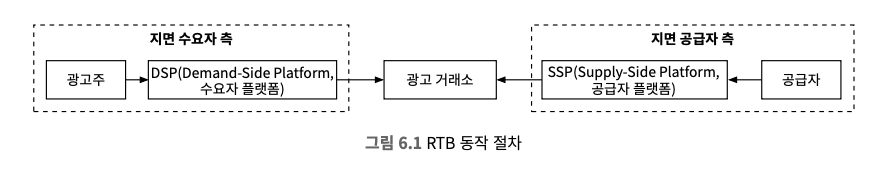

## 1. 문제 이해 및 설계 범위 확정
```
Q1. 입력 데이터는 어떤 형태인가요?
→ 여러 서버에 분산된 로그 파일이고 클릭 이벤트는 수집될 때마다 로그 파일의 끝에 추가되며 ad_iod, click_time-stamp, user-id, ip, country 등의 속성이 있습니다.

Q2. 데이터의 양은 어느 정도인가요?
→ 매일 10억 개의 광고 클릭이 발생하고, 광고는 200백만 회 개재되며 광고 클릭 이벤트의 수는 매년 30%씩 증가합니다.

Q3. 가장 중요하게 지원해야 할 질의는 어떤 것인가요?
→ 다음의 3가지 질의를 지원해야 합니다.
  1. 특정 광고에 대한 지난 M분간의 클릭 이벤트 수
  2. 지난 1분간 가장 많이 클릭된 광고 100개, 질의 기간과 광고 수는 변경 가능해야 하고 집계는 매분 이뤄진다.
  3. ip, user_id, country 등의 속성을 기준으로 상기 2개 질의 결과를 필터링 할 수 있어야 한다.

Q4. 엣지 케이스에 대해 걱정해야 하나요? 다음과 같은 경우를 생각해 볼 수 있을 것 같아요.
  1. 예상보다 늦게 도착하는 이벤트가 있을 수 있다.
  2. 중복된 이벤트가 있을 수 있다.
  3. 시스템 일부가 언제든지 다운될 수 있으므로 시스템 복구를 고려해야 한다.
→ 그런 점들을 고려하기로 합시다.

Q5. 지연 시간 요건은 어떻습니까?
→ 모든 처리가 수 분내에 이루어져야 하며 RTB와 광고 클립 집계의 지연 시간 요건은 매우 다르며 RTB는 일반적으로 1초 미만이어야 하지만, 광고 클릭 이벤트 집계는 주로 광고 과금 및 보고에 사용되기 때문에 몇 분 정도의 지연은 허용됩니다.
```

### 기능 요구사항
* 지난 M분 동안의 ad_id 클릭 수 집계
* 매분 가장 많이 클릭된 상위 100개 광고 아이디를 반환
* 다양한 속성에 따른 집계 필터링을 지원
* 데이터의 양은 페이스북, 구글 규모

### 비기능 요구사항
* 집계 결과 정확성은 데이터가 RTB 및 광고 과금에 사용되므로 중요
* 지연되거나 중복된 이벤트를 적절히 처리할 수 있어야 함
* 견고성(reliability): 부분적인 장애는 감내 가능
* 지연 시간 요구사항: 전체 처리 시간은 최대 수 분을 넘지 않아야 함

### 개략적 추정
* DAU 10억명
* 사용자가 하루 평균 1개 광고를 클릭한다고 가정, 하루에 10억 건의 광고 클릭 이벤트가 발생
* 광고 클릭 QPS = 10,000 (10^9 / 10^5)
* 최대 광고 클릭 QPS는 평균 QPS의 5배로 50,000 QPS로 가정
* 광고 클릭 이벤트 하나당 0.1KB의 저장 용량으로 가정, 월간 저장 용량 요구량은 대략 3TB

## 2. 개략적 설계안 제시 및 동의 구하기

### 질의 API 설계
* 본 설계안의 클라이언트는 대시보드를 이용하는 데이터 과학자, 제품 관리자, 광고주 등
 
#### API 1. 지난 M분간 각 ad_id에 발생한 클릭 수 집계
<table>
    <tr>
        <th>API</th>
        <th>용도</th>
    </tr>
    <tr>
        <td>GET /v1/ads/{:ad_id}/aggregated_count</td>
        <td>주어진 ad_id에 발생한 이벤트 수를 집계하여 반환</td> 
    </tr>
</table>

> Request
<table>
    <tr>
        <th>인자명</th>
        <th>뜻</th>
        <th>자료형</th>
    </tr>
    <tr>
        <td>from</td>
        <td>집계 시작 시간</td> 
        <td>long</td> 
    </tr>
    <tr>
        <td>to</td>
        <td>집계 종료 시간</td> 
        <td>long</td> 
    </tr>
    <tr>
        <td>filter</td>
        <td>필터링 전략 식별자</td> 
        <td>long</td> 
    </tr>
</table>

> Response
<table>
    <tr>
        <th>필드명</th>
        <th>뜻</th>
        <th>자료형</th>
    </tr>
    <tr>
        <td>ad_id</td>
        <td>광고(ad) 식별자</td> 
        <td>string</td> 
    </tr>
    <tr>
        <td>count</td>
        <td>집계된 클릭 횟수</td> 
        <td>long</td> 
    </tr>
</table>

#### API 2. 지난 M분간 가장 많은 클릭이 발생한 상위 N개 ad_id 목록
<table>
    <tr>
        <th>API</th>
        <th>용도</th>
    </tr>
    <tr>
        <td>GET /v1/ads/popular_ads</td>
        <td>지난 M분간 가장 많은 클릭이 발생한 상위 N개 광고 목록 반환</td> 
    </tr>
</table>

> Request
<table>
    <tr>
        <th>인자명</th>
        <th>뜻</th>
        <th>자료형</th>
    </tr>
    <tr>
        <td>count</td>
        <td>상위 몇 개의 광고를 반환할 것인가	</td> 
        <td>integer</td> 
    </tr>
    <tr>
        <td>window</td>
        <td>분 단위로 표현된 집계 윈도 크기</td> 
        <td>integer</td> 
    </tr>
    <tr>
        <td>filter</td>
        <td>필터링 전략 식별자</td> 
        <td>long</td> 
    </tr>
</table>

> Response
<table>
    <tr>
        <th>필드명</th>
        <th>뜻</th>
        <th>자료형</th>
    </tr>
    <tr>
        <td>ad_ids</td>
        <td>광고 식별자 목록</td> 
        <td>array</td> 
    </tr>
</table>

### 데이터 모델

#### 원시 데이터
<table>
  <tr>
    <th>ad_id</th>
    <th>click_timestamp</th>
    <th>user_id</th>
    <th>ip</th>
    <th>country</th>
  </tr>
  <tr>
    <td>ad001</td>
    <td>2021-01-01 00:00:01</td>
    <td>user1</td>
    <td>207.148.22.22</td>
    <td>USA</td>
  </tr>
  <tr>
    <td>ad001</td>
    <td>2021-01-01 00:00:02</td>
    <td>user1</td>
    <td>207.148.22.22</td>
    <td>USA</td>
  </tr>
  <tr>
    <td>ad002</td>
    <td>2021-01-01 00:00:02</td>
    <td>user2</td>
    <td>209.153.56.11</td>
    <td>USA</td>
  </tr>
</table>

#### 집계 결과 데이터
* **집계 결과 데이터**
<table>
  <tr>
    <th>ad_id</th>
    <th>click_minute</th>
    <th>count</th>
  </tr>
  <tr>
    <td>ad001</td>
    <td>20210101010000</td>
    <td>5</td>
  </tr>
  <tr>
    <td>ad001</td>
    <td>20210101010001</td>
    <td>7</td>
  </tr>
</table>

* **필터를 사용한 집계한 데이터**
<table>
  <tr>
    <th>ad_id</th>
    <th>click_minute</th>
    <th>filter_id</th>
    <th>count</th>
  </tr>
  <tr>
    <td>ad001</td>
    <td>20210101010000</td>
    <td>0012</td>
    <td>2</td>
  </tr>
  <tr>
    <td>ad001</td>
    <td>20210101010000</td>
    <td>0023</td>
    <td>3</td>
  </tr>
  <tr>
    <td>ad001</td>
    <td>20210101010001</td>
    <td>0012</td>
    <td>1</td>
  </tr>
  <tr>
    <td>ad001</td>
    <td>20210101010001</td>
    <td>0023</td>
    <td>6</td>
  </tr>
</table>

* **필터 테이블**
<table >
  <tr>
    <th>filter_id</th>
    <th>region</th>
    <th>ip</th>
    <th>user_id</th>
  </tr>
  <tr>
    <td>0012</td>
    <td>US</td>
    <td>0012</td>
    <td>*</td>
  </tr>
  <tr>
    <td>0013</td>
    <td>*</td>
    <td>0023</td>
    <td>123.1.2.3</td>
  </tr>
</table>

* **지난 M분간 가장 많이 클릭된 상위 N개의 광고 집의 테이블**
<table>
  <tr>
    <th colspan=3>most_clicked_ads</th>
  </tr>
  <tr>
    <td>window_size</td>
    <td>integer</td>
    <td>분 단위로 표현된 집계 윈도 크기</td>
  </tr>
  <tr>
    <td>update_time_minute</td>
    <td>timestamp</td>
    <td>마지막으로 갱신된 타임스탬프 (1분 단위)</td>
  </tr>
  <tr>
    <td>most_clicked_ads</td>
    <td>array</td>
    <td>JSON 형식으로 표현된 ID 목록</td>
  </tr>
</table>

#### 비교
<table>
  <tr>
    <th></th>
    <th>원시 데이터만 보관하는 방안</th>
    <th>집계 결과 데이터를 보관하는 방안</th>
  </tr>
  <tr>
    <td>장점</td>
    <td>
      • 원본 데이터를 손실 없이 보관<br>
      • 데이터 필터링 및 재계산 지원
    </td>
    <td>
      • 데이터 용량 절감<br>
      • 빠른 질의 성능
    </td>
  </tr>
  <tr>
    <td>단점</td>
    <td>
      • 막대한 데이터 용량<br>
      • 낮은 질의 성능
    </td>
    <td>
      • 데이터 손실. 원본 데이터가 아닌 계산/유도된 데이터를 저장하는 데서 오는 결과.<br>
      • 예를 들어 10개의 원본 데이터는 1개의 데이터로 집계/축약될 수 있다.
    </td>
  </tr>
</table>

* 문제가 발생하면 디버깅에 활용할 수 있도록 원시 데이터도 보관하기
* 원시 데이터의 양이 엄청나서 직접 질의하는 것은 비효율적이기 때문에 집계 데이터로 질의가 바람직
* 원시 데이터는 백업 용도로 활용하기 (cold storage에 옮기면 비용 절감)
* 집계 결과 데이터는 활성 데이터 구실을 하며 질의 성능을 높이기 위해 튜닝하는 것이 일반적

### 올바른 데이터베이스의 선택
#### 데이터베이스 선택 시 고려 사항
* 데이터 형태 → 관계형, 문서, 이진 대형 객체(Binary Large Object, BLOB)
* 작업 흐름 → 읽기 중심, 쓰기 중심, 모두
* 트랙잭션 지원 여부
* 질의 과정에서 SUM, COUNT 같은 온라인 분석 처리(OLAP) 사용 빈도

#### 고려사항을 바탕으로 분석
* 원시 데이터
  * 원시 데이터의 경우 백업과 재계산 용도로 사용되서 이론적으로 읽기 연산 빈도는 낮다.
  * 관계형 데이터베이스로 쓰기 연산이 가능하도록 구성하기는 어렵기 때문에 쓰기 및 시간 범위 질의에 최적화된 카산드라나 InfluxDB를 사용하는 것이 바람직하다.
  * ORD, 파케이(Parquet), AVRO 같은 컬럼형 데이터 형식 중 하나로 사용해 Amazon S3에 저장하는 방법도 존재하고 각 파일의 최대 크기를 제한한다고 할 때, 원시 데이터 기록 담당 스트림 프로세서는 최대 크기에 도달하면 자동으로 새 파일을 만든다.
  * 본 설계안에서는 카산드라를 활용한다.
* 집계 데이터
  * 본질적으로 시계열 데이터로 데이터를 처리하는 워크 플로우는 읽기 및 쓰기 연산 모두 많이 사용한다.
  * 각 광고에 매 분마다 데이터베이스에 질의를 던져 고객에게 최신 집계 결과를 제시하므로 대시보드를 자동으로 새로 고치거나 적시에 경보를 날리는 데 유용하다.
  * 원시 데이터와 집계 결과 데이터를 저장하는데는 같은 유형의 데이터베이스를 활용하는 것이 가능하다.

### 개략적 설계안
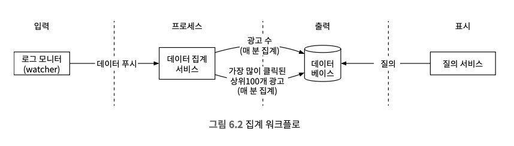

#### 비동기 처리
* 트래픽이 증가해 소비자가 생산자가 발행하는 이벤트 처리 용량을 넘어서는 경우 문제를 겪을 수 있기 때문에 카프카와 같은 메시지 큐를 도입해 결합을 끊어야 한다.
1. 첫 번째 메시지 큐 데이터

    | ad_id | click_timestamp | user_id | ip | country |
    | --- | --- | --- | --- | --- |

2. 두 번째 메시지 큐 데이터
   * 분 단위로 집계된 광고 클릭 수

        | ad_id | click_minute | count |
        | --- | --- | --- |
   * 분 단위로 집계한, 가장 많이 클릭한 상위 N개 광고

        | update_time_minute | most_clicked_ads |
        | --- | --- |


> 집계 결과를 데이터베이스에 바로 기록하지 않는 이유는 정확하게 한 번 데이터를 처리하기 위해서 카프카 같은 시스템을 두 번째 메시지 큐로 도입해야하기 때문이다.

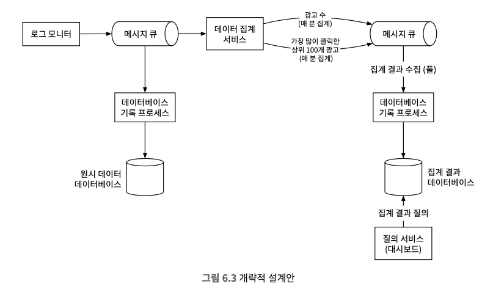

### 집계 서비스
* 맵리듀스(MapReduce) 프레임워크를 사용하여 광고 클릭 이벤트를 집계하는 것이 좋다.
* 맵리듀스 프레임워크에 좋은 모델은 유향 비순환 그래프 (DAG, directed acyclic graph)을 사용하는 것이고, 시스템을 맵/집계/리듀스 노드 등의 작은 컴퓨팅 단위로 세분화하는 것이며 각 노드는 한가지 작업만 처리해 결과를 다음 노드에 인계한다.

#### 맵 노드
* 데이터 출처에서 읽은 데이터를 필터링하고 변환하는 역할을 담당한다.
* 카프카 파티션이나 태그를 구독하는 방법도 동작은 하겠지만 입력 데이터를 정리하거나 정규화해야 하는 경우에 필수적으로 필요하다.
* 데이터가 생성되는 방식에 대한 제어권이 없는 경우, 동일한 ad_id를 갖는 이벤트가 서로 다른 카프카 파티션에 입력될 수 있으므로 필요하다.

#### 집계 노드
* ad_id별 광고 클릭 이벤트 수를 매 분 메모리에서 집계한다.
* 리듀스 프로세스의 일부로 `맵-집계-리듀스 프로세스 = 맵-리듀스-리듀스 프로세스`

#### 리듀스 노드
* 모든 집계 노드가 산출한 결과를 최종 결과로 축약한다.
* 예시) 집계 노드 각각은 자신의 입장에서 가장 많은 클릭이 발생한 광고 3개를 추려 리듀스 노드로 보낸 후 리듀스 노드는 결과를 모아 최종적으로 3개의 광고만 남긴다.

#### 주요 사용 사례
> 사례 1. 지난 M분간 ad_id에 발생한 클릭 이벤트 수 집계
* 멥 노드는 시스템에 입력되는 이벤트를 (ad_id % 3)을 기준으로 분배하며 이 결과는 각 집계 노드가 집계한다.

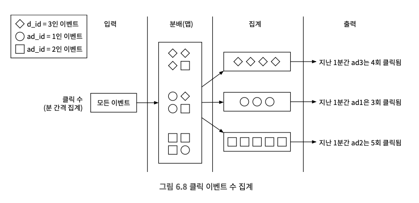

> 사례 2. 가장 많이 클릭된 상위 N개 광고 반환
* 가장 많이 클릭된 상위 광고 3개(상위 N개 광고로 확장 가능)를 가져오는 방법의 단순화된 설계안이다.
* 마지막 단계의 리듀스 노드는 전달 받은 9개의 광고 중 지난 1분간 가장 많이 클릭된 광고 3개를 골라낸다.

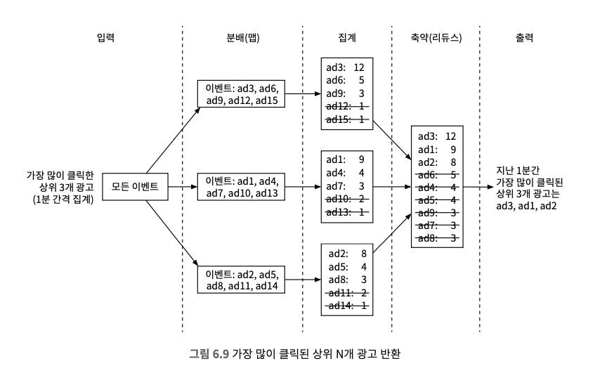

> 사례 3. 데이터 필터링
* `미국 내 광고 ad001에 대해 집계된 클릭 수만 표시`와 같은 데이터 필터링을 지원하기 위해, 사전에 기준을 정의하고 그에 따라 집계한다.

<table>
  <tr>
    <th>ad_id</th>
    <th>click_minute</th>
    <th>country</th>
    <th>count</th>
  </tr>
  <tr>
    <td>ad001</td>
    <td>202101010001</td>
    <td>USA</td>
    <td>100</td>
  </tr>
  <tr>
    <td>ad001</td>
    <td>202101010001</td>
    <td>GPB</td>
    <td>200</td>
  </tr>
  <tr>
    <td>ad001</td>
    <td>202101010001</td>
    <td>others</td>
    <td>3000</td>
  </tr>
  <tr>
    <td>ad001</td>
    <td>202101010001</td>
    <td>USA</td>
    <td>10</td>
  </tr>
  <tr>
    <td>ad001</td>
    <td>202101010001</td>
    <td>GPB</td>
    <td>25</td>
  </tr>
  <tr>
    <td>ad001</td>
    <td>202101010001</td>
    <td>others</td>
    <td>12</td>
  </tr>
</table>

**스타 스키마(star schema)란?** 
* 데이터 웨어하우스에서 널리 쓰이는 기법
* 필터링에 사용되는 필는 차원(dimension)이라고 부른다.

**스타 스키마(star schema)의 장점** 
* 이해하기 쉽고 구축하기 간단하다.
* 기존 집계 서비스를 재사용하여 스타 스키마에 더 많은 자원을 생성할 수 있고 다른 추가 컴포넌트는 필요하지 않다.
* 결과를 미리 계산해두는 방식이므로, 필터링 기준에 따라 데이터에 빠르게 접근할 수 있다.

> 해당 접근법에는 많은 버킷과 레코드가 생성된다는 한계가 있고, 필터링 기준이 많을 경우 더욱 그렇다.

## 3. 상세 설계

### 스트리밍 VS 일괄 처리
* 일괄 및 스트리밍 처리 경로를 동시에 지원하는 시스템의 아키텍처를 람다라고 부른다.
* 람다 아키텍처의 단점은 두 가지 처리 경로를 지원해서 유지 관리해야할 코드도 늘어난다는 것이 단점이다.
* `카파 아키텍처`는 처리 경로를 하나로 결합하여 문제를 해결한다.
<table>
  <tr>
    <th></th>
    <th>서비스(온라인 시스템)</th>
    <th>일괄 처리 시스템(오프라인 시스템)</th>
    <th>스트리밍 시스템(실시간에 가깝게 처리하는 시스템)</th>
  </tr>
  <tr>
    <td>응답성</td>
    <td>클라이언트에게 빠르게 응답</td>
    <td>클라이언트에게 응답할 필요가 없음</td>
    <td>클라이언트에게 응답할 필요가 없음</td>
  </tr>
  <tr>
    <td>입력</td>
    <td>사용자의 요청</td>
    <td>유연한 크기를 갖는 입력 (큰 규모의 데이터도 가능)</td>
    <td>입력에 경계가 없음 (무한 스트림)</td>
  </tr>
  <tr>
    <td>출력</td>
    <td>클라이언트에 대한 응답</td>
    <td>구체화 뷰, 집계 결과 지표 등</td>
    <td>구체화 뷰, 집계 결과 지표 등</td>
  </tr>
  <tr>
    <td>성능 측정 기준</td>
    <td>가용성, 지연 시간</td>
    <td>처리량</td>
    <td>처리량, 지연 시간</td>
  </tr>
  <tr>
    <td>사례</td>
    <td>온라인 쇼핑</td>
    <td>맵리듀스</td>
    <td>플링크(Flink)</td>
  </tr>
</table>

#### 데이터 재계산
* 이미 집계한 데이터를 다시 계산해야 하는 경우 `이력 데이터 재처리`라 부른다.
* 집계 데이터에 중대한 버그가 발생했을 때, 버그 발생 시점부터 원시 데이터를 다시 읽어 집계 데이터를 재계산하고 고쳐야 한다.

**재계산 프로세스**
1. 재계산 서비스는 원시 데이터 저장소에서 데이터를 검색, 일괄 처리 프로세스를 따른다.
2. 추출된 데이터는 전용 집계 서비스로 전송되며 실시간 데이터 처리와 과거 데이터 재처리 프로세스가 서로 간섭하지 않도록 막기 위해서다.
3. 집계 결과는 두 번째 메시지 큐로 전송되어 집계 결과 데이터베이스에 반영된다.

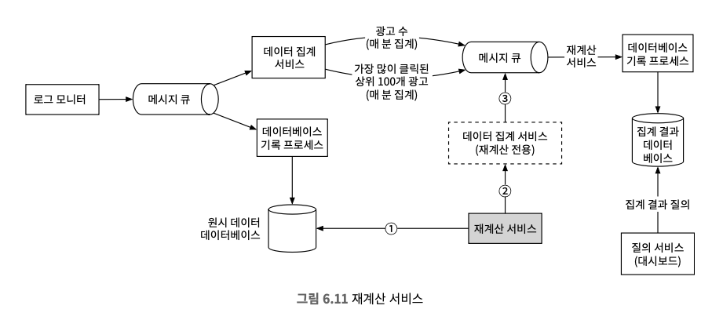

### 시간

#### 타임스탬프 종류
**이벤트 시각(권장)**
* 광고 클릭이 발생한 시각이다.
* 지연된 이벤트 처리 문제를 잘 해결해야 한다.
* 광고 클릭 시점을 정확히 아는 것은 클라이언트이므로, 집계 결과가 보다 정확하다.
* 클라이언트가 생성한 타임스탬프에 의존하는 방식의 경우 클라이언트에 설정된 시각이 잘못되었거나 악성 사용자가 타임스탬프를 고의로 조작하는 문제가 발생 가능하다.

**처리 시각**
* 집계 서버가 클릭 이벤트를 처리한 시스템 시각이다.
* 집계 결과가 부정확할 수도 있다.
* 서버 타임스탬프는 클라이언트 타임스탬프보다 안정적이다.
* 이벤트가 시스템에 도착한 시각이 한참 뒤인 경우에는 집계 결과가 부정확해진다.

**워터마크(wartermark)**
* 시스템에 늦게 도착한 이벤트를 올바르게 처리하기 위해서는 워터마크란 기술을 사용해야 한다.
* 워터마크 기술을 사용하여, 집계 윈도의 확장으로 보고 윈도마다 워터마크를 붙여서 집계하는 방식으로 해결이 가능하다.
* 워터마크의 크기가 길면 늦게 도착하는 이벤트도 포착 가능 하지만 시스템의 이벤트 처리 시간 증가한다.
* 워터마크의 크기가 짧으면 데이터 정확도가 떨어지지만 시스템의 응답 지연은 낮아진다.

> 적당한 구간의 워터마크를 사용하면 데이터의 정확도는 높아지지만 대기 시간이 늘어나 전반적인 지연 시간이 늘어나게 된다.

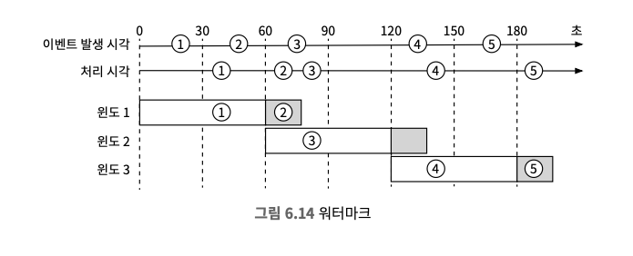

### 집계 윈도
#### 데이터 중심 애플리케이션 설계에 따른 윈도의 종류
* 텀블링 윈도
  * 시간을 같은 크기의 겹치지 않는 구간으로 분할
  * 매 분 발생한 클릭 이벤트를 집계하기에 아주 적합


* 고정 윈도
* 호핑 윈도
* 슬라이딩 윈도(적합)
  * 데이터 스트림을 미끄러져 나아가면서 같은 시간 구간 안에 있는 이벤트를 집계
  * 서로 겹칠 수 있고, 지난 M분간 가장 많이 클릭된 상위 N개 광고를 알아내기에 적합

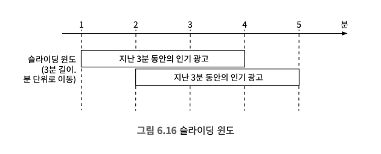

### 전달 보장
* 집계 결과는 데이터의 정확성과 무결성이 매우 중요하다.
  * 이벤트의 중복 처리를 어떻게 피할 수 있는가?
  * 모든 이벤트의 처리를 어떻게 보장할 수 있는가?

#### 어떤 전달 방식을 택할 것인가
* 약간의 중복이 괜찮다면 `최소 한 번이 적합`
* 하지만 몇 퍼센트의 차이가 수백만 달러 차이로 이어질 수 있어 정확성이 무조건 중요한 시스템이므로 `정확히 한 번을 권장`한다.
* 데이터 손실을 막으려면 다운스트림에서 집계 결과 수신 확인 응답을 받은 후에 오프셋을 저장해야 한다.

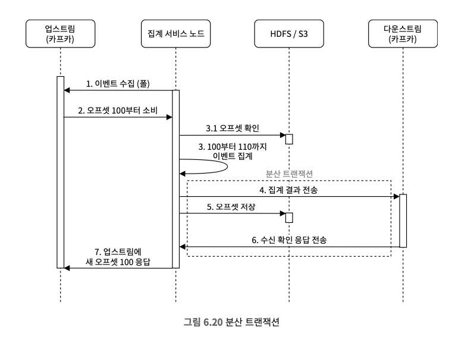

### 시스템의 규모 확장

#### 메세지 큐의 규모 확장
* 생산자
  * 생산자 인스턴스 수에는 제한을 두지 않으므로 따라서 화장성을 쉽게 달성할 수 있다.
* 소비자 
  * 소비자 그룹 내의 재조정 메커니즘은 노드 추가/삭제를 통해 그 규모를 쉽게 조정할 수 있도록 한다.

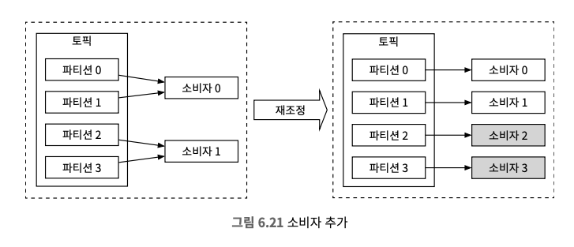

#### 브로커
* 해시 키
  * 같은 ad_id를 갖는 이벤트를 같은 카프카 파티션에 저장하도록 ad_id를 해시 키로 사용, 집계 서비스에서 구독 가능하다.
* 파티션의 수
  * 파티션의 수가 변하면 같은 ad_id를 갖는 이벤트가 다른 파티션에 기록되는 일이 생길 수 있다.
  * 사전에 충분한 파티션 확보 후, 프로덕션에서 동적으로 파티션 수가 늘어나지 않도록 해야한다.
* 토픽의 물리적 샤딩
  * 대부분 지역 또는 사업 유형에 따라 여러 토픽을 필요로 한다.
* 장점
  * 시스템의 처리 대역폭을 높일 수 있다.
  * 단일 토픽에 대한 소비자 수가 줄면, 소비자 그룹의 재조정 시간도 단축된다.
* 단점
  * 복잡성이 증가하고 유지 관리 비용이 늘어난다.

#### 집계 서비스의 규모 확장
* 노드의 추가/삭제를 통해 수평적으로 조정 가능하다.
* 집계 서비스의 처리 대역폭을 높이려면 두 가지 선택지가 있다.
  * 구현이 쉬운 ad_id마다 별도의 처리 스레드를 두는 방식
  * 일반적으로 더 많이 사용되는 집계 서비스 노드를 아파치 하둡 YARN 같은 자원 공급자에 배포하는 방식 (더 많은 컴퓨팅 자원을 추가하여 시스템 규모 확장 가능)

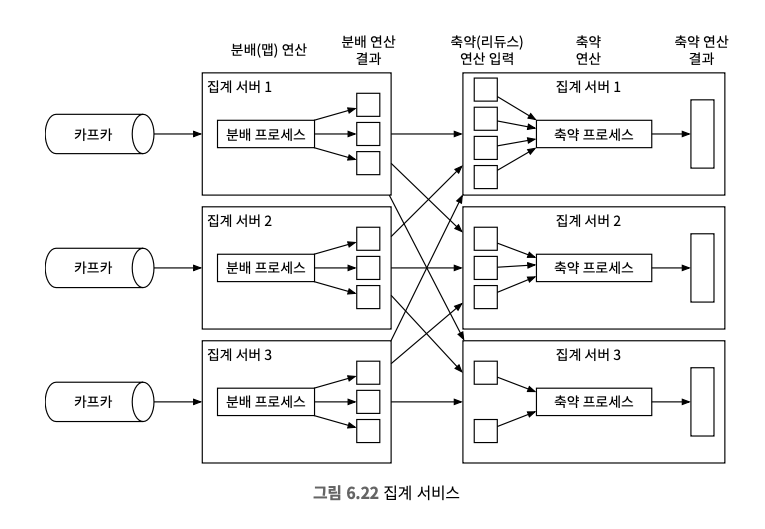

#### 데이터베이스의 규모 확장
* 카산드라는 안정 해시와 유사한 방식으로 수평적인 규모 확장을 지원한다.
* 데이터를 각 노드에 균등하게 분산하고, 사본 역시 적당한 수만큼 분산하여 클러스터에 새 노드를 추가하면 가상 노드 간의 균형이 자동적으로 조정된다.

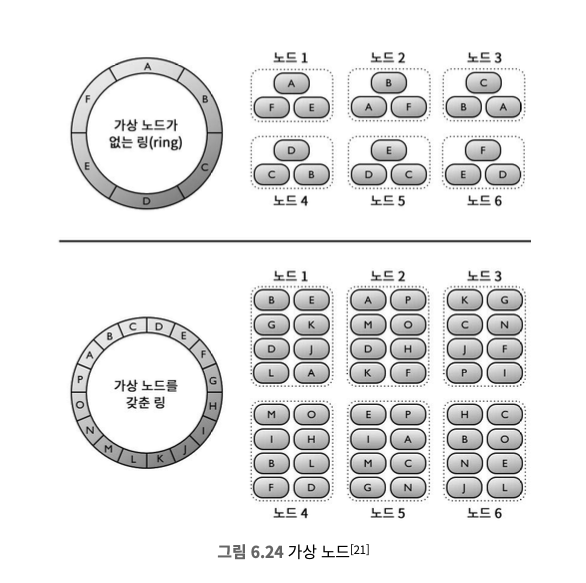

### 핫스팟 문제
* 다른 서비스나 샤드보다 더 많은 데이터를 수신하는 서비스나 샤드를 핫스팟이라고 부른다.
* 이벤트 파티션을 ad_id로 나누게 되면, 어떤 집계 서비스 노드는 다른 노드보다 더 많은 광고 클릭 이벤트를 수신하게 될 것이고, 이는 서버 과부하로 이어질 수 있다.

#### 핫스팟 문제 해결방 법
* 더 많은 집계 서비스 노드를 할당하여 완화 가능하다.
* 전역-지역 집계, 분할 고유 집계 등 복잡한 방법을 통해서도 해결할 수 있다.

### 결함 내성
* 집계는 메모리메어 이루어져서 집계 노드에 장애가 생기면 집계 결과도 손실된다.
* 업스트림 카프카 브로커에서 이벤트를 다시 받아오면 그 숫자를 다시 만들어 낼 수 있다.
* 업스트림 오프셋 같은 ‘시스템 상태’를 스냅숏으로 저장하고, 마지막으로 저장된 상태부터 복구해 나가는 방식이 바람직하고, 스냅숏 저장되어야 하는 항목은 `시스템 상태 + 지난 M분간 가장 많이 클릭된 광고 N개 데이터`도 저장해야 한다.
* 스냅숏을 사용하면 집계 서비스의 복구 절차가 단순해진다.
* 장애가 발생한 노드만 새 것으로 교체한 뒤 마지막 snapshot에서 데이터를 복구한 이후 도착한 새로운 이벤트는 새 집계 서비스 노드가 카프카 브로커에서 읽어가 다시 처리할 것이다.

### 데이터 모니터링 및 정확성
* 청구서 발행 목적으로 사용될 수 있기 떄문에 정상적으로 동작 모니터링과 데이터 정합성 보장은 매우 중요하다.

#### 지속적 모니터링
* 지연 시간
  * 시스템의 중요 부분마다 타임스탬프 추적이 가능하도록, 기록된 타임스탬프 간의 차이를 지연 시간 지표로 변환하여 모니터링할 수 있다.
* 메시지 큐 크기
  * 큐의 크기가 갑자기 늘어난다면 더 많은 집계 서비스 노드를 추가해야 할 수 있다.
  * 카프카(분산 커밋 로그 형태)를 사용한다면, 레코드 처리 지연 지표(records-lag)를 대신 추적하면 된다.
* 집계 노드의 시스템 자원
  * CPU, 디스크, JVM 등과 관계된 지표

#### 조정
* 다양한 데이터를 비교하여 데이터 무결성을 보증하는 기법
* 일 각 파티션에 기록된 클릭 이벤트를 이벤트 발생 시각에 따라 정렬한 결과를 일괄 처리하여 만들어 낸 다음, 실시간 집계 결과와 비교해볼 수 있다.
* 윈도 크기에 관계 없이 일부 이벤트는 늦게 도착할 수도 있으므로 배치 작업 결과가 실시간 집계 결과와 정확히 일치하지 않을 수도 있다.

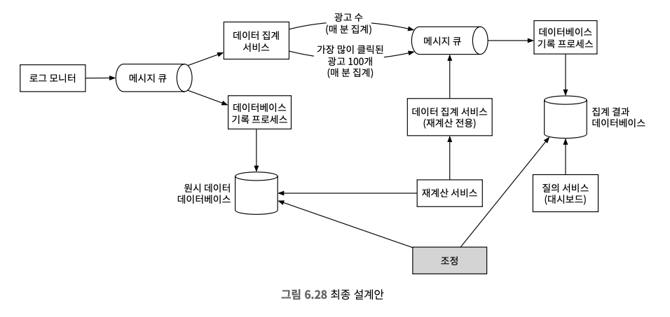

### 대안적 설계안
* 광고 클릭 데이터를 하이브(Hive)에 저장한 다음, 빠른 질의는 ElasticSearch 계층을 얹어서 처리하는 방안도 존재한다.
* 집계는 클릭하우스, 드루이드 같은 OLAP 데이터베이스를 통해 처리방안도 존재한다.

> 사고 프로세스를 설명하고 타협적 선택지 사이의 장단점을 설명하는 능력을 보이는 것이 중요하다.

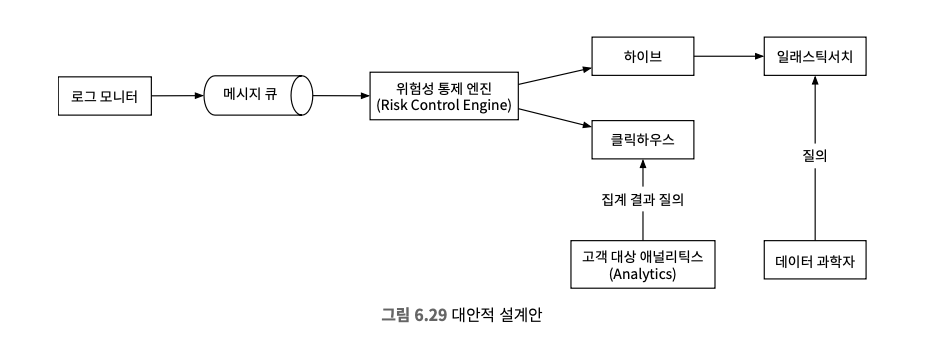