# 7장 호텔 예약 시스템
* 에어비앤비 시스템 설계
* 항공권 예약 시스템 설계
* 영화 티켓 예매 시스템 설계

## 1. 문제 이해 및 설계 범위 확정
```
Q1. 시스템 규모는 어느 정도인가요?
→ 5000개 호텔에 100만 개 객실을 갖춘 호텔 체인을 위한 웹사이트를 구축한다고 가정합니다.

Q2. 대금은 예약 시와 호텔 도착시 어떤 경우 지불하나요?
→ 시간 제한이 있으니 예약할 때 지불합니다.

Q3. 고객은 호텔의 웹사이트에서만 예약할 수 있나요?
→ 호텔 웹사이트나 앱에서만 가능합니다.

Q4. 예약을 취소할 수 있나요?
→ 물론입니다.

Q5. 고려할 다른 사항이 있을까요?
→ 10% 초과 예약이 가능해야 합니다, 호텔은 일부 고객이 예약을 취소할 것을 예상해 초과 예약을 허용하곤 합니다.

Q6. 시간이 제한되어 있어서 검색은 범위에 넣지 않고 아래 사항에만 집중해 보려고 합니다.
* 호텔 정보 페이지 표시
* 객실 정보 페이지 표시
* 객실 예약 지원
* 호텔이나 객실 정보를 추가/삭제/갱신하는 관리자 페이지 지원
* 초과 예약 지원

Q7. 그 외 사항은 없나요?
→ 객실 가격은 유동이고, 그날 객실에 여유가 얼마나 있는 지에 따라 달라지고 매일 달라질 수 있습니다.
```
### 비기능 요구사항
* 높은 수준의 동시성 지원: 성수기, 대규모 이벤트 기간에는 일부 인기 호텔의 특정 객실을 예약하려는 고객이 많이 몰릴 수 있다.
* 적절한 지연 시간: 사용자가 예약할 때 응답 시간이 빠르면 이상적이지만, 몇 초 정도 요청을 처리하는 데 걸리는 것은 괜찮다.

### 개략적 규모 추정
* 총 5,000개 호텔, 100만 개의 객실이 있다고 가정
* 평균적으로 객실의 70%만 사용 중이며, 평균 투숙 기간은 3일로 가정
* 일일 예상 예약 건수 : (1백만 X 0.7) / 3 = 233,333 (약 240,000 건)
* 초당 예약 건수 : 240,000 / 하루에 10^5초 =~ 3, 따라서 초당 예약 TPS는 그리 높지 않다.

> 고객의 웹사이트 사용 흐름
1. 호텔/객실 상세 페이지: 사용자가 호텔/객실 정보를 확인한다 (조회 발생)
2. 예약 상세 정보 페이지: 사용자가 날짜, 투숙 인원, 결제 방법 등의 상세 정보를 예약 전에 확인한다 (조회 발생)
3. 객실 예약 페이지: 사용자가 `예약 버튼`을 눌러 객실을 예약한다 (트랜잭션 발생)

## 2. 개략적 설계안 제시 및 동의 구하기

### API 설계
* 호텔 관련 API
<table>
  <thead>
    <tr>
      <th>API</th>
      <th>설명</th>
    </tr>
  </thead>
  <tbody>
    <tr>
      <td>GET /v1/hotels/id</td>
      <td>호텔의 상세 정보 반환</td>
    </tr>
    <tr>
      <td>POST /v1/hotels</td>
      <td>신규 호텔 추가. 호텔 직원만 사용 가능</td>
    </tr>
    <tr>
      <td>PUT /v1/hotels/id</td>
      <td>호텔 정보 갱신. 호텔 직원만 사용 가능</td>
    </tr>
    <tr>
      <td>DELETE /v1/hotels/id</td>
      <td>호텔 정보 삭제. 호텔 직원만 사용 가능</td>
    </tr>
  </tbody>
</table>

* 객실 관련 API
<table>
  <thead>
    <tr>
      <th>API</th>
      <th>설명</th>
    </tr>
  </thead>
  <tbody>
    <tr>
      <td>GET /v1/hotels/:id/rooms/id</td>
      <td>객실 상세 정보 반환</td>
    </tr>
    <tr>
      <td>POST /v1/hotels/:id/rooms</td>
      <td>신규 객실 추가. 호텔 직원만 사용 가능</td>
    </tr>
    <tr>
      <td>PUT /v1/hotels/:id/rooms/id</td>
      <td>객실 정보 갱신. 호텔 직원만 사용 가능</td>
    </tr>
    <tr>
      <td>DELETE /v1/hotels/:id/rooms/id</td>
      <td>객실 정보 삭제. 호텔 직원만 사용 가능</td>
    </tr>
  </tbody>
</table>

* 예약 관련 API
<table>
  <thead>
    <tr>
      <th>API</th>
      <th>설명</th>
    </tr>
  </thead>
  <tbody>
    <tr>
      <td>GET /v1/reservations</td>
      <td>로그인 사용자의 예약 이력 반환</td>
    </tr>
    <tr>
      <td>GET /v1/reservations/id</td>
      <td>특정 예약의 상세 정보 반환</td>
    </tr>
    <tr>
      <td>POST /v1/reservations</td>
      <td>신규 예약</td>
    </tr>
    <tr>
      <td>DELETE /v1/reservations/id</td>
      <td>예약 취소</td>
    </tr>
  </tbody>
</table>

* 신규 예약 접수 Request Body
```
{
    "startDate": "2021-08-17",
    "endDate": "2021-08-18",
    "hotelID": "245",
    "roomID": "U1234567", 
    "reservationID": "12333" -- 이중 예약을 방지하는 멱등 키(idmpotent key)
}
```

### 데이터 모델
* 호텔 예약 시스템의 지원 질의
  * 호텔 상세 정보 확인 (읽기)
  * 지정된 날짜 범위에 사용 가능한 객실 유형 확인 (읽기)
  * 예약 정보 기록 (쓰기)
  * 예약 내역 또는 과거 예약 이력 정보 조회 (읽기)

> 관계형 데이터 베이스를 선택한 이유
* 읽기 최적화: 정보 조회가 많은 호텔 웹사이트에 적합
* ACID 보장: 데이터 무결성을 유지해 예약 관련 문제 방지
* 간편한 데이터 모델링: 엔티티 간의 관계를 명확히 표현 가능

**[데이터 베이스 스미카]**
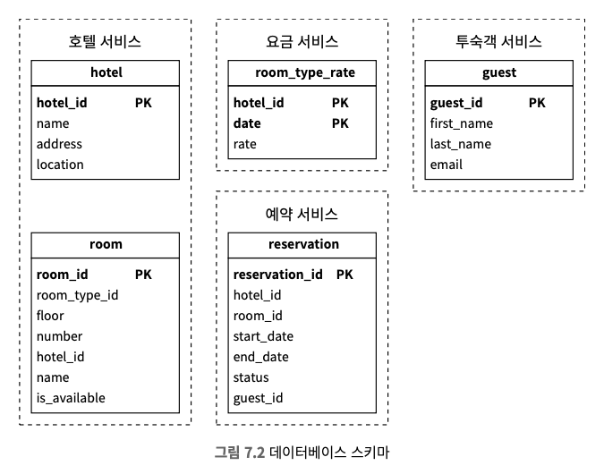

**[상태 천이도 다이어그램]**
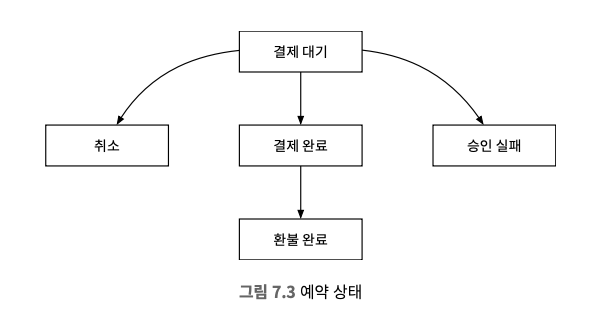

> 스키마 디자인의 문제점


### 개략적 설계안
* 각 구성요소
  * 사용자: 객실을 예약하는 당사자
  * 관리자(호텔 직원): 고객 환불, 예약 취소, 객실 정보 갱신 등의 관리 작업 수행
  * CDN: 이미지, 동영상, HTML 등 모든 정적 콘텐츠를 캐시하여 웹사이트 로드 성능을 개선하는 데 이용
  * 공개 API 게이트웨이: 처리율 제한, 인증 등의 기능을 지원하는 완전 관리형 서비스
  * 엔드포인트를 기반으로 특정 서비스에 요청 전달
  * 내부 API: 승인된 호텔 직원만 사용 가능한 API (내부 소프트웨어, 웹사이트를 통해 사용)
  * VPN 등의 기술로 보안 구성
  * 호텔 서비스: 호텔과 객실에 대한 상세 정보 제공 (대부분 정적 데이터 미리 캐시)
  * 요금 서비스: 미래의 어떤 날에 어떤 요금을 받아야 하는지 데이터를 제공하는 서비스
  * 예약 서비스: 예약 요청을 받고 객실을 예약하는 과정 처리, 잔여 객실 정보 갱신 처리
  * 결제 서비스: 고객의 결제를 맡아 처리하고, 절차의 성공/실패 여부에 따라 상태 업데이트
  * 호텔 관리 서비스: 승인된 호텔 직원만 사용 가능한 서비스 (임박한 예약 기록 확인, 고객 객실 예약, 예약 취소 등 Admin 기능 제공)

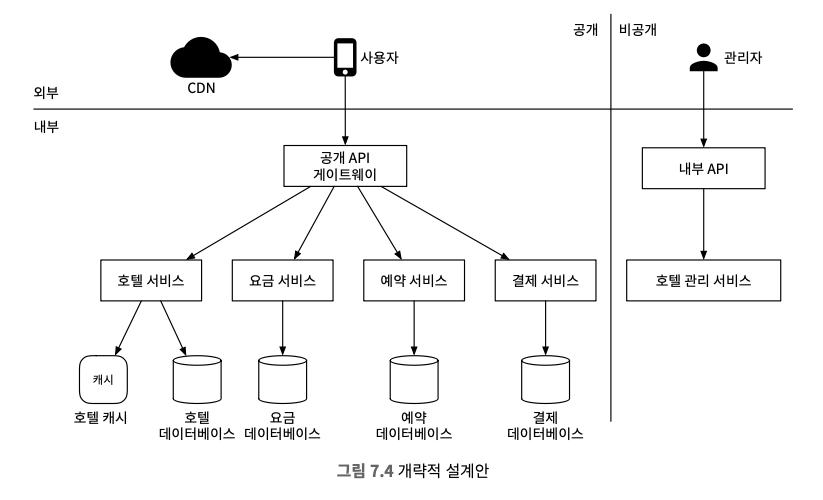

**[서비스 간 연결]**
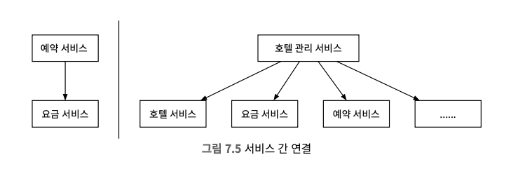


> 실제 상업적으로 이용되는 시스템의 서비스 간 통신에 gRPC와 같은 고성능 원격 프로시저 호출 프레임워크를 사용하는 경우가 많다.

## 3. 상세 설계

### 개선된 데이터 모델
* `특정한 객실 유형을 예약`하기 위한 요구사항을 수용하려면 예약 API의 호출 인자 가운데 `roomID → roomTypeID로 변경`해야 한다.

**[갱신된 스키마]**
* room: 객실에 관계된 정보
* room_type_rate: 특정 객실 유형의 특정 일자 요금 정보
* reservation: 투숙객 예약 정보
* room_type_inventory: 호텔의 모든 객실 유형
  * hotel_id: 호텔 식별자
  * room_type_id: 객실 유형 식별자
  * date: 일자
  * total_inventory: 총 객실 수 - 일시적으로 제외한 객실 수
  * total_reserved: 지정된 hotel_id, room_type_id, date에 예약된 모든 객실의 수
  * primary key: hotel_id, room_type, data의 복합 키

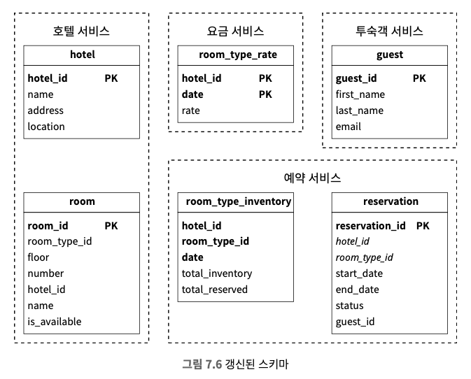

* 저장 용량 추정
  * 2년 이내 모든 미래 날짜에 대한 가용 객실 데이터 결과를 토대로 데이터를 채워둔 상태여야 한다.
  * 5,000 (호텔 수) X 20 (객실 유형) X (365 X 2) = 약 7,300만 개
  * 그리 많은 데이터가 아니기 때문에 데이터베이스 하나면 충분하지만, 서버를 하나만 두면 SPOF(Single-Point-Of-Failure) 문제를 피할 수 없기 때문에 `여러 지역 또는 가용성 구역에 데이터베이스를 복제`해야 한다.

> 만약 예약 데이터가 단일 데이터베이스에 담기에 너무 크다면?
* 현재 및 향후 예약 데이터만 저장하고 자주 접근하지 않으면 아카이빙 또는 냉동 저장소로 옮긴다.
* 데이터베이스를 샤딩하고, hotel_id를 샤딩 키로, hash(hotel_id) % number_of_servers로 샤딩해둔다.

### 동시성 문제
* 이중 예약을 방지에 두 가지 문제를 해결해야 한다.

> 1. 같은 사용자가 예약 버튼을 여러 번 누를 수 있다.

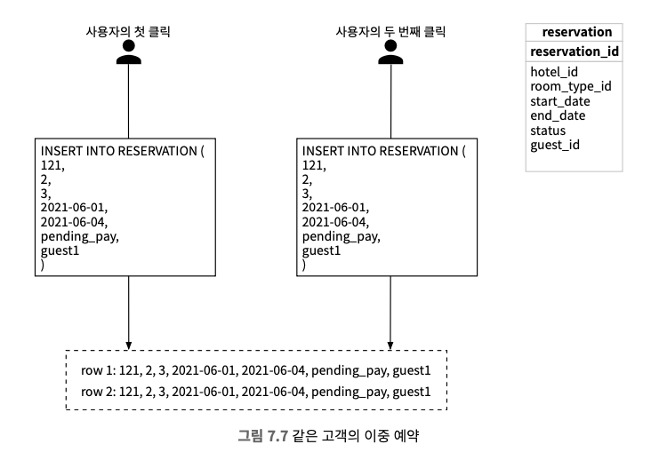

**문제를 푸는 일반적 접근법**
1. 클라이언트 측 구현
   * 클라이언트에서 요청 전송 이후, 예약 버튼을 비활성화 하는 등의 처리
   * 하지만 안정적인 방법은 아니다.
2. 멱등 API
   * 몇 번을 호출해도 같은 결과를 내는 API
   * 예약 API의 요청에 멱등 키(reservation_id)를 추가하여 처리

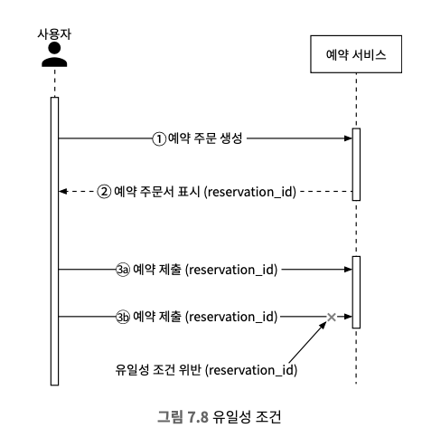

> 2. 여러 사용자가 같은 객실을 동시에 예약하려 할 수 있다.

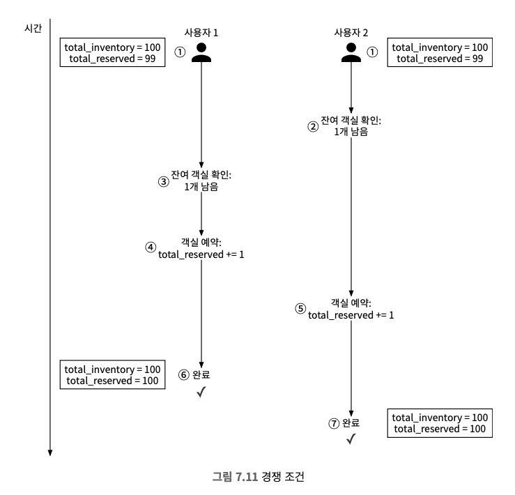

**문제를 해결하기 위한 락(Lock)을 활용**
* 방안 1. 비관적 락
  * 레코드를 갱신하려는 다른 사용자는 먼저 락을 건 사용자가 변경을 마치고 락을 해제할 때까지 기다려야 한다.
  * MySQL의 경우 `SELECT ... FOR UPDATE` 문을 실행하면 반환한 레코드에 락이 걸린다.

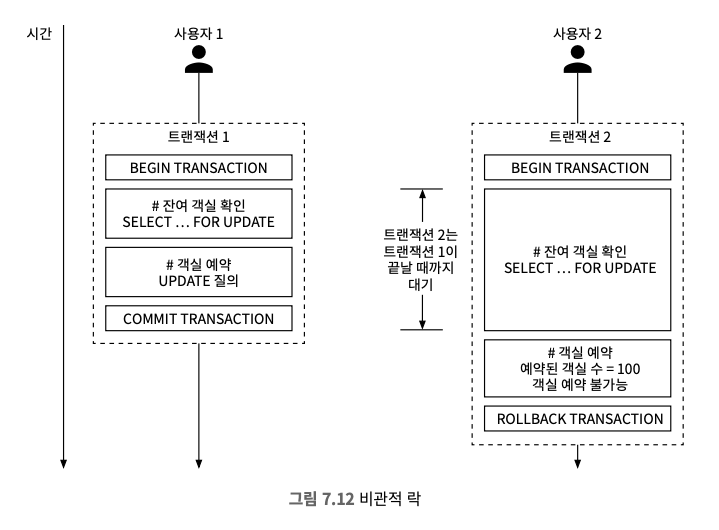

<table>
  <thead>
    <tr>
      <th>장점</th>
      <th>단점</th>
    </tr>
  </thead>
  <tbody>
    <tr>
        <td>
            <li>애플리케이션이 변경 중이거나 변경이 끝난 데이터를 갱신하는 상황을 막을 수 있.</li>
            <li>구현이 쉽고 모든 갱신 연산을 직렬화하여 충돌을 막는다.</li>
            <li>데이터에 대한 경합이 심할 때 유용하다.</li>
        </td>
        <td>
            <li>여러 레코드에 락을 걸면 교착 상태가 발생할 수 있고, 교착 상태가 생기지 않는 애플리케이션 코드 작성은 까다로울 수 있다.</li>
            <li>확장성이 낮고, 너무 오랫동안 트랜잭션이 락을 잡고 있으면 다른 트랜잭션이 자원에 접근할 수 없으므로 DB 성능이 꽤나 저하될 것이다.</li>
        </td>
    </tr>
  </tbody>
</table>

> 예약 시스템은 비관적 락 메커니즘을 사용하는 것은 권장하지 않는다.

* 방안 2. 낙관적 락
  * 데이터베이스 테이블에 version이라는 열을 추가하고, 수정 전 해당 레코드의 버전 번호를 읽어서 사용자가 레코드를 갱신할 때 애플리케이션 버전 번호를 1을 더한 다음 데이터베이스에 기록한 뒤에 다음 버전 번호는 현재 버전 번호보다 1보다 큰 값이어야하는 유효성 검사를 한다.
  * 유효성 검사가 실패하면 트랜잭션은 중단하고 다시 모든 절차를 반복한다.

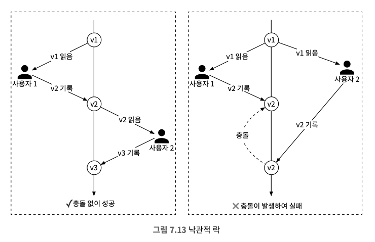

<table>
  <thead>
    <tr>
      <th>장점</th>
      <th>단점</th>
    </tr>
  </thead>
  <tbody>
    <tr>
        <td>
            <li>애플리케이션이 유효하지 않은 데이터를 편집하는 일을 막는다.</li>
            <li>데이터베이스 자원에 락을 걸 필요가 없고, 버전 번호를 통해서 일관성을 유지할 책임을 애플리케이션에 넘긴다.</li>
            <li>데이터에 대한 경쟁이 치열하지 않은 상황에 적합하고 락을 관리하는 비용 없이 트랜잭션 실행할 수 있다.</li>
        </td>
        <td>
            <li>데이터에 대한 경쟁이 치열한 상황에선 성능이 좋지 못하다.</li>
        </td>
    </tr>
  </tbody>
</table>

> 예약 QPS는 일반적으로 높지 않으므로, 호텔 예약 시스템에서 낙관적 락은 적합한 선택지이다.

* 방안 3. 데이터베이스 제약 조건
  * root_type_inventory 테이블에 제약 조건을 추가한다.
    ```sql
    CONSTRAINT `check_room_count` CHECK((`total_inventory - total_reserved` >= 0))
    ```

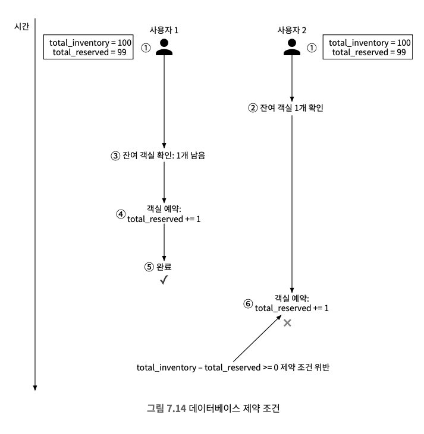

<table>
  <thead>
    <tr>
      <th>장점</th>
      <th>단점</th>
    </tr>
  </thead>
  <tbody>
    <tr>
        <td>
            <li>구현이 쉽다.</li>
            <li>데이터에 대한 경쟁이 심하지 않을 때 잘 동작한다.</li>
        </td>
        <td>
            <li>낙관적 락처럼 데이터에 대한 경쟁이 심하면 실패하는 연산 수가 매우 늘어나게 된다.</li>
            <li>애플리케이션 코드와 달라서 버전을 통제하기 어렵다.</li>
            <li>제약조건을 허용하지 않는 DB도 있어 DBMS의 유연한 교체가 불가능하다.</li>
        </td>
    </tr>
  </tbody>
</table>

> 구현이 쉽고 호텔 예약은 데이터에 대한 경쟁이 심하지 않아서 좋은 선택지라고 할 수 있다.

### 시스템 규모 확장
* 유명한 여행 예약 웹 사이트와 연됭되서 QPS가 천 배늘어날 수 있는 상황에는 시스템 부하를 막기 위한 고민을 해야 한다.

#### 데이터베이스 샤딩
* 데이터베이스를 여러 대 두고 각각에 데이터의 일부만 보관하도록 한다.
* 대부분의 쿼리에서 hotel_id를 필요로 해서 해당 키를 샤딩 조건으로 가져가면 된다.

#### 캐시
* 이력 데이터는 현재와 미래의 데이터만 중요하기 때문에 데이터를 보관할 때 낡은 데이터는 자동적으로 소멸되도록 TTL을 설정하는 것이 바람직해서 `레디스가 적합`하다.
* 요청한 가운데 일부만 잔여 객실 데이터베이스가 처리하고 나머지는 캐시가 담당한다.

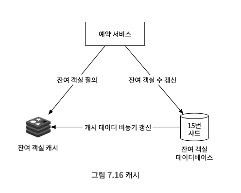

* 시스템의 각 컴포넌트
  * 예약 서비스: 잔여 객실 관리 API 제공
    * 지정된 호텔과 객실 유형, 주어진 날짜 범위에 이용 가능한 객실 수 질의
    * 객실 예약 및 total_reserved 값을 1 증가
    * 예약 취소 시, 잔여 객실 수 갱신
  * 잔여 객실 캐시: 모든 잔여 객실 관리에 필요한 질의를 Redis로 구현된 캐시로 이동
    * 사전에 잔여 객실 정보를 캐시에 미리 저장
  * 잔여 객실 데이터베이스: 잔여 객실 수에 대한 가장 믿을 만한 정보 보관

> 캐시가 주는 새로운 과제?
* 캐시와 데이터 사이의 일관성 유지
* 주로 DB가 먼저 갱신되면 캐시가 비동기적으로 변경 내역이 반영된다.
  * 애플리케이션 측에서 DB에 데이터를 저장한 뒤 캐시 데이터를 수정
  * 변경 데이터 감지(CDC) 메커니즘 사용 (Debezium), DB source connector가 변화를 감지하여 캐시에 반영

> 장점과 단점
* 장점
  * 읽기 질의를 캐시가 처리하므로 데이터베이스의 부하가 크게 줄어든다.
  * 읽기 질의를 메모리에서 실행하기 때문에 높은 성능 보장
* 단점
  * 데이터베이스와 캐시 사이의 데이터 일관성을 유지하지 못할 때의 사용자 경험에 어떤 영향을 끼칠지 신중하게 따져야 한다.

#### 서비스 간 데이터 일관성
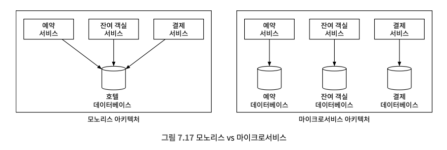

> 데이터 일관성 문제를 해결하기 위한 방법
* 2단계 커밋(2-phase commit, 2PC) 
  * 여러 노드에 걸친 원자적 트랜잭션 실행을 보증하는 데이터베이스 프로토콜
  * 모든 노드가 성공 또는 실패 둘 중 하나로 트랜잭션이 마무리되도록 보증
  * 비중단 실행이 가능한 프로토콜이 아니기 때문에(blocking protocal) 어느 한 노드에 장애가 발생하면 복구될 때까지 진행이 중단된다.
  * 성능이 뛰어난 프로토콜이 아니다.
* 사가(Saga)
  * 각 노드에 국지적으로 발생하는 트랜잭션을 하나로 엮은 것
  * 각각의 트랜잭션이 완료되면 다음 트랜잭션을 시작으로 하는 트리거로 쓰일 메시지를 만들어 보낸다.
  * 각 단계가 하나의 트랜잭션이므로, 결과적 일관성에 의존하는 방식으로 어느 하나라도 실패하면 그 이전 트랙잭션 결과까지 전부 순차적으로 되돌린다.

## 4. 마무리
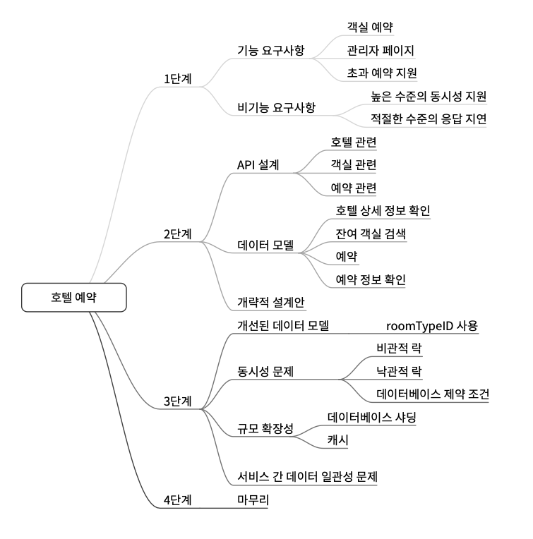