# 8장 분산 이메일 서비스

## 1. 문제 이해 및 설계 범위 확정
```
Q1. 얼마나 많은 사람들이 사용하는 제품인가요?
→ 10억 명입니다.

Q2. 인증, 이메일 발송/수신, 모든 이메일 가져오기, 읽음 여부에 따른 이메일 필터링, 제목/발신인/메일 내용에 따른 검색 기능, 스팸 및 바이러스 방지기능이 중요할 것 같은데요.
→ 인증은 건너뛰고, 나머지 기능에 집중합시다.

Q3. 사용자는 메일 서버에 어떻게 연결하나요?
→ 전통적으로 SMTP, POP, IMAP 등의 프로토콜과 서비스 제공자 전용 프로토콜을 사용해 접속하지만 많이 사용하지만 구식이기 때문에 이번 면접에서는 HTTP를 사용합니다.

Q4. 첨부 파일도 지원해야 하나요?
→ 그렇습니다.
```

### 비기능 요구사항
* **안정성**: 이메일 데이터의 소실되어선 안된다.
* **가용성**: 이메일과 사용자 데이터를 여러 노드에 자동으로 복제하여 가용성 보장해야 하지만 장애가 발생해도 계속 동작해야 한다.
* **확장성**: 사용자 수가늘어도 감당할 수 있어야 하고, 사용자, 이메일 수가 늘어나도 시스템 성능 저하되지 않아야 한다.
* **유연성과 확장성**: 새 컴포넌트로 쉽게 기능 추가 및 성능 개선이 가능한 유연하고 확장성이 높은 시스템이여야 하고, 유연성과 호가장성을 갖추려면 맞춤형 프로토콜이 필요할수도 있다.

### 개력적인 규모 추정
* 10억 명의 사용자
* 1인 하루 송신 평균 이메일 수는 평균 10건이라고 가정, 이메일 전송 QPS = 10⁹ * 10 / 10⁵ = 100,000
* 1인 하루 수신 평균 이메일 수는 평균 40건, 이메일 하나의 메타데이터는 평균 50KB로 가정, 메타데이터에는 첨부 파일은 포함하지 않는다.
* 메타데이터는 DB에 저장한다고 가정, 1년간 메타데이터를 유지하기 위한 스토리지는 10억 * 40건 * 365일 * 50KB = 730PB
* 첨부 파일을 포함하는 이메일의 비율은 20%이고, 첨부 파일의 평균 크기는 500KB라고 가정
* 1년간 첨부파일을 보관하는데 필요한 저장 용량은 10억 * 40개 * 365일 * 20% * 500KB = 1,460PB

## 2. 개략적 설계안 제시 및 동의 구하기

### 이메일 101

#### 이메일 프로토콜
<table>
  <thead>
    <tr>
      <th>프로토콜</th>
      <th>설명</th>
    </tr>
  </thead>
  <tbody>
    <tr>
      <td>SMTP(Simple Mail Transfer Protocol)</td>
      <td>
        <li>이메일을 한 서버에서 다른 서버로 보내는 표준 프로토콜</li>
      </td>
    </tr>
    <tr>
      <td>POP</td>
      <td>
        <li>이메일 클라이언트가 원격 메일 서버에서 이메일을 수신하고 다운로드하기 위해 사용하는 표준 프로토콜</li>
        <li>단말로 다운된 이메일은 서버에서 삭제되서 한 대 단말에서만 이메일을 읽을 수 있다.</li>
        <li>이메일을 일부만 읽을 수 없어서 이메일 확인 시 전부 내려 받아야해서 용량이 큰 첨부 파일이 붙은 이메일은 읽으려면 시간이 </li>
      </td>
    </tr>
    <tr>
      <td>IMAP</td>
      <td>
        <li>이메일 클라이언트가 원격 메일 서버에서 이메일을 수신하는 데 사용되는 또 다른 표준 프로토콜</li>
        <li>여러 단말에서 이메일을 읽을 수 있다.</li>
        <li>개인 이메일 계정에서 가장 널리 사용되는 프로토콜로 이메일을 실제로 열기 전에는 헤더만 다운로드 하기 때문이에 인터넷 속도가 느려도 잘 동작한다.</li>
      </td>
    </tr>
    <tr>
      <td>HTTPS</td>
      <td>
        <li>기술적으로 메일 전송 프로토콜은 아니지만 웹 기반 이메일 시스템의 메일함 접속에 이용될 수 있다.</li>
      </td>
    </tr>
  </tbody>
</table>

#### 도메인 이름 서비스(DNS)
* 수신자 도메인의 메일 교환기 레코드 검색에 이용된다.
* 우선순위 값은 선호도로를 나타내고 우선순위가 높은 것부터 최우선으로 연결된다. 

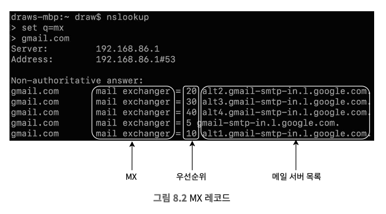

#### 첨부 파일
* 일반적으로 Base64 인코딩을 사용한다.
* 크기 제한이 존재하고, 아웃룩과 지메일은 각각 20MB와 25MB로 제한했다.
* 다목적 인터넷 메일 확장은 인터넷을 통해 첨부 파일을 전송할 수 있도록 하는 표준 규격이다.

#### 전통적 메일 서버
* 보통 서버 한 대로 운영되는 사용자가 많지 않을 때 잘 동작하는 시스템이다.


> 전통적인 메일 서버 아키텍처 프로세스
1. 사용자A가 아웃룩 클라이언트에 로그인하여 이메일 작성 및 보내기 버튼을 클릭하면 아웃룩 메일 서버로 이메일 전송되며, 클라이언트와 메일 서버는 SMTP로 통신한다.
2. 아웃룩 메일 서버는 DNS 질의를 통해 수신자 SMTP 서버 주소(지메일)를 검색 후 해당 주소로 이메일을 전송되며, 메일 서버 간 SMTP로 통신한다.
3. 지메일 서버는 이메일 저장 후, 수신할 사용자B가 메일을 읽어갈 수 있도록 한다.
4. 사용자B가 지메일에 로그인하면 지메일 클라이언트는 IMAP/POP 서버를 통해 새 이메일을 가져온다.

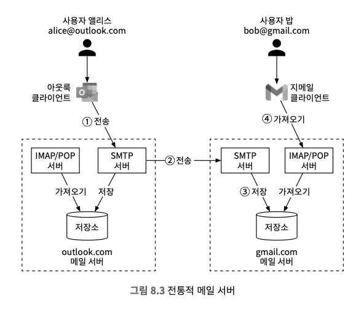

> 저장소
* 이메일은 파일 시스템과 디렉터리에 저장된다.
  * 각 이메일은 고유한 이름을 가진 별도 파일로 보관
  * 각 사용자의 설정 데이터와 메일함은 사용자 디렉터리에 보관
* 주로 Maildir 이름의 디렉터리가 널리 사용된다.
* POP, IMAP, SMTP 같은 이메일 프로토콜은 오래 전에 발명되어 다양한 기능과 수십억 명의 사용자를 지원하도록 확장할 수 없었다.

### 분산 메일 서버
* 현대적 사용 패턴을 지원하고 확장성과 안정성 문제를 해결한다.

#### 이메일 API
* 메일 클라이언트, 이메일 생명주기 단계마다 달라질 수 있다.
  * 모바일 단말 클라이언트를 위한 SMTP/POP/IMAP API
  * 송신 측 메일 서버와 수신 측 메일 서버 간의 SMTP 통신
  * 대화형 웹 기반 이메일 애플리케이션을 위한 HTTP 기반 RESTful API

> 1. POST /v1/messages 엔드포인트
* To, Tc, Bcc 헤더에 명시된 수신자에게 메시지를 전송

> 2. GET /v1/folders 엔드포인트
* 주어진 이메일 계정에 존재하는 모든 폴더를 반환
```json
-- 응답 형식
[{
  id: string      고유한 폴더 식별자
  name: string    폴더 이름 (RFC6154에 따르면, 기본 폴더는 All, Archive, Drafts, Flagged, Junk, Sent, Trash 중 하나이다.)
  user_id: string 계정 소유자 ID
}]
```

> 3. GET /v1/folders/{:folder_id}/messages 엔드포인트
* 주어진 폴더 아래의 모든 메시지를 반환하지만 실제로는 pagenation을 지원하는 등 훨씬 복잡
```
-- 응답 형식
* 메시지 객체 목록
```

> 4. GET /v1/messages/{:message_id} 엔드포인트
* 주어진 특정 메시지에 대한 모든 정보를 반환하고 발신자, 수신자, 메시지 제목, 본문, 첨부 파일 등의 정보로 구성

```json
{
  user_id: string                      // 계정주의 ID
  from: name: string, email: string    // 발신자의 <이름, 이메일> 쌍
  to: [name: string, email: string]    // 수신자의 <이름, 이메일> 쌍의 **목록**
  subject: string                      // 이메일 제목
  body: string                         // 이메일 본문
  is_read: boolean                     // 수신자가 메시지를 읽었는지 여부
}
```

#### 분산 이메일 아키텍처
* 클라우드 기술을 활용하여 여러 메일 서버 간의 데이터 동기화 규모 확장 및 스팸 분류 등 까다로운 문제를 쉽게 풀어본다.

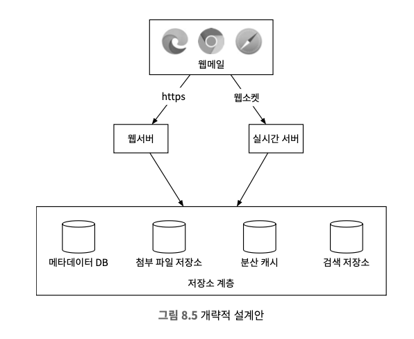

* **웹메일(webmail)**: 용자는 웹 브라우저를 사용해 메일을 받고 보낸다.
* **웹서버**: 사용자가 이용하는 요청/응답 서비스로, 로그인, 가입, 사용자 프로파일 관리 등의 기능을 담당하며, 모든 이메일 API 요청은 전부 웹서버를 통한다.
* **실시간 서버**: 새로운 이메일 내역을 클라이언트에 실시간으로 전달하는 역할을 담당하고, stateful하게 지속성 연결을 맺고 유지하며 실시간 통신 지원 방안으론 롱 폴링, 웹소켓이 있다.
* **메타데이터 데이터베이스**: 이메일 메타데이터 저장하는 데이터베이스
* **첨부 파일 저장소**: Amazon S3와 같은 객체 저장소 사용하고 이미지, 동영상 등 대용량 파일을 저장하는데 적합하다.
  * 카산드라같은 NoSQL DB가 적합하지 않은 이유
    * BLOB 자료형, 최대 2GB의 데이터 지원하지만 1MB 이상의 파일을 지원하지 않는다.
    * 카산드라에 첨부 파일을 저장하면 많은 메모리를 사용해 레코드 캐시를 사용하기 어렵다.
* **분산 캐시**: 메모리에 캐시해 두도록 하면 메일을 표시하는 시간을 많이 줄일 수 있고, 레디스를 활용한다.
* **검색 저장소**: 분산 문서 저장소로 고속 텍스트 검색을 지원하는 역 인덱스 자료 구조를 사용한다.

### 이메일 전송 절차
1. 사용자가 웹메일 환경에서 메일 작성 후 전송 버튼을 누른다.
2. 로드밸런서는 처리율 제한 한도를 넘지 않는 선에서 요청을 웹 서버로 전달한다.
3. 웹 서버는 다음 역할을 담당한다.
   * 기본적인 이메일 검증
   * 수신자 이메일 주소 도메인이 송신자 이메일 주소 도메인과 같은지 검사
4. 메시지 큐
   * 4.a 기본적인 검증에 실패한 이메일은 에러 큐에 보관
   * 4.b 기본적인 검증을 통과한 이메일은 외부 전송 큐로 전달
5. 외부 전송 담당 SMTP 작업 프로세스는 외부 전송 큐에서 메시지를 꺼내어 이메일의 스팸 및 바이러스 감염 여부 확인
6. 검증 절차를 통과한 이메일은 저장소 계층 내의 보낸 편지함에 저장된다.
7. 외부 전송 담당 SMTP 작업 프로세스가 수신자의 메일 서버로 메일을 전송

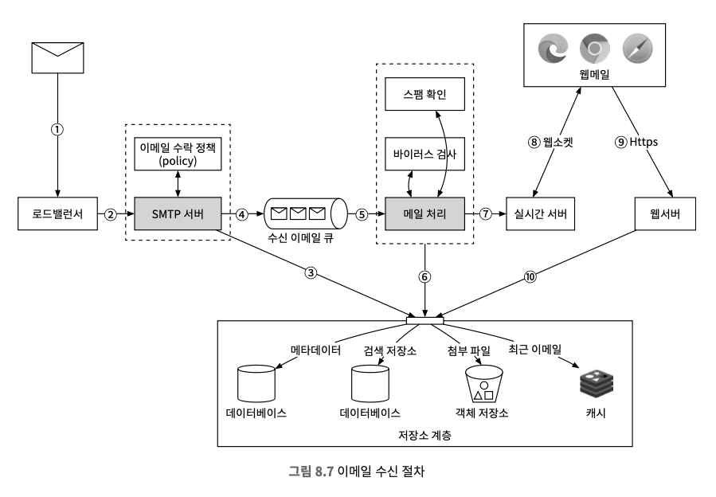

* 분산 메시지 큐는 비동기적 메일 처리를 가능하게 하는 핵심 컴포넌트로, 엡 서버에서 외부 전송 담당 SMTP 프로세스를 분리함으로써 전송용 SMTP 프로세스의 규모를 독립적으로 조정할 수 있게 된다.

> 메일이 처리되지 않고 큐에 오래 남아있는 상황
1. 수신자 측 메일 서버에 장애 발생
   * 메일을 다시 전송해야한다.
   * 지수적 백오프가 좋은 전략일 수 있다.
2. 이메일을 보낼 큐의 소비자 수가 불충분
   * 더 많은 소비자를 추가해 처리 시간을 단축하는 방법을 고려한다.

### 이메일 수신 절차
1. 이메일이 SMTP 로드밸런서에 도착한다.
2. 로드밸런서는 트래픽을 여러 SMTP 서버로 분산한다.
3. 이메일의 첨부 파일이 큐에 들어가기 너무 큰 경우 첨부 파일 저장소에 보관한다.
4. 이메일을 수신 이메일 큐에 넣는다.
5. 메일 처리 작업 프로세스는 스팸 메일을 걸러내고 바이러스를 차단하는 등의 다양한 역할을 한다.
6. 이메일을 메일 저장소, 캐시, 객체 저장소 등에 보관한다.
7. 수신자가 온라인 상태일 경우 이메일을 실시간 서버로 전달한다.
8. 실시간 서버는 수신자 클라이언트가 새 이메일을 실시간으로 받을 수 있도록 하는 웹소켓 서버다.
9. 오프라인 상태 사용자의 이메일은 저장소 계층에 보관한다.
10. 웹 서버는 새로운 이메일을 저장소 계층에서 가져와 클라이언트에 반환한다.

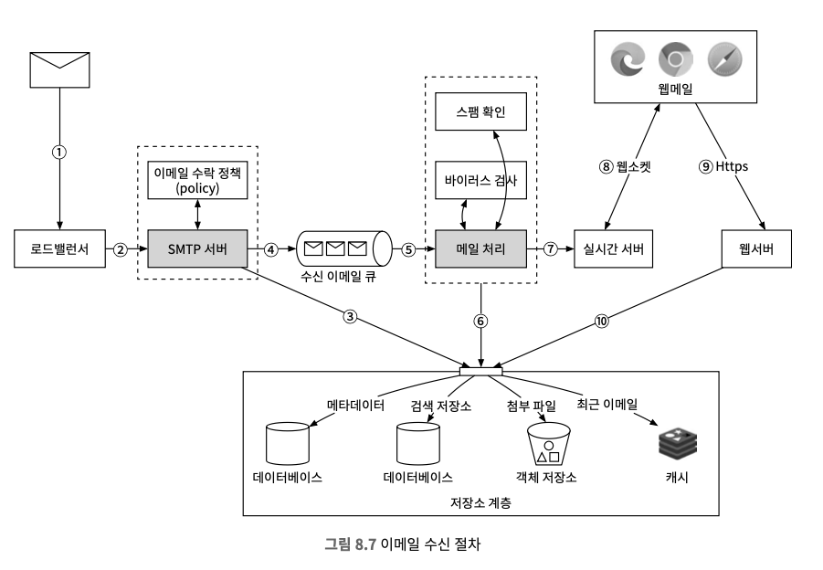

## 3. 상세 설계

### 메타데이터 데이터베이스

#### 이메일 메타데이터의 특성
* 이메일의 헤더는 보통 작고, 빈번하게 이용된다.
* 본문의 크기는 다양하지만 사용 빈도는 낮고, 일반적으로 한 번만 읽는다.
* 이메일은 해당 사용자만 읽을 수 있어 하고, 작업 또한 해당 사용자만 수행할 수 있어야한다.
* 데이터의 신선도는 데이터 사용 패턴에 영향을 미치며 16일 이하 데이터에 발생하기 읽기 질의 비율이 전체 질의의 82%를 보면 보통 최근 메일만 읽는다는 것을 알 수 있다.
* 데이터의 높은 안전성이 보장되어야하고, 손실을 용납하지 않는다.

#### 올바른 데이터베이스의 선정
* 관계형 데이터베이스
  * 이메일을 효율적으로 검색할 수 있다.
  * 헤더와 본문의 인덱스를 만들면 간단한 검색질의는 빠르게 처리할 수 있다.
  * 데이터 크기가 작을 때 적합하지만 이메일은 수 KB보다 크고 HTML이 포함되면 100KB가 넘어간다.
  * BLOB 자료형 큰 이메일도 처리할 수 있지만 성능이 좋지 않고 많은 디스크 I/O가 발생한해서 바람직하지 않다.
* 분산 객체 저장소
  * 이메일의 원시 데이터를 그대로 객체 저장소에 보관한다.
  * 백업 데이터 보관에는 좋지만 다양한 기능(읽음 표시, 키워드 검색, 이메일 타래 등) 구현에는 좋지 않다.
* NoSQL 데이터베이스
  * 지메일은 구글 빅테이블을 저장소로 사용한다.
  * 빅테이블은 오픈소스로 공개되어 있지 않기 때문에 카산드라를 대안으로 사용할 수 있지만 아직 카산드라를 사용하는 곳은 없다.

> 본 설계안에 필요한 기능을 완벽히 지원하는 데이터베이스는 없다고 봐도 좋다.

* 데이터베이스가 다음 조건을 충족해야 하고, 제한된 면접 시간에 데이터베이스를 구현할 시간은 없기 때문에 설명할 수 있어야한다.
  1. 어떤 단일 컬럼의 크기는 한 자릿수 MB 정도일 수 있다.
  2. 강력한 데이터 일관성이 보장되어야 한다.
  3. 디스크 I/O가 최소화되도록 설계되어야 한다.
  4. 가용성이 아주 높아야 하고 일부 장애를 감내할 수 있어야 한다.
  5. 증분 백업이 쉬워야 한다.

#### 데이터 모델
* 데이터를 저장하는 방식은 user_id를 파티션 키로 사용하여 특정한 사용자의 데이터를 항상 같은 샤드에 보관하는 것이다.

> 테이블 정의 (기본 키는 파티션 키와 클러스터 키로 구성)
* 파티션 키
  * 데이터를 여러 노드에 분산하는 구실을 한다.
  * 일반적으로 데이터가 모든 노드에 균등하게 분산되도록 하는 파티션 키를 골라야 한다는 규칙 존재한다.
* 클러스터 키
  * 같은 파티션에 속한 데이터를 정렬하는 구실을 한다.

> 이메일 서비스의 데이터 계층이 지원하는 질의

질의 1. 특정 사용자의 모든 폴더 구한다.
* 파티션 키(user_id)로 특정 사용자의 파티션에 접근

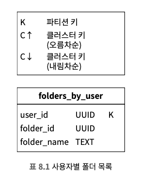

질의 2. 특정 폴더 내의 모든 이메일을 표시
*  복합 파티션 키(<user_id, folder_id>), 클러스터 키(email_id, TIMEUUID)로 최근 시간순 정렬된 같은 파티션, 폴더에 접근한다.

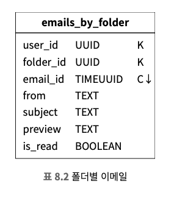

질의 3. 이메일 생성/삭제/수신
* 이메일 상세 정보, 첨부파일을 관리하는 두 테이블이 필요하다.

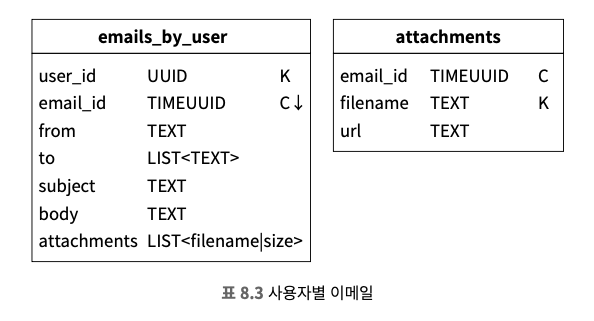

질의 4. 읽거나 읽지 않은 메일 가져온다.
```sql
SELECT 
  * 
FROM 
  emails_by_folder
WHERE 
  user_id = <user_id> 
  and folder_id = <folder_id> 
  AND **is_read = true**
ORDER BY 
email_id
```
* NoSQL DB에서도 동작(파티션 키, 클러스터 키 활용)하게 하려면, 주어진 폴더에 속한 모든 메시지를 가져온 다음, 애플리케이션 단에서 필터링을 수행하는 대안이 있지만 대규모 서비스에는 적합하지 않고, 비정규화하여 해결하는 것이 보통이다.
* 비정규화는 흔한 관행이지만 애플리케이션 코드가 복잡해지고 관리가 까다로워지지만 질의 성능은 대규모 서비스에 어울리는 수준으로 개선한다.

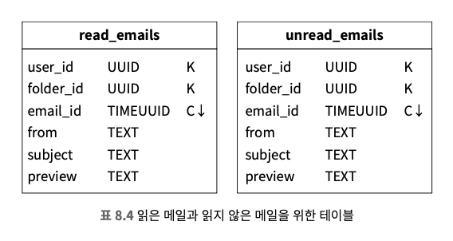

질의 5. 이메일 타래를 가져온다. (보너스 점수를 받을 수 있는 질의)
* 모든 답장을 최초 메시지에 타래로 엮어 보여주는 기능으로 사용자는 특정한 대화에 관련된 모든 메일을 한 번에 확인할 수 있게 된다.
* 이메일 헤더 정보를 이용하는 JWZ같은 알고리즘을 통해 구현된다.

```json
// 이메일 헤더
{
	"headers": {
		"Message-Id": "<8BA024-4DSD-2FWD@gmail.com>",   // 메시지 식별자. 메시지를 보내는 클라이언트가 생성
		"In-Reply-To": "<CAEXWEW2=KSFJCVW TW@gmail.com>",  // 이 메시지가 어떤 메시지에 대한 답신인지 나타내는 식별자
		"References": ["<8BA024-4DSD-2FWD@gmail.com>"]  // 타래에 관계된 메시지 식별자 목록
	}
}
```

* 위 필드들을 이용해 이메일 클라이언트는 타래 내의 모든 메시지가 사전에 메모리로 로드되어 있다면, 타래 재구성이 가능하다

#### 일관성 문제
* 높은 가용성을 달성하기 위해서 다중화에 의존하는 분산 데이터베이스는 일관성과 가용성 사이에 타협적인 결정을 내릴 수 밖에 없다.
* 이메일 서비스는 데이터의 정확성이 무엇보다 중요하므로, 장애가 발생하면 다른 사본을 통해 주 사본이 복원될 때까지 동기화/갱신 작업을 중단한다, 즉 차라리 가용성을 희생하는 방안을 택하는 것이다.

### 이메일 전송 가능성
* 서버를 구성하고 메일을 보내는 것은 쉽지만 스팸 메일로 분류되지 않고 사용자의 메일함에 전달되도록 하는 것은 어려운 문제다.

> 이메일 전송 가능성을 높이기 위한 고려 요소
* **전용 IP**: 대부분의 이메일 서비스 사용자는 아무 이력없는 새로운 IP를 무시하기 때문에 이메일을 보낼 때 전용 IP 주소를 사용해야 한다.
* **스팸 발송자의 신속한 차단**: 서버 평판을 훼손하기 전에 시스템에서 신속히 차단해야 한다.
* **피드백 처리**: ISP 측에서 피드백을 쉽게 받아 처리할 수 있는 경로를 만드는 것이 중요하다.
  * 경성 반송: 수신인의 이메일 주소가 올바르지 않아 ISP가 전달을 거부한 경우
  * 연성 반송: ISP 측의 이메일 처리 지원 부족 등의 이유로 일시적으로 이메일을 전달할 수 없었던 경우
  * 불만 신고: 수신인이 스팸으로 신고 버튼을 누른 경우

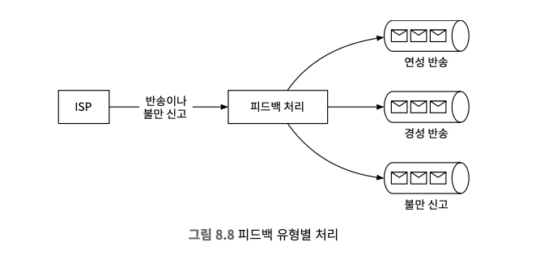

* **이메일 인증**: 피싱, 프리텍스팅에 의해 유출 사고가 발생되지 안도록 SPF, DKIM, DMARC 등의 전략을 도입해 검증을 거쳐야 한다.

### 검색
* 제목, 본문에 특정 키워드가 포함되었는지 찾는 것을 뜻하고 고급 기능에 발신인, 제목, 읽지 않음 같은 메일 속성에 따른 필터링 기능이 포함된다.
* 검색 기능을 제공하기 위해서 이메일이 전송, 수신, 삭제 시마다 색인 작업을 수행해야하지만 검색은 사용자가 검색 버튼을 누를 때만 실행되기 때문에 쓰기 연산이 읽기 연산보다 많이 발생한다.

> 방안 1. 일래스틱서치
* 질의가 대부분 사용자의 이메일 서버에서 실행되므로 user_id를 파티션 키로 사용해 같은 사용자의 이메일은 같은 노드에 묶어 놓드다.
* 사용자가 검색 버튼을 누른 다음 결과가 수신될 때까지 기다리는 동기(sync) 방식 으로 처리하지만 이벤트 처리 결과를 클라이언트에 전달할 필요는 없다.
* 카프카를 활용해 색인 작업을 시작하는 서비스와 실제로 색인을 수행할 서비스 사이에 결합도를 낮춘다.

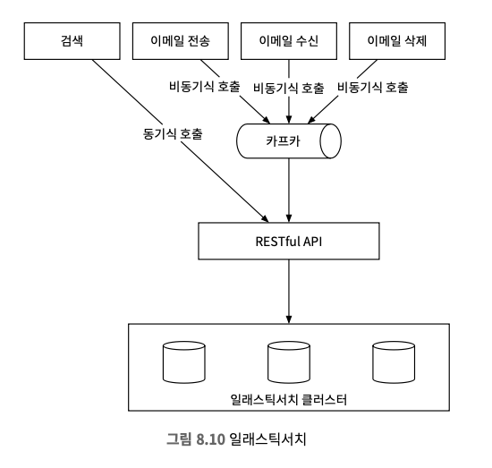

> 방안 2. 맞춤형 검색 솔루션
* 보통 대규모 이메일 서비스 사업자는 고유한 요구사항을 만족하기 위해 자체 검색 엔진을 개발해 사용한다.
* 개략적 규모 추정을 통하면 데이터의 양은 페타바이트(PB) 수준은 아니고 하나의 이메일 계정에 오십 만개가 넘는 이메일이 저장되는 것도 드문 일이 아니기 때문에 메일 색인 서버의 병목은 보통 디스크 I/O이다.
* 색인을 구축하는 프로세스는 쓰기 연산을 발생시킬 수 밖에 없기 떄문에 LSM 트리(빅테이블, 카산드라, RocksDB의 핵심 자료구조)를 사용하는 전략으로 최적화할 수 있다.
* 새로운 이메일이 도착하면 우선 메모리 캐시로 구현되는 0번 계층에 추가하고, 메모리에 보관된 데이터 양이 임계치를 초과하면 데이터는 다음 계층에 병합한다.

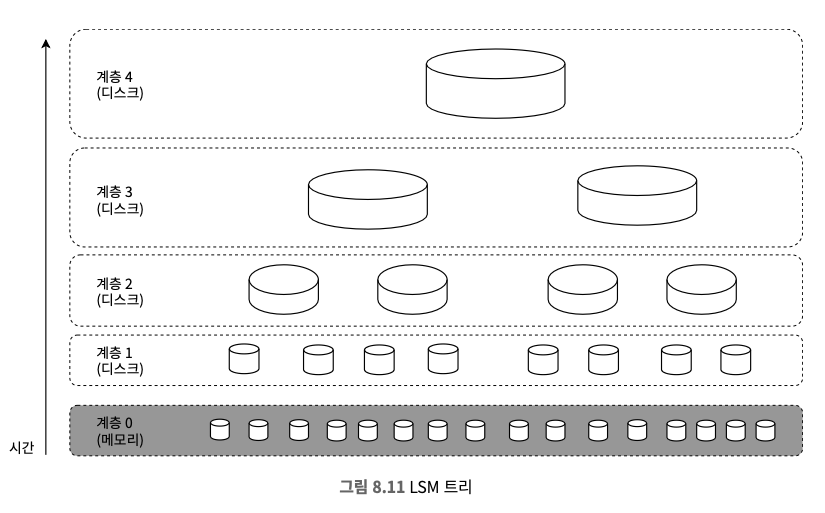

<table>
  <thead>
    <tr>
      <th>비교항목</th>
      <th>일래스틱서치</th>
      <th>맞춤형 검색 엔진</th>
    </tr>
  </thead>
  <tbody>
    <tr>
      <td>규모 확장성</td>
      <td>어느 정도까지 확장 가능</td>
      <td>이메일 사용 패턴에 따라 시스템을 최적화할 수 있으므로 규모 확장이 용이</td>
    </tr>
    <tr>
      <td>시스템 복잡도</td>
      <td>두 가지 상이한 시스템을 동시에 유지해야 함: 데이터 저장소와 일래스틱서치</td>
      <td>하나의 시스템</td>
    </tr>
    <tr>
      <td>데이터 일관성</td>
      <td>
        한 데이터의 두 사본이 존재. 하나는 메타 데이터 저장소에 있고 다른 하나는
        일래스틱서치 내에 있다. 따라서 데이터 일관성을 유지하기 까다롭다.
      </td>
      <td>메타데이터 저장소에 하나의 사본만 유지됨</td>
    </tr>
    <tr>
      <td>데이터 손실 가능성</td>
      <td>없다. 색인이 손상되면 주 저장소의 데이터를 사용해 복구한다.</td>
      <td>없다.</td>
    </tr>
    <tr>
      <td>개발 비용</td>
      <td>
        통합하기 쉬운 편이지만 대규모의 이메일 검색이 필요한 경우에는 일래스틱서치를
        전달하는 팀이 필요할 수 있다.
      </td>
      <td>
        맞춤형 검색 솔루션 전환이 필요하므로 굉장히 많은 엔지니어링 노력이 필요하다.
      </td>
    </tr>
  </tbody>
</table>

> 소규모 이메일 시스템을 구축하면 일래스틱서치는 좋은 선택지고 대규모 시스템을 규축하는 경우에도 일래스틱 서치를 사용할 수는 있지만 전담 팀이 필요할 수도 있다.
> 또한, 대규모 이메일 시스템(지메일, 아웃룩)을 지원하기 위해선 데이터베이스에 내장된 전용 검색 솔루션을 사용하는 것이 바람직할 수도 있다.

### 규모 확장성 및 가용성
* 가용성을 향상시키기 위해선 여러 데이터센터에 데이터를 다중화하는 것이 필요하다.
* 사용자는 네트워크 토폴로지 측면에서 가장 물리적으로 가까운 메일 서버와 통신하게 되고, 네트워크 파티션 자체에서 통신이 불가능한 장애가 발생하면, 사용자는 다른 데이터센터에 보관된 메시지를 이용하게 된다.

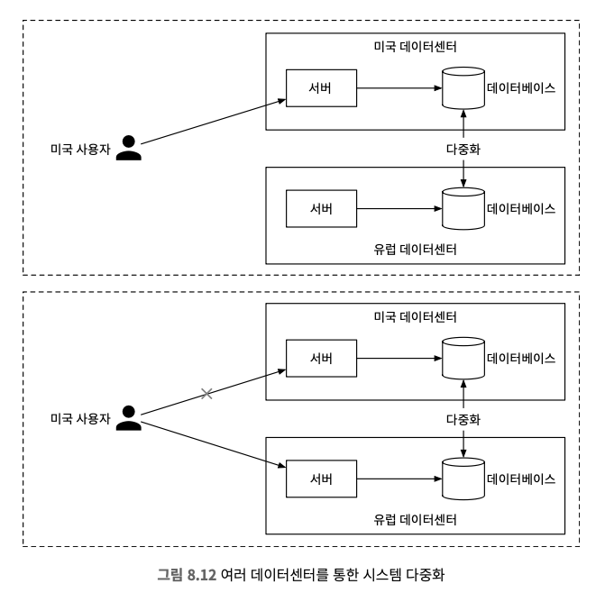

## 4. 마무리
> 시간이 남는 경우 추가로 논의해 볼 만한 주제
* 결함 내성
  * 노드 장애, 네트워크 문제, 이벤트 전달 지연 등의 문제에 어떻게 대처할 수 있을지 살펴본다.
* 규정 준수
  * 각 나라마다 준수해야할 법규를 지키기 위한 방법이 필요하다.
  * 유럽의 경우 개인 식별 정보를 처리하고 저장해야하고, 합법적 감청이 필요하다.
* 보안
  * 민간 정보가 포함될 가능성이 높은 이메일 데이터를 다루며, 보안 기능(피싱 방지, 안정 브라우징, 사전 경고, 계정 안전, 기밀 모드, 이메일 암호화)을 고려해볼 수 있다.
* 최적화
  * 같은 이메일이 여러 수신자에게 전송되는 경우 같은 첨부파일이 S3에 여러 번 저장될 수 있다.
  * 이를 최적화하려면 저장하기 전에 이미 저장소에 존재하는 파일인지 확인하면 저장 연산 실행 비용을 절감할 수 있다.