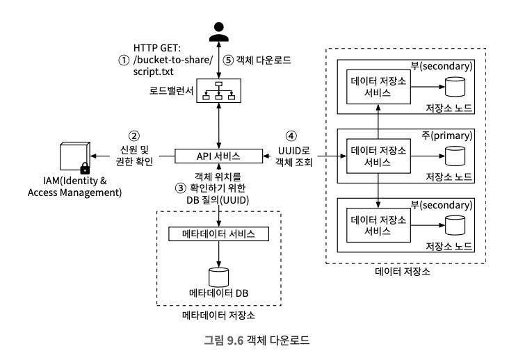

# 9장 S3와 유사한 객체 저장소

## 저장소 시스템 101
* 개략적으로 저장소 시스템은 세 가지 부류로 나눠진다.
  * 블록(block) 저장소
  * 파일(file) 저장소
  * 객체(object) 저장소

### 블록 저장소
* 원시(raw block)을 서버에 볼륨(volume) 형태로 제공한다.
* 가장 유연하고 융통성이 높은 서비스다.
* 서버가 원시 블록을 포맷한 뒤 파일 시스템을 이용하거나 애플리케이션에 블록 제어권을 넘길 수도 있고 데이터베이스나 가상 머신 엔진 같은 애플리케이션은 원시 블록을 직접 제어해 성능을 끌어낸다.
* 서버에 물리적으로 직접 연결되는 저장소에 국한되지 않는다.
  * 고속 네트워크로 연결
  * FC(Fibre Channel, 업계 표준 연결 프로토콜), iSCSI를 통해 연결

### 파일 저장소
* 블록 저장소 위에 구현도고 더 높은 수준의 추상화를 제공한다.
* 가장 널리 사용되는 범용 저장 솔루션이다.
* SMB/CIFS, NFS와 같은 네트워크 프로토콜을 사용해 저장소 하나에 여러 서버를 동시에 붙일 수 있다.
* 파일 저장소를 사용하는 서버는 블록을 직접 제어하고 볼륨을 포맷하는 등의 까다로운 작업을 신경 쓸 필요가 없고 단순해서 폴더, 파일을 조직 구성원에 공유하는 솔루션으로 좋다.

### 객체 저장소
* 데이터 영속성을 높이고 대규모 애플리케이션을 지원하며 비용을 낮추기 위해 의도적으로 성능을 희생한다.
* 상대적으로 차가운(cool) 데이터 보관에 초점을 맞추며 데이터 아카이브, 백업에 주로 쓰인다.
* 계층적 디렉터리 구조를 제공하지 않고 모든 데이터를 수평적 구조 내에 객체로 보관한다.
* 데이터 접근은 보통 RESTful API를 통해서 상대적으로 느리다.
* AWS S3, Azure Blob Storage 같은 객체 저장소 제품들이 존재한다.

> 객체 저장소 용어 정리
* **버킷(bucket)**
  * 객체를 보관하는 논리적 컨테이너, 전역적으로 이름은 유일해야 한다.
  * S3에 업로드하기 위해서는 버킷부터 만들어야 한다.
* **객체(object)**
  * 버킷에 저장하는 개별 데이터를 말한다.
  * 데이터(페이로드)와 메타데이터를 갖고 데이터는 어떤 것도 가능하고, 메타데이터는 이름-값 쌍의 집합이다.
* **버전(versioning)**
  * 한 객체의 여러 버전을 같은 버킷 안에 둘 수 있는 기능이다.
  * 버킷마다 별도의 설정이 가능하고, 덮어쓴 객체를 복구할 수 있다.
* **URL(Uniform Resource Identifier)**
  * 버킷과 객체에 접근할 수 있는 RESTful API를 제공한다.
  * 각 객체는 API URL을 통해 고유하게 식별할 수 있다.
* **SLA(Service-Level Agreement)**
  * 서비스 제공자와 클라이언트 사이에 맺어지는 계약이다.
  * 아마존 S3 Standard-IA 다음 SLA 만족한다.
    * 여러 가용성 구역에 걸쳐 99.999999999%의 객체 내구성을 제공하도록 설계
    * 하나의 가용성 구역 전체가 소실되도 데이터 복원 가능
    * 연간 99.9% 가용성 제공


### 블록 저장소, 파일 저장소, 객체 저장소의 비교


<table>
  <caption>저장소 유형별 특성</caption>
  <thead>
    <tr>
      <th></th>
      <th>블록 저장소</th>
      <th>파일 저장소</th>
      <th>객체 저장소</th>
    </tr>
  </thead>
  <tbody>
    <tr>
      <td>저장된 내용의 변경 가능성</td>
      <td>Y</td>
      <td>Y</td>
      <td>N (직접 변경은 불가능하지만 객체 버전을 통해 새로운 버전의 객체를 추가하는 것은 가능)</td>
    </tr>
    <tr>
      <td>비용</td>
      <td>고</td>
      <td>중~고</td>
      <td>저</td>
    </tr>
    <tr>
      <td>성능</td>
      <td>중~고 혹은 최상</td>
      <td>중~고</td>
      <td>저~중</td>
    </tr>
    <tr>
      <td>데이터 일관성</td>
      <td>강력</td>
      <td>강력</td>
      <td>강력</td>
    </tr>
    <tr>
      <td>데이터 접근</td>
      <td>SAS, iSCSI, FC</td>
      <td>표준 파일 접근, CIFS/SMB, NFS</td>
      <td>RESTful API</td>
    </tr>
    <tr>
      <td>규모 확장성</td>
      <td>중</td>
      <td>고</td>
      <td>최상</td>
    </tr>
    <tr>
      <td>적합한 응용</td>
      <td>가상 머신(VM), 데이터베이스 같은 높은 성능이 필요한 애플리케이션</td>
      <td>범용적 파일 시스템 접근</td>
      <td>아카이빙, 구조화되지 않은 데이터</td>
    </tr>
  </tbody>
</table>

## 1. 문제 이해 및 설계 범위 확정
```
Q1. 어떤 기능을 지원해야 하나요?
→ 아래 기능을 제공하는 S3와 유사한 객체 저장소 시스템을 설계하면 좋을 것 같습니다.
* 버킷 생성
* 객체 업로드 및 다운로드
* 객체 버전
* 버킷 내 객체 목록 출력 기능, aws s3 ls 명령어와 유사해야 한다.

Q2. 데이터의 크기는 어느 정도인가요?
→ 아주 큰 객체와 다량의 소형 객체를 효율적으로 저장할 수 있어야 합니다.

Q3. 매년 추가되는 데이터는 어느 정도입니까?
→ 100페타바이트(PB)입니다.

Q4. 99.9999%의 데이터 내구성과 99.99%의 서비스 가용성을 보장한다고 해도 될까요?
→ 그 정도면 만족스러운 것 같습니다.
```

### 비기능 요구사항
* 100PB 데이터
* 식스 나인(six nines, 99.9999%) 수준의 데이터 내구성
* 포 나인(four nines, 99.99%) 수준의 서비스 가용성
* 저장소 효율성: 높은 수준의 안정성과 성능은 보증하되 저장소 비용은 최대한 낮추어야 한다.

### 대략적인 규모 추정
* 디스크 용량: 객체 크기나 다음 분로를 따른다고 가정한다.
  * 20%는 1MB
  * 60%는 1MB~64MB
  * 나머지 20%는 64MB
* IOPS: SATA 인터페이스를 탑재하고 7200rpm을 지원하는 하디 디스크 하나가 초당 100 ~ 150회의 임의 데이터 탐색을 지원할 수 있다고 가정한다.
* 저장소에 수용 가능한 객체의 수
  * 계산을 편하기 하기 위해서 유형별 중앙값을 사용 (소형 0.5MB, 중형 32MB, 대형 200MB)
  * 40%의 저장 공간을 유지하는 경우의 계산 식
    * 100PB = 100 × 1000 × 1000 × 1000MB = 10¹¹MB
    * 6억 8천만 개의 객체
    * 메타데이터의 크기가 1KB라고 가정 시 0.68TB 공간이 필요

> 수치를 직접 사용하지는 않지는 시스템 규모의 감을 잡아두면 좋다.

## 2. 개략적 설계안 제시 및 동의 구하기
* 객체 저장소의 속성
  * **객체 불변성(object immutability)**
    * 보관되는 객체들은 변경이 불가능하다.
    * 삭제한 뒤 새 버전 객체로 대체할 수는 있지만 그 값을 점진적으로 변경할 수 없다.
  * **키-값 저장소(key-value store)**
    * 객체의 URI을 사용해 데이터를 가져올 수 있다.
    * URI는 키이고 데이터는 값에 해당해서 키-값 저장소라고 볼 수 있다.
  * **저장은 1회, 읽기는 여러번**
    * 데이터 접근 패턴으로 보면 쓰기는 1회, 읽기는 여러번 발생한다.
    * 객체 저장소 요청 가운데 95% 가량이 읽기 요청이다.
  * **소형 및 대형 객체 동시 지원**
    * 다양한 크기의 객체를 저장할 수 있다.

### 개략적 설계안


* 중요 컴포넌트
  * **로드밸런서**
    * RESTful API에 대한 요청을 API 서버들에 분산하는 역할을 담당한다.
  * **API 서비스**
    * IAM(Identity & Access Management) 서비스, 메타데이터 서비스, 저장소 서비스에 대한 호출을 조욜하는 역할을 담당한다.
    * 무상태(stateless) 서비스여서 수평적인 규모 확장이 가능하다.
  * **IAM 서비스**
    * 인증(authentication), 권한 부여(authorization), 접근 제어(access control) 등을 중앙에서 맡아 처리한다.
    * 인증은 호출 주체가 누구인지 확인하는 작업, 권한 부여는 인증된 사용자가 어떤 작업을 수행할 수 있는지 검증하는 과정이다.
  * **데이터 저장소**
    * 실제 데이터를 보관하고 필요할 때마다 읽어가는 장소이며 모든 데이터 관련 연산은 객체 ID(UUID)를 통한다.
  * **메타데이터 저장소**
    * 객체 메타데이터를 보관하는 장소이다.

### 객체 업로드
> 객체 업로드 과정
1. 클라이언트는 bucket-to-share 버킷을 생성하기 위한 HTTP PUT 요청을 보내며, 이 요청은 API 서비스로 전달된다.
2. API 서비스는 IAM을 호출하여 해당 사용자가 WRITE 권한을 가졌는지 확인한다.
3. API 서비스는 메타데이터 데이터베이스에 버킷 정보를 등록하기 위해 메타 데이터 저장소를 호출하고, 버킷 정보가 만들어지면 그 사실을 알리는 메시지가 클라이언트에 전송된다.
4. 버킷이 만들어지고 나면 클라이언트는 script.txt 객체를 생성하기 위한 HTTP PUT 요청을 보낸다.
5. API 서비스는 해당 사용자 신원 및 MRITE 권한 소유 여부를 확인한다.
6. 확인 결과 문제가 없으면 API 서비스는 HTTP PUT 요청 몸체에 실린 객체 데이터를 데이터 저장소로 보낸 뒤 데이터 저장소는 해당 데이터를 객체로 저장하고 해당 객체의 UUID를 반환한다.
7. API 서비스는 메타데이터 저장소를 호출하여 새로운 항목을 등록하고, 이 항목에는 object_id(UUID), bucket_id(해당 객체가 속한 버킷), object_name 등의 정보가 포함된다.


### 객체 다운로드
> 객체 다운로드 과정
1. 클라이언트는 GET /bucket-to-share/script.txt 요청을 로드밸런서로 보내고, 로드밸런서는 이 요청을 API 서버로 보낸다.
2. API 서비스는 IAM을 질의하여 사용자가 해당 버킷에 READ 권한을 가지고 있는지 확인한다.
3. 권한이 있음을 확인하면 API 서비스는 해당 객체의 UUTD를 메타데이터 저장소에서 가져온다.
4. API 서비스는 해당 UUID를 사용해 데이터 저장소에서 객체 데이터를 가져온다.
5. API 서비스는 HTTP GET요청에 대한 응답으로 해당 객체 데이터를 반환한다.




## 3. 상세 설계

### 데이터 저장소
* API 서비스는 사용자의 요청을 받으면 그 요청을 처리하기 위해 다른 내부 서비스들을 호출한다.
* 객체를 저장하거나 가져오는 작업은 데이터 저장소를 호출하여 처리한다.

### 데이터 저장소의 개략적 설계


### 데이터 라우팅 서비스
* 데이터 노드 클러스터에 접근하기 위한 RESTful 또는 gRPC 서비스를 제공한다.
* 더 많은 서버를 추가하여 쉽게 규모를 확장할 수 있는 무상태(stateless) 서비스이다.

> 데이터 라우팅 서비스의 역할
* 배치 서비스를 호출하여 데이터를 저장할 최적의 데이터 노드를 판단
* 데이터 노드에서 데이터를 읽어 API 서비스에 반환
* 데이터 노드에 데이터 기록

### 배치 서비스
* 어느 데이터 노드에 데이터를 저장할지 결정한다.
* 데이터 노드는 주 데이터 노드와 부 데이터 노드가 있고 배치 서비스는 내부적으로 가상 클러스터 지도를 유지해 클러스터의 물리적 형상 정보가 보관한다.
* 가상 클러스터 지도는 보관되는 데이터 노드의 위치 정보를 이용해 데이터 사본이 물리적으로 다른 위치에 놓이도록 하는데 물리적인 분리는 높은 내구성을 달성하는 핵심 요소다.


* 배치 서비스는 모든 데이터 노드와 지속적으로 박동 메시지를 주고받아 상태를 모니터링하고 15초의 유예 기간 동안 응답하지 않는 데이터 노드는 지도에 죽은 노드로 표시한다.
* 배치 서비스는 중요한 서비스이기 때문에 5~7개의 노드를 갖는 배치 서비스 클러스터를 팩서스나 래프트 같은 합의 프로토콜을 사용해서 구축할 것은 권장한다. (일부 노드에 장애가 생겨도 건강한 노드 수가 클러스터 크기의 절반 이상이면 서비스를 지속할 수 있도록 보장)

### 데이터 노드
* 실제 객체 데이터가 보관되며 여러 노드에 데이터를 복제해 데이터의 안정성과 내구성을 보증하고 이를 다중화 그룹이라 부른다.
* 각 데이터 노드는 배치 서비스에 주기적으로 박동 메시지를 보내는 데몬이 돈다.
  * 해당 데이터 노드에 부착된 디스크 드라이브(HDD/SSD) 수
  * 각 드라이브에 저장된 데이터의 양
* 처음 박동 메시지를 보내면 ID를 부여하고 가상 클러스터 지도에 추가한 뒤 데이터를 반환받는다.
  * 해당 데이터 노드에 부여한 고유 식별자
  * 가상 클러스터 지도
  * 데이터 사본을 보관할 위치

### 데이터 저장 흐름
1. API 서비스는 객체 데이터를 데이터 저장소로 포워딩한다.
2. 데이터 라우팅 서비스는 해당 객체에 UUID를 할당하고 배치 서비스에 해당 객체를 보관할 데이터 노드를 질의하고, 배치 서비스는 가상 클러스터 지도를 확인하여 데이터를 보관할 주 데이터 노드를 반환한다.
3. 데이터 라우팅 서비스는 저장할 데이터를 UUID와 함께 주 데이터 노드에 직접 전송한다.
4. 주 데이터 노드는 데이터를 자기 노드에 지역적으로 저장하는 한편, 두 개의 부데이터 노드에 다중화하고 주 데이터 노드는 데이터를 모든 부 데이 터 노드에 성공적으로 다중화하고 나면 데이터 라우팅 서비스에 응답을 보낸다.
5. 객체 ID(UUID)를 API 서비스에 반환한다.


### 데이터는 어떻게 저장되는가
* 가장 단순한 각각의 객체를 개별 파일로 저장한다.

> 작은 파일이 많아졌을 때 두 가지 문제
* 낭비되는 데이터 블록 수가 늘어난다.
  * 파일 시스템은 파일을 별도의 디스크 블록으로 저장하고 크기는 전부 같고 볼륨을 초기활 때 결정되는데 보통 4KB지만 이 보다 작은 파일을 저장할 때도 블록 하나를 온전히 써서 작은 파일이 많아지면 낭비되는 블록이 늘어난다.
* 시스템의 아이노드 용량 한계를 초과한다.
  * 파일 위치 등의 정보를 아이노드라는 특별한 유형의 블록에 저장한다.
  * 사용 가능한 아이노드의 수는 디스크가 초기화되는 순간에 결정되고 작은 파일의 수가 수백만에 달성하면 아이노드가 전부 소진될 가능성이 생긴다.
  * 운영체제는 파일 시스템 메타데이터를 공격적으로 캐싱하는 전략을 취해도 아주 많은 양의 아이노드를 효과적으로 처리하지 못해서 작은 객체를 개별 파일로 저장하는 방안은 현질적으로 쓸모가 없다.

> 작은 파일이 많아졌을 때 해결하는 방법
* 작은 객체들을 큰파일 하나로 모아서 해결할 수 있다.
* WAL(Write-Ahead Log)와 같이 객체를 저장할 떄 이미 존재하는 파일에 추가하는 방식이다.
* 용량 임계치에 도달한 파일은 읽기 전용 파일로 변경하고 새로운 파일을 만들며 읽기 전용으로 변경된 파일은 오직 읽기 요청만 처리한다.
* 객체는 파일에 일렬로 저장되기 때문에 레이아웃을 유지하기 위해서 CPU 코어가 쓰기 연산을 병렬로 진행해도 객체 내용이 뒤썩이는 일은 없어야 하기 때문에 **읽기-쓰기 파일에 대한 쓰기 연산은 순찬적으로 이루어져야 한다.**


### 객체 소재 확인
* UUID로 객체 위치를 찾기 위해 다음 정보가 필요하다.
  * 객체가 보관된 데이터 파일
  * 데이터 파일 내 객체 오프셋(offset)
  * 객체 크기
* RocksDB와 같은 키-값 저장소와 관계형 데이터베이스 두 가지 선택지가 있지만 데이터는 한 번 기록된 후에는 변경되지 않고 읽기 연산은 빈번하게 발생하기 때문에 읽기 연산 성능이 좋은 관계형 데이터베이스가 더 나은 선택이다.
* 데이터 노드마다 관계형 데이터베이스를 설치하는 방안이 가능하고 SQLite는 이 경우 딱 맞는 해결책이고 파일 기반 관계형 데이터베이스로 평이 좋다.

### 개선된 데이터 저장 흐름
1. API 서비스는 새로운 객체(객체 4)를 저장하는 요청을 데이터 노드 서비스
에 전송한다.
2. 데이터 노드 서비스는 객체 4를 읽기쓰기 파일 /data/c의 마지막 부분에 추
가한다.
3. 해당 객체에 대한 새로운 레코드를 object_mapping 테이블에 추가한다.
4. 데이터 노드 서비스는 API 서비스에 해당 객체의 UUID를 반환한다.


### 데이터 내구성

#### 하드웨어 장애와 장애 도메인
* 데이터를 여러 대의 하드 드라이브에 복제하여 어떤 드라이브에서 발생한 장애가 전체 데이터 가용성에 영향을 주지 않도록 한다.
* 가용성 구역은 보통 독립적 데이터센터 하나로 데이터를 여러 AZ에 복제해 놓으면 장애 여파를 최소화할 수 있다.


#### 소거 코드
* 데이터를 3중으로 다중화하면 99.9999%의 내구성을 달성할 수 있지만 소거 코드같은 다른 방안도 존재한다.
* 데이터를 작은 단위로 분할하여 다른 서버에 배치하는 한편, 그 가운데 일부가 소실되었을 때 복구하기 위한 패리티(parity)라는 정보를 만들어 중복성을 확보한다.
* 장애가 생기면 남은 데이터와 패리티를 조합하여 소실된 부분을 복구한다.
* 소거 코드는 이면의 수식 덕분에 최대 4대 노드에 장애가 동시에 발생하더라도 원본 데이터를 복원할 수 있다.
* 소거 코드를 사용하면 최대 8개의 건강한 노드에서 데이터를 가져와야 하기 때문에 응답 지연은 높아지는 대신 내구성은 향상되고 저장소 비용은 낮아진다.

> 소커 코드를 통한 데이터 복구 과정


> 다중화 VS 소거코드
* 응답 지연이 중요한 애플리케이션에는 다중화 방안이 좋고 저장소 비용이 중요한 애플리케이션에는 소거 코드가 좋다.
* 소거 코드는 효율과 내구성 측면에서 매력적이지만 데이터 노드 설계 측면에선 까다롭다.
* 본 설계안에선 다중화 방안에 중점을 둔다.

<table>
  <caption>표 9.5 다중화 vs 소거 코드</caption>
  <thead>
    <tr>
      <th>비교 항목</th>
      <th>다중화</th>
      <th>소거 코드</th>
    </tr>
  </thead>
  <tbody>
    <tr>
      <td>내구성</td>
      <td>99.9999% (3중 복제의 경우)</td>
      <td>99.999999999% (8 + 4 소거 코드를 사용하는 경우). 따라서 내구성은 소거 코드가 우월</td>
    </tr>
    <tr>
      <td>저장소 효율성</td>
      <td>200%의 저장 용량 오버헤드</td>
      <td>50%의 저장 용량 오버헤드. 따라서 소거 코드가 우월</td>
    </tr>
    <tr>
      <td>계산 자원</td>
      <td>계산이 필요 없음. 따라서 다중화가 우월</td>
      <td>패리티 계산에 많은 계산 자원 소모</td>
    </tr>
    <tr>
      <td>쓰기 성능</td>
      <td>데이터를 여러 노드에 복제. 추가로 필요한 계산은 없음. 따라서 쓰기 성능은 다중화 쪽이 우월</td>
      <td>데이터를 디스크에 기록하기 전에 패리티 계산이 필요하므로 쓰기 연산의 응답 지연이 증가</td>
    </tr>
    <tr>
      <td>읽기 성능</td>
      <td>장애가 발생하지 않은 노드에서 데이터를 읽음. 다중화 쪽의 성능이 우월</td>
      <td>데이터를 읽어야 할 때마다 클러스터 내의 여러 노드에서 데이터를 가져와야 함. 장애가 발생한 경우 패리티 데이터를 먼저 복원해야 하므로 지연 시간 증가</td>
    </tr>
  </tbody>
</table>

#### 정확성 검증
* 소거 코드를 사용하면 적당한 비용으로 높은 데이터 내구성을 달성할 수 있지만 대규모 시스템의 경우 디스크에 국한되지 않고 메모리의 데이터가 망가지는 일도 자주 일어난다.
* 메모리 데이터가 훼손되는 문제는 프로세스 경계에 데이터 검증을 위한 체크섬(checksum)을 두어 해결할 수 있다.
* 원본 데이터의 체크섬을 알면 전송 받은 데이터의 정확성은 해당 데이터의 체크섬을 다시 계산한 후 다음과 같은 절차로 확인 가능하다.
  * 새로 계산한 체크섬이 원본 체크섬과 다르면 데이터가 망가진 것이다.
  * 같은 경우에는 아주 높은 확률로 데이터는 온전하다고 볼 수 있다.
  * 체크섬 알고리즘은 MD5, SHA1, HMAC 등 다양하다.


> 소거 코드와 체크섬 확인 메커니즘을 동시에 활용하는 절차
1. 객체 데이터와 체크섬을 가져온다.
2. 수신된 데이터의 체크섬을 계산한다.
   1. 두 체크섬이 일치하면 데이터에는 에러가 없다고 간주한다.
   2. 체크섬이 다르면 데이터는 망가진 것이므로 다른 장애 도메인에서 데 이터를 가져와 복구를 시도한다.
3. 데이터 8조각을 전부 수신할 때까지 1과 2를 반복한다. 그런 다음 원래 객 체를 복원한 다음 클라이언트에게 보낸다.

### 메타데이터 데이터 모델

#### 스키마
* 3가지 질의를 지원할 수 있어야 한다.
  * 질의 1: 객체 이름으로 객체 ID 찾기
  * 질의 2: 객체 이름에 기반하여 객체 삽입 또는 삭제
  * 질의 3: 같은 접두어를 갖는 버킷 내의 모든 객체 목록 확인


#### bucket 테이블의 규모 확장
* 한 사용자가 만들 수 있는 버킷의 수에는 제한이 있고 고객이 백만명에 10개의 버킷, 레코드의 크기가 10KB라고 가정하면 10GB의 저장 공간이 필요하다.
* 전체 테이블은 최신 데이터베이스 서버 한 대에 충분히 저장할 수 있지만 모든 읽기 요청을 처리하기에는 CPU 용량이나 네트워크 대역폭이 부족할 수 있다.
* 데이터베이스 사본을 만들어 읽기 부하를 분산할 수 있다.

#### object 테이블의 규모 확장
* object 테이블에는 객체 메타데이터를 보관한다.
* 본 설계안의 규모의 경우 객체 메타데이터를 데이터베이스 한 대에 보관하기는 불가능하기 때문에 샤딩을 통해 객체 메타데이터 테이블의 규모를 확장한다.

> object 테이블에 샤딩을 하는 방법
1. bucket_id를 기준으로 삼아 같은 버킷 내 객체는 같은 샤드에 배치되도록 한다.
   1. 버킷 안에 수십억 개 의 객체가 있는 핫스팟 샤드를 지원하지 못한다.
2. object_id를 기준으로 샤딩을 한다.
   1. 부하를 균등하게 분산한다는 측면에서는 괜찮은 방안이다.
   2. 질의 1과 2는 URI를 기준으로 하기 때문에 효율적으로 지원하지 못한다.
3. bucket_name과 object_name을 결합하여 샤딩을 한다.
   1. 대부분의 메타데이터 관련 연산이 객체 URI를 기준으로 하기에 샤딩에 적합하다.
   2. bucket_name과 데이터를 균등하게 분산하려면 object_name의 순서쌍을 해싱한 값을 샤딩 키로 사용하면 된다.
   3. 하지만 질의 3을 간단히 지원할 수는 없다.

### 버킷 내 객체 목록 확인
1. 어떤 사용자가 가진 모든 버킷 목록 출력
```
aws s3 list-buckets
```
2. 주어진 접두어를 가진, 같은 버킷 내 모든 객체 목록 출력
```
aws s3 ls s3://mybucket/abc/
```
3. 주어진 접두어를 가진, 같은 버킷 내 모든 객체를 재귀적으로 출력
```
aws s3 ls s3://mybucket/abc/ --recursive
```

### 단일 데이터베이스 서버
* 특정 사용자가 가진 모든 버킷을 출력하는 질의
```sql
SELECT * FROM bucket WHERE owner_id={id}
```
* 같은 접두어를 갖는 버킷 내 모든 객체를 출력하는 질의
  * 공통 접두어로 갖는 모든 객체를 찾는다.
  * 해당 접두어 이후에 더 많은 슬래시 기호가 포함된 이름을 가진 객체들을 디렉터리처럼 보이도록 묶는 작업은 애플리케이션이 담당한다.
```sql
SELECT * FROM object
WHERE bucket_id = "123" AND object_name LIKE `abc/%`
```

### 분산 데이터베이스
* 메타데이터 테이블을 샤딩하면 어떤 샤드에 데이터가 있는지 모르므로 목록 출력 기능을 구현하기가 어렵기 때문에 단순한 해결책은 검색 질의를 모든 샤드에 돌린 뒤 결과를 취합한다.
  1. 메타데이터 서비스는 모든 샤드에 다음 질의를 돌림
      ```sql
      SELECT * FROM object
      WHERE bucket_id = "123" AND object_name LIKE a/b/'
      ```
  2. 메타데이터 서비스는 각 샤드가 반환한 객체들을 취합하여 그 결과를 호출 클라이언트에 반환
* 단일 데이터베이스 서버에서 페이지 나눔(pagination)을 구현할 때는 OFFSET과 LIMIT을 이용하여 특정 범위의 데이터만 가져오고 클라이언트가 서버로부터 받은 커서(cursor)에 오프셋 정보가 포함되어 있어서 다음 페이지 요청 시 이 커서를 사용하여 데이터베이스가 새로운 오프셋을 기반으로 질의를 실행한다.
* 데이터가 여러 샤드로 분산된 경우, 각 샤드마다 데이터 개수가 다르고 샤드별로 다른 오프셋을 추적해야 하고, 모든 샤드에서 데이터를 모은 후 정렬하여 원하는 개수만큼 추려내야 하기 때문에 페이지 나눔이 복잡해지고 샤드 수가 많을수록 관리해야 할 오프셋이 늘어나며, 커서에 각 샤드의 오프셋을 결부시켜야 하는 부담이 생긴다.

> 해결책으로는 객체 목록 데이터를 별도 테이블에 비정규화하여 저장하고, 목록 조회 시 이 테이블에서만 조회하는 방법을 통해서 하나의 데이터베이스 서버에서만 페이지 나눔을 구현할 수 있어 구조가 단순해진다.

### 객체 버전
* 버킷 안에 한 객체의 여러 버전을 둘 수 있도록 하는 기능으로 실수로 지우거나 덮어 쓴 객체를 쉽게 복구한다.
* 버전 기능이 활성화되면 객체 저장소는 해당 문서의 모든 이전 버전을 메타데이터 저장소에 유지하고, 이전 버전에 삭제 표시를 한다거나 하지 않는다.

### 큰 파일의 업로드 성능 최적화
* 큰 파일을 버킷에 직접 업로드하는 것도 가능하지만 시간은 오래 걸리고 중간에 네트워크에 문제가 생기면 처음부터 다시 업로드해야 한다는 문제도 있다.
* 큰 객체는 작게 쪼갠 다음 독립적으로 업로드하는 것이 좋고, 모든 조각이 업로드된 후 객체 저장소는 그 조각을 모아서 원본 객체를 복원하는데 이를 멀티 파트 업로드라고 한다.
* 객체 조립 후에 조각들은 더 이상 쓸모가 없어서 조각을 삭제하여 저장 용량을 확보할 필요가 있다.


### 쓰레기 수집
* 더 이상 사용되지 않는 데이터에 할당된 저 장 공간을 자동으로 회수하는 절차다.
  * 객체의 지연된 삭제(lazy object deletion): 삭제했다고 표시하지만 실제로 지우지는 않는다.
  * 갈 곳 없는 데이터(orphaned data): 반쯤 업로드된 데이터, 취소된 멀티파트 업로드 데이터
  * 훼손된 데이터(corupted data): 체크섬 검사에 실패한 데이터
* 삭제된 객체는 정리 메커니즘을 주기적으로 실행하여 지운다.
* 사용되지 않는 사본에 할당된 저장 공간을 회수하는 역할도 담당한다.
* 데이터를 다중화하는 경우 주 저장소 노드뿐만 아니라 부 저장소 노드에서도 지워야 한다.

