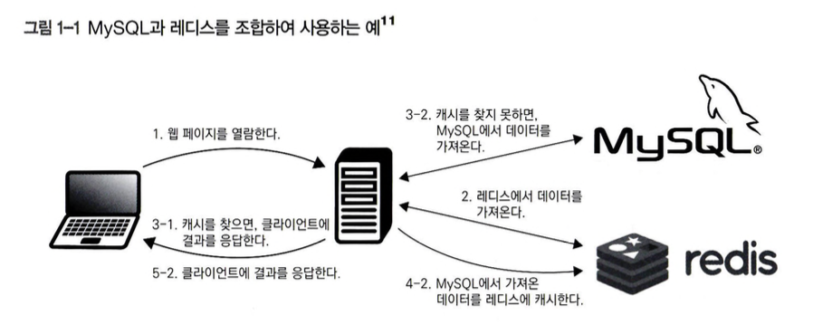
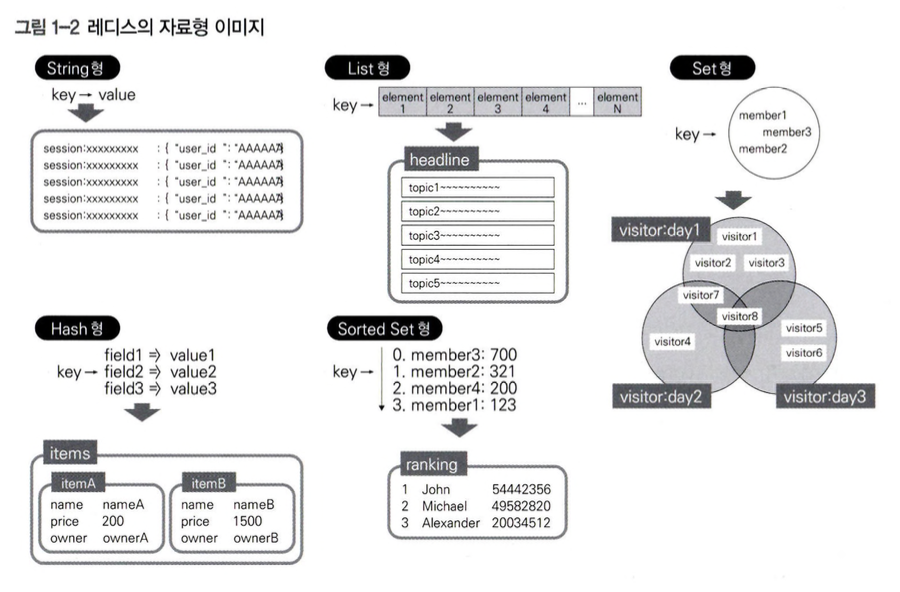

# 01. 레디스의 시작
### 레디스란?
* 인메모리 데이터 구조 저장소(In-Memory Data Structure Store)로써 인메모리에서 빠르게 동작하고, 자료형과 기능이 다양한 비관계형 데이터베이스이다.
* 속도가 빠르고 다양한 자료형과 기능을 이용해 데이터를 표현할 수 있어서 웹 시스템 등에서 널리 사용된다.

## 1.1 레디스를 사용하기까지
* BSD 라이선스의 오픈소스 소프트웨어로 뛰어난 성능, 간단하고 유연한 데이터베이스 기능, 간편한 설정이라는 장점이 존재한다.
* NoSQL을 사용하면 확정성을 유지하면서 문제를 효과적으로 해결할 수 있고, RDBMS에서 해결하기 어려웠던 문제도 해결할 수 있는 경우가 있다.

## 1.2 레디스의 특징
* 디스크 입출력 접근을 피하고 병목 현상도 예방하는 등 처리 속도가 뛰어나다.
* 고속 메모리에서 처리를 수행하며, 메모리 사용량 최소화 기술을 사용한다.
* 가격이 높아 용량을 확보하기 어렵다.
* SQL처럼 표현력이 뛰어난 수단이 없고, 일부 트랜잭션 기능을 지원하지 않는다.
* 주로 RDBMS와 함께 조합해 사용한다.
* 레디스는 RDBMS 뿐만 아니라 아파치 HBase 영속 계층으로 사용, 아파치 스파크와 조합해 대규모 데이터 세트의 실시간 스트림 처리와 같은 빅데이터 처리에 활용한다.

### 1.2.1 레디스의 동작 이미지
* 여러 자료형의 복잡한 값이 키와 연결되어 있다.
* 관계형 데이터베이스와 다르고 일반적인 KVS보다도 값이 복잡할 수 있다.

### 1.2.2 다른 데이터베이스와 다른 부분
* 표현력이 뛰어난 SQL 사용할 수 없다.
* 트랜잭션 처리 기능이 일부 제한된다.
* 인메모리 처리에 최적화되어 빠르게 처리할 수 있는 경우가 많다.
* 다양한 자료형과 기능을 갖추고 있어서 어느정도 복잡한 형식의 데이터도 저장할 수 있다.

### 1.2.3 의존성이 적은 레디스
* 운영체제에서 외부 라이브러리를 따로 설치할 필요가 없도록 구현됬고, 의존성을 줄였다.

### 1.2.4 레디스의 활용
* 웹 애플리케이션 캐시, 배치 처리 메시지 큐, Pub/Sub 시스템 구축 등에서 활용한다.
* RDBMS에서 처리 성능(특히 쓰기 처리)의 병목 현상을 해결할 방법이 필요한 경우, RDBMS의 다양한 자료형과 기능(레디스 클러스터와 영속성 등)이 유스케이스에 부합하는 경우에 유용하게 활용한다.
* RDBMS에서 여러 테이블을 조인한 결과가 여러번 사용되는 경우에는 레디스에 캐싱하면 빠른 속도를 기대할 수 있다.
* 소셜 게임 랭킹에서 Sorted Set형을 활용할 수 있다.

### 1.2.5 속도가 빠르고 기능이 많은 인메모리 데이터 저장소
* 인메모리 동작 기반의 빠른 처리 속도
  * redis-benchmart라는 부하 벤치마크 도구로 측정 가능
* 다향한 자료형과 명령어
  * 자료형도 풍부하지만 하위 멍령어 포함 시 400여 종류에 가깝게 제공한다.
* 데이터 영속성
  * RDB의 스냅숏 생성 기능이 기본적으로 활성화되고, 설정한 시점에 백업을 생성한다.
  * AOF는 기본적으로 비활성화지만 RDB와 조합하여 활성화 시 데이터의 손실 위험을 최소화하고 시작 시간을 단축한다.
* 클라이언트/서버 모델 기반으 요청/응답 통신
  * 클라이언트/서버 모델을 채택하여 요청/응답 방식으로 통신한다.
  * redis-cli 외에도 넷캣이나 텔넷에서도 사용 가능하다.
* 루아를 통한 유연한 처리
* 상글 스레드 기반 요청 이벤트 주도 처리
  * 데이터 접근은 싱글 스레드이지만 옵션을 통해 I/O 부분은 멀티 스레드 처리 활성화 가능하다.

### 1.2.6 RDBMS와 비교
* RDBMS는 범용성이 뛰어나지만 데이터 모델 표현이나 속도 면에서 불만스러울 수 있고 레디스에 맡기는 게 속도나 구현 측면에서 효율적이다.
* 레디스는 RDBMS와 같은 범용성도 없고 강력한 ACID 특성이 없어서 RDBMS를 완전히 대체하기 어렵고 서로 보완하는 관계다.
* 레디스 자료형을 사용해서 랭킹을 단일 명령어로 가져오는 경우나 일관성 문제가 발생해도 배치 처리와 같은 방식으로 대체하는 경우가 있다.

### 1.2.7 멤케시디와 비교
* 멤케시디는 이름 그대로 RDBMS에 대한 쿼리 처리 결과를 저장하는 등 캐시가 주 용도라서 용도가 한정되어 있다.
* 레디스는 단독으로 주요 데이터베이스로도 사용할 수 있게 설계되어 있다.
* 복잡한 데이터 모델이 될 것 같으면 레디스를 단순 캐시 용도라면 레디스와 멤케시디 중에서 적절하게 고려하기를 추천한다.

## 1.3 레디스 서버 설정
* 책 참조

## 1.4 레디스 동작 테스트
* 책 참조

### 1.4.3 원격 연결로 조작하기
* redis-cli -h <endpoint> 옵션으로 엔드포인트를 지정해서 사용한다.
* 보호모드에서 원격 연결을 하기 위해서 두 가지를 수행해야 한다.
  * bind 지시자
  * requirepass 지시자에서 레디스 서버로 인증용 패스워드 설정
* 보호모드 해체 방법
  * 레디스 서버 설정 파일에서 protected-mode no로 지정
  * redis-server 실행 옵션에 --protected-mode no를 추가

## 1.5 레디스 문서와 공식 리소스
* 레디스 자료형
  * https://redis.io/docs/latest/develop/data-types/
* 레디스 활용
  * https://redis.io/docs/latest/
* 레디스를 처음 사용할 때는 The Home of Redis Developers | Redis Developer Hub를 참고하는 것이 도움이 된다.
  * https://redis.io/learn