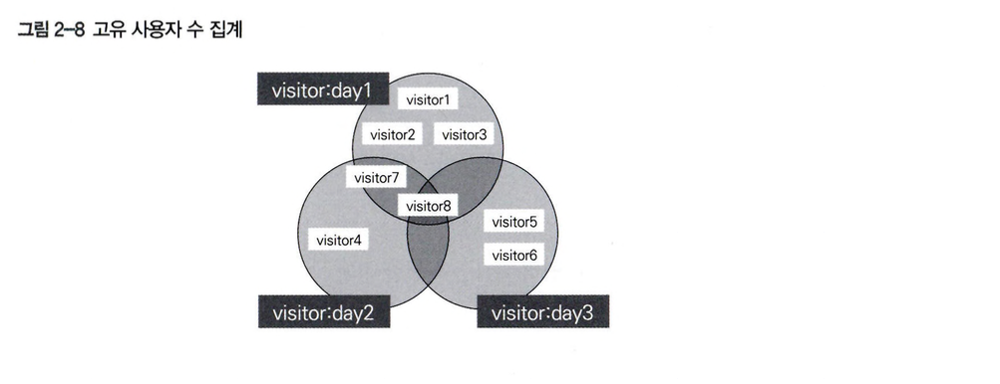
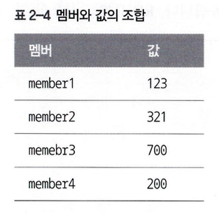
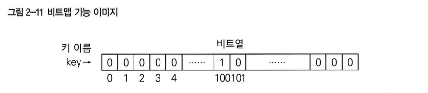
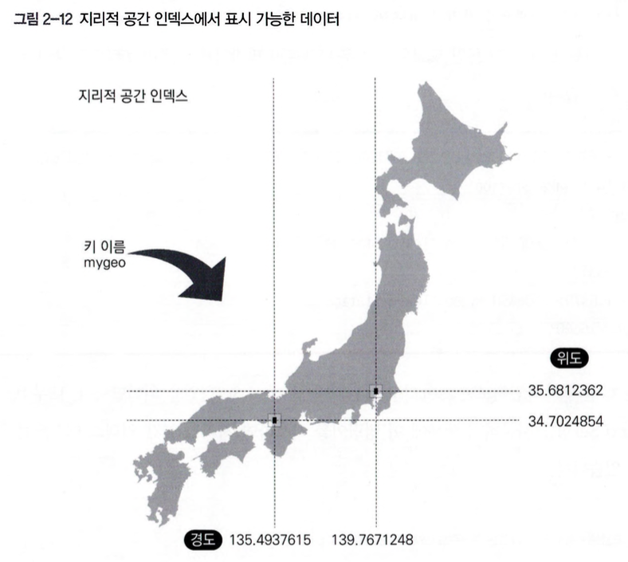
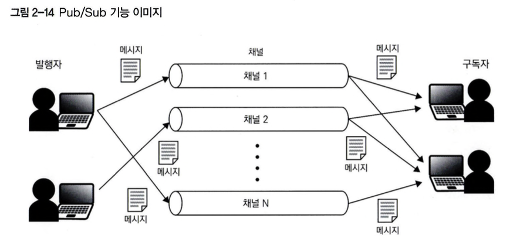
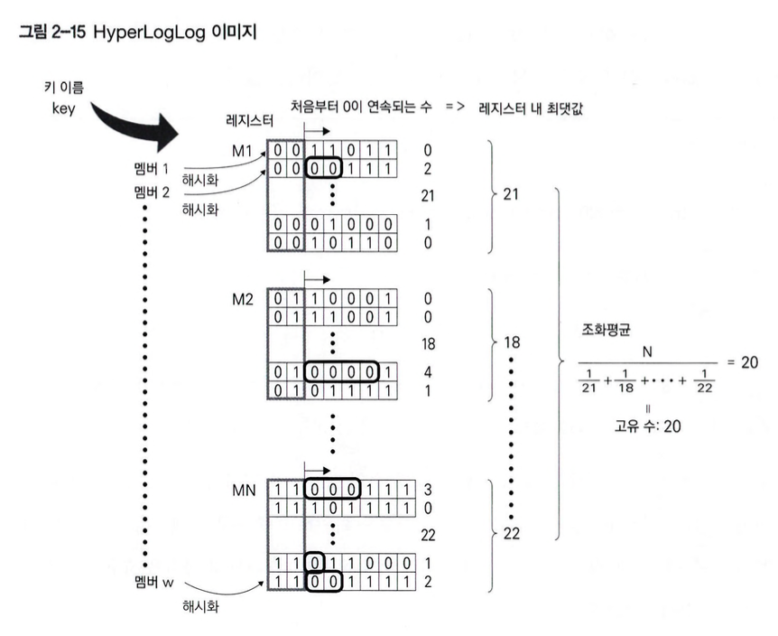
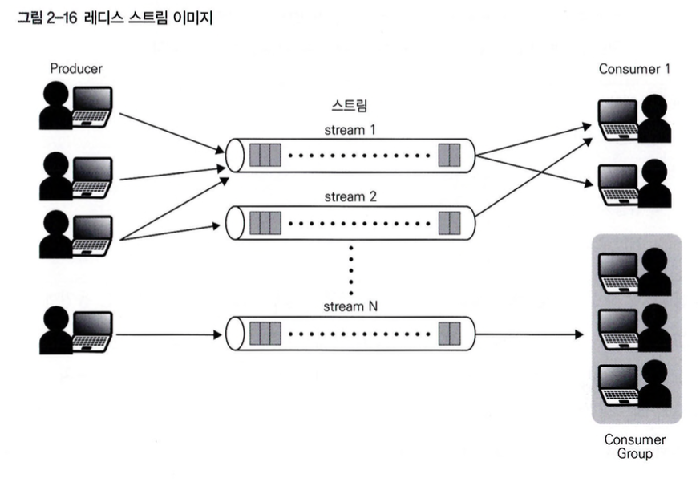
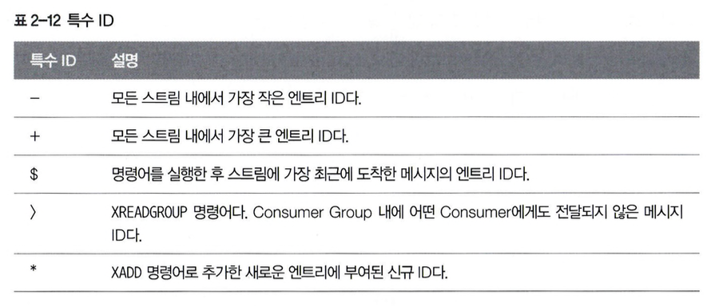

# 02. 자료형과 기능

### 대표적인 다섯 가지 자료형
* String형, List형, Hash형, Set형, Sorted Set형

<table class="table">
    <thead>
        <tr>
            <th>자료형</th>
            <th>설명</th>
            <th>예시</th>
        </tr>
    </thead>
    <tbody>
        <tr>
            <td>String형</td>
            <td>문자열(레디스에서는 숫자값도 포함), 간단한 키와 값의 조합이다.</td>
            <td>세션 정보관리</td>
        </tr>
        <tr>
            <td>List형</td>
            <td>리스트, 문자열 리스트다.</td>
            <td>타임라인</td>
        </tr>
        <tr>
            <td>Hash형</td>
            <td>해시, 프로그래밍 언어에서 연관 배열이나 딕셔너리와 비슷한 개념이다.</td>
            <td>객체 표현</td>
        </tr>
        <tr>
            <td>Set형</td>
            <td>집합, 복수의 값을 순서와 중복 없이 저장한다.</td>
            <td>태그 관리</td>
        </tr>
        <tr>
            <td>Sorted Set형</td>
            <td>정렬된 집합, 순서(랭크)가 있는 집합이다.</td>
            <td>랭킹</td>
        </tr>
    </tbody>
</table>

### 보조 자료형과 기능
* 기본 자료형 내부에서 특정 용도에 사용될 목적으로 만들어진 보조 자료형
    * 비트맵(비트 배열)
        * 비트 단위 연산을 통해 효율적인 메모리 사용과 빠른 비트 조작을 지원하는 데이터 구조
    * 지리적 공간 인덱스
        * 지리적 좌표 데이터를 저장하고 근접 검색을 수행할 수 있는 데이터 구조
* 데이터를 직접 다루는 기능
    * Pub/Sub 기능
        * 메시지를 발행(Publish)하고 구독(Subscribe)하는 방식으로 실시간 메시지 전송을 지원하는 기능
    * HyperLogLog
        * 고유 항목 수를 매우 적은 메모리로 추정할 수 있는 확률적 데이터 구조
    * 레디스 스트림
        * 로그와 같은 시퀀스 데이터를 효율적으로 처리할 수 있는 새로운 데이터 타입

### 레디스의 폭 넓은 데이터 모델 표현성
* 문제에 맞춰 적합한 자료형을 선택하면 데이터를 간단하게 다룰 수 있는 장점이 있다.
* 레디스는 KVS이지만 각 키를 독립적으로 관리하며 키간에는 관련성이 없기 때문에 KVS로 간주되지 않는다.
* 데이터베이스 번호로 식별하는 네임스페이스 같은 데이터를 관리할 수 있지만 기본적으로 전역에서 키와 값 쌍으로 관리한다.
* 키 어노테이션이라는 기능을 통해 키 간 관계성도 레디스에서 다룰 수 있고, 이 기능을 사용해 키 작업의 트리거 용도로 사용할 수 있다.
* 키 간 독립성을 원칙으로 하여, 가능하면 이 원칙에 맞춰 데이터를 저장하는 것이 좋다.
* 하나의 키에 연관된 값들을 범위 내에서 서로 연관성을 가진 단위로 관리할 수 있다.

### 레디스 자료형과 명령어
* String에서는 SET으로 저장하고, GET으로 데이터를 가져온다.
* Hash에서는 HSET으로 저장하고, GET으로 가져온다.
* 여러 키를 조작하기 위해서는 MSET, MGET 명령어를 사용할 수 있고 원자적으로 처리한다.

### 레디스 유틸리티 명령어
* KEYS
    * 키 목록을 확인하고 싶을 떄 사용된다.
        * > KEYS pattern
        * > KEYS *
    * 편리하지만 실행 시간이 오래걸리기 때문에 운용 중인 애플리케이션에서 지양하고 구현 중 동작을 확인하거나 분석할 때 사용하는 것이 좋다.
    * 운영환경에서는 SCAN 계열 명령어 사용을 추천한다.
* EXISTS
    * 키 존재 여부를 확인할 때 사용된다.
        * > EXISTS X
        * > EXISTS X Y
    * 키가 존재하면 1, 아니면 0, 키가 여러 개 있는 경우 매칭된 수를 반환한다.
* TYPE
    * 자료형과 기능을 확인할 수 있다.
        * > TYPE mykey
* DEL
    * 키의 삭제는 모든 자료형에서 공통적으로 DEL을 사용한다.
        * > DEL L
    * 반환 값은 삭제한 키의 개수이다.

## String 형
* 문자열, 이진 데이터 등을 위한 자료형이다.
* 이진 안전 문자열이기에 이미지나 실팽파일 등의 데이터도 저장할 수 있다.
* 숫자값(정수, 부동소수점)도 String 형에 저장한다.
* Bigmap형이라는 비트 단위로 조작할 수 있는 보조 자료형이 존재한다.
* 유스케이스
    * 캐시
        * 키와 값의 쌍으로 대응되는 문자열, 세션 정보, 이미지 데이터 등 이진 데이터
    * 카운터
        * 방문자 수 등 접근 수 카운트
    * 실시간 메트릭스
        * 각 항목의 수치를 파악할 수 있는 지표

#### 레디스의 String 형은 지금도 512MB가 최대인가?
* 512MB 제한은 키와 값 양쪽에 적용되며 SDS 버전의 제한 때문이다.
* 레디스 4.0.7에서 proto-max-bulk-len 지시자로 최대 제한을 해제할 수 있다.

### String 형 활용, 빠른 세션 캐시
* 세션 캐시(쿠키 등), 표시할 웹 페이지, 장바구니 내용 등 일시적인 정보를 저장하는데 사용된다.
  

### String 형 주요 명령어
* GET/SET을 여러번 실행하면 RTT가 발생하여 시간 오버헤드가 발생하기 때문에 MGET/MSET을 RTT를 줄여 효율적으로 사용 가능하다.
* 숫자값 String 형 명령어 사용 시 10진수 부호 정수로 해석하지 않으면 오류가 반환된다.
<table class="table">
    <thead>
        <tr>
            <th>명령어</th>
            <th>설명</th>
            <th>예시</th>
        </tr>
    </thead>
    <tbody>
        <tr>
            <td>GET</td>
            <td>키값 가져오기, 존재하지 않는 경우 nil 반환, 시간 복잡도 O(1)</td>
            <td>GET key</td>
        </tr>
        <tr>
            <td>SET key value</td>
            <td>키와 값의 쌍을 지정하여 키에 값을 설정, EX 같은 시간을 지정하는 옵션을 통해 TTL 설정, 시간 복잡도 O(1)</td>
            <td>SET key value [ NX | XX] [GET] [ EX seconds | PX milliseconds | EXAT unix-time- seconds | PXAT unix-time-milliseconds | KEEPTTL]</td>
        </tr>
        <tr>
            <td>MGET</td>
            <td>여러 개의 키 값 가져오기, 시간 복잡도 O(N)</td>
            <td>MGET key [key ...]</td>
        </tr>
        <tr>
            <td>MSET</td>
            <td>여러 개의 키를 지정하여 한번에 값 저장, 키가 존재하는 경우 덮어쓰기, 시간 복잡도 O(N)</td>
            <td>MSET key vale [key value...]</td>
        </tr>
        <tr>
            <td>APPEND</td>
            <td>키에 값 덮어쓰기, 키가 존재하는 경우 키값 끝에 인수 내용을 추가하고, 키가 존재하지 않으면 새로운 키를 만든다, 시간 복잡도 O(1)</td>
            <td>APPEND key value</td>
        </tr>
        <tr>
            <td>STRLEN</td>
            <td>기의 길이 가져오기</td>
            <td>STRLEN key</td>
        </tr>
        <tr>
            <td>GETRANGE</td>
            <td>범위를 지정하여 키값 가져오기, 첫 번째 문자는 0부터 시작, 시간 복잡도 O(N)</td>
            <td>GETRANGE key start end</td>
        </tr>
        <tr>
            <td colspan="3">숫자인 경우에만 사용가능한 명령어</td>
        </tr>
        <tr>
            <td>INCR</td>
            <td>값을 1만큼 증가시키기, 값이 없으면 동작 전 0으로 지정, 시간 복잡도 O(1)</td>
            <td>INCR key</td>
        </tr>
        <tr>
            <td>INCRBY</td>
            <td>값을 지정한 정수만큼 증가시키기, 값이 없으면 동작 전 0으로 지정, 시간 복잡도 O(1)</td>
            <td>INCRBY key increment</td>
        </tr>
        <tr>
            <td>INCRBYFLOAT</td>
            <td>값을 지정한 부동소수점만큼 증가시키기, 값이 없으면 동작 전 0으로 지정, 시간 복잡도 O(1)</td>
            <td>INCRBYFLOAT key increment</td>
        </tr>
        <tr>
            <td>DECR</td>
            <td>값을 1만큼 감소시키기, 값이 없으면 동작 전 0으로 지정, 시간 복잡도 O(1)</td>
            <td>DECR key decrement</td>
        </tr>
        <tr>
            <td>DECRBY</td>
            <td>값을 지정한 정수만큼 감소시키기, 값이 없으면 동작 전 0으로 지정, 시간 복잡도 O(1)</td>
            <td>DECRBY key decrement</td>
        </tr>
        <tr>
            <td></td>
            <td></td>
            <td></td>
        </tr>
        <tr>
            <td></td>
            <td></td>
            <td></td>
        </tr>
    </tbody>
</table>

* 그외 명령어
  * GETTEX - TTL을 설정한 키 값 가져오기
    * 유효기간 설정도 가능 
    * > GETEX key [ EX seconds | PX milliseconds | EXAT unix-time- seconds | PXAT unix-1ime-mi11iseconds | PERSIST]
  * GETDEL - 키 값을 가져온 후 그 키를 삭제하기
    * 레디스 6.2.0 이상 
    * > GETDEL key
  * MSETNX - 여러 개의 키가 존재하지 않는 것을 확인하고 값을 저장하기
    * 인수에 있는 키 중에 하나라도 이미 존재하면 모든 저장에 실패 
    * > MSETNX key value [key value ...]

### [SET 명령어와 옵션](https://redis.io/docs/latest/commands/set/)
* EX/PX 옵션
  * TTL 설정으로 EX는 초 단위, PX 밀리 초 단위 지정
* NX/XX 옵션
  * 키의 존재 여부에 따라 조건을 충족할 때만 저장
  * NX는 키가 존재하지 않는 경우, XX는 키가 존재하는 경우에만 지정
* KEEPTTL 옵션
  * 키 관련 TTL을 변경하지 않고 조작 (레디스 6.0 이상)
* EXAT/PXAT 옵션
  * 유닉스 시간을 사용하여 유효 시간 설정
  * EXAT는 초단위, PXAT는 밀리 초 단위 (레디스 6.2 이상)
* GET 옵션
  * 키를 지정하여 값을 가져온 후 계속해서 설정을 수행 (레디스 6.2 이상)

## LIST 형
* 문자열의 리스트
* 여러 값을 순서대로 저장해 삽입한 순서를 유지하는 자료형
* 스택이나 큐로 사용
* 좌우 끝부분에 요소를 추가 및 삭제하거나 부분적으로 요소를 가져오는 동작이 가능
* 중간 부분으로 접근하는 경우 느리고, 데이터가 큰 경우 느려지기 때문에 작은 단위로 관리하거나 다른 자료형이 더 좋은 지 검토가 필요

#### 특징과 유스케이스
* 특징
  * 문자열 컬렉션, 삽입 순서를 유지
* 유스케이스
  * 스택, 큐, SNS 최신 게시물, 로그

### LIST 형 주요 명령어
#### LPOP - 리스트 왼쪽부터 값을 가져오고 삭제하기
* count 옵션으로 지정한 수만큼의 요소 개수를 삭제하고 값을 반환
* 시간복잡도 O(N)

> LPOP key [count]

#### LPUSH - 리스트 왼쪽부터 값을 삽입하기
* 키로 지정한 리스트의 앞부분에 지정한 값을 모두 삽입
* 시간 복잡도 O(N)

> LPUSH key element [element ...]

#### RPOP - 리스트의 오른쪽부터 값을 가져오고 삭제하기
* 키로 지정한 리스트의 끝부분 요소를 삭제하고 값을 반환
* count 옵션으로 지정한 수만큼의 요소 개수를 삭제하고 값을 반환
* 시간 복잡도 O(N)

> RPOP key [count]

#### RPUSH - 리스트 오른쪽부터 값을 삽입하기
* 키로 지정한 리스트의 끝부분에 지정한 값을 모두 삽입
* 시간 복잡도 O(N)

> RPUSH key element [element ...]

#### LMPOP - 리스트 왼쪽 혹은 오른쪽부터 여러개의 값을 가져오고 삭제하기
* 키로 지정한 리스트의 처음 혹은 마지막부터 여러 요소를 삭제하고 값을 반환
* numkeys로 대상 리스트의 키 개수를 지정
* count 옵션으로 지정한 수만큼의 요소 개수를 삭제하고 값을 반환
* 시간 복잡도 O(N + M), M은 반환된 요소의 개수

> LMPOP numkeys key [key ...] <LEFT | RIGHT> [COUNT count]

#### BLMPOP - 블록 기능을 갖춘 LMPOP
* 키로 지정한 리스트의 처음 혹은 마지막부터 여러 요소를 삭제하고 값을 반환
* count 옵션으로 지정한 수만큼의 요소 개수를 삭제하고 값을 반환
* 리스트에 요소가 없으면 처리를 블록, 순서 집합에 요소가 추가될 때까지 처리를 대기
* 최대 대기 사간은 timeout에서 지정한 값
* 시간 복잡도 O(N + M), M은 반환된 요소의 개수

> BLMPOP timeout numkeys key [key ...] <LEFT | RIGHT> [COUNT count]

#### LINDEX - 리스트에서 지정한 인덱스에 값을 조회하기
* 키로 지정한 리스트에 지정한 인덱스 위치에 있는 요소를 반환
* 시간 복잡도 O(N)

> LINDEX key index

#### LINSERT - 리스트에서 지정한 인덱스에 값을 삽입하기
* 키로 지정한 리스트에 지정한 요소의 바로 앞 혹은 뒤에 같은 요소를 삽입
* 요소를 찾을 수 없는 경우 -1 반환되며 동작이 미수행
* 시간 복잡도 O(N)

> LINSERT key BEFORE|AFTER privot element

#### LLEN - 리스트의 길이 가져오기
* 키로 지정한 리스트의 길이를 반환
* 시간 복잡도 O(1)

> LLEN key

#### LRANGE - 리스트에서 지정한 범위의 인덱스에 있는 값 가져오기
* 키로 지정한 리스트의 인덱스 범위를 지정하여 데이터를 반환
* 특정 인덱스에서 끝부분의 요소를 가져오고 싶은 경우에는 음의 정수를 지정
* 시간 복잡도는 O(S + N)

> LRANGE key start stop

#### LREM - 리스트에서 지정한 요소를 지정한 수만큼 삭제하기
* 키로 지정한 리스트에서 지정한 특정 요소를 지정한 수만큼 삭제
* 음수라면 끝부분에서 시작부분으로 이동하면서 특정 요소와 동일한 요소를 삭제
* 시간 복잡도는 O(N + M)

> LERM key count element

#### LSET - 리스트에서 지정한 인덱스에 있는 값을 지정한 값으로 저장하기
* 키로 지정한 리스트에서 지정한 인덱스에 있는 값을 갱신
* 시간 복잡도는 O(N)

> LSET key index element

#### LTRIM - 지정한 범위 인덱스에 포함된 요소로 리스트 갱신하기
* 키로 지정한 리스트를 특정 인덱스 범위에 포함된 요소로만 이뤄진 리스트로 갱신
* 시간 복잡도는 O(1)

> LTRIM key start stop

#### LPOS - 리스트 중 지정한 인덱스에 있는 값 가져오기
* 키로 지정한 리스트에서 탐색 대상 요소의 인덱스를 반환
* RANK 옵션으로 몇 번째에 일치하는 요소 반환 지정
* COUNT 옵션으로 몇 개의 인덱스를 반환 지정
* MAXLEN 옵션으로 탐색하는 요소의 개수 반환 지정
* 시간 복잡도 O(N)

#### 그 외 명령어
* LPUSHX - 리스트가 있는 경우에만 왼쪽부터 값을 삽입하기
* LMOVE - 리스트 간 요소로 이동하기
* RPUSHX - 리스트가 있는 경우에만 오른쪽부터 값을 삽입하기
* BLPOP - 블록 기능을 갖춘 LPOP
* BRPOP - 블록 기능을 갖춘 RPOP
* 블록 기능이 있는 명령어의 장점
  * 프로세스 간 통신 같은 애플리케이션에서 폴링과 같은 기능을 구현하지 않아도 블록 기능이 가능한 명령어를 사용하면 간단히 구현할 수 있다.
  * 현재 `주문/결제 쪽에서 폴링을 사용 중인데 해당 기능을 이용`할 수 있지 않을까?

## Hash 형
* 순서 없이 필드와 값이 여러 쌍으로 매핑된 자료구조
* 연관 배열이나 딕셔너리 같은 자료구조로 하나의 키에 키와 값의 쌍으로 구성된 여러 요소를 연결
* 하나의 해시에 저장할 수 있는 필드 수는 2³²-1개 (약 43억 개)
* 하나의 키에 여러 속성을 가지면 사용자 정보와 같은 표현은 애플리케이션에서 쉽게 구현할 수 있지만 키에 값을 계속 추가하면 볼륨이 거대해져서 처리 시간에 문제가 생길 수 있다.
* 해시 내 각 필드에 개별 TTL을 설정할 수 없기 떄문에 String 형 사용을 검토해야 한다.

#### 특징과 유스케이스
* 특징
  * 필드와 값의 쌍 집합
  * 필드와 연결된 값으로 구성된 맵, 필드와 값이 모두 문자열
* 유스케이스
  * 객체 표현(사용자 정보, 상품 정보)

### [Hash 형 주요 명령어](https://redis.io/docs/latest/commands/?group=hash)
* Hash 형은 String 형과 마찬가지로 필드값이 숫자인 경우에 사용할 수 있는 명령와 값 내용에 상관없이 사용할 수 있는 명령어가 존재

### 모든 타입에 사용할 수 있는 명령어
#### HDEL - 해시에서 지정한 필드 삭제하기
* 키로 지정한 해시에서 지정한 필드를 삭제
* 시간 복잡도 O(N)

> HDEL key field [field ...]

#### HEXISTS - 해시에 지정한 필드가 존재하는지 확인하기
* 키로 지정한 해시에서 지정한 필드가 존재 시 1, 미존재 시 0을 반환
* 시간 복잡도 O(1)

> HEXISTS key field

#### HGET - 해시에 지정한 필드 값 가져오기
* 키로 지정한 해시에서 지정한 필드에 저장된 값을 반환
* 시간 복잡도 O(1)

> HGET key field

#### HGETALL - 해시에서 모든 필드 및 저장된 값 쌍 가져오기
* 키로 지정한 해시에 포함된 모든 필드와 값 쌍을 반환
* 시간 복잡도 O(N)

> HGETALL key

#### HKEYS - 해시에서 모든 필드 가져오기
* 키로 지정한 해시에 포함된 모든 필드 목록을 반환
* 시간 복잡도 O(N)

> HKEYS key

#### HLEN - 해시에 포함된 필드 수 가져오기
* 키로 지정한 해시에 포함된 필드 수를 반환
* 시간 복잡도는 O(1)

> HLEN key

#### HMSET - 해시에서 여러 필드와 값의 쌍 저장하기
* 키로 지정한 해시에 여러 필드와 값의 쌍을 지정하여 필드에 값을 한번에 저장
* 필드가 이미 존재하면 덮어쓰기
* 시간 복잡도 O(N)

> HMSET key field value [field value ...]

#### HSET - 해시에 지정한 필드값 저장하기
* 키로 지정한 해시에 필드와 값의 쌍을 지정하여 필드에 값을 저장
* 필드가 이미 존재하면 덮어쓰기
* 레디스 4.0.0 이후에는 여러 필득와 값의 쌍을 한번에 지정
* 시간 복잡도 O(N)

> HSET key field value [field value ...]

#### HVALS - 해시의 모든 필드값 가져오기
* 키로 지정한 해시의 필드에 연결된 모든 값을 반환
* 시간 복잡도 O(N)

> HVALS key

#### HSCAN - 반복 처리하여 해시의 필드와 그에 연결된 값의 쌍 목록을 가져오기
* 키로 지정한 해시의 필드 집합을 반복 처리하여 필드 이름과 저장된 값의 쌍 목록을 반환
* 시간 복잡도 O(1)

> HSCAN key cursor [MATCH pattern] [COUNT count]

### 숫자형에 사용가능한 명령어
#### HINCRBY - 해시에 지정한 필드값을 지정한 정수만큼 증가
* 키에 지정한 해시 필드에 저장된 값을 지정한 값만큼 증가
* 키가 존재하지 않으면 동작 전 0을 저장
* 시간 복잡도 O(1)

> HINCRBY key field increment

#### HINCRBYFLOAT - 해시에 지정한 필드값을 지정한 부동소수점 수만큼 증가시키기
* 키에 지정한 해시 필드에 연결된 부동소수점 수로 표현되는 키값을 지정한 값만큼 증가
* 키가 존재하지 않으면 동작 전 0을 저장
* 시간 복잡도 O(1)

> HINCRBYFLOAT key field increment

#### 그 외 명령어
* HSETNX - 해시에 필드가 존재하지 않는 것을 확인한 후 값 저장하기
* HSTRLEN - 해시에 지정한 필드값 문자열의 길이 가져오기
* HRANDFIELD - 해시에 포함된 필드 이름 무작위로 가져오기

### 성능을 발휘하기 위한 주의사항
* 해시가 필드 수 증가 등으로 커지면 HDEL 명령어를 실행 시 수행 시간이 길어져 다른 명령어가 블록될 가능성이 존재한다.
* 시간 복잡도가 O(N)인 HKEYS, HVALS를 시간 복잡도 O(1)인 HSCAN 명령어로 대체하여 해결 가능하다.
* HDEL 명령어를 꼭 사용해야할 경우 사전에 벤치마크를 수행하고 해시를 더 작은 단위로 분할하여 관리할 수 없는지, String 형으로 관리해야 하는지 등을 고려해서 스키마를 설계한다.

## Set 형
* 문자열의 집합
* 집합의 키는 여러 값을 순서와 중복 없이 저장
* 같은 값을 여러번 저장해도 하나의 값으로 저장
* 데이터 세트의 크기에 비례하여 소비하는 메모리양도 증가
* 다소 오차를 허용해도 괜찮다면 메모리를 절약할 수 있는 HyperLogLog 기능을 활용 가능
* ZRANGE, REV, BYLEX, BYSCORE 이런 명령어들은 대량의 데이터를 가져오는 경우 실행시간이 오래 걸릴 수 있고, 작업입 블록될 수 있어서 주의해야 한다.

#### 특징과 유스케이스
* 특징
  * 순서 없이 고유한 문자열 집합
  * 요소 포함 여부 확인, 집합 간 합집합, 차집합 등 작업을 통해 공통 요소 또는 차이점 추출 가능
* 유스케이스
  * 멤버십, 태그 관리

### [Set 형 주요 명령어](https://redis.io/docs/latest/commands/?group=set)
#### SADD - 집합에 하나 이상의 멤버 추가하기
* 키로 지정한 집합에 지정한 하나 이상의 멤버를 추가
* 시간 복잡도 O(1)

> SADD key member [member ...]

#### SCARD - 집합에 포함된 멤버의 수 가져오기
* 키로 지정한 집합에 저장된 멤버의 수를 반환
* 시간 복잡도 O(1)

> SCARD key

#### SISMEMBER - 집합에 지정한 멤버가 포함되었는지 판단하기
* 키로 지정한 집합에 지정한 멤버가 집합에 포함되어 있는지 여부를 반환
* 시간 복잡도 O(1)

> SISMEMBER key member

#### SMEMBERS - 집합에 포함된 모든 멤버 가져오기
* 키로 지정한 집합의 모든 멤버를 반환
* 시간 복잡도 O(N)

> SMEMBERS key

#### SPOP - 집합에 포함된 멤버를 무작위로 가져오기
* 키로 지정한 집합의 멤버를 무작위로 반환
* count 옵션을 지정한 경우 최대로 지정한 요소 개수만큼 값을 반환하고 반환한 데이터는 삭제
* 시간 복잡도 O(1)

> SPOP key [count]

#### SREM - 집합에서 하나 이상 멤버를 삭제하기
* 키로 지정한 집합에 지정한 하나 이상의 멤버를 삭제
* 시간 복잡도 O(1)

> SREM key member [member ...]

#### SSCAN - 반복 처리하여 멤버 목록 가져오기
* 키로 지정한 집합에 각 멤버를 반복 처리하여 멤버 목록을 반환
* 시간 복잡도 O(1)

> SSCAN key member [member ...] 

### Set 형의 집합 연산 명령어
#### SDIFF - 집합 간 차집합 가져오기
* 키로 지정한 하나 이상의 집합들의 차집합을 반환
* 시간 복잡도 O(N)

> SDIFF key [key ...]

#### SDIFFSTORE - 집합 간 차집합을 가져오고 저장하기
* 키로 지정한 하나 이상의 집합에 대해 차집합을 지정한 키에 저장
* 시간 복잡도 O(N)

> SDIFFSTORE destination key [key ...]

#### SINTER - 집합 간 교집합 가져오기
* 키로 지정한 하나 이상의 집합들의 교집합을 반환
* 시간 복잡도는 O(N * M), N은 가장 작은 요소 개수, M은 집합의 개수

> SINTER key [key ...]

#### SINTERSTORE - 집합 간 교집합을 가져오고 저장하기
* 키로 지정한 하나 이상의 집합들의 교집합을 지정한 키에 저장
* 시간 복잡도는 O(N * M), N은 가장 작은 요소 개수, M은 집합의 개수

#### SINTERCARD - 집합 간 교집합에 포함된 멤버 수 가져오기
* 키로 지정한 하나 이상의 집합들의 교집합의 멤버 수를 반환
* 시간 복잡도는 O(N * M), N은 가장 작은 요소 개수, M은 집합의 개수

#### SUNION - 집합 간 합집합 가져오기
* 키로 지정한 하나 이상의 집합들의 합집합을 반환
* 시간 복잡도는 O(N)

#### SUNIONSTORE - 집합 간 합집합을 가져오고 저장하기
* 키로 지정한 하나 이상의 집합에 대해 합집합을 지정한 키에 저장
* 시간 복잡도는 O(N)

#### 그 외 명령어
* SMISMEMBER - 집합에 지정한 여러 멤버가 포함되어 있는지 판단하기
* SMOVE - 집합 간 멤버 이동하기
* SRANDMEMBER - 집합에 포함된 멤버를 무작위로 가져오기

## Sorted Set 형
* 순서가 있는 Set 형
* 실시간 랭킹에 활용하는 경우가 많고 레디스의 특징이라고 할 수 있는 자료형
* 각 키마다 점수를 가진 멤버로 구성된 하나의 집합이 매핑되고 각 집합은 멤버의 중복을 포함하지 않기 때문에 고유한 값이 된다.
* Hash 형과 Set형을 섞어 놓은 순서 집합이기 때문에 더 넓은 범위의 데이터 모델을 구현한다.

#### 특징과 유스케이스
* 특징
  * 순서가 있는 고유한 문자열 집합
  *  모든 요소에는 점수라는 부동소수점을 가지며 요소는 항상 점수를 통해 정렬되며 Set형과는 다른 특정 범위의 요소를 추출할 수 있다.
* 유스케이스
  * 랭킹, 활동 피드

### [Sorted Set 형의 주요 명령어](https://redis.io/docs/latest/commands/?group=sorted%E2%80%94set)

#### ZADD - 순서 집합에 하나 이상의 점수와 멤버 쌍 추가하기
* 키로 지정한 순서 집합에 지정한 점수와 멤버 쌍을 추가
* 시간 복잡도 O(logN)
* GT 옵션은 등록되어 있는 점수보다 지정한 점수 쪽이 큰 경우 값 갱신
* LT 옵션은 등록되어 있는 점수보다 지정한 점수 쪽이 작은 경우 값 갱신

> ZADD key [ NX | XX] [ GT | LT] [CH] [INCR] score member [ score member ...]

#### ZCARD - 순서 집합에 포함된 멤버 수 가져오기
* 키로 지정한 순서 집합에 대해 저장되어 있는 멤버 수를 반환
* 시간 복잡도는 O(1)

> ZCARD key

#### ZRANK - 순서 집합에 지정한 멤버의 점수 순위를 오름차순으로 가져오기
* 키로 지정한 순서 집합에 지정한 멤버의 오름차순으로 순위를 추출
* 시간 복잡도 O(logN)

> ZRANK key member

#### ZREVRANK - 순서 집합에 지정한 멤버의 점수 순위를 높은 순서대로 가져오기
* 키로 지정한 순서 집합에 지정한 멤버의 높은 순서대로 순위를 추출
* 시간 복잡도 O(logN)

> ZREVRANK key member

#### ZRANGE - 순서 집합에 지정한 멤버의 점수 범위에 있는 멤버 목록을 오름차순으로 가져오기
* 키로 지정한 순서 집합에 지정한 점수 범위에 있는 멤버 목록을 오름차순으로 추출
* 최소값, 최대값과 함께 지정한 값도 포함하는 형태
* 시간 복잡도 O(logN + M), M은 추출된 요소의 개수

> ZRANGE key min max [ BYSCORE | BYLEX] [REV] [LIMIT offset count] [WITHSCORES]

#### ZRANGESTORE - 순서 집합에 지정한 멤버의 점수 범위에 있는 멤버 목록을 오름차순으로 가져오고 저장하기
* 키로 지정한 순서 집합에 지정한 점수 범위에 있는 멤버 목록을 지정한 키에 저장
* 시간 복잡도 O(logN + M), M은 추출된 요소의 개수

> ZRANGESTORE dst sic min max [ BYSCORE ! BYLEX] [REV] [LIMIT offset count]

#### ZREM - 순서 집합에 지정한 멤버 삭제하기
* 키로 지정한 순서 집합에서 지정한 멤버를 삭제
* 시간 복잡도 O(M * logN), M은 추출된 요소의 개수

> ZREM key member [member ...]

#### ZCOUNT - 순서 집합에서 지정한 점수 범위에 있는 멤버의 수 가져오기
* 키로 지정한 순서 집합에 지정한 점수 범위에 있는 멤버의 수를 반환
* 시간 복잡도 O(logN)

> ZCOUNT key min max

#### ZPOPMAX - 순서 집합에서 점수가 최대인 멤버를 삭제하고 가져오기
* 키로 지정한 순서 집합에서 최대 점수를 가진 멤버를 하나 삭제하고 그 멤버와 저장된 점수 쌍을 반환
* count 옵션을 지정한 경우에는 그 수만큼 반환
* 시간 복잡도 O(M * logN), M은 추출된 요소의 개수

> ZPOPMAX key [count]

#### ZPOPMIN - 순서 집합에서 점수가 최소인 멤버 삭제하고 가져오기
* 키로 지정한 순서 집합에서 점수가 최소인 멤버를 하나 삭제하고 그 멤버와 저장된 점수 쌍을 반환
* count 옵션을 지정한 경우에는 그 수만큼 반환
* 시간 복잡도 O(M * logN), M은 추출된 요소의 개수

> ZPOPMIN key [count]

#### ZSCORE - 순서 집합에서 지정한 멤버 점수 가져오기
* 키로 지정한 순서 집합에서 지정한 멤버 점수를 반환
* 시간 복잡도 O(1)

> ZSCORE key member

#### ZMSCORE - 순서 집합에서 여러 멤버 점수 가져오기
* 키로 지정한 순서 집합에서 지정한 하나 이상의 멤버 점수를 반환
* 시간 복잡도 O(N)

> ZMSCORE key member [member ...]

####  ZSCAN - 순서 집합에서 반복 처리하여 멤버 목록 가져오기
* 키로 지정한 순서 집합에서 각 멤버를 반복 처리하여 멤버 목록을 반환
* 시간 복잡도 O(N)

> ZSCAN key cursor [MATCH pattern] [COUNT count]

#### ZMPOP - 순서 집합에서 점수가 최대 혹은 최소인 여러 멤버를 삭제하고 가져오기
* 키로 지정한 순서 집합에서 점수가 최대 혹은 최소인 여러 멤버를 삭제하고 그 멤버와 점수 쌍을 반환 (레디스 7.0.0 이상)
* count 옵션을 지정한 경우에는 그 수만큼 반환
* 시간 복잡도 O(K) + O(N * logM), K는 지정한 순서 집합의 수, M은 추출된 요소의 개수

#### BZMPOP - 블록 기능을 갖춘 ZMPOP
* 키로 지정한 순서 집합에서 점수가 최대 혹은 최소의 여러 멤버를 삭제하고 그 멤버와 점수 쌍을 반환 (레디스 7.0.0 이상)
* count 옵션을 지정한 경우에는 그 수만큼 반환
* 순서 집합에 요소가 없는 경우에는 처리를 블록하고 순서 집합에 요소가 추가될 때까지 처리를 대기
* 시간 복잡도 O(K) + O(N * logM), K는 지정한 순서 집합의 수, M은 추출된 
* 요소의 개수

> BZMPOP timeout numkeys key [key ...] <MIN | MAX> [COUNT count]

### Sorted Set형에서 사용 가능한 집합 연산 명령어
#### ZINTER - 순서 집합 간 교집합 가져오기
* 키로 지정한 하나 이상의 순서 집합에서 순서가 있는 교집합을 반환
* 시간 복잡도 O(L + (N - K) * logN)

> ZINTER numkeys key [key ...] [WITHSCORES]

#### ZINTERSTORE - 순서 집합 간 교집합을 가져오고 저장하기
* 키로 지정한 하나 이상의 순서 집합에서 교집합을 지정한 키에 저장
* 시간 복잡도 O(N * K + M * logM)

> ZINTERSTORE destination numkeys key [key ...] [WEIGHTS weight [weight ...]] [AGGREGATE SUM | MIN | MAX]

#### ZINTERCARD - 순서 집합 간 교집합에 포함된 멤버 수 가져오기
* 키로 지정한 하나 이상의 순서 집합에서 순서가 있는 교집합의 멤버 수를 반환
* 시간복잡도 O(N * K), N은 가장 작은 순서 집합의 요소의 개수, K는 순서 집합의 수

> ZINTERCARD numkeys key [key ...] [LIMIT limit]

#### ZDIFF -  순서 집합 간 차집합 가져오기
* 키로 지정한 하나 이상의 순서 집합의 차집합을 반환
* 시간 복잡도 O(L + (N - K) * logN), L은 모든 순서 집합 내 모든 요소의 개수, N은 첫 순서 집합의 요소의 개수, K는 결과의 순서 집합 요소의 개수

> ZDIFF numkeys key [key ...] [WITHSCORES]

#### ZDIFFSTORE - 순서 집합 간 차집합을 가져오고 저장하기
* 키로 지정한 하나 이상의 순서 집합의 차집합을 반환
* 시간 복잡도 O(L + (N - K) * logN), L은 모든 순서 집합 내 모든 요소의 개수, N은 첫 순서 집합의 요소의 개수, K는 결과의 순서 집합 요소의 개수

> ZDIFFSTORE destination numkeys key [key ...]

#### ZUNION - 순서 집합 간 합집합 가져오기
* 키로 지정한 하나 이상의 순서 집합의 교•집합을 반환
* 시간 복잡도 O(N) + O(M * log(M))

> ZUNION numkeys key [key ...] [WEIGHTS weight [weight ...]] [AGGREGATE SUM | MIN | MAX] [WITHSCORES]

#### ZUNIONSTORE - 순서 집합 간 합집합을 가져오고 저장하기
* 키로 저장한 하나 이상의 순서 집합의 합집합을 지정한 키에 저장
* 시간 복잡도 O(N) + O(M * log(M))

> ZUNIONSTORE destination numkeys key [key ...] [WEIGHTS weight [weight ...]] [AGGREGATE SUM | MIN | MAX]

## 대표 기능과 관련 명령어
* 레디스는 주로 대표적인 다섯 가지 자료형을 사용하지만 특정 용도에 특화된 보조 자료형이 존재하며 다섯 가지 자료형 내부에서 모두 사용할 수 있다.
* 그 외에도 데이터를 다루는 기능이 있으며 데이터를 어떻게 표현할지보다 데 이터를 어떻게 활용하는지에 초점을 맞춘 기능이다.

### [비트맵(비트 배열)](https://redis.io/docs/latest/develop/data-types/bitmaps/)
* 처리하고 있는 데이터 모델을 비트의 존재 여부나 그 위치에 따라 표현해 메모리를 절약할 수 있다.
* 각 비트의 위치를 사용자 ID와 연결 후 위치가 1또는 0인지 값을 확인해 특정 기능의 사용 여부등을 사용자별로 관리할 수 있다.
* 독립적인 자료형처럼 보이지만 String형이며 비트 연산 등 특정 용도에 특화된 보조 자료형이다.
* 메모리 공간을 효율적으로 다루는 것이 장점이지만 처리하는 대상의 숫자가 적다면 비트맵이 희소한 상태가 되기 때문에 메모리 공간 관리 측면에서 비효율적일 수 있어서 Set형을 사용하는 것이 좋다.
* 비트맵의 크기가 작은 상태에서 큰 오프셋으로 비트를 설정하는 경우 메모리가 추가로 할당되어 확장하고 이 과정에서 서버가 블록될 수 있다.

#### 특징과 유스케이스
* 특징
  * 비트열 작업에 사용
  * 개별 비트 설정 또는 초기화하거나 비트 수를 세거나 처음 0 또는 1로 저장된 비트 위치 검색, 연산 등을 처리
  * 비트맵을 여러 키로 분해하여 샤딩하기 용이
* 유스케이스
  * 모든 종류의 실시간 분석
  * 객체 ID 관련 이진 정보 저장

### 비트맵 명령어
#### GETBIT - 지정한 오프셋의 비트값 가져오기
* 키로 지정한 비트맵에 지정한 오프셋의 비트값을 추출
* 시간 복잡도 O(1)

> GETBIT key offset

#### SETBIT - 지정한 오프셋의 비트값 설정하기
* 키로 지정한 비트맵에 지정한 오프셋에 비트값을 설정하고 해제하고 반환 값은 기존 비트값을 반환
* 시간 복잡도 O(1)

> SETBIT key offset value

#### BITCOUNT - 비트맵의 비트 수 가져오기
* 비트맵 내 비트 수를 세며, 탐색 범위 지정도 가능
* 바이트 단위로 시작과 종료 시점을 지정 및 레디스 7.0.0 이후엔 BIT 옵션 을 지정하여 비트 단위로 범위를 지정 가능
* 시간 복잡도 O(N)

> BITCOUNT key [start end [BYTE | BIT]]

#### BITOP - 비트 연산 결과 산출하기
* 지정한 하나 이상의 키로 지정한 비트맵의 연산결과를 지정한 키에 저장
* 연산자는 AND, OR, XOR, NOT을 사용 가능
* 시간 복잡도 O(N)

> BITOP operation destkey key [key ...]

#### BITPOS - 지정한 비트의 처음 위치 가져오기
* 키로 지정한 비트맵에 지정한 비트의 처음 위치를 반환하고 탐색 범위도 지정
* 바이트 단위로 시작과 종료 시점을 지정 및 레디스 7.0.0 이후엔 BIT 옵션 을 지정하여 비트 단위로 범위를 지정 가능
* 시간 복잡도 O(N)

> BITPOS key bit [start [end [BYTE | BIT]]]

#### BITFIELD - 여러 비트 필드를 동시에 조작하기
* 키로 지정한 비트맵에 하나 이상의 비트 필드를 한번에 조작
* 시간 복잡도 O(1)

> BITFIELD key GET encoding offset | [OVERFLOW WRAP | SAT ! FAIL] SET encoding offset value | INCRBY encoding offset increment [ GET encoding offset I [OVERFLOW WRAP | SAT | FAIL] SET encoding offset value | INCRBY encoding offset increment ...]

#### BITFIELD_RO - 읽기 전용 BITFIELD 명령어
* BITFIELD의 읽기 전용 명령어이며 레디스 클러스터의 불필요한 리다이렉션을 피할 수 있다.
* 시간 복잡도 O(1)

### 지리적 공간 인덱스
* 지리적 공간 정보는 주소나 경도, 위도 등 지구상 지리적 위치 정보 나타낸다.
* 지리적 공간 인덱스 기능을 통해 특정 장소까지의 거리 등 위치 정보에 기반한 애플리케이션을 간단하면서도 빠르게 구현할 수 있다.
* 2차원 지리적 공간 정보 인덱스로서 Geohash를 사용할 수 있고, 위도 경도 두개의 자표를 하나로 합쳐 그리드 내의 영역을 표시한다.
* 지리적 공간 인덱스는 내부적으로는 Sorted Set형으로 키가 저장되어 있다.

### [지리적 공간 인덱스 명령어](https://redis.io/docs/latest/commands/geohash/)
#### GEOADD - 위치 정보 추가하기
* 키로 지정한 위치 정보에 경도, 위도 정보를 가진 하나 이상의 멤버를 추가
* 시간 복잡도 O(logN)

> GEOADD key [NX|XX] [CH] longitude latitude member [longitude latitude member ...]

#### GEOHASH - 위치 정보 Geohash 값 가져오기
* 키로 지정한 위치 정보에 지정한 하나 이상의 멤버의 각 Geohash 값을 반환
* 시간 복잡도 O(1)

> GEOHASH key member [member ...]

#### GEOPOS - 경도, 위도 값 가져오기
* 키로 지정한 위치 정보에 지정한 하나 이상의 멤버의 각 경도, 위도 값을 반환
* 시간 복잡도 O(1)

> GEOPOS key member [member ...]

#### GEODIST - 멤버 간 거리 가져오
* 키로 지정한 위치 정보에 두 멤버 간 거리를 반환, 기본적으로 미터 단위 값으로 표시
* 시간 복잡도 O(1)

> GEODIST key member1 member2 [ M | KM | FT | MI]

#### GEOSEARCH - 특정 경도, 위도 지점에서 지정한 조건에 있는 멤버 목록 가져오기
* 키로 지정한 위치 정보에 특정 경도, 위도 지점에서 지정한 반경 내 거리 혹은 장방형 영역 내 등 조건과 일치하는 멤버를 표시
* 시간 복잡도 O(N + logN)

> GEOSEARCH key FROMMEMBER member | FROMLONLAT longitude latitude BYRADIUS radius M | KM | FT | MI | BYBOX width height M | KM | FT | MI [ ASC | DESC] [ COUNT count [ANY]] [WITHCOORD] [WITHDIST] [WITHHASH]

#### GEOSEARCHSTORE - 특정 경도, 위도 지점에서 지정한 조건에 있는 멤버 목록 가져오고 저장하기
* 키로 지정한 위치 정보에 특정 경도 • 위도 지점에서 지정한 반경 내 거리 혹은 장방형 영역 내 등 조건과 일치하는 멤버를 지정한 키에 저장
* 시간 복잡도 O(N + logN)

> GEOSEAR어STORE destination source FROMMEMBER member | FROMLONLAT longitude latitude BYRADIUS radius M | KM | FT | MI | BYBOX width height M | KM | FT | MI[ ASC | DESC] [COUNT count [ANY]] [STOREDIST]

### Pub/Sub 기능
* 발행자가 구독자에게 정보를 저장하지 않고 메시지를 보내는 패턴
* Pub/Sub는 자료형이 아닌 기능 형태로 제공
* Pub/Sub 기능으로 구현하는 경우 메시지를 보내는 사람을 발행자, 메시지를 받는 사람을 구독자, 각 채널 방과 같은 공간을 채널로 구현
* 레디스 5.0 이후라면 레디스 스트림을 사용할 수 있으며 구독자가 메세지를 받아 제대로 처리하지 못하는 클라이언트가 있는 경우, 레디스 서버 측의 부하가 커질 수 있기 때문에 Pub/Sub용 클라이언트 출력 버퍼로 해당 클라이언트에 제한을 설정해
대상 클라이언트의 연결을 해제할 수 있다.

### [Pub/Sub 명령어](https://redis.io/docs/latest/commands/?group=pubsub)
#### PUBLISH - 발행자가 메시지 발행하기
* Pub/Sub 기능에서 발행자로 지정한 채널에 메시지를 발행
* 시간 복잡도 O(N + M)

> PUBLISH channel message

#### SUBSCRIBE - 구독자가 채널 구독하기
* Pub/Sub 기능에서 구독자로서 지정한 채널을 구독
* 시간 복잡도 O(N)

> SUBSCRIBE channel [channel ...]

#### UNSUBSCRIBE - 구독자가 채널 구독 종료하기
* Pub/Sub 기능에서 구독자가 지정한 채널 구독을 종료
* 채널을 지정하지 않으면 모든 채널을 종료
* 시간 복잡도 O(N)

> UNSUBSCRIBE [channel [channel ...]]

#### PSUBSCRIBE - 구독자가 패턴으로 지정한 채널 구독하기
* Pub/Sub 기능에서 구독자로서 지정한 채널을 구독
* 채널 이름을 패턴으로 지정 가능
* 시간 복잡도 O(N)

> PSUBSCRIBE pattern [pattern ...]

#### PUNSUBSCRIBE - 구독자가 패턴으로 지정한 채널 구독 종료하기
* Pub/Sub 기능에서 구독자가 지정한 채널 구독을 종료
* 채널 이름을 패턴으로 지정 가능
* 시간 복잡도 O(N + M)

> PUNSUBSCRIBE [pattern [pattern ...]]

#### SPUBLISH - 발행자가 메시지를 발행하기
* Sharded Pub/Sub 기능에서 발행자로 지정한 샤드 채널에 메시지를 발행
* 시간 복잡도 O(N)

> SPUBLISH shardchannel message

#### SSUBSCRIBE - 구독자가 채널 구독하기
* Sharded Pub/Sub 기능에서 구독자로 지정한 샤드 채널을 구독
* 시간 복잡도 O(N)

> SSUBSCRIBE shardchannel [shardchannel ...]

#### SUNSUBSCRIBE - 구독자가 채널 구독 종료하기
* Sharded Pub/Sub 기능에서 구독자로 지정한 샤드 채널의 구독을 종료
* 채널을 지정하지 않으면 모든 채널을 종료
* 시간 복잡도 O(N)

> SUNSUBSCRIBE [channel [channel ...]]

#### Shared Pub/Sub 가능
* 레디스 7.0 미만에서 레디스 클러스터를 사용하는 경우 노드에 발행된 메시지는 다른 모든 노드에 전달되므로 모든 노드에서 구독되기 때문에 높은 처리량이 필요한 워크로드를 처리할 때 메인 스레드 CPU 부하가 높아진다.
* 레디스 7.0 이후 Sharded Pub/Sub 기능이 도입됬고 레디스 클러스터를 사용하는 경우, 메시지 반영은 샤드 내로 제한시켜 클러스터 버스 내 데이터양이 제한되 고, 샤드를 추가하여 수평 방향으로 쉽게 확장할 수 있다.

### HyperLogLog
* 정확한 값을 제공하지 않고 확률적인 방법을 사용하여 집합의 카디널리티를 추정하는 알고리즘이다.
* Set형으로 데이터를 관리하는 경우 고유한 수에 비례하여 메모리 공간이 필요하므로 메모리를 많이 사용하는데 HyperLogLog는 이럴 때 `고유한 수를 효과적으로 계산할 수 있는 확률적 계산 방법`이다.
* 동전을 연속해서 던졌을 때 같은 면이 연속해서 몇 번 나오는 지를 여러 번 시도하는 데서 출발하며 우연인 경우도 있기 때문에 오차가 발생한다.

#### HyperLogLog 특징 및 유스케이스
* 특징 
  * 고유한 수를 계산하는 확률적 계산 방법에 사용
  * 메모리 공간 효율성을 위해 오차는 1% 미만
  * 계산해야 하는 수에 비례하지 않는 일정량의 메모리만 필요
  * 표준 오차 1% 미만의 계산을 할 때 오차가 발생
* 유스케이스
  * 고유 방문자 수

### [HyperLogLog 명령어](https://redis.io/docs/latest/commands/?group%E4%B8%89hyperloglog)
* PFADD - HyperLogLog에 값 추가하기
  * > PFADD key element [element ...]
* PFCOUNT - HyperLogLog로 引누운트한 값의 근사치 가져오기
  * > PFCOUNT key [key ...]
* PFMERGE - HyperLogLog 자료구조 통합하기
  * > PFMERGE destkey sourcekey [sourcekey ...]
* PFDEBUG - HyperLogLog 기능을 디버그하기
  * > PFDEBUG subcommand key

### 레디스 스트림
* 스트림 작업에 사용되는 기능으로 채팅 등과 같은 메시지 교환 에도 활용할 수 있으며, 기본적으로는 강력한 메시지 처리 기능을 가진 추가형 자료구조를 사용한다.
* 다양한 상황을 다룰 수 있도록 로그 데이터 구조를 모델링하고 있다.

#### 레디스 스트림 특징 및 유스케이스
* 특징 
  * 데이터가 연속으로 대량 발생하는 상황에서 데이터를 추가할 때 특화된 자료구조
  * 엔트리에 여러 필드를 갖도록 구조화된 데이터를 가질 수 있고, 과거 데이터도 유지할 수 있다.
  * 엔트리 ID 및 유닉스 시간으로 엔트리 조회 범위를 지정할 수 있다.
  * ConsumerGroup 기능을 지원하여 그룹 내 클라이언트 협동할 수 있다.
  * 미리 준비된 Consumer의 상태를 기반으로 논리적으로 파티션을 구현하며 Kafka와 비슷하게 구현하기 위해서는 키를 여러 개로 분할하여 유사한 파티셔닝할 수 있다.
  * RAX 기반의 트리형 구조로, 트리 각 노드에 listpack이 사용된다.
* 유스케이스
  * 채팅 시스템, 메시지 브로커, 큐잉 시스템, 통합 로그

#### 레디스 스트림 쿼리 모드
* 메시징 시스템
  * 스트림에 추가된 메시지와 같은 내용을 여러 Consumer에 전달
* 시계열 데이터
  * 시간 범위를 지정하거나 커서로 과거 이력에 따라 메시지를 추적
* Consumer Group
  * Consumer Group 내 하나 이상의 Cons니mer에서 스트림 내 엔트리를 분산시키면서 함께 처리

### 레디스 스트림 명령어
* XADD - 스트림에 엔트리 추가하기
  * > XADD key [NOMKSTREAM] [<MAXLEN | MINID> [= | ~] threshold [LIMIT count]] <* | id> field value [field value ...]
* XRANGE - 스트림에서 지정한 범위에 있는 엔트리 ID를 오름차순으로 가져오기
  * > XRANGE key start end [COUNT count]
* XREVRANGE - 스트림에서 지정한 범위에 있는 엔트리 ID를 내림차순으로 가져오기
  * XREVRANGE key end start [COUNT count]
* XREAD - 스트림에서 엔트리 가져오기
  * > XREAD [COUNT count] [BLOCK milliseconds] STREAMS key [key ...] ID [ID ...]
* XLEN - 스트림 내 엔트리 수 가져오기
  * > XLEN key
* XDEL - 스토리 내 엔트리 삭제하기 
  * > XDEL key ID [ID ...]
* XTRIM - 스토리 내 엔트리 수를 트리밍하기
  * > XTRIM key MAXLENjMINID [=|~] threshold [LIMIT count]
* XINFO - 스트림 상세 정보 가져오기
  * > XINFO CONSUMERS key groupname
  * > XINFO GROUPS key
  * > XINFO STREAM key [FULL [COUNT count]]

#### 엔트리 ID 형식
> 〈유닉스 시간〉- 〈동일 시간에 있는 엔트리 수만큼 더한 ID(O부터 시작)〉

### 레디스 스트림 Consumer Group 명령어
* XGROUP - Consumer Group 관리하기
  * > 그룹 생성 XGROUP CREATE key groupname id | $ [MKSTREAM] [ENTRIESREAD entries_read]
  * > 컨슈머 생성 XGROUP CREATECONSUMER key groupname consumername
  * > 컨슈머 삭제 XGROUP DELCONSUMER key groupname consumername
  * > 그룹 삭제 XGROUPGROUP DESTROY key groupname
  * > 아이디 지정 XGROUP SETID key groupname id | $ [ENTRIESREAD entries_read]
  * > 도움 명령어 XGROUP HELP
* XREADGROUP - Consumer Group 내 각 Consumer가 공동으로 각 엔트리 가져오기
  * > XREADGROUP GROUP group consumer [COUNT count] [BLOCK milliseconds] [NOACK] STREAMS key [key ...] id [id ...]
* XACK - Consumer Group 내에서 엔트리 처리 완료 보고하기
  * > XACK key group ID [ID ...]
* XCLAIM - Consumer Group 내에서 엔트리 소유권을 다른 Consumer로 변경하기
  * > XCLAIM key group consumer min-idle-time id [id ...] [IDLE ms] [TIME unix-time- milliseconds] [RETRYCOUNT co니nt] [FORCE] [JUSTID]
* XPENDING - Consumer Group 내에서 보류 상태인 엔트리 수 가져오기
  * > XPENDING key group [[IDLE min-idle-time] start end count [consumer]]
* XAUTOCLAIM - Consumer Group 내에 시간 만료된 엔트리 소유권을 자동적으로 다른 Consumer로 변경하기
  * > XAUTOCLAIM key group consumer min-idle-time start [COUNT count] [JUSTID]

### 자료형과 관계 없이 사용 가능한 명령어
#### TTL
* 오래된 데이터는 계속해서 캐시에 두는 것이 아니라 적당한 때에 삭제해야하며, 가능하면 캐시를 재사용해야 하기 때문에 레디스는 TTL을 설정해 대처한다.
* TTL이 만료된 키는 바로 메모리에서 삭제되는 것이 아니며 사용된 메모리는 재사용되거나 자동적으로 활성화 상태에서 삭제하는 동작도 있다.
* 명령어(SKIP)
  * EXISTS - 키가 존재하는지 확인하기
    * > EXISTS key [key ...]
  * TTL - 키의 TTL(초 단위) 확인하기
    * > TTL key
  * PTTL - 키의 TTL(밀리 초 단위) 확인하기
    * > PTTL key
  * EXPIRE - 키의 TTL(초 단위) 설정하기
    * > EXPIRE key seconds [NX | XX | GT | LT]
  * PEXPIRE - 키의 TTL(밀리 초 단위) 설정하기
    * > PEXPIRE key milliseconds
  * EXPIREAE - 키의 TTL(초 단위)을 유닉스 시간으로 설정하기
    * > EXPTREAT key timestamp
  * PEXPIREAT - 키의 TTL(밀리 초 단위)을 유닉스 시간으로 설정하기
    * > PEXPIREAT key milliseconds-timestamp
  * EXPIRETIME - 키의 만료시간(초 단위) 확인하기
    * > EXPIRETIME key
  * PEXPIRETIME - 키의 만료시간(밀리 초 단위) 확인하기
    * > PEXPIRETIME key
  * PERSIST - 키에 지정한 TTL 삭제하기
    * > PERSIST key

#### 데이터 삭제 관련 명령어
* 메모리 내에 불필요한 데이터를 삭제하고 싶은 경우가 발생하고, 자료형 관계 없이 명령어로 삭제할 수 있다.
* 대용량 삭제를 진행하면 몇 초가 걸릴 수 있기 때문에 동기 처리 삭제 시 블록이 발생하기 때문에 UNLINK 명령어를 사용해야 하며 UNLINK는 백그라운드에서 큐에 얺어지고 다른 스레드에 의해 비동기 및 순차적으로 삭제해 클라이언트 영향을 최소화한다.
* UNLINK는 비동기적으로 처리하기 때문에 즉시 삭제 보장이 없어 메모리 여유가 있는 경우 사용하는 것이 좋다.
* 명령어(SKIP)
  * DEL - 키를 동기적으로 삭제하기
    * > DEL key [key ...]
  * UNLINK - 키를 비동기적으로 삭제하기
    * > UNLINK key [key ...]
  * FLUSHDB - 현재 데이터베이스 내 모든 키 삭제하기
    * > FLUSHDB [ASYNC|SYNC]
  * FLUSHALL - 모든 데이터베이스 내 모든 키 삭제하기
    * > FLUSHALL [ASYNC|SYNC]

#### 범용 명령어
* KEYS 명령어를 사용하면 CPU 사용률이 높아져 요청 처리가 블록되고 레플리케이션 처리 중 마스터와 레플리카 간의 접속이 끊어져 다시 마스터에서 스냅숏을 가져오기 때문에 다른 영향을 미칠 수도 있다.
* 명령어(SKIP)
  * KEYS - 키 목록 가져오기
    * > KEYS pattern
  * SCAN - 반복 처리하여 키 목록 가져오기
    * > SCAN cursor [MAT어 pattern] [COUNT count] [TYPE type]
  * DBSIZE - 현재 데이터베이스 내의 키 개수 가져오기
    * > DBSIZE
  * SORT - 지정한 기준으로 키 정렬하기
    * > SORT key [BY pattern] [LIMIT offset count] [GET pattern [GET pattern ...]] [ASC i DESC] [ALPHA] [STORE destination]
  * SORTRO - SORT 명령어의 읽기 전용 버전
  * > SORT_RO key [BY pattern] [LIMIT offset count] [GET pattern [GET pattern ...]] [ASC | DESC] [ALPHA]