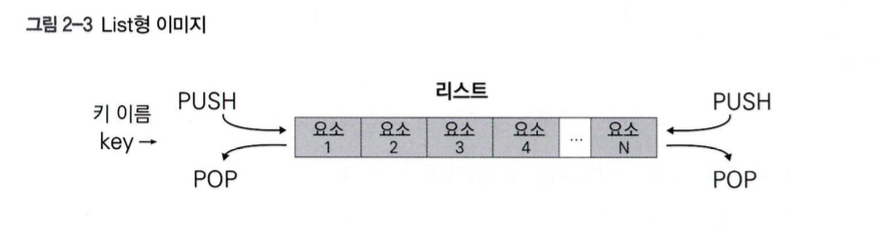

# 02. 자료형과 기능

### 대표적인 다섯 가지 자료형
* String형, List형, Hash형, Set형, Sorted Set형

<table class="table">
    <thead>
        <tr>
            <th>자료형</th>
            <th>설명</th>
            <th>예시</th>
        </tr>
    </thead>
    <tbody>
        <tr>
            <td>String형</td>
            <td>문자열(레디스에서는 숫자값도 포함), 간단한 키와 값의 조합이다.</td>
            <td>세션 정보관리</td>
        </tr>
        <tr>
            <td>List형</td>
            <td>리스트, 문자열 리스트다.</td>
            <td>타임라인</td>
        </tr>
        <tr>
            <td>Hash형</td>
            <td>해시, 프로그래밍 언어에서 연관 배열이나 딕셔너리와 비슷한 개념이다.</td>
            <td>객체 표현</td>
        </tr>
        <tr>
            <td>Set형</td>
            <td>집합, 복수의 값을 순서와 중복 없이 저장한다.</td>
            <td>태그 관리</td>
        </tr>
        <tr>
            <td>Sorted Set형</td>
            <td>정렬된 집합, 순서(랭크)가 있는 집합이다.</td>
            <td>랭킹</td>
        </tr>
    </tbody>
</table>

### 보조 자료형과 기능
* 기본 자료형 내부에서 특정 용도에 사용될 목적으로 만들어진 보조 자료형
    * 비트맵(비트 배열)
        * 비트 단위 연산을 통해 효율적인 메모리 사용과 빠른 비트 조작을 지원하는 데이터 구조
    * 지리적 공간 인덱스
        * 지리적 좌표 데이터를 저장하고 근접 검색을 수행할 수 있는 데이터 구조
* 데이터를 직접 다루는 기능
    * Pub/Sub 기능
        * 메시지를 발행(Publish)하고 구독(Subscribe)하는 방식으로 실시간 메시지 전송을 지원하는 기능
    * HyperLogLog
        * 고유 항목 수를 매우 적은 메모리로 추정할 수 있는 확률적 데이터 구조
    * 레디스 스트림
        * 로그와 같은 시퀀스 데이터를 효율적으로 처리할 수 있는 새로운 데이터 타입

### 레디스의 폭 넓은 데이터 모델 표현성
* 문제에 맞춰 적합한 자료형을 선택하면 데이터를 간단하게 다룰 수 있는 장점이 있다.
* 레디스는 KVS이지만 각 키를 독립적으로 관리하며 키간에는 관련성이 없기 때문에 KVS로 간주되지 않는다.
* 데이터베이스 번호로 식별하는 네임스페이스 같은 데이터를 관리할 수 있지만 기본적으로 전역에서 키와 값 쌍으로 관리한다.
* 키 어노테이션이라는 기능을 통해 키 간 관계성도 레디스에서 다룰 수 있고, 이 기능을 사용해 키 작업의 트리거 용도로 사용할 수 있다.
* 키 간 독립성을 원칙으로 하여, 가능하면 이 원칙에 맞춰 데이터를 저장하는 것이 좋다.
* 하나의 키에 연관된 값들을 범위 내에서 서로 연관성을 가진 단위로 관리할 수 있다.

### 레디스 자료형과 명령어
* String에서는 SET으로 저장하고, GET으로 데이터를 가져온다.
* Hash에서는 HSET으로 저장하고, GET으로 가져온다.
* 여러 키를 조작하기 위해서는 MSET, MGET 명령어를 사용할 수 있고 원자적으로 처리한다.

### 레디스 유틸리티 명령어
* KEYS
    * 키 목록을 확인하고 싶을 떄 사용된다.
        * > KEYS pattern
        * > KEYS *
    * 편리하지만 실행 시간이 오래걸리기 때문에 운용 중인 애플리케이션에서 지양하고 구현 중 동작을 확인하거나 분석할 때 사용하는 것이 좋다.
    * 운영환경에서는 SCAN 계열 명령어 사용을 추천한다.
* EXISTS
    * 키 존재 여부를 확인할 때 사용된다.
        * > EXISTS X
        * > EXISTS X Y
    * 키가 존재하면 1, 아니면 0, 키가 여러 개 있는 경우 매칭된 수를 반환한다.
* TYPE
    * 자료형과 기능을 확인할 수 있다.
        * > TYPE mykey
* DEL
    * 키의 삭제는 모든 자료형에서 공통적으로 DEL을 사용한다.
        * > DEL L
    * 반환 값은 삭제한 키의 개수이다.

## String 형
* 문자열, 이진 데이터 등을 위한 자료형이다.
* 이진 안전 문자열이기에 이미지나 실팽파일 등의 데이터도 저장할 수 있다.
* 숫자값(정수, 부동소수점)도 String 형에 저장한다.
* Bigmap형이라는 비트 단위로 조작할 수 있는 보조 자료형이 존재한다.
* 유스케이스
    * 캐시
        * 키와 값의 쌍으로 대응되는 문자열, 세션 정보, 이미지 데이터 등 이진 데이터
    * 카운터
        * 방문자 수 등 접근 수 카운트
    * 실시간 메트릭스
        * 각 항목의 수치를 파악할 수 있는 지표

#### 레디스의 String 형은 지금도 512MB가 최대인가?
* 512MB 제한은 키와 값 양쪽에 적용되며 SDS 버전의 제한 때문이다.
* 레디스 4.0.7에서 proto-max-bulk-len 지시자로 최대 제한을 해제할 수 있다.

### String 형 활용, 빠른 세션 캐시
* 세션 캐시(쿠키 등), 표시할 웹 페이지, 장바구니 내용 등 일시적인 정보를 저장하는데 사용된다.
  

### String 형 주요 명령어
* GET/SET을 여러번 실행하면 RTT가 발생하여 시간 오버헤드가 발생하기 때문에 MGET/MSET을 RTT를 줄여 효율적으로 사용 가능하다.
* 숫자값 String 형 명령어 사용 시 10진수 부호 정수로 해석하지 않으면 오류가 반환된다.
<table class="table">
    <thead>
        <tr>
            <th>명령어</th>
            <th>설명</th>
            <th>예시</th>
        </tr>
    </thead>
    <tbody>
        <tr>
            <td>GET</td>
            <td>키값 가져오기, 존재하지 않는 경우 nil 반환, 시간 복잡도 O(1)</td>
            <td>GET key</td>
        </tr>
        <tr>
            <td>SET key value</td>
            <td>키와 값의 쌍을 지정하여 키에 값을 설정, EX 같은 시간을 지정하는 옵션을 통해 TTL 설정, 시간 복잡도 O(1)</td>
            <td>SET key value [ NX | XX] [GET] [ EX seconds | PX milliseconds | EXAT unix-time- seconds | PXAT unix-time-milliseconds | KEEPTTL]</td>
        </tr>
        <tr>
            <td>MGET</td>
            <td>여러 개의 키 값 가져오기, 시간 복잡도 O(N)</td>
            <td>MGET key [key ...]</td>
        </tr>
        <tr>
            <td>MSET</td>
            <td>여러 개의 키를 지정하여 한번에 값 저장, 키가 존재하는 경우 덮어쓰기, 시간 복잡도 O(N)</td>
            <td>MSET key vale [key value...]</td>
        </tr>
        <tr>
            <td>APPEND</td>
            <td>키에 값 덮어쓰기, 키가 존재하는 경우 키값 끝에 인수 내용을 추가하고, 키가 존재하지 않으면 새로운 키를 만든다, 시간 복잡도 O(1)</td>
            <td>APPEND key value</td>
        </tr>
        <tr>
            <td>STRLEN</td>
            <td>기의 길이 가져오기</td>
            <td>STRLEN key</td>
        </tr>
        <tr>
            <td>GETRANGE</td>
            <td>범위를 지정하여 키값 가져오기, 첫 번째 문자는 0부터 시작, 시간 복잡도 O(N)</td>
            <td>GETRANGE key start end</td>
        </tr>
        <tr>
            <td colspan="3">숫자인 경우에만 사용가능한 명령어</td>
        </tr>
        <tr>
            <td>INCR</td>
            <td>값을 1만큼 증가시키기, 값이 없으면 동작 전 0으로 지정, 시간 복잡도 O(1)</td>
            <td>INCR key</td>
        </tr>
        <tr>
            <td>INCRBY</td>
            <td>값을 지정한 정수만큼 증가시키기, 값이 없으면 동작 전 0으로 지정, 시간 복잡도 O(1)</td>
            <td>INCRBY key increment</td>
        </tr>
        <tr>
            <td>INCRBYFLOAT</td>
            <td>값을 지정한 부동소수점만큼 증가시키기, 값이 없으면 동작 전 0으로 지정, 시간 복잡도 O(1)</td>
            <td>INCRBYFLOAT key increment</td>
        </tr>
        <tr>
            <td>DECR</td>
            <td>값을 1만큼 감소시키기, 값이 없으면 동작 전 0으로 지정, 시간 복잡도 O(1)</td>
            <td>DECR key decrement</td>
        </tr>
        <tr>
            <td>DECRBY</td>
            <td>값을 지정한 정수만큼 감소시키기, 값이 없으면 동작 전 0으로 지정, 시간 복잡도 O(1)</td>
            <td>DECRBY key decrement</td>
        </tr>
        <tr>
            <td></td>
            <td></td>
            <td></td>
        </tr>
        <tr>
            <td></td>
            <td></td>
            <td></td>
        </tr>
    </tbody>
</table>

* 그외 명령어
  * GETTEX - TTL을 설정한 키 값 가져오기
    * 유효기간 설정도 가능 
    * > GETEX key [ EX seconds | PX milliseconds | EXAT unix-time- seconds | PXAT unix-1ime-mi11iseconds | PERSIST]
  * GETDEL - 키 값을 가져온 후 그 키를 삭제하기
    * 레디스 6.2.0 이상 
    * > GETDEL key
  * MSETNX - 여러 개의 키가 존재하지 않는 것을 확인하고 값을 저장하기
    * 인수에 있는 키 중에 하나라도 이미 존재하면 모든 저장에 실패 
    * > MSETNX key value [key value ...]

### [SET 명령어와 옵션](https://redis.io/docs/latest/commands/set/)
* EX/PX 옵션
  * TTL 설정으로 EX는 초 단위, PX 밀리 초 단위 지정
* NX/XX 옵션
  * 키의 존재 여부에 따라 조건을 충족할 때만 저장
  * NX는 키가 존재하지 않는 경우, XX는 키가 존재하는 경우에만 지정
* KEEPTTL 옵션
  * 키 관련 TTL을 변경하지 않고 조작 (레디스 6.0 이상)
* EXAT/PXAT 옵션
  * 유닉스 시간을 사용하여 유효 시간 설정
  * EXAT는 초단위, PXAT는 밀리 초 단위 (레디스 6.2 이상)
* GET 옵션
  * 키를 지정하여 값을 가져온 후 계속해서 설정을 수행 (레디스 6.2 이상)

## LIST 형
* 문자열의 리스트
* 여러 값을 순서대로 저장해 삽입한 순서를 유지하는 자료형
* 스택이나 큐로 사용
* 좌우 끝부분에 요소를 추가 및 삭제하거나 부분적으로 요소를 가져오는 동작이 가능
* 중간 부분으로 접근하는 경우 느리고, 데이터가 큰 경우 느려지기 때문에 작은 단위로 관리하거나 다른 자료형이 더 좋은 지 검토가 필요

#### 특징과 유스케이스
* 특징
  * 문자열 컬렉션, 삽입 순서를 유지
* 유스케이스
  * 스택, 큐, SNS 최신 게시물, 로그

### LIST 형 주요 명령어
#### LPOP - 리스트 왼쪽부터 값을 가져오고 삭제하기
* count 옵션으로 지정한 수만큼의 요소 개수를 삭제하고 값을 반환
* 시간복잡도 O(N)

> LPOP key [count]

#### LPUSH - 리스트 왼쪽부터 값을 삽입하기
* 키로 지정한 리스트의 앞부분에 지정한 값을 모두 삽입
* 시간 복잡도 O(N)

> LPUSH key element [element ...]

#### RPOP - 리스트의 오른쪽부터 값을 가져오고 삭제하기
* 키로 지정한 리스트의 끝부분 요소를 삭제하고 값을 반환
* count 옵션으로 지정한 수만큼의 요소 개수를 삭제하고 값을 반환
* 시간 복잡도 O(N)

> RPOP key [count]

#### RPUSH - 리스트 오른쪽부터 값을 삽입하기
* 키로 지정한 리스트의 끝부분에 지정한 값을 모두 삽입
* 시간 복잡도 O(N)

> RPUSH key element [element ...]

#### LMPOP - 리스트 왼쪽 혹은 오른쪽부터 여러개의 값을 가져오고 삭제하기
* 키로 지정한 리스트의 처음 혹은 마지막부터 여러 요소를 삭제하고 값을 반환
* numkeys로 대상 리스트의 키 개수를 지정
* count 옵션으로 지정한 수만큼의 요소 개수를 삭제하고 값을 반환
* 시간 복잡도 O(N + M), M은 반환된 요소의 개수

> LMPOP numkeys key [key ...] <LEFT | RIGHT> [COUNT count]

#### BLMPOP - 블록 기능을 갖춘 LMPOP
* 키로 지정한 리스트의 처음 혹은 마지막부터 여러 요소를 삭제하고 값을 반환
* count 옵션으로 지정한 수만큼의 요소 개수를 삭제하고 값을 반환
* 리스트에 요소가 없으면 처리를 블록, 순서 집합에 요소가 추가될 때까지 처리를 대기
* 최대 대기 사간은 timeout에서 지정한 값
* 시간 복잡도 O(N + M), M은 반환된 요소의 개수

> BLMPOP timeout numkeys key [key ...] <LEFT | RIGHT> [COUNT count]

#### LINDEX - 리스트에서 지정한 인덱스에 값을 조회하기
* 키로 지정한 리스트에 지정한 인덱스 위치에 있는 요소를 반환
* 시간 복잡도 O(N)

> LINDEX key index

#### LINSERT - 리스트에서 지정한 인덱스에 값을 삽입하기
* 키로 지정한 리스트에 지정한 요소의 바로 앞 혹은 뒤에 같은 요소를 삽입
* 요소를 찾을 수 없는 경우 -1 반환되며 동작이 미수행
* 시간 복잡도 O(N)

> LINSERT key BEFORE|AFTER privot element

#### LLEN - 리스트의 길이 가져오기
* 키로 지정한 리스트의 길이를 반환
* 시간 복잡도 O(1)

> LLEN key

#### LRANGE - 리스트에서 지정한 범위의 인덱스에 있는 값 가져오기
* 키로 지정한 리스트의 인덱스 범위를 지정하여 데이터를 반환
* 특정 인덱스에서 끝부분의 요소를 가져오고 싶은 경우에는 음의 정수를 지정
* 시간 복잡도는 O(S + N)

> LRANGE key start stop

#### LREM - 리스트에서 지정한 요소를 지정한 수만큼 삭제하기
* 키로 지정한 리스트에서 지정한 특정 요소를 지정한 수만큼 삭제
* 음수라면 끝부분에서 시작부분으로 이동하면서 특정 요소와 동일한 요소를 삭제
* 시간 복잡도는 O(N + M)

> LERM key count element

#### LSET - 리스트에서 지정한 인덱스에 있는 값을 지정한 값으로 저장하기
* 키로 지정한 리스트에서 지정한 인덱스에 있는 값을 갱신
* 시간 복잡도는 O(N)

> LSET key index element

#### LTRIM - 지정한 범위 인덱스에 포함된 요소로 리스트 갱신하기
* 키로 지정한 리스트를 특정 인덱스 범위에 포함된 요소로만 이뤄진 리스트로 갱신
* 시간 복잡도는 O(1)

> LTRIM key start stop

#### LPOS - 리스트 중 지정한 인덱스에 있는 값 가져오기
* 키로 지정한 리스트에서 탐색 대상 요소의 인덱스를 반환
* RANK 옵션으로 몇 번째에 일치하는 요소 반환 지정
* COUNT 옵션으로 몇 개의 인덱스를 반환 지정
* MAXLEN 옵션으로 탐색하는 요소의 개수 반환 지정
* 시간 복잡도 O(N)

#### 그 외 명령어
* LPUSHX - 리스트가 있는 경우에만 왼쪽부터 값을 삽입하기
* LMOVE - 리스트 간 요소로 이동하기
* RPUSHX - 리스트가 있는 경우에만 오른쪽부터 값을 삽입하기
* BLPOP - 블록 기능을 갖춘 LPOP
* BRPOP - 블록 기능을 갖춘 RPOP
* 블록 기능이 있는 명령어의 장점
  * 프로세스 간 통신 같은 애플리케이션에서 폴링과 같은 기능을 구현하지 않아도 블록 기능이 가능한 명령어를 사용하면 간단히 구현할 수 있다.
  * 현재 `주문/결제 쪽에서 폴링을 사용 중인데 해당 기능을 이용`할 수 있지 않을까?

## Hash 형
* 순서 없이 필드와 값이 여러 쌍으로 매핑된 자료구조
* 연관 배열이나 딕셔너리 같은 자료구조로 하나의 키에 키와 값의 쌍으로 구성된 여러 요소를 연결
* 하나의 해시에 저장할 수 있는 필드 수는 2³²-1개 (약 43억 개)
* 하나의 키에 여러 속성을 가지면 사용자 정보와 같은 표현은 애플리케이션에서 쉽게 구현할 수 있지만 키에 값을 계속 추가하면 볼륨이 거대해져서 처리 시간에 문제가 생길 수 있다.
* 해시 내 각 필드에 개별 TTL을 설정할 수 없기 떄문에 String 형 사용을 검토해야 한다.

#### 특징과 유스케이스
* 특징
  * 필드와 값의 쌍 집합
  * 필드와 연결된 값으로 구성된 맵, 필드와 값이 모두 문자열
* 유스케이스
  * 객체 표현(사용자 정보, 상품 정보)

### [Hash 형 주요 명령어](https://redis.io/docs/latest/commands/?group=hash)
* Hash 형은 String 형과 마찬가지로 필드값이 숫자인 경우에 사용할 수 있는 명령와 값 내용에 상관없이 사용할 수 있는 명령어가 존재

### 모든 타입에 사용할 수 있는 명령어
#### HDEL - 해시에서 지정한 필드 삭제하기
* 키로 지정한 해시에서 지정한 필드를 삭제
* 시간 복잡도 O(N)

> HDEL key field [field ...]

#### HEXISTS - 해시에 지정한 필드가 존재하는지 확인하기
* 키로 지정한 해시에서 지정한 필드가 존재 시 1, 미존재 시 0을 반환
* 시간 복잡도 O(1)

> HEXISTS key field

#### HGET - 해시에 지정한 필드 값 가져오기
* 키로 지정한 해시에서 지정한 필드에 저장된 값을 반환
* 시간 복잡도 O(1)

> HGET key field

#### HGETALL - 해시에서 모든 필드 및 저장된 값 쌍 가져오기
* 키로 지정한 해시에 포함된 모든 필드와 값 쌍을 반환
* 시간 복잡도 O(N)

> HGETALL key

#### HKEYS - 해시에서 모든 필드 가져오기
* 키로 지정한 해시에 포함된 모든 필드 목록을 반환
* 시간 복잡도 O(N)

> HKEYS key

#### HLEN - 해시에 포함된 필드 수 가져오기
* 키로 지정한 해시에 포함된 필드 수를 반환
* 시간 복잡도는 O(1)

> HLEN key

#### HMSET - 해시에서 여러 필드와 값의 쌍 저장하기
* 키로 지정한 해시에 여러 필드와 값의 쌍을 지정하여 필드에 값을 한번에 저장
* 필드가 이미 존재하면 덮어쓰기
* 시간 복잡도 O(N)

> HMSET key field value [field value ...]

#### HSET - 해시에 지정한 필드값 저장하기
* 키로 지정한 해시에 필드와 값의 쌍을 지정하여 필드에 값을 저장
* 필드가 이미 존재하면 덮어쓰기
* 레디스 4.0.0 이후에는 여러 필득와 값의 쌍을 한번에 지정
* 시간 복잡도 O(N)

> HSET key field value [field value ...]

#### HVALS - 해시의 모든 필드값 가져오기
* 키로 지정한 해시의 필드에 연결된 모든 값을 반환
* 시간 복잡도 O(N)

> HVALS key

#### HSCAN - 반복 처리하여 해시의 필드와 그에 연결된 값의 쌍 목록을 가져오기
* 키로 지정한 해시의 필드 집합을 반복 처리하여 필드 이름과 저장된 값의 쌍 목록을 반환
* 시간 복잡도 O(1)

> HSCAN key cursor [MATCH pattern] [COUNT count]

### 숫자형에 사용가능한 명령어
#### HINCRBY - 해시에 지정한 필드값을 지정한 정수만큼 증가
* 키에 지정한 해시 필드에 저장된 값을 지정한 값만큼 증가
* 키가 존재하지 않으면 동작 전 0을 저장
* 시간 복잡도 O(1)

> HINCRBY key field increment

#### HINCRBYFLOAT - 해시에 지정한 필드값을 지정한 부동소수점 수만큼 증가시키기
* 키에 지정한 해시 필드에 연결된 부동소수점 수로 표현되는 키값을 지정한 값만큼 증가
* 키가 존재하지 않으면 동작 전 0을 저장
* 시간 복잡도 O(1)

> HINCRBYFLOAT key field increment

#### 그 외 명령어
* HSETNX - 해시에 필드가 존재하지 않는 것을 확인한 후 값 저장하기
* HSTRLEN - 해시에 지정한 필드값 문자열의 길이 가져오기
* HRANDFIELD - 해시에 포함된 필드 이름 무작위로 가져오기

### 성능을 발휘하기 위한 주의사항
* 해시가 필드 수 증가 등으로 커지면 HDEL 명령어를 실행 시 수행 시간이 길어져 다른 명령어가 블록될 가능성이 존재한다.
* 시간 복잡도가 O(N)인 HKEYS, HVALS를 시간 복잡도 O(1)인 HSCAN 명령어로 대체하여 해결 가능하다.
* HDEL 명령어를 꼭 사용해야할 경우 사전에 벤치마크를 수행하고 해시를 더 작은 단위로 분할하여 관리할 수 없는지, String 형으로 관리해야 하는지 등을 고려해서 스키마를 설계한다.