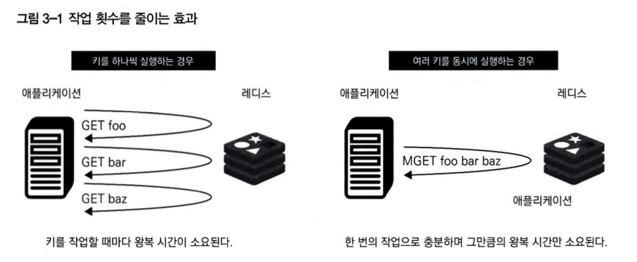

# 03. 고급 기능
### 레디스에서 트러블슈팅 또는 높은 성능을 내기 위해 알아야 하는 고급 기능
* 파이프라인
* 루아 스크립팅(이페머럴 스크립트, 레디스 함수)
* 모듈
* 키 공간 알림
* 클라이언트 측 캐시

#### 복잡한 로직과 원자적 처리가 필요할 때 사용되는 기술
* 트랜잭션
  * 원자적 처리
* 루아 스크립트(이페머럴 스크립트, 레디스 함수)
  * 복잡한 로직 구현
  * 원자적 처리
* 모듈
  * 복잡한 로직 구현
  * 원자적 처리

## [파이프라인](https://redis.io/docs/latest/develop/use/patterns/bulk-loading/)
* 이전 요청의 응답을 기다리지 않고 새로운 요청을 보낼 수 있는 기능이다.
* 여러 명령어를 동시에 송신하여 네트워크 RTT(Round Trip Time, 왕복 시간)을 절약할 수 있다.
* MSET/MGET을 사용하는 것보다 파이프라인이 더 범용적이기 때문에 파이프라인을 사용하는 것이 좋다.
* 여러 명령어를 한번에 처리할 수 있어서 효율적이지만, 조건 분기 등을 적용할 수 없어서 복잡한 로직에는 적합하지 않다.
* 읽기/쓰기 명령이 모두 포함된 경우 쓰기 명령 전 읽기 명령을 기다려야해서 지연 시간이 길어질 수 있다.
* 다른 클라이언트들이 연결된 상황에서 다른 명령어가 간섭할 가능성도 존재해 스크립트의 원자적 처리를 보증할 수 없다.
* 파이프라인 내에선 명령의 순서가 보장되기 때문에 여러 명령어를 빠르게 전송하고 응답은 한꺼번에 처리하는 것이 효과적이다.




## 루아
* 레디스는 내장 스크립트 언어로 루아를 채택하고 있고, 레디스 명령어만으로 구현하기 어려운 유연한 처리와 기능 확장 등을 루아를 통해 빠른 속도로 구현할 수 있다.
* 복잡한 작업을 할 때 애플리케이션에서 처리 작업을 진행할 수 있지만 실행 속도의 문제로 루아를 사용 시 레디스에서 모든 작업을 원자적으로 처리할 수 있다.
* 레디스 7.0 이후 레디스 함수로 루아를 실행할 수 있다.

#### 파이프라인의 문제점과 루아의 특징
* 파이프라인의 문제점
  *  여러 종류의 명령어를 처리할 수 있지만, 조건 분기 등 로직 기반 처리는 할 수 없다.
  *  쓰기와 읽기가 모두 포함된 작업을 진행할 때, 쓰기 작업 이전에 읽기 작업 결과(응답)를 기다려야하고, 이로 인해 지연 시간이 발생할 수 있다.
* 루아의 특징
  * 조건 분기와 같은 복잡한 로직을 기술할 수 있다.
  * 쓰기와 읽기 지연 시간을 최소화하도록 설계됐다.

### 이페머럴 스크립트
* 레디스 7.0 이전에는 루아를 실행하기 위해 이페머럴 스크립트가 제공됐다.

#### 데이터 저장 시 TTL을 설정하고 싶은 경우
* 명령어 실행 시 TTL 설정이 불가능한 경우 데이터를 저장한 뒤 TTL을 설정하는데 RTT 오버헤드가 발생하며 파이프라인으로 실행하면 오버헤드를 줄일 수 있지만 원자적 처리를 보장할 수 없다.
* 이페머럴 스크립트를 사용해 한 번의 레디스 호출로 원자적 처리를 할 수 있기 때문에 RTT를 줄이고 원자적 처리도 간단하게 구현할 수 있다.

#### 여러 요소를 동시에 처리하기
* 여러 값을 동시에 다룰 수 있는 명령도 존재하지만 제약(MGET의 경우 String형 키만 동시 지정, MSET의 경우 한 개의 키 내에서만 여러 필드를 동시에 처리)이 존재하기 때문에 이런 사례도 이페머럴 스크립트를 사용하면 구현할 수 있다.

#### 이페머럴 스크립트를 통한 복잡한 로직 구현하기
* 루아에는 디버깅을 위한 루아 디버거 기능이 탑재되어 있어 복잡한 코드를 실행할 때 디버거를 활용할 수 있다.

#### 이페머럴 스크립트 명령어
* 주요 명령어
  * EVAL
    * 인수로 스크립트를 문자열로 전달
    * 첫 번째 인수는 스크립트 내용, 두 번째 인수 키 종류의 수, 세 번쨰 인수는 키 종류의 수만큼 스크립트 내에서 사용하는 키를 나열
    * `EVAL script numkeys key [key ...] arg [arg ...]`
  * EVALSHA
    * EVAL와 동일하지만 두 번째 인수 부분에 스크립트 자체가 아닌 스크립트 해시값을 지정한다.
    * 스크립트 해시 값은 SCRIPT ROAD 명령어로 확인할 수 있다.
    * `EVALSHA sha1 numkeys key [key ...] arg [arg ...]`
  * EVAL_RO
  * EVALSHA_RO

#### EVAL/EVALSHA 실행 예시
* EVAL 명령어는 실행할 스크립트를 인수로 지정하기 떄문에 해시값 관리 비용이 들지 않지만 실행할 때마다 클라이언트에서 레디스 서버로 전송되기 때문에 그만큼 대역폭을 사용한다.
* EVAL 명령어로 특정 키의 데이터를 작업할 때 인수로 나열한 키는 루아 전역 변수인 KEYS의 배열에 저장되며 이어서 나열된 값은 루아의 전역 변수인 ARGV 배열에 저장된다.
* EVAL 명령어 인수로 키를 지정하지 않고 KEYS 변수를 사용하지 않을 수 있지만 레디스 클러스터를 사용하는 경우 인수로 지정한 키 값을 바탕으로 라우팅할 캐시 노드를 결정하기 때문에 문제가 생길 수 있어 일반적으로 스크립트 내에 사용할 키를 인수로 지정하는 것을 권장한다.
* EVALSHA 명령어는 해시값으로 스크립트를 지정할 수 있어 대역폭 감소 효과가 있지만 그 전에 SCRIPT LOAD 명령어를 통해 SHA1 해시 값을 생성하고 스크립트는 레디스에 저장한다.
* EVAL는 매번 루아 스크립트를 서버로 전송해야 할 만큼 오버헤드가 크기 때문에 현업에선 EVALSHA명령어를 많이 사용하지만 관리 비용을 절약하기 위해서 EVAL을 사용하는 것도 하나의 전략이다.
* 이페머럴 스크립트는 롤백 기능이 구현되지 않아 스크립트 내부 구현에 오류가 발생 시 발생한 시점에 스크립트가 종료되기 때문에 원자성을 보장하지 않아 애플리케이션 개발 시 이런 오류에 대한 대책을 마련해야 한다.

#### 스크립트 제거
* EVAL, EVALSHA로 실행한 스크립트는 삭제 작업을 수행하지 않는 한 레디스 인스턴스에 캐시로 남아있어 실행 속도를 높이기 위해 사용된다.
* 메모리 사용량을 줄이기 위해서 전역 변수인 KEYS, 지역 변수인 ARGV 에 저장되는데 매개변수를 사용하지 않고 직접 값을 스크립트에 삽입하면 메모리 영역이 점점 증가되기 때문에 KEYS, ARGV 변수를 활용해 매개변수화가 가능한 경우는 스크립트를 일반화할 수 있다.
* 스크립트를 삭제하기 위해서 SCRIPT FLUSH 명령어를 실행하거나 서버를 재시작하면 되서 캐시를 강제로 삭제하고 싶을 때나 운영환경에 불필요한 캐시가 쌓여있을 때 사용하면 좋다.
* 스크립트가 실행 중에는 키가 만료되지 않는데, 같은 데이터 세트에는 같은 효과를 보장하도록 동작하기 때문이다.

#### 스크립트 정지
* SCRIPT KILL, SHOTDOWN NOSAVE 명령어를 통해 실행 중인 이페머럴 스크립트를 정지할 수 있다.
* 스크립트 실행 중에 데이터 세트가 변경되지 않았다면 busy-replay-threshold(레디스 7.0 미만은 lua-time-limit) 명령어를 통해서 타임아웃을 설정할 수 있고, 기본 값은 5초입니다.
* 읽기 전용 명령어만 실행한 경우 SCRIPT KILL 명령어로 중지할 수 있고 데이터 세트가 변경됐다면 명령어로 제어할 수 없기 때문에 타임아웃 값을 초과하면 SHUTDOWN NOSAVE 명령어만 수행해 강제 종료해야만 문제를 해결할 수 있다, 이 경우 롤백 기능이 없기 때문에 데이터 세트가 불완전한 상태로 남아있게되고 스크립트 원자성을 해치게 된다.
* SHUTDOWN NOSAVE 명령어는 모든 클라이언트에서 연결을 끊고, AOF가 활성화된 경우 플러시 처리한 후 레디스 서버를 종료해 스크립트 실행 중 내용이 반영되지 않고 파기된다. (save 지시자로 스냅숏을 기록해도 생략)
* 레디스 7.0 이후 EVAL_RO/EVALSHA_RO 명령어를 통해 읽기전용 스크립트라면 항상 레플리카에서 실행되서 SCRIPT KILL 명령어 실행을 보장시켜 의도적인 쓰기 작업 문제를 방지할 수 있다.

#### 플래그
* 레디스 7.0 이후부터 이페머럴 스크립트에 플래그 기능을 사용할 수 있게되고 이를 통해 `사전에 어떻게 동작할지 전달하여 레디스를 제어`한다.
* 플래그를 잘못 사용하면 외도치 않게 동작할 수 있어서 제대로 이해하고 사용해야 한다.
* 플래그를 지정하기 위해선 셔뱅(#1)과 루아 문자열을 연결한 #!lua를 첫행에 선언하고 flags= 다음에 플래그들을 쉼표로 구분해 나열한다.
  ```
  #!lua flags=no-writes,allow-stale
  local result = redis.call('get','x')
  return result
  ```

#### 플래그의 종류
* no-writes
  * 스크립트가 데이터의 읽기 작업만 수행하고, 쓰기 작업은 수행하지 않는다고 선언
* allow-oom
  * 레디스 서버가 OOM 상황에서 실행 가능한 스크립트라고 선언
* allow-stale
  * 마스터의 연결이 끊어자는 등 데이터가 오래되어도 레플리카의 스크립트 실행이 가능하다고 선언
* no-cluster
  * 레디스 클러스터 내에서 실행이 불가능한 스크립트가 있음을 선언
* allow-cross-slot-keys
  * 레디스 클러스터에서 여러 슬롯을 통해 키에 접근하는 스크립트가 있음을 선언

#### 루아 디버그
* 이페머럴 스크립트 디버깅을 위해 루아 디버그를 사용할 수 있으며 redis-cli에서 --ldb와 --ldb-sync-mode 두 종류의 옵션을 사용할 수 있다.
* --ldb 옵션은 논 블로킹 비동기 디버깅을 위한 것이며 활성화한 상태에서 변경한 작업은 롤백되어 파기된다.
* --ldb-sync-mode은 활성화 중 변경한 작업도 반영되며 특정 버그를 추적하는 등 각 디버깅 세션에 키 공간에서 변경된 내용을 유지해야 하는 경우 동기 디버깅을 사용한다.
* --ldb와 --ldb-sync-mode 옵션으로 redis-cli를 실행하지 않고 SCRIPT DEBUG 명령어를 사용해 디버거를 사용할 수도 있다.

### 레디스 함수
* 루아 스크립트를 실행하는 또 하나의 방법으로 레디스 함수가 존재한다.
* 레디스 7.0의 대표 기능으로 이페머럴 스크립트의 문제점을 극복하기 위한 대체 기능이다.
* 레디스 7.0과 루아를 함께 사용하고자 할 때 레디스 함수를 사용하는 것이 좋다.

#### 이페머럴 스크립트의 문제점?
* 스크립트가 서버 측 캐시에 저장될 뿐 언제든 삭제될 수 있기 때문에 애플리케이션 측에서도 스크립트의 소스코드를 유지해야하고, 복잡해지고 많이 사용할수록 스크립트 관리가 어려워지며 한 트랜잭션 내에 스크립트를 호출하면 필요한 스크립트가 삭제될 가능성도 증가한다.
* SHA1의 다이제스트 값은 직접적으로 어떤 의미를 나타내지 않기 때문에 디버깅이 어렵다.
* KEYS와 ARGV를 제대로 사용하지 않고 스크립트를 그대로 렌더링하는 안티 패턴을 따를 가능성이 있다.
* 한 스크립트에서 다른 스크립트를 호출할 수 없어 스크립트 간 코드 공유와 재사용이 어렵다.
* 루아 5.1만 사용할 수 있다.
* `이러한 문제점을 개선하기 위해 레디스 함수가 등장`했다.

#### 레디스 함수 특징
* 원자적 처리가 보장되지만 실행 중엔 다른 처리를 블록하기 때문에 장시간 실행을 피해야 한다.
* 함수가 마스터에서 레플리카로 복제된다는 점과 스냅숏이나 AOF로 영속화되어 데이터와 동등한 내구성을 가진다.
* 라이브러리 개념을 도입해 개별 함수를 부분적으로 업데이트할 수 없고 모든 함수를 하나의 작업으로 한꺼번에 업데이트를 진행해 같은 라이브러리 내에 있는 함수에서 다른 함수를 호출하거나 내 함수를 공통으로 재사용할 수 있다.
* 다양한 프로그래밍 언어의 엔진을 사용할 수 있고 자바스크립트와 호환도 예정되어 있지만 현재는 루아 5.1만 지원한다.

#### 레디스 함수 실행 정지
* FUNCTION KILL, SHUTDOWN NOSAVE 명령어를 통해서 실행 중인 함수를 정지시킬 수 있으며 동작은 이페머럴 스크립트와 동일하다.
* busy-reply-threshold 지시자를 사용해 매개변수를 설정할 수 있고 기본값 5초이며 초과한 경우 읽기 명령어만 실행하는 스크립트를 FUNCTION KILL 명령어로 중단할 수 있다.
* FCALL_RO 읽기 전용 명령어로 항상 레클리카에서 실행돼서 FUNCTION KILL 명령어로 중단할 수 있어서 쓰기 작업 문제를 방지할 수 있다.

#### 레디스 함수 플래그
* 레디스 함수는 `쓰기와 읽기 작업을 모두 수행한다고 가정`하기 때문에 이렇게 동작하기 때문에 플래그로 함수가 어떻게 동작할지 지정할 수 있다.
* 플래그의 종류는 이페머럴 스크립트와 동일하지만, 플래그 기본 동작은 이페머럴 스크립트와 다르다.

### [레디스의 루아 프로그래밍](https://redis.io/docs/latest/develop/interact/programmability/lua-api/)
* 이페머럴 스크립트, 레디스 함수에서 공통 루아 API를 사용하며 기본적으로 비슷한 방식으로 코딩할 수 있다.
* 루아는 레디스 서버가 동작하는 호스트에 접근할 수 없도록 샌드박스 환경에서 실행되며 전역 변수나 함수 사용이 제한돼 에약어를 제외하고는 지역 변수와 함수만 사용할 수 있다.
* 레디스 명령어를 루아에서 호출하기 위한 라이브러리 등 레디스 측에서 제공하는 라이브러리도 일부 사용할 수 있지만, 임의 라이브러리를 불러오는 것은 불가능해서 레디스에서 제공하는 것만 사용할 수 다.
* 라이브러리 목록은 아래와 같다.
  * base (루아 표준 라이브러리)
  * table (루아 표준 라이브러리)
  * string (루아 표준 라이브러리)
  * math (루아 표준 라이브러리)
  * struct (서드 파티 라이브러리)
  * cjson (서드 파티 라이브러리)
  * cmsgpack(서드 파티 라이브러리)
  * bitop(서드 파티 라이브러리)
  * redis (레디스 고유 라이브러리)
* 레디스 서버 내에 동작하는 스크립트에서 레디스 명령어를 호출하기 위해서는 레디스 객체의 API를 사용한다.
  * redis.call(), redis.pcall() 두 가지 명령어로 실행한다.
  * redis.call() 함수를 사용하는 경우 지역 변수처럼 호출한다.
  * redis.call()은 오류 발생 시 즉시 종료되며 redis.pcall()은 오류를 인식해도 처리를 계속한다.
  * redis.sha1hex()는 SHA1 다이제스트를 계산하는 함수이며, redis.breakpoint()와 redis.debug()는 디버그 용도로 사용하는 함수이다.

## 트랜잭션
* 트랜잭션은 `분리하면 안되는 여러 작업을 하나의 그룹으로 묶어서 다루는 단위`를 가리키며 ACID의 성질을 가지고 있습니다.
  * 원자성(Atomicity), 일관성(Consistency), 격리성(Isolation), 지속성(Durability)
* 레디스는 개별 명령어 수준에서 원자적 처리를 보장하지만, 여러 명령어를 실행할 땐 보장하지 않기 때문에 MULTI/EXEC 명령어를 사용해 다른 클라이언트의 간섭없이 원자적 처리하며 선언된 명령어를 큐에 넣어 처리한다.
  * 큐에 넣기만할 뿐 데이터 세트를 변경하는 것은 아니기 때문에 도중에 계산한 결과값을 바탕으로 다음 작업을 해야할 경우 적합하지 않기 때문에 루아로 작업을 검토해야 한다.
  ```
  MULTI
    SET foo 10
    INCR foo
    INCR foo
    GET foo
  EXEC
  ```
* 레디스 트랜잭션은 RDBMS에서 제공하는 롤백 기능은 지원하지 않고, 실패 시 그래도 남은 작업을 처리되며 DISCARD 명령어로 트랜잭션을 도중에 멈추고 큐를 비우는 것도 가능하지만 큐에 성공적으로 저장된 명령어는 오류가 발생해도 그 외 명령어는 실행한다.
* WATCH 명령어가 제공하는 CAS 기능은 EXEC 명령어 실행 전에 대상이 된 키가 변경되면 트랜잭션의 전체 실행을 중지하며, 충돌이 발생하지 않을 것을 기대하고 처리하는 방식을 낙관적 락이라 부른다.
* WATCH 명령어의 키를 대상에서 제거하기 위해 UNWATCH 명령어가 있으며, EXEC 명령어 실행 및 클라이언트가 접속을 종료 했을 때 모든 키는 자동으로 UNWATCH된다.

## [모듈](https://redis.io/docs/latest/)
* 레디스 4.0부터 모듈 기능을 제공하며 레디스 소스코드 수정없이 C언어로 구현해 레디스 서버에 독립적으로 추가할 수 있어서 확장성이 뛰어난 시스템이 되었다고 할 수 있다.
* 레디스 서버 버전에 의존하지 않도록 호환성도 고려하여 구현됐고 호환성을 위해 레디스는 모듈만을 위한 API를 만들어 이를 통해 레디스와 연동할 수 있다.
* 레디스 모듈의 API 버전과 레디스 서버의 버전이 일치하도록 만드는 과정을 거쳐야해서 모듈 기능을 등록할 때는 버전을 지정해야 한다.

### 모듈로 구현할 수 있는 것
1. 모듈 기능을 통해 새롭게 정의한 자료형을 추가할 수 있다.
   * 기존의 대표 자료형만으로 해결하기 어려웠던 부분을 보완
2. 복잡한 로직 구현이나 사용자 정의 명령어로 구현할 수 있어 클라이언트에서 사용자 정의 명령어를 호출할 수 있다.
   * 다양한 데이터 모델의 표현 및 복잡한 처리를 수행
   * 서드 파티 라이브러리도 많아 활용 가능
3. 모듈 기능을 쉽게 사용할 수 있는 Redis Stack이라는 서비스도 존재한다.

* 레디스 서버 데이터 공간에 접근하기 위해 고수준 API와 저수준 API 두 종류 API를 제공한다.
  * 저수준 API는 레디스 자료구조에 빠르게 접근하고 조작하기 위한 함수 제공 및 네이티브 레디스 명령에 버금가는 속도로 처리
  * 고수준 API는 루아가 레디스 명령어를 호출한 결과를 가져오기 위해 클라이언트 측에서 레디스에 접근하는 방식과 유사하게 처리
* 자동 메모리 관리 기능을 제공한다.
  * 레디스 모듈 기능을 사용하는 동안 열린 키나 응답, RedisModuleString 객체 등 불필요한 요소를 자동으로 해제
  * 수동 조작을 통해서 기본적으로 자동으로 관리하는 것이 좋으나 적절하게 속도나 메모리 사용량을 관리할 수 있다.

## 키 공간 알림
* 키 공간 알림은 레디스 서버에 저장된 데이터 세트를 변경하거나 레디스 서버에 이벤트가 발생하면 알림을 제공하는 시스템이다.
* 어떤 이벤트가 실행된 경우 다른 처리를 수행하도록 트리거를 설정할 수 있다.
* Pub/Sub 기능을 사용하여 수신하는 시스템이므로, 알림을 받기 위해서는 클라이언트 측에서 해당 기능의 명령어를 사용해야하며 서버 측에서 알림을 받기 위해서는 사전에 notify-keyspace-events 지시자로 수신할 알람 종류를 설정하면 지정한 종류의 알람이 전달된다.
* 트리거될 때, 키 공간과 이벤트 두 종류의 알림을 받을수 있다.
  * 키 공간 알림: 특정 키가 변경됐을 때 알림
  * 키 이벤트 알림: 특정 이벤트가 발생한 경우에 알림
* 모든 명령어의 이벤트는 키값이 변경되는 시점에 알림을 보냅니다. 단, 만료 이벤트는 TTL이 만료된 시점이 아닌, 실제 삭제된 시점이라는 점에 주의해야한다.
* 레디스에는 만료된 키를 실제로 삭제하기 위해 키를 회수하는 방식으로 능동과 수동 두가지가 읐으며 능동적 방식의 경우 TTL이 만료된 시점과 만료 이벤트 알림을 받을 떄까지 간극이 발생할 수 있다.
  * 능동적 방식: 초당 10회씩 무작위로 20개의 키를 샘플링하여 만료된 모든 키를 삭제하며 샘플리된 키 중 만료된 키가 25% 이하가 될 때까지 반복
  * 수동적 방식: 만료된 키에 처음으로 접근했을 때, 만료를 감지하고 삭제
* 레디스 6.0 이후 만료 주기 알고리즘이 개선돼서 빠른 주기가 추가되어 처리된다. 
  * 빠른 만료 주기는 이벤트 루프의 주기마다 실행되며 만료된 키 수의 비율이 10% 혹은 메모리 합계 비율이 25% 이하의 크기를 사용하게 되면, 각 데이터베이스의 점검을 중단한다.
  * active-expire-effort 지시자로 1부터 10까지 값을 설정할 수 있고 값이 커질수록 메모리 사용 효율이 올라가지만 CPU를 사용해서 주기 기간이 길 어지거나 지연 시간이 증가한다.

#### notify-keyspace-events 지시자로 지정 가능한 키
<table class="table">
    <thead>
        <tr>
            <th>종류</th>
            <th>설명</th>
        </tr>
    </thead>
    <tbody>
    <tr>
        <td>K</td>
        <td>키 공간 알림</td>
    </tr>
    <tr>
        <td>E</td>
        <td>키 이벤트 알림</td>
    </tr>
    <tr>
        <td>g</td>
        <td>일반 명령어</td>
    </tr>
    <tr>
        <td>$</td>
        <td>문자열형 명령어</td>
    </tr>
    <tr>
        <td>l</td>
        <td>리스트형 명령어</td>
    </tr>
    <tr>
        <td>s</td>
        <td>Set형 명령어</td>
    </tr>
    <tr>
        <td>h</td>
        <td>Hash형 명령어</td>
    </tr>
    <tr>
        <td>z</td>
        <td>Sorted Set형 명령어</td>
    </tr>
    <tr>
        <td>x</td>
        <td>만료 이벤트</td>
    </tr>
    <tr>
        <td>e</td>
        <td>제거 이벤트</td>
    </tr>
    <tr>
        <td>A</td>
        <td>g$lshzxe 별칭</td>
    </tr>
    </tbody>
</table>

## [클라이언트 측 캐싱](https://redis.io/docs/latest/commands/client-tracking/)
* 레디스 서버로 매번 접속하면 서버로의 요청과 응답 지연 시간(RTT)이 발생하며 지연 시간을 없애서 성능 향상을 노리는 방식이 바로 클라이언트 측 캐싱 기능이다.
* 클라이언트가 캐싱된 키를 업데이트 할 때 데이터의 정합성을 보장하기 위한 처리가 필요하며 레디스는 기본 모드로 서버 측에서 무효화 테이블(Invalidation Table)이라 불리는 하나의 전역 테이블에 캐싱된 키를 갖는 클라이언트의 목록을 기록한다.
* 키가 업데이트된 경우, 저장된 클라이언트에게 무효화 메시지를 전송하고, 메시지를 전송 받은 클라이언트에서는 해당 키의 캐시를 무효화하며 클라이언트와 클라이언트가 접근한 키를 기록해두기 때문에 레디스 서버 측에 서는그 수에 비례하여 메모리를 사용한다.
* 특정 키에 대한 접근을 기록하지 않아 서버 측의 메모리 사용을 제한하는 브로드캐스트 모드(Broadcast)도 있고 키의 접두사를 지정해두고 이 접두사와 일치하는 키를 조작할 때 대상 클라이언트에게 무효화 메시지를 전송한다.
  * 저장할 키의 최대 개수를 설정하거나 브로드캐스트 모드로 레디스 측 메모리 사용을 줄이는 방식을 통해 레디스에서 메모리 사용량을 줄일 수 있다.
  * 클라이언트 측 캐싱 시에는 CLIENT TRACKING ON 명령어를 실행하여 추적한다.
* RESP3 모드를 사용할 때는 같은 연결 내에서 데이터 쿼리를 실행하고 무효화 메시지를 받을 수 있다.
* RESP2로 클라이언트 측 캐시 기능을 사용하고자 하는 경우에는 데이터 접근을 위한 연결과는 별개로 무효화 메시지용 연결을 열고 Pub/Sub 기능을 구독하는 방식으로 구현할 수 있다.
* Pub/Sub 기능과 마찬가지로 클라이언트 측 캐시 기능은 키 공간과 관계가 없고, 다른 데이터베이스 번호에 같은 이름의 키가 변경돼도 무효화 메시지가 전송된다는 점에 주의해야 한다.