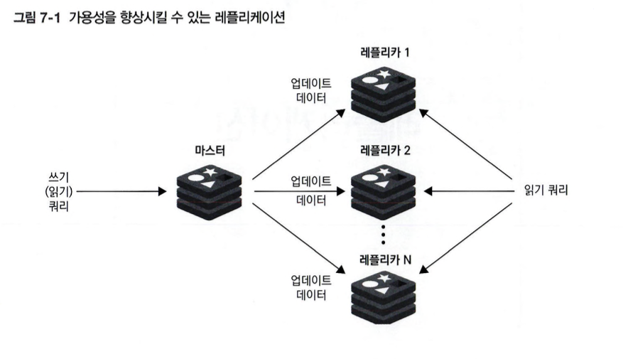

# 07. 레플리케이션

### 데이터 레플리케이션이란?
일반적으로 쓰기 작업이 있을 때마다 업데이트된 데이터를 다른 서버로 계속 보내 복제하는 것을 말하며 이런 방식을 통해 서버를 추가하고 리소스를 확작해 읽기 쿼리의 부하를 관리할 수 있고 데이터 중복성을 통한 페일오버로 가용성을 얻을 수 있다.

## 7.1 레플리케이션 기능
단일 노드 방식은 장애, 네트워크 연결 문제, 시스템 충돌 같은 문제에 영향을 쉽게 받기 때문에 실제 운영환경에선 다중 노드로 구성하여 가용성을 확보하고 레디스는 여러 노드로 운영하기 위한 레플리케이션 기능을 제공한다. 

마스터 레플리카 모델에선 지속적으로 마스터의 업데이트 내용을 여러 레플리카에 반영하고 RDBMS에서 사뇽하는 방식과 유사하며 주요 목적은 `읽기 작업 확장과 고가용성을 위한 중복성 확보`이다.