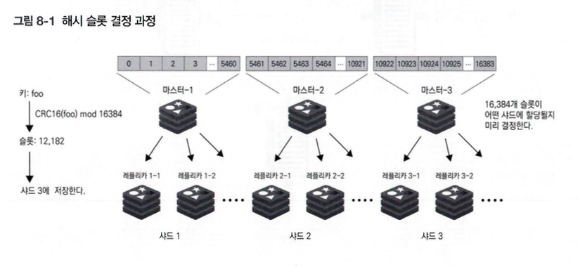
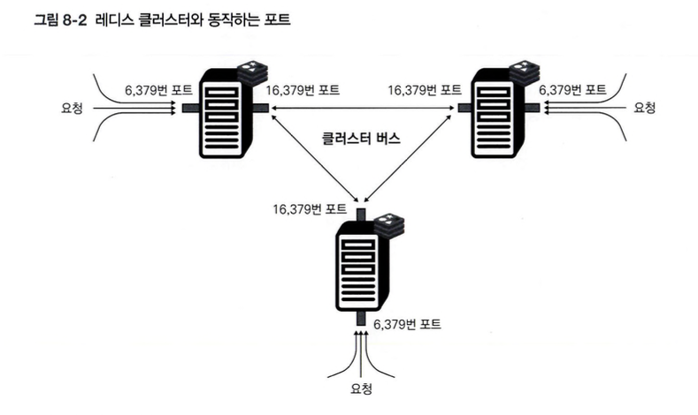
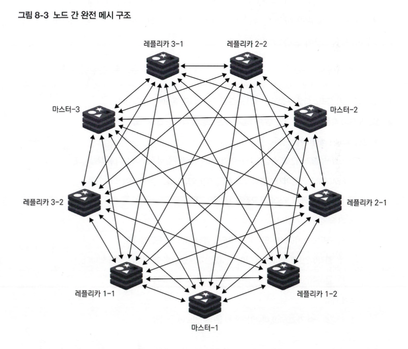
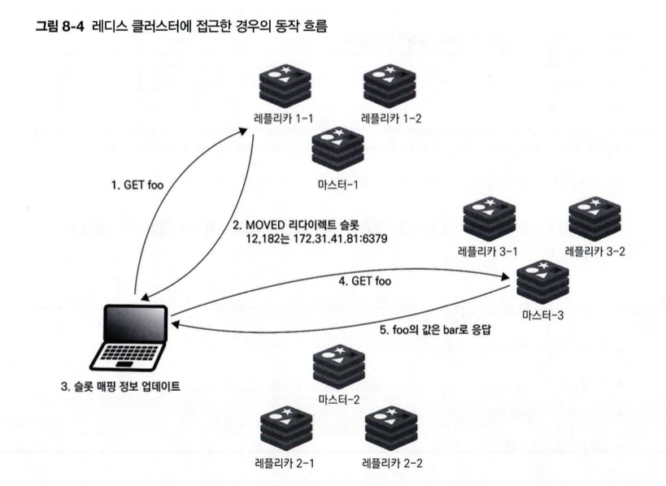
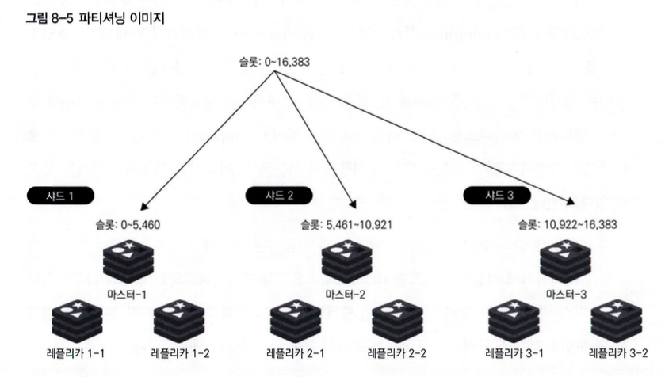

# 08. 레디스 클러스터

## 8.1 레디스 클러스터의 기능?
여러 캐시 노드를 연결하여 일부 장애가 발생해도 시스템을 계속 운영할 수 있도록 페일오버 기능을 지원하고 샤딩을 통해 레디스 서버가 실행 중일 때 노드 사이에 키를 옮길 수 있으며 높은 가용성과 쓰기 및 읽기 작업의 확장성을 높일 수 있다.

### 8.1.1 레디스 클러스터의 장점
레플리이션을 사용하면 레클리카의 수를 늘려서 읽기 작업의 확정성을 높일 수 있지만 쓰기 작업은 마스터에만 수행되서 확장성을 높이기 여럽기 때문에 레디스 클러스터는 샤딩을 제공한다, 각 샤드는 한 개의 마스터와 0개 이상의 레플리카로 구성되며 여러 샤드를 설정해 샤드의 수만큼 배치할 수 있고 데이터베스 내의 데이터를 슬롯에 할당한 후 샤드들이 담당할 슬롯을 결정해 어드 샤드에 데이터를 저장할지 결정한다.

READONLY 명령어를 사용하여 레플리카에서 읽기 쿼리를 수행하도록 설정하면 읽기 작업의 확장성을 높일 수 있다.

레디스 클러스터는 클라이언트 요청에 대해 각 노드 요청하는 과정에서 프록시를 사용하지 않아 오버헤드가 발생하지 않고 데이터가 없는 노드에 요청이 들어올 경우, 클러스터는 클라이언트에게 데이터를 가진 노드의 정보를 제공하여 요청을 리다이렉트합니다. 클라이언트는 이 정보를 저장하여 다음 요청 시 오버헤드를 줄일 수 있다.

레디스 클러스터에는 총 16,384개의 해시 슬롯이 있어 슬롯이 각 샤드에 할당되고 데터를 저장할 해 슬롯을 선택하기 위해서 키 값의 해시 결과를 사용한다.



레디스는 비동기 레플리케이션을 통해 일정 수준의 가용성과 일관성을 제공하며 최종 일관성 모델을 채택하고 있어서 CAP 이론에 따라 제한적인 일관성과 가용성을 제공하지만 실제 세계의 특성을 고려해 기능을 구현할 수 있다.

### 8.1.2 레디스 클러스터가 사용하는 두 개의 TCP 포트
레디스 클러스터 연결 시 두 개의 TCP 포트를 사용한다.
* 첫 번째 포트는 클라이언트로부터 TCP 연결을 받는 포트(기본 값 6,379번)
* 두 번째 포트는 클러스터 내부 통신을 위한 포트(기본 값에 + 10,000을 더한 16,379번)을 사용하며 `클러스터 버스 포트`라고 부른다.



NAT, 포트 포워딩을 사용하는 도커와 같은 컨테이너 환경에선 마스터에서 보이는 레플리카의 IP 주소, 포트 번호가 달라질 수 있어서 클러스터 내 다른 캐시 노드에 자신의 캐시 노드 IP 주소와 클러스터 버스 포트 번호를 임의의 값으로 설정할 수 있다.

레디스 클러스터 내에서 노드 간에 통신할 때는 클러스터 버스 포트를 사용하는데 통신 채널을 클러스터 버스라고 부르고 클러스터 버스를 통해서 다른 모드 노드와 연결된다, 통신에는 이진 프로토콜이 사용되고 노드는 완전 메시 구조로 구성되 노드 간 구성 정보, 상태 같은 정보를 교환한다.



하트비트 패킷(페일오버 인증, 설정 업데이트) 교환도 이뤄지고 가십 프로토콜을 통해서 내부적으로 클러스터 내의 노드 간에 설정 정보를 공유하고 인지하기 위해 Raft라는 분산합의 알고리즘 기반으로 시스템이 구현되어 있다.

### 8.1.3 동작 메커니즘
레디스 클러스터에서 클라이언트의 요청 처리 흐름은 아래와 같다.
1. 클라이언트가 클러스터를 구성하는 캐시 노드 중 하나의 IP 주소에 접속
2. 접근 노드의 레플리카 마스터인 경우 다음과 같은 내용에 따라 아래 조건에 따라 분기
* 접근 노드가 레플리카인 경우
  * 읽기 쿼리 (클라이언트 설정에 따라 READONLY 명령어 실행 여부에 따라 동작)
    * READONLY 명령어가 실행되었고, 해당 키가 노드의 슬롯 범위 내에 있는 경우
      * ① 요청된 캐시 노드에서 요청을 처리합니다.
    * 그 외 경우
      * ① 레디스 서버가 MOVED 리다이렉트를 클라이언트에 응답합니다.
      * ② 클라이언트가 MOVED 리다이렉트를 받고 로컬 슬롯 매핑을 업데이트합니다.
      * ③ 클라이언트가 해당 키의 슬롯을 가진 샤드의 마스터에 접근합니다.
  * 쓰기 쿼리
    * ① 레디스 서버가 WOVED 리다이렉트를 클라이언트에 응답합니다.
    * ② 클라이언트가 MOVED 리다이렉트를 받고 로컬 슬롯 매핑을 업데이트합니다.
    * ③ 클라이언트가 해당 키의 슬롯을 가진 샤드의 마스터에 접근합니다.
* 접속 노드가 마스터인 경우
  * 키가 해당 캐시 노드의 슬롯 범위 내인 경우
    * ① 요청된 마스터에서 처리합니다.
  * 키가 해당 캐시 노드의 슬롯 범위 밖인 경우
    * ① 레디스 서버가 NOVED 리다이렉트를 클라이언트에 응답합니다.
    * ② 클라이언트가 MOVED 리다이렉트를 받고 로컬 슬롯 매핑을 업데이트합니다.
    * ③ 클라이언트가 해당 키의 슬롯을 가진 샤드의 마스터에 접근합니다.



## 8.2 레디스 클러스터 장애 탐지
특정 샤드의 마스터 노드에 장애나 문제가 발생하는 상황이 존재하는데 시스템 내 마스터 노드 중 과반수가 응답하지 않는 상황이 발생하면 레디스 클러스터는 문제가 발생한 마스터가 속한 샤드 내의 레플리카를 마스터로 승격시키도록 동작한다.

### 8.2.1 장애 탐지 메커니즘
가십 프로토콜을 사용하여 주기적으로 핑을 보내고 클러스터 내의 노드들은 신뢰할 수 있는 노드에서 다른 노드의 상태 정보를 공유하는 형태로 노드 간의 상태를 파악한다.
* PFAIL(Possible Failure)
  * 특정 노드가 다른 노드에 핑을 보내고 cluster-node-timeout 이내에 응답이 오지 않을 때 해당 노 드는 로컬 정보에서 핑 대상 노드를 PFAIL로 표시
  * cluster-node-timeout / 2만큼 시간이 지나도 핑의 응답이 오지 않으면 연결을 다시 시도
  * 마스터 노드가 PFAIL 상태일 때는 페일오버를 실행할 수 없다.
* FAIL
  * FAIL 상태가 되어야 마스터의 페일오버를 실행할 수 있다.
  * PF시L에서 다음 조건에 따라 FAIL 상태 변경
    * 과반수의 마스터 노드가 대상 노드를 PFAIL 혹은 FAIL 상태로 판단하는 경우 해당 노드는 FAIL 상태가 된다.
    * 판단에 걸리는 시간은 cluster-node-timeout * cluster-replica-validity-factor로 계산한다.
  
레디스 클러스터의 cluster-replica-validity-factor가 0으로 설정되면, 마스터와 레플리카의 연결이 끊어져도 페일오버가 즉시 실행됩니다. 페일오버는 마스터 노드의 과반수가 정상이어야 하지만, 대부분의 노드가 사용 불가능할 경우에는 복구되지 않습니다. 오픈소스 레디스 클러스터는 소규모 장애에 대한 복구를 지원하며, 큰 장애에는 적합하지 않을 수 있습니다. 관리형 서비스에서는 복구가 가능할 수 있습니다.

네트워크 장애로 인해 데이터 손실이 발생할 수 있으며, 장애 발생 시 샤드 내의 데이터가 두 개의 마스터에 나눠 저장될 수 있습니다. 복구 과정에서 last failover wins 방식으로 새로운 마스터가 결정되며, 이전 마스터의 데이터는 손실될 수 있습니다. 레플리카와의 비동기적 복제 때문에 마스터에 저장된 후 레플리카에 기록되기 전 장애가 발생하면, 레플리카에 기록되지 않은 데이터는 손실될 수 있습니다.

### 8.2.2 레플리카 선출
#### 선출 프로세스가 시작되는 조건
1.  레플리카 마스터가 FAIL 상태여야 한다.
2.  마스터가 하나 이상의 슬롯을 관리한다.
3.  레플리카가 일정 시간 이상 마스터와 연결이 끊긴 상태여야 한다.

#### 선출하는 과정
1. 마스터가 FAIL 상태임을 감지한 레플리카는 일정 시간(DEUKY 밀리 초) 동안 대기한 후, 클러스터 내의 각 마스터에게 FAILOVER_AUTH_REQUEST(인증 요청) 패킷을 브로드캐스트한다.
   * cluster-node-timeout * 2의 시간만큼 대기
2. 각 마스터는 해당 패킷을 받으면 FAILOVER_AUTH_ACK(투표)로 응답한다.
   * 이후 cluster-node-timeout * 2의 시간 동안 다른 레플리카로부터 의 패킷에는 응답하지 않고 마스터는 각 에포크마다 한 번만 투표할 수 있다.
3. 레플리카는 currentEpoch 이하의 에포크 응답을 무시하고, 그렇지 않은 경우에는 반영한다.
   * 과반수의 마스터로부터 투표를 받으면, 해당 레플리카가 승격 대상으로 페일오버가 실행되고 과반수에 도달하지 못하면 재투표를 진행 (cluster-node-timeout * 2의 시간 동안 대기한 뒤 cluster-node-timeout * 4의 시간 후)
4. 새로운 마스터가 된 노드는 다른 마스터보다 더 크게 conf igEpoch를 증가시킨다.

#### 선출하는 과정 (레플리카 관점)
레플리카의 DELAY 시간은 마스터가 FAIL 상태임을 감지한 후, 500밀리 초 동안 기다린 후 각 마스터에게 투표 요청을 보낸다.
> DELAY = 500밀리 초 + 무작위 지연(0〜500밀리 초) + REPLICA_RANK * 1000밀리 초

* 각 마스터는 lastVoteEpoch를 가지며, 인증 요청의 currentEpoch가 더 작으면 투표를 반영하지 않습니 다. 마스터가 레플리카에 정상적으로 응답하면 lastVoteEpoch가 업데이트되고 디스크에 저장
* 각 마스터는 레플리카의 마스터가 FAIL 상태로 판단될 경우에만 레플리카에 투표를 진행
* 인증 요청의 currentEpoch가 마스터의 currentEpoch보다 작은 경우는 반영하지 않으며, 마스터의 응답은 인증 요청과 동일한 currentEpoch

## 8.3 레디스 클러스터 키워드
### 8.3.1 슬롯
* 레디스 클러스터 구조
  * 각 샤드는 하나의 마스터와 0개 이상의 레플리카를 가진다.
  * 총 16,384개의 슬롯이 클러스터의 각 샤드에 분배된다.
* 키 해싱 및 슬롯 할당
  * 키는 CRC16 해시 함수를 사용하여 해시값을 계산한다.
  * 해시값을 16,384로 나눈 나머지를 구해 해당 슬롯을 결정한다.
  * 공식 `HASH_SLOT = CRC16(key) mod 16384`
  * 결정된 슬롯을 가진 샤드가 요청을 처리한다.
* 데이터 분산
  * 슬롯은 각 샤드에 할당되며, 데이터는 해싱된 슬롯을 기준으로 분산된다.
  * 데이터 크기는 고려되지 않고 슬롯의 개수에 따라 데이터가 분산된다.
  * 결과적으로, 특정 샤드에 데이터가 집중될 수 있으며 슬롯 할당에 편향이 발생할 수 있다.
* 슬롯 구성 확인
  * 슬롯 구성은 CLUSTER SHARDS (7.0 이상), CLUSTER NODES, CLUSTER SLOTS 명령어로 확인할 수 있다 (단, CLUSTER SLOTS는 비추천)

### 8.3.2 해시태그
* 해시태그 개념
  * 키를 해싱하여 어느 슬롯에 데이터를 저장할지 결정한다.
  * MSET과 같이 여러 키를 동시에 조작할 때는 모든 키가 동일한 슬롯에 있어야 한다.
  * 다른 슬롯에 있는 키에 접근하려고 하면 `CROSSSLOT` 오류가 발생한다.
* 일관 보장
  * Redis 7.0.3부터는 일관성을 보장하기 위해, 여러 키를 동시에 조작할 때 키가 존재하지 않거나 리샤딩 중인 경우 `TRYAGAIN` 오류를 반환한다.
* 해시태그 사용 방법
  * 해시태그 기능을 사용하여 서로 다른 키라도 같은 슬롯에 접근할 수 있다.
  * 해시태그를 사용하려면 키 내의 공통 문자열을 `{}`로 감싸야 한다.
  * 예시 → `user1000`의 정보를 같은 슬롯에 저장하려면 `{user1000}.following`처럼 표현한다.
* 해시태그 조건
  * 키에 `{`을 포함해야 한다.
  * `{`의 오른쪽에 `}`을 포함해야 한다.
  * `{}` 사이에 하나 이상의 문자가 포함돼야 한다.
  * 예시 → `{{foo}}bar`에서 `{foo}`가 해시 대상이 된다.
* 주의사항
  * 해시태그를 남용하면 슬롯 간 요청에서 편향이 발생할 수 있으므로 주의해야 한다.

### 8.3.3 클러스터 버스
* 클러스터 버스 개요
  * 레디스 클러스터 내의 각 노드는 클러스터 버스를 통해 연결된다.
  * 클러스터 버스는 TCP 기반의 이진 프로토콜과 완전 메시 구조를 사용한다.
  * 기본적으로 레디스의 대기 포트 번호에 10,000을 더한 포트를 사용한다.
  * Redis 7.0부터는 `cluster-port` 지시자를 통해 클러스터 통신 포트를 설정할 수 있다.
* 컨테이너 환경과 IP 인식
  * 도커와 같은 NAT 또는 포트 포워딩을 사용하는 환경에서는 마스터 노드가 레플리카의 IP 주소나 포트를 다르게 인식할 수 있다.
  * 레디스 클러스터는 각 노드가 자신의 IP와 클러스터 버스 포트를 자유롭게 설정할 수 있도록 한다.
* 가십 프로토콜 및 Raft
  * 클러스터 버스에서는 노드 상태 파악을 위해 가십 프로토콜을 사용한다.
  * Raft 알고리즘을 기반으로 노드의 설정 정보를 공유하고 페일오버 기능을 제공한다.
* 핑 메시지 및 완전 메시 방식
  * 각 노드는 상대 노드에 핑을 보내고 응답을 받아 노드 상태를 확인한다.
  * 모든 노드 쌍에 핑을 주고받는 완전 메시 방식은 사용되지 않는다. 이유는 노드 수가 많아지면 핑의 양이 급격히 증가하여 성능이나 네트워크 대역폭에 영향을 줄 수 있기 때문이다.
  * 일반적으로 각 노드는 무작위로 선택된 다른 노드에 핑을 보내고 응답을 받으며, 핑 패킷의 총량을 일정하게 유지한다.
* 노드 상태 검사
  * `cluster-node-timeout` 설정 시간의 절반을 초과하는 동안 다음 조건을 만족하는 노드가 있을 경우, 모든 노드에 핑을 보내도록 설정되어 있다:
    * 핑이 이전에 송신되지 않은 노드
    * 핑의 응답을 받지 못한 노드
* 메시지 증가 방지
  * 가십 프로토콜과 설정 업데이트 기능을 통해 메시지 수의 급격한 증가를 방지한다.
  * 캐시 노드가 추가되면 메시지 개수는 선형적으로 증가하지만, 메시지 크기는 지수적으로 증가한다.
* 클러스터 외부 노드 처리
  * 클러스터에 속하지 않은 노드에서 오는 핑 메시지는 수신되면 응답을 반환하나, 클러스터 외부 노드에서 오는 패킷은 폐기된다.
* 클러스터에 노드 추가
  * MEET 메시지
    * `CLUSTER MEET <ip> <port>` 명령을 통해 노드를 클러스터에 추가할 수 있다. 해당 명령을 받은 노드는 대상 노드를 클러스터의 일부로 인식한다.
  * 가십 프로토콜
    * 노드 A가 노드 B에게 다른 노드의 정보를 전달하여 노드 B도 해당 노드를 인식하게 한다.
* 슬롯 배치 및 업데이트
  * 슬롯 배치는 다음 두 종류의 메시지로 관리된다:
    * 하트비트 메시지
      * 핑/퐁퐁을 보낼 때 슬롯 구성 정보를 포함하여 전달한다. 발신자의 `configEpoch`와 슬롯 구성 정보가 포함된다.
      * 수신자가 발신자의 노드 정보가 오래되었다고 판단하면 `UPDATE` 메시지로 업데이트를 요청한다.
    * UPDATE 메시지
      * 하트비트 메시지에서 정보가 오래되었다고 판단한 경우, `UPDATE` 메시지로 슬롯 구성을 업데이트한다.
      * 클러스터에서 제외된 노드를 다시 추가할 때 다른 노드에 핑을 보내는 경우, `UPDATE` 메시지로 업데이트를 요청하게 된다.

### 8.3.4 파티셔닝
* 파티셔닝 개요
  * 파티셔닝은 여러 레디스 인스턴스 간에 데이터 세트를 분할하여 저장하는 작업이다.
  * 이를 통해 여러 컴퓨터의 메모리, 처리 능력, 네트워크 대역폭을 활용하여 더 큰 데이터베이스를 지원할 수 있다.
* 파티셔닝 방식
  * 레인지 파티셔닝 (Range Partitioning)
    * 키의 범위를 기준으로 데이터를 분할한다.
    * 간단하지만 레인지와 노드의 매핑 테이블이 별도로 필요하다.
  * 해시 파티셔닝 (Hash Partitioning)
    * 해시 함수를 사용해 키를 슬롯에 매핑한다.
    * 매핑 테이블이 필요 없고, 키의 형식에 구애받지 않는다.
* 파티셔닝 실행 방법
  * 클라이언트 측 파티셔닝
    * 클라이언트가 직접 요청을 어느 노드로 보낼지 결정한다.
    * 레디스 클라이언트는 슬롯과 슬롯별 캐시 노드의 매핑 정보를 보관한다.
  * 프록시 기반 파티셔닝
    * 클라이언트의 요청을 프록시가 받아서 적절한 노드로 라우팅한다.
    * 대표적인 오픈소스 소프트웨어: `twemproxy`
      * `twemproxy`는 Redis나 Memcached의 ASCII 모드를 지원하며 데이터 샤딩을 수행할 수 있다.
      * 명령어에 제한이 있을 수 있으며, 노드 추가, 삭제 및 설정 변경 시 재시작이 필요하다.
  * 쿼리 라우팅
    * 클라이언트의 요청을 무작위 노드로 보내고, 적합하지 않을 경우 요청을 다른 노드로 리다이렉트한다.
* 레디스 클러스터의 파티셔닝 방식
  * 레디스 클러스터는 클라이언트 측 파티셔닝과 쿼리 라우팅을 결합한 형태를 사용한다.
  * 레디스 클러스터 프록시는 프록시 기반 파티셔닝을 사용한다.



## 8.4 레디스 클러스터 지원 클라이언트
레디스 클러스터를 사용하려면 클라이언트에서도 레디스 클러스터 기능을 지원해야하고 레디스 클러스터 지원 클라이언트는 MOVED 리다이렉트와 ASK 리다이렉트를 처리할 수 있어야 한다는 점이다.

### 8.4.1 MOVED 리다이렉트와 ASK 리다이렉트
* 레디스 클러스터와 슬롯 할당
  * 레디스 클러스터는 여러 샤드로 구성되며, 16,384개의 슬롯을 각 샤드에 할당한다.
  * 키의 해시값을 계산하여 슬롯에 할당하고, 슬롯에 따라 데이터를 저장할 샤드를 결정한다.
* MOVED 리다이렉트
  * 클라이언트가 요청을 처리할 수 없는 캐시 노드에 접근하면, MOVED 리다이렉트가 발생한다.
  * 클라이언트는 처리 가능한 샤드의 마스터로 리다이렉트된다.
  * 이후 처리되는 모든 쿼리는 새로 리다이렉트된 노드로 전송된다.
  * 예시: 클라이언트가 127.0.0.1에서 GET 명령어를 실행하고, MOVED 리다이렉트에 따라 172.23.0.6으로 리다이렉트되어 값을 가져온다.
* ASK 리다이렉트
  * ASK 리다이렉트는 다음 쿼리만 리다이렉트한다.
  * 주로 특정 슬롯을 다른 캐시 노드로 이동시킬 때 임시적으로 사용된다.
  * 리다이렉트된 노드는 이후 쿼리 처리를 계속할 수 있다.
* 차이점
  * MOVED 리다이렉트는 이후 모든 쿼리를 리다이렉트하며, ASK 리다이렉트는 단지 다음 쿼리만 리다이렉트한다.

### 8.4.2 레디스 클러스터 지원 클라이언트 동작
* 슬롯 매핑 정보 유지
  * 레디스 클러스터는 매핑 정보가 없거나 최신이 아닐 때도 리다이렉트를 통해 동작할 수 있다.
  * 성능 향상을 위해 클라이언트에서 샤드별로 슬롯 매핑 정보를 유지하는 것이 권장된다.
  * 레디스 클러스터는 프록시를 사용하지 않고 직접 노드에 연결하여 단일 캐시 노드와 동일한 성능을 낼 수 있도록 설계되었다.
* 슬롯 매핑 업데이트
  * MOVED 리다이렉트: 클라이언트가 MOVED 리다이렉트를 받으면 로컬 슬롯 맵이 업데이트된다.
  * ASK 리다이렉트: ASK 리다이렉트가 발생해도 로컬 슬롯 맵은 업데이트되지 않는다.
* 슬롯 배치 정보 조회
  * `CLUSTER NODES` 명령어나 `CLUSTER SHARDS` 명령어 (레디스 7.0 이전에는 `CLUSTER SLOTS`)를 통해 슬롯 배치 정보를 확인할 수 있다.
  * 실제 정보 조회 방법은 사용하는 클라이언트에 따라 다를 수 있다.

### 8.4.3 레디스 클러스터 지원 클라이언트 사용 방법
* 클라이언트 사용 방법
  * PhpRedis: `new Redis` 대신 `new RedisCluster`로 객체를 생성해야 한다.
  * redis-cli: 레디스 클러스터를 사용할 때는 `-c` 옵션을 추가해야 한다.
  * 클라이언트마다 사용 방법이 다르므로, 사용하는 클라이언트의 문서를 참조해야 한다.
* 클러스터 비지원 클라이언트 문제
  * 레디스 클러스터를 지원하지 않는 방식으로 사용할 경우, 겉으로는 정상 작동하지만 오류나 예기치 않은 행동이 발생할 수 있다.
  * 클러스터를 지원하는지 여부를 확인하고, 레디스 클러스터에 적합한 클라이언트를 사용해야 한다.
* 레디스 클러스터 프록시
  * 레디스 클러스터 프록시: 레디스 6 RC1과 함께 발표된 프록시로, 클러스터를 지원하지 않는 클라이언트에서 레디스 클러스터를 하나의 인스턴스처럼 사용할 수 있게 한다.
    * 기능: 여러 명령어를 동시에 처리, MOVED 오류 후 슬롯 배치 업데이트, 서로 다른 슬롯에 대한 쿼리 라우팅 등 지원.
    * 제한사항: 2020년 이후로 GitHub에서 활동이 없으며, 사용 가능한 명령어에 제한이 있다.
  * Envoy Redis: 최근 등장한 프록시로, twemproxy를 지원하지 않는 레디스 클러스터에서도 사용할 수 있다.
    * 장점: 클라이언트의 레디스 클러스터 지원이 미흡할 경우, 프록시를 통해 지원 가능.
    * 주의사항: 성능 요구사항을 충족하는지 사전에 테스트해야 한다.
* RedisRaft 모듈
  * 현재 개발 중이며, 강력한 일관성을 실현하는 모듈이다.
  * 읽기와 쓰기 데이터의 강력한 일관성을 보장하지만, 일부 명령이 제한되거나 성능이 저하될 수 있다.

### 8.6.1 모든 마스터 혹은 모든 레플리카에 특정 작업 실행
* FLUSHALL 명령어 사용
  * FLUSHALL 명령어는 모든 데이터베이스의 데이터를 삭제하며, 데이터 세트를 변경하므로 마스터 노드에서만 실행할 수 있다.
  * 레플리카에서는 `READONLY` 오류가 발생하며, FLUSHALL 명령어는 MOVED 리다이렉트 오류 처리를 지원하지 않는다.
  * 레플리카에서 실행하면 오류가 발생하고, 마스터에서 실행해야 한다.
* 관리형 서비스와 단일 엔드포인트
  * ElastiCache와 같은 관리형 서비스를 사용하는 경우 단일 엔드포인트를 통해 클러스터에 연결할 수 있다.
  * 이 엔드포인트는 클라이언트 요청을 처리할 수 있는 캐시 노드 중 하나의 엔드포인트를 반환하며, 마스터나 레플리카에 따라 달라질 수 있다.
  * `--cluster-only-masters` 옵션을 사용하면 레디스 클러스터의 모든 샤드의 마스터에 명령을 실행할 수 있다.
* 명령 실행 예시
  * 모든 마스터 캐시 노드에 대해 FLUSHALL 명령어를 실행할 때:
    ```sh
    $ redis-cli --cluster call 172.28.0.7:6379 FLUSHALL --pass foobared --cluster-only-masters
    ```
    - 명령 실행 결과: 모든 마스터에서 `OK` 응답을 받음.
* 다른 용도의 활용
  * `--cluster-only-masters` 옵션을 사용하여 모든 마스터에 FUNCTION LOAD를 실행하면, 레디스 클러스터 내 모든 샤드에 함수를 등록할 수 있다.
  * 레플리카에는 자동으로 복제되므로, 마스터에서 한 번만 실행하면 충분하다.
  * 레플리카에만 명령을 실행하고 싶다면 `--cluster-only-replicas` 옵션을 사용할 수 있다.