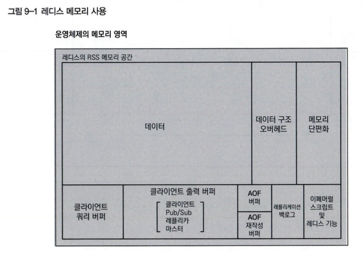

# 09. 메모리 관리

## 9.1 메모리 관리 아키텍처
레디스 서버는 메모리(운영체제 내의 RSS 영역)을 아래와 같은 형태로 사용한다.

#### 메모리 할당과 반환
레디스는 malloc 함수를 사용해 메모리를 할당하며, 운영체제의 메모리 페이지 할당 매핑을 제어할 수 없습니다. 따라서 데이터를 삭제해도 메모리가 운영체제로 반환되지 않으며, 실제 메모리 사용량(RSS)은 변하지 않습니다. 예를 들어, 5GB의 데이터 중 2GB를 삭제해도 운영체제는 여전히 5GB를 사용 중이라고 인식합니다. 레디스는 새 데이터를 추가할 때 기존 메모리 청크를 재사용하여 메모리 효율성을 높입니다.

#### 클라이언트 쿼리 버퍼
클라이언트가 보낸 명령어는 클라이언트 쿼리 버퍼에 저장되며, 데이터는 점진적으로 소켓을 통해 읽힙니다. 복잡한 명령어나 큰 데이터 처리 시, 이 버퍼링 과정이 서버의 안정성을 유지하는 데 도움이 됩니다. 버퍼 크기는 레디스 4.0.7 이전에는 1GB로 고정되어 있었지만, 이후 버전에서는 client-query-buffer-limit 지시자로 조정할 수 있습니다.

#### 클라이언트 출력 버퍼
명령어의 실행 결과는 클라이언트 출력 버퍼에 저장되며, 이 버퍼의 크기는 client-output-buffer-limit 지시자로 조정 가능합니다. 버퍼 크기를 초과하면 연결이 끊어지도록 설정할 수 있으며, 하드 리미트와 소프트 리미트 두 가지 방식이 있습니다. 하드 리미트를 초과하면 즉시 연결이 끊어지고, 소프트 리미트는 지정된 시간 동안 초과할 경우 연결이 끊어집니다.

### 9.1.1 INFO Memory 출력 결과 해석
#### used_memory와 maxmemory의 관계
used_memory는 레디스가 jemalloc 같은 메모리 할당자를 사용하여 할당한 메모리의 크기를 의미하며, 실제로 데이터가 사용하는 크기를 나타냅니다. 하지만 클라이언트 출력 버퍼 등도 포함되어 있어 데이터만 사용하는 것이 아닙니다. maxmemory는 레디스가 사용할 수 있는 최대 메모리 크기를 나타내며, maxmemory 값이 초과되면 maxmemory-policy 지시자에 따라 동작합니다. 특히, 레디스를 캐시 서버나 임시 저장소로 사용할 경우 maxmemory를 설정하는 것이 좋습니다.

#### 메모리 할당과 반환의 특징
레디스는 malloc 함수를 사용해 메모리를 할당하기 때문에 운영체제의 메모리 페이지 할당 매핑을 제어할 수 없습니다. 데이터 삭제 시 메모리가 운영체제로 반환되지 않아 실제 메모리 사용량(RSS)에는 변화가 없습니다. 예를 들어, 5GB의 데이터 중 2GB를 삭제해도 운영체제는 여전히 5GB를 사용 중으로 인식합니다. 새로운 키를 추가할 때 기존 메모리 청크를 재사용하기 때문에, 사용 메모리가 5GB를 초과하지 않는 한 RSS 값은 변하지 않습니다.

1. 클라이언트 쿼리 버퍼와 출력 버퍼
클라이언트가 보낸 명령어는 '클라이언트 쿼리 버퍼'에 저장되고, 점진적으로 소켓을 통해 데이터를 읽어 처리합니다. 클라이언트 출력 버퍼는 명령어 실행 결과를 저장하며, 메모리 소비가 크면 연결이 끊어질 수 있습니다. client-output-buffer-limit 지시자로 버퍼 크기를 조정할 수 있지만, 여러 클라이언트가 동시에 있을 때는 효과가 제한적입니다. 레디스 7.0 이후에는 maxmemory-clients 지시자로 모든 클라이언트의 메모리 소비량을 제한할 수 있습니다. 제한값을 초과하면 가장 많은 메모리를 소비하는 클라이언트의 연결이 해제됩니다.

#### mem_not_counted_for_evict
mem_not_counted_for_evict는 AOF 버퍼, AOF 재작성 버퍼, 레플리카용 클라이언트 출력 버퍼, RDB 스냅숏 생성 시 COW에 의해 사용된 메모리 양의 합계를 나타냅니다. 이는 used_memory에 포함되지만, maxmemory 계산에서는 제외됩니다. 따라서 실제 사용 메모리(used_memory - mem_not_counted_for_evict)가 maxmemory를 초과하지 않도록 관리해야 합니다.

#### 클러스터와 메모리 관리
레디스 7.0 이후부터 클러스터 버스에서 사용하는 메모리 정보를 INFO 명령어의 mem_cluster_links와 CLUSTER LINKS 명령어의 send-buffer-allocated 값으로 확인할 수 있습니다. 기본적으로 클러스터 링크의 전송용 버퍼 크기에는 제한이 없으며, cluster-link-sendbuf-limit 값으로 조정할 수 있습니다.

#### 메모리 단편화율
메모리 단편화율(mem_fragmentation_ratio)은 레디스가 인식하는 메모리 사용량과 실제 RSS 메모리 사용량 간의 비율을 나타내며, 이는 메모리 단편화 상태를 보여줍니다. 계산 공식은 mem_fragmentation_ratio = used_memory_rss / used_memory입니다. 단편화율이 높으면 메모리 관리에 비효율이 발생할 수 있습니다.

#### AOF 버퍼와 스크립트 캐시
AOF(Append-Only File)는 데이터 변경 사항을 지속적으로 파일 끝에 추가하는 방식으로 작동하며, 명령어는 AOF 버퍼에 임시 저장된 후 플러시 작업을 통해 디스크에 영구 저장됩니다. 이 과정에서 자식 프로세스를 통해 AOF 재작성을 수행하며, 부모 프로세스는 쓰기 작업 내용을 AOF 재작성 버퍼에 저장합니다. 스크립트 캐시는 메모리 사용량이 적어 큰 문제를 일으키지 않으며, 동일한 해시값을 가진 스크립트를 재사용할 수 있어 메모리와 대역폭 절감에 도움이 됩니다.

#### 메모리 단편화 문제 대처 방법
레디스의 mem_fragmentation_ratio는 메모리 단편화율을 나타내며, 이를 통해 현재 메모리 단편화 상황을 평가하고 대처 방법을 고려할 수 있습니다. 이 항목의 주요 내용은 다음과 같습니다
* 단편화율 해석
  * 1.0 ~ 1.5 단편화율이 1.0이거나 약간 더 높으면 메모리 상태가 양호한 편입니다
  * 1.5 이상 단편화율이 1.5 이상이면 메모리 단편화가 심각하고 성능 문제가 발생할 수 있으므로 주의가 필요합니다
  * 1.0 미만 단편화율이 1보다 낮다면 스왑이 발생할 가능성이 있습니다
* 단편화율의 의미
  * mem_fragmentation_ratio는 레디스가 현재 사용 중이라고 인식하는 메모리 사용량을 실제 RSS 메모리 사용량과 비교한 값입니다. 많은 양의 키를 한꺼번에 삭제한 후에는 단편화율이 증가할 수 있습니다
  * 데이터의 삭제와 저장이 빈번하면 메모리 단편화가 발생할 가능성이 높아지고, 이는 성능 저하로 이어질 수 있습니다
* 단편화 대처 방법
  * 레디스 재시작: RDB나 AOF 파일을 불러와 데이터를 복원합니다
  * 동적 단편화: 레디스 내부에서 메모리 단편화를 줄이는 작업을 수행합니다
  * 메모리 스왑 제한: 스왑 발생을 제한하여 성능 저하를 방지합니다
  * 메모리 할당자 변경: 필요에 따라 메모리 할당자를 변경해 단편화를 줄일 수 있습니다
  * MEMORY PURGE 명령어 사용: jemalloc을 사용하는 환경에서 메모리를 즉시 해제하여 재사용할 수 있습니다. 레디스 4.0.0 이상에서만 사용할 수 있습니다

관리형 서비스나 클라우드 환경에서는 레디스 재시작이나 메모리 스왑 제한에 제약이 있을 수 있으므로, 노드 재생성과 같은 클라우드 서비스의 대안을 고려할 수 있습니다.

### 9.1.2 클라이언트 출력 버퍼
레디스 서버는 각 클라이언트, 레플리카, Pub/Sub, 기능용 COB(Client Output Buffer)를 가지고 있습니다.

#### COB(Client Output Buffer)?
COB는 특정 이유로 서버로부터 데이터를 즉시 읽지 못하는 클라이언트의 연결을 강제로 끊는 용도로 사용되며 레디스 서버는 클라이언트마다 COB를 갖추고, 서버에서 처리한 결과를 직접 클라이언트에게 보내지 않고 일단 COB에 저장한 뒤 
COB에 저장된 정보가 클라이언트에 한번에 전송됩니다.
* 버퍼 크기가 커질 수 있는 상황
  * 다루는 데이터 크기가 큰 경우
  * 스토리지가 느린 경우
  * 네트워크 환경이 좋지 않은 경우

COB를 많이 사용하는 클라이언트가 있고, COB의 크기에 제한을 두지 않으면 다른 처리 작업에 영향을 줄 수 있고, 버퍼 크기에 제한 설정을 하면 COB 크기를 초 과했을 때 해당 클라이언트의 연결을 끊을 수 있습니다.

#### 클라이언트 출력 버퍼 종류
레디스의 클라이언트 출력 버퍼(COB)에는 세 가지 유형이 있으며, 각각의 특징과 관리 방법이 중요합니다.
* Pub/Sub 유형
  * Pub/Sub 기능에서 발행자가 생성한 메시지를 클라이언트가 소비하지 못하는 경우, 레디스 서버의 메모리 사용량이 증가할 수 있습니다.
  * Pub/Sub 유형의 COB는 버퍼 크기에 제한을 두어, 클라이언트 출력 버퍼가 초과되면 연결을 끊도록 설정할 수 있습니다.
* Replica 유형
  * 마스터에서 레플리카로 데이터를 복제하는 과정에서 사용됩니다.
  * 스냅숏 생성 시, 레플리카의 COB에 쓰기 요청이 쌓이므로 관리가 필요합니다. 레플리카의 COB가 초과되면 레플리카는 마스터에 동기화를 요청하며, 전체 동기화 과정에서 성능 저하가 발생할 수 있습니다.
  * 적절한 버퍼 크기를 설정하거나 필요에 따라 비활성화해야 합니다.
* Normal 유형
  * 일반적인 클라이언트 연결에 사용되는 버퍼입니다.
  * 기본적으로 제한값이 0으로 설정되어 있어 연결을 끊지 않도록 설정됩니다.

레디스에서 client-output-buffer-limit 지시자는 COB의 크기를 제한하는 데 사용됩니다. 각 COB 유형에 대해 하드 리미트와 소프트 리미트를 설정할 수 있습니다.
* 하드 리미트: COB의 메모리 크기가 설정된 제한에 도달하면 즉시 연결이 끊깁니다.
* 소프트 리미트: 제한에 도달한 후 지정된 시간 동안 유지되면 연결이 끊깁니다.

레디스 7.0 이후, COB는 더 효율적으로 메모리를 관리하도록 개선되었습니다, CLIENT LIST 명령어를 통해 클라이언트의 응답 버퍼 크기와 메모리 사용량을 모니터링할 수 있으며, INFO stats 명령어를 통해 응답 버퍼의 축소 및 확장 횟수를 확인할 수 있습니다.

## 9.2 키 만료
주로 캐시 용도로 사용되기 때문에 데이터를 가능한 한 최신 상태로 유지하고, 오 래된 데이터는 갱신할 필요가 있어서 최대한 캐시 내 데이터를 재사용하고 데이터베이스 접근 횟수를 줄여 효율적으로 운영할 필요가 있습니다, 또한 TTL을 설정해 적절하게 만료처리를 관리해야 합니다.

### 9.2.1 만료 방법
레디스에서 키의 만료를 처리하는 방법은 수동적 방법과 능동적 방법으로 나뉩니다. 두 방법은 기본적으로 조합되어 사용됩니다.
* 수동적 방법
  * 클라이언트가 키에 접근할 때 해당 키의 TTL(Time To Live)이 만료되었는지 확인합니다. 만료된 경우, 키를 메모리에서 삭제합니다.
* 능동적 방법
  * 레디스는 매초 10번, 임의로 20개의 키를 샘플링하여 만료된 키를 확인하고 삭제합니다. 샘플링된 키 중 25% 이상이 만료되면, 이 과정을 반복합니다.
  * 이 방법은 레디스의 싱글 스레드 구조로 인해 다른 작업에 지연을 초래할 수 있으므로, 주의가 필요합니다.
* 타이머 이벤트와 빠른 만료 주기
  * 레디스 서버는 정기적으로 실행되는 타이머 이벤트를 통해 능동적 만료 작업을 수행합니다. 이 이벤트의 실행 빈도는 hz 지시자 값으로 조정할 수 있습니다.
  * 빠른 만료 주기라는 방식은 이벤트 루프의 각 주기마다 실행되며, 만료된 키의 비율이 10% 이하이거나 메모리의 25% 이하 크기를 소비하도록 설계되었습니다. active-expire-effort 지시자로 이를 조정할 수 있습니다.

> 이러한 만료 처리 방법들은 레디스의 메모리 관리와 성능 유지에 중요한 역할을 합니다.

### 9.2.2 삭제 정책
만료된 키를 처리하는 방법으로만은 메모리 공간을 충분히 확보하지 못할 수 있고, 만약 만료될 키가 없으면 메모리 사용량이 최대치에 도달할 수 있기 때문에 `레디스에선 메모리 사용량이 maxmemory 지시자로 설정된 값에 도달했을 때 메모리 확보를 위해 키를 삭제하는 과정`이 이루어집니다.

#### maxmemory-policy에 설정할 수 있는 값 목록
<table border="1" cellpadding="8" cellspacing="0">
  <thead>
    <tr>
      <th>정책</th>
      <th>상세</th>
    </tr>
  </thead>
  <tbody>
    <tr>
      <td>noeviction</td>
      <td>오류를 반환하고 어떤 키도 삭제하지 않는다.</td>
    </tr>
    <tr>
      <td>volatile-random</td>
      <td>TTL이 설정된 키 중에서 임의로 키를 선택해 삭제한다.</td>
    </tr>
    <tr>
      <td>allkeys-random</td>
      <td>모든 키 중에서 임의로 키를 선택해 삭제한다.</td>
    </tr>
    <tr>
      <td>volatile-lru</td>
      <td>TTL이 설정된 키 중에서 가장 최근에 사용되지 않은 키(LRU)를 선택해 삭제한다.</td>
    </tr>
    <tr>
      <td>allkeys-lru</td>
      <td>모든 키 중에서 가장 최근에 사용되지 않은 키를 선택해 삭제한다.</td>
    </tr>
    <tr>
      <td>volatile-ttl</td>
      <td>TTL이 설정된 키 중에서 남은 TTL이 가장 짧은 키를 선택해 삭제한다.</td>
    </tr>
    <tr>
      <td>volatile-lfu</td>
      <td>TTL이 설정된 키 중에서 가장 적게 사용된 키(LFU)를 선택해 삭제한다.</td>
    </tr>
    <tr>
      <td>allkeys-lfu</td>
      <td>모든 키 중에서 가장 적게 사용된 키를 선택해 삭제한다.</td>
    </tr>
  </tbody>
</table>

메모리 사용 문제에 대처하기 위해서는 키의 TTL 설정을 확인하거나, 다른 maxmemory-policy를 시도하는 것이 효과적이고 임시 해결책으로는 DEL 명령어를 사용하여 불필요한 키를 삭제하거나 클라우드 환경에서 더 많은 메모리 용량을 가진 캐시 노드 타입을 사용하여 메모리 용량을 증가시키는 방법이 있지만 메모리 관리 전략을 재검토하고 필요한 경우에는 삭제 정책을 변경하는 것을 먼저 고려해야 한다.

리눅스에서는 메모리 사용량이 캐시 노드의 메모리를 압박할 경우 OOM Killer 가 활성화되어 프로세스를 강제 종료할 수 있어서 레디스 서버가 중단될 가능성이 있어 메모리 사용량을 모니터링해야 합니다.

#### LFU 메커니즘
LFU(Least Frequently Used) 메커니즘은 사용 빈도가 가장 낮은 항목을 삭제 대상으로 선택하는 알고리즘입니다. LFU는 사용 빈도를 정확히 카운트하는 대신, 확률에 기반한 근사치를 계산하는 방식을 사용합니다. 이는 밑수를 정하고 지수 부분만 기억하여 실제 사용 빈도를 추정하는 방법으로, 자주 사용될수록 지수값이 올라가고 사용 빈도가 낮을수록 지수값이 커질 확률이 높아집니다. 그러나 지수가 클수록 사용될 확률이 낮아지고, 오차가 커질 수 있습니다.

레디스에서 LFU는 세 가지 동작으로 이루어집니다
* 각 키에 접근할 때마다 카운터가 증가.
* 시간이 지나면 카운터가 감소.
* 카운터 값이 낮은 키를 삭제.

레디스의 기본 설정에서는 100만 번의 요청당 한 번, 1분 간격으로 카운터가 감소되도록 되어 있으며, lfu-log-factor와 lfu-decay-time 지시자를 통해 이를 조정할 수 있습니다. lfu-log-factor는 지수값을 설정하고, lfu-decay-time은 카운터 감소 시간을 분 단위로 설정합니다.

LFU 카운터는 각 키에 대해 8비트로 할당되어 최대값은 255입니다. 기본 설정에서 LFU 카운터가 255에 도달하려면 100만 번의 요청이 필요합니다. 이는 사용 빈도가 높은 키가 삭제되지 않도록 보장하지만, 지수가 커질수록 요청을 통해 카운터가 최대값에 도달하는 데 더 많은 시간이 걸리게 됩니다.

#### LRU 메커니즘
LRU(Least Recently Used) 메커니즘은 메모리 관리에서 가장 오랫동안 사용되지 않은 키를 삭제 대상으로 선택하는 알고리즘입니다.
* 레디스의 LRU 방식
  * 레디스는 일반적인 LRU 방식과 다르게, 무작위로 선택된 일정 수의 키 중에서 가장 오랫동안 사용되지 않은 키를 삭제 대상으로 선정하는 근사적인 LRU 방식을 사용합니다.
* 샘플링 과정
  * maxmemory-samples 지시자를 통해 무작위로 샘플링할 키의 수를 설정할 수 있습니다.
  * 샘플링 과정에서 16개의 키 풀을 사용하여 키 정보를 수집하고, 이 키들은 유휴 시간에 따라 정렬됩니다.
  * 새로운 키가 추가될 때, 만약 유휴 시간이 풀에 있는 키들 중 가장 짧은 유휴 시간보다 길다면, 해당 키가 풀에 추가되고 유휴 시간이 가장 긴 키는 삭제 대상이 됩니다.
* LRU VS LFU
  * LRU는 최근에 접근했지만 자주 사용되지 않는 아이템이 메모리에 남아있을 수 있습니다. 이는 메모리 효율을 떨어뜨릴 수 있습니다.
  * LFU(Least Frequently Used)는 사용 빈도가 낮은 아이템을 삭제 대상으로 선택하여, 다양한 사용 패턴에 더 효율적으로 대응할 수 있습니다.
* LRU 와 LFU 의 선택 방법
  * 두 알고리즘 중 어떤 것을 사용할지 결정하기 어렵다면, 실제 환경에서 비교해 보는 것이 좋습니다. 예를 들어, 캐시 히트율이 더 높은 방식을 채택할 수 있습니다.
  * 특별한 차이점이 없다면, 기본 설정으로 자주 사용되는 LRU를 사용하는 것이 무난합니다.
  * 만약 워크로드 특성상 사용 빈도가 낮지만 메모리에 남아 있는 아이템 때문에 메모리 효율이 떨어진다면, LFU 방식을 고려하는 것이 좋습니다.

## 9.3 메모리를 효율적으로 사용하기 위한 기타 방법
### 9.3.1 동적 리해싱
레디스는 데이터를 관리하기 위해 하나의 큰 해시 테이블을 사용합니다. 동적 리해싱은 이 해시 테이블의 크기를 필요에 따라 자동으로 조정하는 기능입니다. 리해싱 과정은 CPU의 100밀리초 중 1밀리초만 사용되며, 이로 인해 자주 접근되지 않는 테이블은 리해싱이 완료되지 않을 수 있습니다.

해시 테이블의 크기는 2의 거듭제곱 단위로 설정되며, 충돌이 발생할 경우 체이닝 방식을 통해 해결합니다. 리해싱 과정에서는 새로운 크기의 해시 테이블을 준비하고, 새로운 데이터는 이 테이블에 저장됩니다. 오래된 테이블에서 새 테이블로 데이터가 점진적으로 옮겨지고, 데이터 이동이 완료되면 이전 테이블은 삭제됩니다. 이로 인해 리해싱 중에도 테이블을 계속 사용할 수 있습니다.

동적 리해싱이 레디스의 응답 지연을 유발할 수 있을 때는 비활성화할 수 있지만, 메모리 해제를 즉시 원한다면 기본적으로 활성화해 두는 것이 좋습니다. 이 기능은 activerehashing 지시어로 관리할 수 있으며, 활성화는 yes, 비활성화는 no로 설정합니다.

### 9.3.2 동적 단편화
레디스 사용 중 메모리 단편화가 발생할 수 있으며, 특히 데이터 크기 차이가 클 때 더 심해진다. jemalloc은 단편화를 최소화하도록 설계된 메모리 할당자로 기본적으로 많이 사용된다.

단편화가 심해지면 레디스 서버를 재시작하거나 캐시 노드를 재생성하는 등의 조치를 취할 수 있다. 그러나 동적 단편화 제거 기능을 사용하면 이러한 조치 없이도 단편화 문제를 해결할 수 있다.

동적 단편화 제거는 jemalloc의 기능을 활용해 특정 임계값을 초과할 때 자동으로 연속된 메모리 영역에 새로운 데이터를 저장하고, 오래된 데이터를 해제하여 단편화를 줄인다. 이 과정은 모든 키에 대해 점진적으로 반복되며, 단편화를 정상 범위로 되돌린다.

동적 단편화 제거의 주요 설정 매개변수는 다음과 같다
* active-defrag-ignore-bytes: 단편화 제거를 무시할 최소 메모리 크기
* active-defrag-threshold-lower: 단편화 제거가 시작되는 메모리 단편화 비율
* active-defrag-threshold-upper: 단편화 제거가 완료되는 메모리 단편화 비율
* active-defrag-cycle-min: 단편화 제거 작업의 최소 주기
* active-defrag-cycle-max: 단편화 제거 작업의 최대 주기
* active-defrag-max-scan-fields: 단편화 제거 중 스캔할 최대 필드 수

이 기능은 레디스 4.0에서 도입되었고, 레디스 5.0에서 업데이트되었다. 기본적으로 비활성화되어 있으며, jemalloc을 메모리 할당자로 사용하는 경우에만 사용할 수 있다.