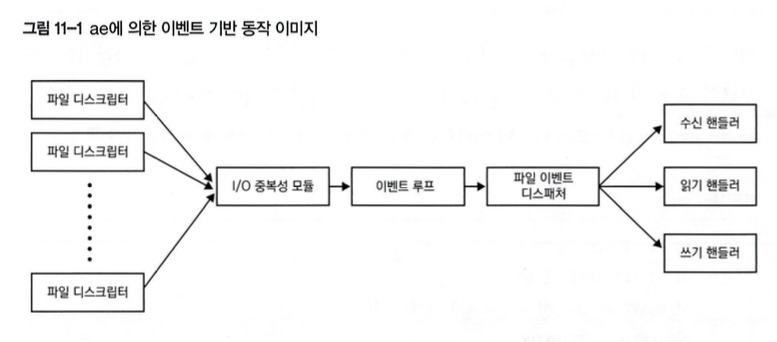

# 11. 레디스의 구조
트러블슈팅이 어려운 경우에 레디스 구조를 자체적으로 분석하기 위한 지식 등이 존재한다.

## 11.1 레디스 관련 기술
독자적으로 만들거나 확장한 기술
* RESP
* SDS
* ae
* RAX

레디스를 더 잘 이해할 수 있는 용어와 개념
* Copy On Write
* Raft
* HyperLogLog

### RESP
REdis Serialization Protocol(RESP)는 레디스(Redis)에서 클라이언트-서버 통신을 위해 설계된 프로토콜이며 통신은 기본적으로 이 프로토콜을 사용하고 TCP보다 상위 계층인 애플리케이션 계층에서 메시지 형식을 정의한 것이기 때문에 TCP 같은 하위 계층의 설정과 관계없이 사용할 수 있다.

RESP는 다음 세 가지 목표로 설계되었다.
1. 쉬운구현
2. 빠른파싱속도 
3. 가독성

### RESP3
RESP3는 Redis 6.0 이상 버전에서 선택적으로 사용할 수 있는 프로토콜로, 기본적으로는 RESP2 모드로 연결이 시작되지만, 클라이언트에서 HELLO 3 명령어를 실행하면 핸드셰이크를 통해 RESP3 모드로 전환된다.

RESP2의 경우 의미 체계가 제한적이어서 데이터 유형의 암묵적 변환이 자주 필요하다. 예를 들어, 부동소수점 수나 불리언을 문자열이나 정수로 처리하거나, 이진 안전 오류를 반환할 방법이 부족하다. 이러한 문제를 해결하고 프로토콜의 표현력을 높이기 위해 RESP3로 업그레이드되었다.

RESP3의 주요 개선점은 아래와 같다.
* Pub/Sub 기능보다 범용적인 푸시 모드를 지원하여 응답 속성을 데이터 외부로 반환 가능
* 레플리케이션 없이도 처음에 문자열 길이를 알 수 없는 스트리밍을 처리할 수 있는 특별 모드 추가
* RESP2에서 사용된 CRLF 대신, LF만으로 충분한 사양으로 변경하여 크기를 줄임

RESP3는 기존의 직렬화 라이브러리(MessagePack, BSON 등)가 Redis의 요구 사항을 충족하지 못해, Redis에 맞춘 직렬화 기능을 제공하는 프로토콜로 설계되었다.

### SDS
SDS(Simple Dynamic String)는 C 언어 기반의 가변 길이 문자열 라이브러리로, 원래 Redis에서 사용되었지만 현재는 독립된 프로젝트로 공개되었다. Redis의 문자열 처리는 SDS를 기반으로 하고 있다.

SDS의 주요 개념은 아래와 같다.
* 간단한 사용
* 이진 안전
* 효율적인 성능
* C 언어의 문자열과의 호환성(미해결 문제)

SDS는 문자열 길이를 효율적으로 관리하고, 매번 메모리를 새로 할당하지 않고 문자열의 끝에 추가할 수 있다. C 언어에서는 문자열의 끝을 NULL 문자로 인식하여 문자열 중간에 NULL 문자를 포함할 수 없지만, SDS는 이진 안전을 보장하여 NULL 문자와 관계없이 데이터를 처리할 수 있다. 문자열의 끝부분의 길이 정보를 함께 관리해 JPEG 같은 이진 파일도 처리할 수 있다.

SDS 문자열 구조는 현재 문자열 길이(len), 사용 가능한 공간(free), 실제 문자열(buf)로 정의되며, 예를 들어 sdsnewlen("redis", 5)와 같은 형태로 문자열을 생성하여 사용한다.

#### SDS 버전 2
SDS 버전 2는 레디스 3.2 이후부터 사용하고 있으며, 메모리 사용량이 최적화되고, 문자열의 최대 길이 512MB 제한이 없어졌고, 문자열 길이의 비트 수에 따라 헤더 크기를 변화시키는 메커니즘으로 구현되어 있다.

### ae
ae는 이벤트 기반 라이브러리로 레디스의 싱글 스레드를 통한 요청의 이벤트 기반 처리 기능을 구현한 것이며 epoll, kqueue, select 등의 래퍼를 사용한다.

여러 파일 디스크립터로 소켓 요청이 있으면, I/O 중복성 모듈로 통합된 뒤 이벤트 루프를 통해 이벤트 핸들러 (수신 핸들러, 읽기 핸들러, 쓰기 핸들러)에 할당된다.

I/O 중복성에는 select, epoll, kq나eue 중 하나가 사용되고 실제 환경에서 레디스 서버를 운영하면 대부분은 리눅스를 사용해 epoll, macOS는 kqueue가 사용된다.

레디스에는 파일 이벤트와 타이머 이벤트라는 두 종류의 이벤트가 있다. 
* 클라이언트로 부터의 요청 처리는 파일 이벤트
* 정기적인 처리 등은 타이머 이벤트
* aeProcessEvents는 모든 타이머 이벤트를 처리한 후에 파일 이벤트를 처리

레디스 서버에는 백그라운드에서 일정 시간마다 실행되는 타이머 이벤트가 있어 hz 지시자 값으로 초당 실행 횟수를 지정할 수 있으며 아래와 같은 처리를 한다.
* 동적 방식으로 만료된 키 회수
* 소프트웨어 워치독
* 일부 통계 업데이트
* DB 해시 테이블의 증분 리해싱
* BGSAVE/AOF 재작성 트리거 및 완료된 자식 프로세스 처리
* 다른 유형의 클라이언트 타임아웃
* 레플리케이션 재연결

이벤트 기반 처리의 장단점 아래와 같다.
* 장점
  * 요청 당 스레드/프로세스를 준비할 필요가 없어 메모리 소비를 줄일 수 있다.
  * 스레드/프로세스 전환에 따른 컨텍스트 스위치 오버헤드를 줄일 수 있다.
  * 논블로킹 I/O로 인해 즉시 처리하지 못하는 상황이라면 다른 작업으로 전환하여 병렬로 처리할 수 있다.
* 단점
  * 하나의 요청 처리에 시간이 오래 걸리면 후속 처리에 영향을 줄 수 있다.

### RAX
RAX는 메모리 관리용 데이터 구조로, Redis의 성능 문제를 해결하기 위해 안티레즈가 만든 기수 트리(Radix Tree)이다. Redis 4.0부터 도입된 이 구조는 성능 저하를 방지하면서도 메모리 사용량을 줄이는 것을 목표로 하여, 성능과 메모리 사용 사이의 균형을 맞추는 데 중점을 두고 있다. 

현재는 Redis 외의 프로젝트에서도 사용 가능하도록 독립적인 프로젝트로 개발되었으며, 소스 코드는 rax.h, rax.c, rax_malloc.h 파일에 구현되어 있다. 또한, Redis의 스트림 기능에서도 사용되고 있다.

RAX는 기수 트리를 기반으로 하며, 노드 간의 간선에는 여러 문자가 포함된 라벨이 부여된다. 부모 노드가 자식 노드를 하나만 가질 경우, 그 노드는 병합되고 라벨도 변경된다. 이를 통해 공통된 접두사가 길수록 공간 사용 효율이 높아지는 특징을 갖는다. 예를 들어, "foobar"와 "footer" 같은 문자열은 공통된 접두사를 통해 트리에서 효율적으로 표현될 수 있다.

### Cow (Copy on Write)
Cow는 리소스를 절약하기 위해 사용되는 전략이고 파일 시스템, 데이터베이스에서 자주 사용된다, 레플리카를 생성할 때 바로 복사하는 것이 아니라 파일에 변경이 있을 때까지 참조본을 생성하는 방법으로 디스크나 메모리 사용량을 줄일 수 있다.

레디스엔 스냅숏 생성, AOF 재작성 시 CoW를 사용하고 사용 시 때 필요한 메모리도 데이터 세트 크기의 두 배보다는 더 적고, 읽기 작업이 기본인 환경이라면 더 적은 메모리로 처리할 수도 있지만 쓰기 작업이 많은 환경이라면 두 배까지 소비하게 된다.

#### 리눅스의 Cow
리눅스에서의 Copy-On-Write(COW) 메커니즘은 프로세스 포크 시 메모리 효율성을 높이기 위한 방식이다. 포크 호출 후 부모와 자식 프로세스는 물리 페이지를 공유하며, 쓰기 작업이 발생하면 새 페이지를 할당해 독립적으로 관리한다.
* COW와 메모리 관리
  * 포크 시 메모리 할당이 아닌 페이지 테이블 복사만 수행되며, 쓰기 작업 시에만 물리 메모리가 할당된다.
  * 이를 통해 메모리 효율성을 유지하며 불필요한 메모리 사용을 방지한다.
* 레디스와 COW
  * 레디스는 스냅샷 생성이나 AOF 재작성 시 COW를 사용하여 백그라운드 프로세스를 통해 작업을 처리한다.
  * 쓰기 작업이 많을 경우 메모리 사용량이 두 배 가까이 증가할 수 있으므로 주의가 필요하다.
  * COW가 활성화된 상태에서 메모리 사용량을 줄이기 위해 리눅스의 overcommit 설정을 활용해 물리 메모리보다 많은 메모리를 할당할 수 있다.
* 추천 설정
  * vm.overcommit_memory를 1로 설정하여 항상 오버커밋을 활성화하고, 충분한 스왑 공간을 확보하는 것이 좋다.
  * 레디스 운영 시 메모리 사용량을 모니터링하고, 메모리의 절반 정도를 여유 공간으로 남겨두는 것이 바람직하다.

이 방식은 메모리 효율성을 높이면서도 성능 저하를 방지하기 위한 핵심 메커니즘으로, 특히 레디스 같은 애플리케이션에서 활용도가 높다.

### Raft
Raft는 이해하기 쉬운 분산 합의 알고리즘으로, 리더 선출, 로그 레플리케이션, 안전성 문제를 해결하는 데 중점을 둡니다. 레디스는 클러스터의 서버 간 설정 관리에 Raft 알고리즘을 일부 반영하였으며, RedisRaft라는 외부 프로젝트에서 Raft를 실험적으로 적용하고 있습니다.

* Raft의 세 가지 역할
  * 리더: 클라이언트 요청을 처리하고 로그를 팔로워에 복제
  * 팔로워: 리더의 지시에 따라 로그를 복제
  * 후보자: 리더가 없을 때 리더 선출을 위해 투표 요청
* 리더 선출 과정
  * 팔로워가 일정 시간 동안 리더의 하트비트를 받지 못하면 후보자로 변환
  * 과반수의 투표를 얻은 후보자가 리더로 승격
* 로그 레플리케이션
  * 리더는 클라이언트의 요청을 로그로 저장하고, 이를 팔로워에게 전송
  * 과반수의 팔로워가 응답하면 리더가 변경사항을 커밋하고, 팔로워에 이를 통보
* 안전성
  * 로그의 안전성을 보장하기 위해 현재 기간의 로그만 커밋하고, 더 새로운 로그를 가진 후보만 리더로 선출될 수 있도록 제한

> Raft의 구조 덕분에 시스템 내에서 로그 일관성과 안전성을 유지하면서 리더 선출과 로그 복제가 원활히 이루어집니다.

### HyperLogLog
HyperLogLog는 메모리 사용량을 최소화하면서 고유한 요소의 개수를 추정하는 확률적 알고리즘입니다. 약간의 오차가 발생하지만, 오차를 허용할 수 있는 상황에서 유용합니다. 주로 큰 데이터 집합에서 사용되며, LogLog 알고리즘의 확장판입니다.
* 작동 방식
  * 데이터를 해시화한 비트열의 맨 앞에서 연속된 0의 개수를 세어 고유 요소의 개수를 추정
  * LogLog 알고리즘은 고유 요소의 개수를 나타내는 값을 LogN으로 변환하고, 메모리 절약을 위해 다시 로그를 취해 LogLogN 값을 사용
* HyperLogLog의 장점
  * 스케치라는 메모리 효율적인 형식으로 데이터를 변환하여 추정값 계산
  * 스케치는 메모리를 적게 사용하면서도 병합이 가능해, 데이터를 집계하거나 합집합, 교집합 연산에 사용될 수 있음
* 개선점
  * LogLog 알고리즘은 단일 해시 함수 사용 시 정확도가 낮아지는 문제가 있었지만, HyperLogLog는 여러 개의 레지스터로 데이터를 분할하고 확률적 평균을 사용해 이 문제를 개선함.

> HyperLogLog는 큰 데이터 집합에서 메모리 효율성과 병합 가능성을 동시에 제공하여, 대규모 분석 작업에 적합한 알고리즘