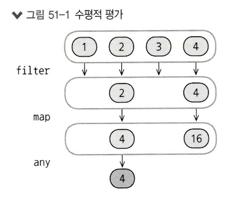
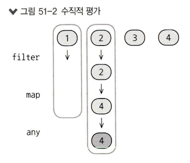

## 아톰 44. 람다
### 람다
* 람다를 사용하면 이해하기 쉬운 간결한 코드를 작성할 수 있다.
* 람다는 부가적인 장식 덜 들어간 함수로 이름이 없고 함수 생성에 필요한 최소한의 코드만 필요하며, 다른 코드에 람다를 직접 삽입할 수 있다.
* map()은 List와 같은 컬렉션에 작용하는 함수로 map()의 파라미터는 컬렉션의 모든 원소에 적용할 변환 함수다.
  * result를 초기화할 때 중괄호 사이에 쓴 코드가 람다이며 파라미터 목록과 함수 본문 사이에는 ->가 들어간다.
  * 함수 본문은 하나 이상의 식이며 식이 여럿인 경우 마지막 식이 람다의 결과가 된다.
  ```
  fun main() {
    val list = listOf(1, 2, 3, 4)
    val result = list.map({ n: Int -> "[$n]" })
    // 출력 true
    println(result == listOf("[1]", "[2]", "[3]", "[4]"))
  }
  ```
* 보통 람다가 필요한 위치에 바로 람다를 적는데 이는 람다의 타입을 추론할 수 있다는 의미이다.
  ```
  fun main() {
    val list = listOf(1, 2, 3, 4)
    val result = list.map({ n -> "[$n]" })
    // 출력 true
    println(result == listOf("[1]", "[2]", "[3]", "[4]"))
  }
  ```
* 파라미터가 하나인 경우 코틀린은 자동으로 파라미터 이름을 it으로 만들며 더 이상 ->를 사용할 필요가 없다는 의미이다.
  ```
  fun main() {
    val list = listOf(1, 2, 3, 4)
    val result = list.map({ "[$it]" })
    // 출력 true
    println(result == listOf("[1]", "[2]", "[3]", "[4]"))
  }
  ```
* 함수의 파라미터가 람다뿐이면 람다 주변의 괄호를 없앨 수 있어서 깔끔하게 코드를 적을 수 있다.
  ```
  fun main() {
    val list = listOf('a', 'b', 'c', 'd')
    val result = list.map { "[${it.toUpperCase()}]" }
    // 출력 true
    println(result == listOf("[A]", "[B]", "[C]", "[D]"))
  }
  ```
* 함수가 여러 파라미터를 받고 람다가 마지막 파라미터인 경우에는 람다를 인자 목록을 감싼 괄호 다음에 위치시킬 수 있다.
  ```
  fun main() {
    val list = listOf(9, 11, 23, 32)
    // 출력 true
    println(list.joinToString(" ") { "[$it]" } == "[9] [11] [23] [32]")
  }
  ```
* 람다를 이름 붙은 인자로 호출하고 싶다면 인자 목록을 감싸는 괄호 안에 람다를 위치시켜야 한다.
  ```
  fun main() {
    val list = listOf(9, 11, 23, 32)
    list.joinToString(
        separator = " ",
        transform = { "[$it]" }
    ) == "[9], [11], [23], [32]"
  }
  ```
* 파라미터가 둘 이상있는 람다 구문도 존재한다.
  ```
  fun main() {
    val list = listOf('a', 'b', 'c')
    list.mapIndexed { index, element -> 
      "[$index: $element]"
    } == listOf("[0: a]", "[1: b]", "[2: c]")
  }
  ```
* 람다가 특정 인자를 사용하지 않는 경우 밑줄을 사용할 수 있는데 밑줄을 쓰면 람다가 무슨 인자를 사용하지 않는다는 컴파일러 경고를 무시할 수 있다.
  ```
  fun main() {
    val list = listOf('a', 'b', 'c')
    list.mapIndexed { index, _ -> 
      "[$index]"
    } == listOf("[0]", "[1]", "[2]")
  }
  ```
* 람다에 파라미터가 없을 수도 있기 때문에 파라미터가 없다는 사실을 강조하기 위해서 화살표를 남겨둘 수 있지만 코틀린 스타일 가이드에서 화살표를 사용하지 말라고 권장한다.
  ```
  fun main() {
    run { -> println("A Lambda") }
    run { println("Without args") }
  }
  ```
* 표준 라이브러리 함수 run()은 자신에게 인자로 전달된 람다를 호출하기만 한다.

> 일반 함수를 쓸 수 있는 모든 곳에 람다를 쓸 수 있지만 람다가 너무 복잡하거나 크면  이름 붙은 함수를 정의해서 사용하는 것이 낫다.

## 아톰 45. 람다의 중요성
### 람다의 중요성
* 람다는 문법 설탕처럼 보일 수 있지만 프로그래밍에 중요한 능력을 부여해준다.
* 컬렉션의 내용을 조작하는 경우는 종종있고 조작을 반복하곤 하지만 함수 라이브러리가 없는 경우 연산을 직접 구현해야 한다.
  ```
  fun filterEven(nums: List<Int>): List<Int> {
    val result = mutableList<Int>()
    for (i in nums) {
        if (i % 2 == 0) {
          result += i
        }
    }
    return result
  }

  fun greaterThan2(nums: List<Int>): List<Int> {
    val result = mutableList<Int>()
    for (i in nums) {
        if (i > 2) {
          result += i
        }
    }
    return result
  }

  fun main() {
    val even = filterEven(listOf(1, 2, 3, 4))
    val greaterThan2 = filterEven(listOf(1, 2, 3, 4))
    // 출력 [ 2, 4 ]
    println(even)
    // 출력 [ 3, 4 ]
    println(greaterThan2)
  }
  ```
* 람다를 사용하면 표준 라이브러리 함수 filter()는 보존하고 싶은 원소를 선택하여 술어(Boolean)를 인자로 받는다.
  ```
  fun main() {
    val list = listOf(1, 2, 3, 4)
    val even = list.filter { it % 2 == 0 }
    val greaterThan2 = list.filter { it > 2 }
    // 출력 [ 2, 4 ]
    println(even)
    // 출력 [ 3, 4 ]
    println(greaterThan2)
  }
  ```
* 루프 처리는 뻔하기 떄문에 실수를 저지르면 발견하기 어려우면 이 부분이 함수형 프로그래밍이 제공하는 특징으로 map(), filter()가 그 예이다.
* 함수형 프로그래밍은 문제를 작은 단계로 풀어나가고 뻔해 보이는 작업을 함수로 수행하는 경도 많지만 이런 함수를 작성하는 건 map()이나 filter()를 사용하는 것보다 어렵지 않다.
* 작고 디버깅이 `잘 이뤄진 해법을 많이 갖추고 나면 매번 디버깅할 필요 없이 쉽게 조합해서 사용할 수 있고 튼튼한 코드를 더 빨리 작성`할 수 있다.
* 람다를 `var나 val에 담아서 여러 함수에 같은 람다를 넘기며 로직을 재사용`할 수 있다.
  * isEven을 정의할 때 코틀린 타입 추론기가 파라미터의 타입을 결정할 수 있는 문맥이 존재하지 않아서 람다 파라미터의 타입을 명시해야 한다.
  * any()는 주어진 술어를 만족하는 원소가 List에 하나라도 있는지 검사한다.
  ```
  fun main() {
    val list = listOf(1, 2, 3, 4)
    val isEven = { e: Int -> e % 2 == 0 }
    // 출력 [2, 4]
    println(list.filter(isEven))
    // 출력 true
    println(list.any(isEven))
  }
  ```
* 람다의 또 다른 특징으론 자신의 영역 밖에 있는 요소를 참조할 수 있는 능력을 들 수 있다.
  * 함수가 자신이 속한 환경의 요소를 포획하거나 닫아버리는 것을 클로저라고 한다.
  * 일부 언어에서 클로저라는 용어를 람다 개념과 혼동하지만 두 개념은 다른 개념으로 클로저가 없는 람다가 있을 수 있고 람다가 없는 클로저가 있을 수 있다.
  ```
  // divider과 sum을 람다가 포획한다.
  fun main() {
    val list = listOf(1, 5, 7, 10)
    val sum = 0
    val divider = 5
    list.filter { it % divider == 0 }
      .forEach { sum += it }
    list.filter { it % divider == 0 }
      .sum()
  }
  ```
  * 일반 함수도 주변 환경을 포획할 수 있다.
  ```
  var x = 100

  fun useX() {
    x++
  }

  fun main() {
    useX() == 101
  }
  ```

## 아톰 46. 컬렉션에 대한 연산
### 컬렉션에 대한 연산
* 함수형 프로그래밍의 능력들 중 객체 컬렉션에 대한 연산을 한꺼번에 수행할 수 있는 능력이 매우 중요하다.
* 대부분의 함수형 언어는 컬렉션을 다룰 수 있는 강력한 수단을 제공하며 코틀린은 map(), filter(), any(), forEach() 등을 제공하며, 람다를 사용해서 List를 초기화할 수 있다.
  ```
  fun main() {
    // 람다는 인자로 추가할 원소의 인덱스를 받는다.
    val list1 = List(10) { it }
    // 출력 [0, 1, 2, 3, 4, 5, 6, 7, 8, 9]
    println(list1)
    
    // 한 값으로만 이뤄진 리스트
    val list2 = List(10) { 0 }
    // 출력 [0, 0, 0, 0, 0, 0, 0, 0, 0, 0]
    println(list2)

    // 글자로 이뤄진 리스트
    val list3 = List(10) { 'a' + it }
    // 출력 [a, b, c, d, e, f, g, h, i, j]
    println(list3)

    // 정해진 순서를 반복
    val list4 = List(10) { list3[it % 3] }
    // 출력 [a, b, c, a, b, c, a, b, c, a]
    println(list4)
  }
  ```
* MutableList도 List와 동일한 방법으로 초기화 할 수 있다.
  ```
  fun main() {
    val mutableList1 = MutableList(5, { 10 * (it + 1) })
    // 출력 [10, 20, 30, 40, 50]
    println(mutableList1)

    val mutableList2 = MutableList(5) { 10 * (it + 1) }
    // 출력 [10, 20, 30, 40, 50]
    println(mutableList2)
  }
  ```

### 코틀린의 다양한 컬렉션 함수
* filter()
  * 주어진 술어와 일치하는 모든 원소가 들어있는 새 리스트를 만든다.
* map()
  * 각 원소를 원하는 형태로 변환하여 반환한다.
* any()
  * 원소 중 어느 하나에 대해 술어가 true를 반환하면 true를 반환한다.
* all()
  * 모든 원소가 술어와 일치하는지 검사한다.
* none()
  * 술어와 일치하는 원소가 하나도 없는지 검사한다.
* find()
  * 모든 술어와 일치하는 첫 번째 원소를 반환하며 원소가 없으면 예외를 던진다.
* firstOrNull()
  * 모든 술어와 일치하는 첫 번째 원소를 반환하며 원소가 없으면 null을 반환한다.
* lastOrNull()
  * 술어와 일치하는 마지막 원소를 반환하며, 일치하는 원소가 없으면 null을 반환한다.
* count()
  * 술어와 일치하는 원소의 개수를 반환한다.
* partition()
  * List가 들어 있는 Pair객체를 만든다.
  ```
  fun main() {
    val list = listOf(-3, -1, 5, 7, 10)
    val isPositive = { i: Int -> i > 0 }
  
    list.filter(isPositive) eq "[5, 7, 10]"
    list.filterNot(isPositive) eq "[-3, -1]"
  
    val (pos, neg) = list.partition { it > 0 }
    // 출력 [5, 7, 10]
    println(pos)
    // 출력 [-3, -1]
    println(neg)
  }
  ```
* sumBy(), sumOf()
  * 덧셈 연산에 사용할 특성값을 돌려주는 함수를 인자로 받으며 인자목록을 합산한 값을 반환한다.
  * sumBy()는 코틀린 1.5부터 더 이상 사용되지 않는다.
* sorted(), sortedBy()
  * 정렬 연산에 사용할 특성값을 돌려주는 함수를 인자로 받으며 인자목록을 정렬된 새로운 리스트로 반환한다.
  * 기본은 오름차순이며 sortedDescending(), sortedByDescending()는 내림차순이다.
* task()
  * 앞부분부터 지정한 개수만큼의 요소를 추출하여 새로운 리스트를 반환한다.
  * taskLast()의 경우 뒷부분부터 지정된다.
* drop()
  * 리스트 앞부분부터 지정한 개수만큼의 요소를 뺀 새로운 리스트를 생성한다.
* maxByOrNull()
  * 컬렉션의 가장 큰 값을 반환하며 비어있는 경우 null을 반환한다.

> filter(), map()을 set에 적용하면 List를 결과로 받는다.

## 아톰 47. 멤버 참조
### 멤버 참조
* 함수 인자로 멤버 참조를 전달할 수 있다.
* 함수, 프로퍼티, 생성자에 대해 만들 수 있는 `멤버 참조`는 해당 함수 프로퍼티, 생성자를 호출하는 람다를 대신할 수 있다.
* 멤버 함수나 프로퍼티 이름 앞에 속한 클래스 이름과 2중 콜론(::)을 위치시켜서 멤버 참조를 만든다.
  ```
  data class Message(
    val sender: String,
    val text: String,
    val isRead: Boolean
  )

  fun main() {
    val messages = listOf(
      Message("Kitty", "Hey!", true)
      Message("Kitty", "Where are you?", false))

    val unread = messages.filterNot(Message::isRead) // 멤버 참조

    unread.size == 1
    unread.single().text == "Where are you?"
  }
  ```
* 객체의 기본 대소 비교를 따르지 않는 정렬 순서를 지정해야 할 때는 프로퍼티 참조가 유용하다.
  * sortedWith()는 비교기(comparator)를 사용해 리스트를 정렬한다.
  * 비교기는 두 원소를 비교하는 객체다.
  * 라이브러리 함수 compareBy()는 파라미터로 주어진 술어 목록에 따라 비교기를 생성한다.
  ```
  val messages = listOf(
    Message("Kitty", "Hey!", true),
    Message("Kitty", "Where are you?", false),
    Message("Boss", "Meeting today", false))

  messages.sortedWith(compareBy(
    Message::isRead, Message::sender)) ==
    listOf(
      // 우선은 읽지 않은 메시지가 보낸 사람 순서로 정렬된다
      Message("Boss", "Meeting today", false),
      Message("Kitty", "Where are you?", false),
      // 그 후 읽은 메시지가 역시 보낸 사람 순서로 정렬된다
      Message("Kitty", "Hey!", true))
  ```

### 함수 참조
* 요구사항이 많아지고 복잡한 기준이 여럿 필요해지면 람다에 넣을 경우 람다가 커지고 복잡해지는데 이런 경우 별도의 함수로 추출하면 코드를 이해하기 쉽다.
* 코틀린에선 함수 타입이 필요한 곳에 함수를 바로 넘길 수 있지만, 함수에 대한 참조는 넘길 수 있다.
  ```
  data class Message(
    val sender: String,
    val text: String,
    val isRead: Boolean,
    val attachments: List<Attachment>
  )
  
  data class Attachment(
    val type: String,
    val name: String
  )
  
  fun Message.isImportant(): Boolean =
    text.contains("Salary increase") ||
      attachments.any {
        it.type == "image" && it.name.contains("cat")
      }
  
  fun main() {
    val messages = listOf(Message(
      "Boss", "Let's discuss goals " +
      "for next year", false,
      listOf(Attachment("image", "cute cats"))))
    
    messages.any(Message::isImportant) == true
  }
  ```
* 최상위 수준 함수에 대한 참조를 만들 때는 클래스 이름이 없으므로 ::funcation처럼 쓴다.
  ```
  data class Message(
    val sender: String,
    val text: String,
    val isRead: Boolean,
    val attachments: List<Attachment>
  )
  
  data class Attachment(
    val type: String,
    val name: String
  )
  
  fun Message.isImportant(): Boolean =
    text.contains("Salary increase") ||
      attachments.any {
        it.type == "image" && it.name.contains("cat")
      }

  fun ignore(message: Message) =
    !message.isImportant() &&
      message.sender in setOf("Boss", "Mom")
  
  fun main() {
    val text = "Let's discuss goals " +
      "for the next year"
    val msgs = listOf(
      Message("Boss", text, false, listOf()),
      Message("Boss", text, false, listOf(
        Attachment("image", "cute cats"))))
    msgs.filter(::ignore).size eq 1
    msgs.filterNot(::ignore).size eq 1
  }
  ```

### 생성자 참조
* 클래스 이름을 사용해 생성자에 대한 참조를 만들 수 있다.
  * 함수와 생성자 참조를 사용하면 단순히 람다로 전달되기만 하는 긴파라미터 리스트를 지정하는 수고를 하지 않아도 되며 람다를 사용할 때보다 가독성이 좋아진다.
  ```
  data class Student(
    val id: Int,
    val name: String
  )
  
  fun main() {
    val names = listOf("Alice", "Bob")
    val students = names.mapIndexed { index, name ->
      Student(index, name)
    }
    students == listOf(Student(0, "Alice"), Student(1, "Bob"))
    names.mapIndexed(::Student) eq == students
  }
  ```

### 확장 함수 참조
* 확장 함수에 대한 참조를 만들려면 참조 앞에 확장 대상 타입 이름을 붙이면 된다.
  ```
  fun Int.times47() = times(47)

  class Frog
  fun Frog.speak() = "Ribbit!"

  fun goInt(n: Int, g: (Int) -> Int) = g(n)

  fun goFrog(frog: Frog, g: (Frog) -> String) = g(frog)
  
  fun main() {
    goInt(12, Int::times47) eq 564
    goFrog(Frog(), Frog::speak) eq "Ribbit!"
  }
  ```

## 아톰 48. 고차 함수
### 고차 함수
* 프로그래밍 언어에서 `함수를 다른 함수의 인자로 넘길 수 있거나 함수가 반환값으로 함수를 돌려줄 수 있으면 언어가 고차함수를 지원`한다고 말한다.
* 고차 함수는 함수형 프로그래밍에서 필수적이며 이미 filter(), map(), any() 등의 고차 함수가 존재한다.
* 람다는 참조에 저장할 수 있다.
  * `(파라미터타입1, ..., 파라미터타입N) -> 반환타입`
  ```
  val isPlus: (Int) -> Boolean = { it > 0 }

  fun main() {
    listOf(1, 2, -3).any(isPlus) == ture
  }
  ```
* 참조를 통해 함수를 호출하는 구문은 일반 함수와 동일하다.
  ```
  val helloWorld: () -> String = { "Hello, world!" }

  val sum: (Int, Int) -> Int = { x, y -> x + y }

  fun main() {
    helloWorld() == "Hello, world!"
    sum(1, 2) == 3
  }
  ```
* 함수가 함수 파라미터를 받는 경우 인자로 람다나 함수 참조를 전다할 수 있다.
  * any()를 직접 구현하는 방법
  * [1] 여러 타입의 List를 호출할 수 있어야해서 제네릭 List<T> 타입의 확장함수로 정의한다.
  * [2] 함수의 리스트를 원소로 적용할 수 있어야해서 T 인자로 받는 함수다.
  * [3] predicate() 함수를 적용하면 선택 기준을 element가 만족하는지 알 수 있다.
  * [4], [5] 람다 파라미터 타입이 다르며 [4]는 Int, [5]는 String이다.
  * [6] `멤버 참조를 전달한느 것은 함수 참조를 전달하는 또 다른 방법`이다.
  ```
  fun <T> List<T>.any(                    // [1]
    predicate: (T) -> Boolean             // [2]
  ): Boolean {
    for (element in this) {
      if (predicate(element))             // [3]
        return true
    }
    return false
  }
  
  fun main() {
    val ints = listOf(1, 2, -3)
    ints.any { it > 0 } eq true           // [4]
  
    val strings = listOf("abc", " ")
    strings.any { it.isBlank() } eq true  // [5]
    strings.any(String::isNotBlank) eq    // [6]
      true
  }
  ```
* repeat()는 두 번째 인자를 함수로 받는다.
  * [1] (Int) -> Unit 타입의 함수를 action 파라미터로 받는다.
  * [2] action()을 현재의 반복 횟수 index를 사용해 호출한다.
  * [3] 호출할 때 람다 내부에서 반복 인덱스를 it으로 참조할 수 있다.
  ```
  fun repeat(
    times: Int,
    action: (Int) -> Unit           // [1]
  ) {
    for (index in 0 until times) {
      action(index)                 // [2]
    }
  }
  
  fun main() {
    // 출력
    // #0
    // #1
    // #2
    repeat(3) { println("#$it") }     // [3]
  }
  ```
* 반환을 null로 할 수 있다.
  * 함수의 반환 타입이 null이 될 수 있는 타입
  ```
  fun main() {
    val transform: (String) -> Int? =
      { s: String -> s.toIntOrNull() }
    transform("112") eq 112
    transform("abc") eq null
    val x = listOf("112", "abc")
    x.mapNotNull(transform) == "[112]"
    x.mapNotNull { it.toIntOrNull() } == "[112]"
  }
  ```
  * 반환 타입을 null이 될 수 있는 타입으로 만드는 것과 함수 전체의 타입을 null이 될 수 있는 타입으로 만드는 것의 차이점
  ```
  fun main() {
    val returnTypeNullable: (String) -> Int? =
      { null }
    val mightBeNull: ((String) -> Int)? = null
    returnTypeNullable("abc") eq null
    // 널 검사를 하지 않으면 컴파일이 되지 않는다
    // mightBeNull("abc")
    if (mightBeNull != null) {
      mightBeNull("abc")
    }
  }
  ```

## 아톰 49. 리스트 조작하기
### 묶기의 zip()
* 재킷의 지퍼처럼 두 List의 원소를 한짝씩 묶는다.
  * [1] Pair로 이뤄진 짝이 생긴다.
  * [2] List와 범위를 지정할 수 있다.
  * [3] 두 짝중에 작은 쪽이 끝나면 연산도 끝난다.
  ```
  fun main() {
    val left = listOf("a", "b", "c", "d")
    val right = listOf("q", "r", "s", "t")
  
    left.zip(right).toString() ==                 // [1]
      "[(a, q), (b, r), (c, s), (d, t)]"
  
    left.zip(0..4).toString() ==                  // [2]
      "[(a, 0), (b, 1), (c, 2), (d, 3)]"
  
    (10..100).zip(right).toString() ==            // [3]
      "[(10, q), (11, r), (12, s), (13, t)]"
  }
  ```
* 만들어진 Pair에 대해 연산을 적용하는 기능


### 평평하게 하기
* flatten()은 각 원소가 List인 List를 인자로 받아서 원소가 따로 들어있는 List를 반환한다.
  ```
  fun main() {
    val list = listOf(
      listOf(1, 2),
      listOf(4, 5),
      listOf(7, 8)
    )

    list.flatten().toString() == "[1, 2, 4, 5, 7, 8]"
  }
  ```
* flatMap()은 컬렉션에서 중요한 연산이면 이해하는데 flatten이 중요하다.
  * 어떤 범위에 속한 Int로부터 가능한 모든 Pair
  * [1] 세 개의 List가 생긴다.
  * [2] 결과가 평평하게 적용돼 단일 List를 만든다.
  * [3] flatMap()을 통해서 map(), flatten()을 동작이 한번에 동작된다.
  ```
  fun main() {
    val intRange = 1..3

    // 출력 [[(1, 1), (1, 2), (1, 3)], [(2, 1), (2, 2), (2, 3)], [(3, 1), (3, 2), (3, 3)]]
    println(intRange.map { a -> // [1]
        intRange.map { b -> a to b }
    })
    // 출력 [(1, 1), (1, 2), (1, 3), (2, 1), (2, 2), (2, 3), (3, 1), (3, 2), (3, 3)]
    println(intRange.map { a -> // [2]
        intRange.map { b -> a to b }
    }.flatten())
    // 출력 [(1, 1), (1, 2), (1, 3), (2, 1), (2, 2), (2, 3), (3, 1), (3, 2), (3, 3)]
    println(intRange.flatMap { a -> // [3]
        intRange.map { b -> a to b }
    })
  }
  ```

## 아톰 50. 맵 만들기
### 맵 만들기
* Map을 사용하면 `키를 사용해 값을 빠르게 접근`할 수 있다.
* 라이브러리 함수 groupBy()는 Map을 만드는 방법 중 하나다.
  * groupBy()의 파라미터는 원소를 분류하는 기준이 되는 키를 반환하는 람다다.
  * groupBy()는 원본 컬렉션의 각 원소에 파라미터 람다를 적용해 키 값을 얻은 후 맵에 넣어주며 값이 둘 이상 있는 경우 키에 해당하는 값의 리스트가 되야한다.
  ```
  fun main() {
    val map: Map<Int, List<Person>> =
      people().groupBy(Person::age)

    map[15] == listOf(Person("Arthricia", 15))

    map[21] == listOf(
      Person("Alice", 21),
      Person("Charlie", 21),
      Person("Franz", 21))

    map[22] == null

    map[25] == listOf(
      Person("Bob", 25),
      Person("Bill", 25))

    map[33] == listOf(Person("Revolio", 33))

    map[42] == listOf(
      Person("Birdperson", 42),
      Person("Crocubot", 42))
  }
  ```
* filter() 함수를 사용해도 똑같은 그룹을 계산할 수 있지만 새로운 키가 나타날 때마다 그룹을 만드는 작업을 반복해야하지만 groupBy()는 그런 분류를 단 한번할 수 있으므로 groupBy()가 낫다.
* 그룹이 `두개만 필요한 경우에는 술어에 의해 컬렉션 내용을 두 그룹으로 나누는 partition() 함수가 더 적합`하고 `groupBy()는 세 개 이상인 경우 적합`하다.
* 리스트에 대해 associateWith()를 사용하면 리스트 원소에 적용한 반환값을 값으로 하는 Map을 만든다.
  ```
  fun main() {
    val map: Map<Person, String> =
      people().associateWith { it.name }
    map eq mapOf(
      Person("Alice", 21) to "Alice",
      Person("Arthricia", 15) to "Arthricia",
      Person("Bob", 25) to "Bob",
      Person("Bill", 25) to "Bill",
      Person("Birdperson", 42) to "Birdperson",
      Person("Charlie", 21) to "Charlie",
      Person("Crocubot", 42) to "Crocubot",
      Person("Franz", 21) to "Franz",
      Person("Revolio", 33) to "Revolio")
  }
  ```
* associateBy()는 associatewith()가 만들어내는 연관관계를 반대로 만든다.
  * `키가 유일하지 않는 경우 실패`하며 원본의 값 중 일부가 사라진다.
  ```
  fun main() {
    val map: Map<String, Person> =
      people().associateBy { it.name }
    map eq mapOf(
      "Alice" to Person("Alice", 21),
      "Arthricia" to Person("Arthricia", 15),
      "Bob" to Person("Bob", 25),
      "Bill" to Person("Bill", 25),
      "Birdperson" to Person("Birdperson", 42),
      "Charlie" to Person("Charlie", 21),
      "Crocubot" to Person("Crocubot", 42),
      "Franz" to Person("Franz", 21),
      "Revolio" to Person("Revolio", 33))
  }
  ```
* getOrElse()는 Map에서 값을 찾고, 키가 없으면 디폴트 값을 계산하는 방법을 담긴 람다를 인자로 받는다.
* getOrPut()는 MutableMap에만 적용할 수 있고 키가 있으면 연관된 값을 반환하고 키가 없으면 값을 계산한 후 그 값을 키와 연관시켜 맵에 저장하고 저장한 값을 반환한다.
* Map의 원소에 filter(), map()을 적용할 수 있다.
  * filter(), filterkeys(), filterValues() 모두 술어를 만족하는 원소들로 이뤄진 새 맵을 반환
  * filterKey()는 맵의 키에 적용, filterValues()는 맵의 값에 적용
  ```
  fun main() {
    val map = mapOf(1 to "one",
      2 to "two", 3 to "three", 4 to "four")
  
    map.filterKeys { it % 2 == 1 } eq
      "{1=one, 3=three}"
  
    map.filterValues { it.contains('o') } eq
      "{1=one, 2=two, 4=four}"
  
    map.filter { entry ->
      entry.key % 2 == 1 &&
        entry.value.contains('o')
    } eq "{1=one}"
  }
  ```

### 맵에 연산 적용하기
* map이라는 영단어는 두 가지 아이디어를 나타낸다.
  1. 컬렉션 변환하기
  2. 키-값 쌍을 저장하는 데이터 구조
* `map()을 Map에 적용하면 맵을 변환`한다.
  * [1] Map.Entry를 인자로 받는 람다를 파라미터로 받는다.
  * [2] 구조 분해 선언을 이용해 key, value로 분해한다.
  * [3] 파라미터를 사용하지 않을 때 밑줄을 사용하며, mapKey(), mapValues()는 모든 키나 값이 변환된 새 맵을 반환한다. 
  * [4] map()은 쌍들의 리스트를 반환하며, 새로운 맵을 생성시 toMap()을 사용한다.
  ```
  fun main() {
    val even = mapOf(2 to "two", 4 to "four")
  
    even.map {                            // [1]
      "${it.key}=${it.value}"
    } eq listOf("2=two", "4=four")
  
    even.map { (key, value) ->            // [2]
      "$key=$value"
    } eq listOf("2=two", "4=four")
  
    even.mapKeys { (num, _) -> -num }     // [3]
      .mapValues { (_, str) -> "minus $str" } eq
      mapOf(-2 to "minus two",
        -4 to "minus four")
  
    even.map { (key, value) ->
      -key to "minus $value"
    }.toMap() eq mapOf(-2 to "minus two", // [4]
      -4 to "minus four")
  }
  ```
* any(), all()도 Map에 적용할 수 있다.
  * any()는 Map의 원소 중에 주어진 술어를 만족하는 원소가 하나라도 있는지 검사
  * all()은 Map의 모든 원소가 술어를 만족해야 한다.
* maxByOrNull()은 주어진 기준에 따라 가장 큰 원소를 찾으며, 원소가 없으면 null이 된다.

## 아톰 51. 시퀀스
* 코틀린의 Sequence를 다른 함수형 언어에서는 스트림이라고 부르며 다른 이름을 선택한 이유는 자바 8의 Stream 라이브러리와 호환성을 유지하기 위해서다.
* `List에 대한 연산은 즉시 계산`되는데 List 연산을 연쇄시키면 첫 번째 `연산의 결과가 나온 후에야 다음 연산이 적용`된다.
* 즉시 계산은 직관적이고 단순하지만 최적은 아니다.
  * 첫 번째 원소를 만나서 적용한 뒤 연쇄적인 연산을 멈출 수 있다면 더 합리적이다.
  * 시퀀스가 긴 경우 최적화가 모든 원소에 대해 연산을 적용한 다음 일치하는 원소를 하나 찾아내는 것이 훨씬 더 빠르다.
  * 즉시 계산은 `수평적 평가`라고도 한다.
  
* 즉시 계산의 대안은 지연 계산이다.
  * 지연 계산은 결과가 필요할 때만 계산을 수행한다.
  * 시퀀스에 지연 계산을 수행하는 경우 수직적 평가라고 한다.
  * 지연 계산을 사용하면 진짜 필요할 때만 원소와 관련된 연산을 수행하며 결과를 찾아내면 나머지 원소는 처리되지 않는다.
  
* List를 asSequence()를 사용해 `Sequence로 변경하면 지연 계산이 활성화`되며 인덱싱을 제외한 모든 List 연산을 Sequence에도 사용할 수 있다.
* Sequence를 filter(), map() 호출하면 다른 Sequence가 생기며 계산 결과를 요청할 때까진 아무 일도 벌어지지 않고 새 Sequences는 지연된 모든 연산에 대해 정보를 저장해두고 필요할 때만 저장해둔 연산을 실행한다.
* Sequence 연산에는 `중간 연산`과 `최종 연산` 두 가지가 있다.
  * 중간 연산은 결과가 다른 Sequence를 내놓으며, filter(), map()은 중간 연산이다.
  * 최종 연산은 Sequence가 아닌 값을 내놓으며 결괏값을 얻기위해 최종 연산은 저장된 모든 계산을 수행한다.
* Sequence는 중간 연산을 저장해두기 때문에 각 연산을 원하는 순서로 호출할 수 있고 그에 따라 지연 연산이 발생한다.
* Sequence는 한 번만 이터레이션할 수 있으며 이터레이션을 또 시도하면 예외가 발생하기 때문에 여러 번 처리할 때는 우선 Collection 타입으로 변환해야 한다.
* takeIf() 대신 항상 일반 if를 쓸 수 있지만 식별자가 추가로 필요하기 때문에 지저분해 보여서 takeIf() 쪽이 더 함수형 표현이고 호출 연쇄 중간에 자연스럽게 사용할 수 있다.

## 아톰 52. 지역 함수
### 지역 함수
* 다른 함수 안에 정의된 이름 붙은 함수를 `지역 함수`라고 한다.
* 지역 함수를 통해서 반복되는 코드를 추출해서 중복을 줄일 수 있고, 자신이 속함 함수 내부에서만 지역 함수를 볼 수 있어서 공간을 오염시키지 않는다.
  ```
  fun main() {
    val logMsg = StringBuilder()

    fun log(message: String) = logMsg.appendLine(message)

    log("Starting computation")
    val x = 42
    log("Computation result: $x")

    logMsg.toString eq """
      Starting computation
      Computation result: 42
    """
  }
  ```
* 지역 함수는 `클로저`이며 자신을 둘러싼 환경의 var, val을 포획하는데 포획을 쓰지 않으면 주변 환경의 값을 별도의 파라미터로 전달 받아야 한다.
* 지역 함수는 확장 함수로 선언해서 지역 확장 함수로 정의할 수 있다.
  ```
  fun main() {
    fun String.exclaim() = "$this!"
    "Hello".exclaim() eq "Hello!"
    "Hello".exclaim() eq "Hallo!"
    "Bonjour".exclaim() eq "Bonjour!"
    "Ciao".exclaim() eq "Ciao!"
  }
  ```
* 함수 참조를 사용해 지역 함수를 참조할 수 있다.
  ```
  class Session(
    val title: String,
    val speaker: String 
  )
  
  val sessions = listOf(Session("Kotlin Coroutines", "Roman Elizarov"))

  val favoriteSpeakers = setOf("Roman Elizarov")

  fun main() {
    fun interesting(session: Session): Boolean {
      if (session.title.contains("Kotiln") && session.speaker in favoriteSpeakers) {
        return true
      }
      // ... 추가 검사

      return false
    }
    sessions.any(::interesting) eq true
  }
  ```
* return 식이 있으면 함수를 람다로 정의하기 어려운데 `익명 함수`를 사용해서 이런 문제를 피할 수 있다.
  * fun 키워드를 사용해 정의한다.
  * [1] 익명 함수는 이름이 없는 일반 함수처럼 보인다.
  * `람다가 너무 복잡해서 읽기 어렵다면 지역 함수나 익명 함수로 대신`한다.
  ```
  fun main() {
    sessions.any(
      fun(session: Session): Boolean {    // [1]
        if (session.title.contains("Kotlin") &&
          session.speaker in favoriteSpeakers) {
          return true
        }
        // ... 추가 검사
        return false
      }) eq true
  }
  ```

### 레이블
* 레이블을 통해서 return할 때 반환 값이 있으면 호출된 함수로 이동한다.
  * [1] return은 main 함수를 끝낸다.
  * [2] [1]에서 main 함수를 종료해 출력되지 않는다.
  ```
  fun main() {
    val list = listOf(1, 2, 3, 4, 5)
    val value = 3
    var result = ""
    list.forEach {
      result += "$it"
      if (it == value) {
        result eq "123"
        return                   // [1]
      }
    }
    result eq "Never gets here"  // [2]
  }
  ```
* 람다를 둘러싼 함수가 아닌 `람다에서 반환해야하면 레이블이 붙은 return 사용`한다.
  ```
  fun main() {
    val list = listOf(1, 2, 3, 4, 5)
    val value = 3
    var result = ""
    list.forEach {
      result += "$it"
      if (it == value) return@forEach
    }
    result eq "12345"
  }
  ```
* 람다 앞에 레이블@을 넣으면 새 레이블을 넣을 수 있으며 레이블 이름은 아무 이름이나 사용 가능하다.

### 지역 함수 조작하기
* var, val에 람다나 익명 함수를 저장할 수 있고, 식별자를 사용해 해당 함수를 호출할 수 있다.
* 지역 함수 저장은 함수 참조를 사용한다.
  * 
  ```
  fun first(): (Int) -> Int {
    val func = fun(i: Int) = i + 1
    func(1) eq 2
    return func
  }
  
  fun second(): (String) -> String {
    val func2 = { s: String -> "$s!" }
    func2("abc") eq "abc!"
    return func2
  }
  
  fun third(): () -> String {
    fun greet() = "Hi!"
    return ::greet
  }
  
  fun fourth() = fun() = "Hi!"
  
  fun fifth() = { "Hi!" }
  
  fun main() {
    // 지역 함수
    val funRef1: (Int) -> Int = first()
    val funRef2: (String) -> String = second()
    val funRef3: () -> String = third()
    val funRef4: () -> String = fourth()
    val funRef5: () -> String = fifth()
    // 함수 참조
    funRef1(42) eq 43
    funRef2("xyz") eq "xyz!"
    funRef3() eq "Hi!"
    funRef4() eq "Hi!"
    funRef5() eq "Hi!"
    // 반환된 함수 호출
    first()(42) eq 43 
    second()("xyz") eq "xyz!"
    third()() eq "Hi!"
    fourth()() eq "Hi!"
    fifth()() eq "Hi!"
  }
  ```

## 아톰 53. 리스트 접기