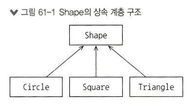

## 아톰 55. 인터페이스
### 인터페이스
* 인터페이스를 `구현하는 모든 클래스의 프로토타입`이다.
  1. 클래스가 무엇을 하는지 기술하지만 어떻게 하는지는 기술하지 않는다.
  2. 클래스의 형태를 제시하지만 일반적으로 구현은 포함하지 않는다.
  3. 객체의 동작을 지정하지만 어떻게 수행하는지에 대한 세부 사항은 제시하지 않는다.
  4. 존재의 목표나 임무를 기술하며 클래스는 세부적인 구현 사항을 포함한다.
* `시스템의 여러 부품이 서로 의사소통하는 수단`이다.
* `애플리케이션 프로그래밍 인터페이스`는 `여러 소프트웨어의 구성 요소 사이에 명확히 정의된 통신 경로의 집합`으로 `객체 지향 프로그래밍에선 객체의 API는 객체가 다른 객체와 상호 작용할 때 사용하는 공개 멤버의 집합`이다.
* 인터페이스를 사용하는 코드는 인터페이스에서 호출할 수 있는 함수가 무엇인지에 대한 정보만 알고 있으며, 인터페이스는 클래스 사이의 프로토콜을 확립한다.
* interface 키워드를 사용해 만들며 구현하는 클래스를 정의 시에는 콜론과 인터페이스 이름을 넣는다.
  * 인터페이스 멤버 구현 시 override 변경자 필요
  * 각 함수를 구체적인 함수, 구상 함수라고 한다.
  ```
  interface Computer {
    fun prompt(): String
    fun calculateAnswer(): Int
  }
  
  class Desktop : Computer {
    override fun prompt() = "Hello!"
    override fun calculateAnswer() = 11
  }
  
  class DeepThought : Computer {
    override fun prompt() = "Thinking..."
    override fun calculateAnswer() = 42
  }
  
  class Quantum : Computer {
    override fun prompt() = "Probably..."
    override fun calculateAnswer() = -1
  }
  ```
  * 인터페이스가 프로퍼티를 선언할 수 있다.
  ```
  interface Player {
    val symbol: Char
  }
  
  class Food : Player {
    override val symbol = '.'
  }
  
  class Robot : Player {
    override val symbol get() = 'R'
  }
  
  class Wall(override val symbol: Char) : Player
  ```
  * 이넘도 인터페이스를 구현할 수 있다.
  ```
  interface Hotness {
    fun feedback(): String
  }
  
  enum class SpiceLevel : Hotness {
    Mild {
      override fun feedback() =
        "It adds flavor!"
    },
    Medium {
      override fun feedback() =
        "Is it warm in here?"
    },
    Hot {
      override fun feedback() =
        "I'm suddenly sweating a lot."
    },
    Flaming {
      override fun feedback() =
        "I'm in pain. I am suffering."
    }
  }
  ```

### SAM 변환
* 단일 추상 메서드(SAM) 인터페이스는 자바 개념으로 자바에선 멤버 함수를 메서드라 부른다.
* 코틀린에선 SAM 인터페이스를 정의하는 fun interface 문법이 존재한다.
  ```
  fun interface ZeroArg {
    fun f(): Int
  }
  
  fun interface OneArg {
    fun g(n: Int): Int
  }
  
  fun interface TwoArg {
    fun h(i: Int, j: Int): Int
  }
  ```
* fun interface를 붙이면 멤버 함수가 하나만 들어있는지 확인한다.
* 람다를 사용하는 경우 SAM 변환이라고 한다.
  ```
  fun interface ZeroArg {
    fun f(): Int
  }
  
  fun interface OneArg {
    fun g(n: Int): Int
  }
  
  fun interface TwoArg {
    fun h(i: Int, j: Int): Int
  }

  class VerboseZero : ZeroArg {
    override fun f() = 11
  }
  
  val verboseZero = VerboseZero()
  
  val samZero = ZeroArg { 11 }
  
  class VerboseOne : OneArg {
    override fun g(n: Int) = n + 47
  }
  
  val verboseOne = VerboseOne()
  
  val samOne = OneArg { it + 47 }
  
  class VerboseTwo : TwoArg {
    override fun h(i: Int, j: Int) = i + j
  }
  
  val verboseTwo = VerboseTwo()
  
  val samTwo =  TwoArg { i, j -> i + j }
  ```
* 자주 쓰이는 구문을 SAM 변환을 사용해 간결한 구문으로 작성할 수 있고, 객체를 한번만 쓰면 클래스를 억지로 정의할 필요가 없다.
* 람다를 SAM 인터페이스가 필요한 곳에 넘길 수 있다.
  ```
  fun interface Action {
    fun act()
  }
  
  fun delayAction(action: Action) {
    trace("Delaying...")
    action.act()
  }

  fun main() {
    delayAction { trace("Hey!") }
  }
  ```

## 아톰 56. 복잡한 생성자
### 복잡한 생성자
* 생성자는 새 객체를 만드는 특별한 함수다.
* var, val을 파라미터 목록에 있는 파라미터에 붙이면 파라미터를 프로퍼티로 만들면서 객체 외부에서 접근할 수 있다.
* 생성 과정을 좀 더 제어하고 싶으면 클래스 본문에 생성자 코드를 추가하면 되는데 객체 생성 중 `init 블록 안의 코드가 실행`된다.
  * 생성자 파라미터에 var, val이 붙여있지 않아도 init 사용 가능
  * content는 val 정의지만 정의시점에 초기화하지 않고 이런 경우 코틀린이 어느 지점에서 한번만 초기화가 일어나도록 보장한다.
  ```
  Class Message(text: String) {
    private val content: STring

    init {
        counter += 10
        conent = "[$counter] $text"
    }

    override fun toString() = content
  }
  ```
* 생성자는 생성자 파라미터 목록, init 블록을 합친 것이고 객체를 생성하는 동안 실행된다.
* init 블록은 클래스 본문에 정의된 순서대로 실행된다.
* 크고 복잡한 클래스에서 init을 분산시키면 유지보수 문제를 야기할 수 있다.

## 아톰 57. 부생성자
### 부생성자
* 객체를 생성할 때 이름 붙은 인자나 디폴트 인자를 통해서 생성하는게 쉽지만 오버로드한 생성자를 여러 개만들어야 할 경우도 있다.
* 오버로드한 생성자를 `부생성자`라고 부르며, 생성자 파라미너, 프로퍼티 초기화, init 블록을 합친 생성자는 `주생성자`다.
* 부생성자는 constructor 키워드 다음 파라미터 목록을 넣고 안에서 this 키워드로 주생성자나 다른 부생성자를 호출한다.
  ```
  class WithSecondary(i: Int) {
    init {
      trace("Primary: $i")
    }
    constructor(c: Char) : this(c - 'A') {
      trace("Secondary: '$c'")
    }
    constructor(s: String) :
      this(s.first()) {             // [1]
      trace("Secondary: \"$s\"")
    }
    /* 주생성자를 호출하지 않으면
       컴파일이 되지 않는다
    constructor(f: Float) {         // [2]
      trace("Secondary: $f")
    }
    */
  }
  ```
* init 블록을 사용하지 않아도 되지만 몇가지 주의점이 있다.
  1. 주생성자의 파라미터만 var, val을 붙여 프로퍼티 선언이 가능
  2. 부생성자에 반환 타입 지정 불가능
  3. 프로퍼티의 네이밍이 겹치는 경우 this를 사용해서 모호성 없애기
  4. 부생성자 본문을 적지 않아도 되지만 this() 호출은 필수
* 디폴트 인자를 써서 부생성자를 주생성자 하나로 만들면 클래스를 단순하게 만들 수 있다.

## 아톰 58. 상속
### 상속
* 상속은 `기존 클래스를 재사용하면서 변경해 새로운 클래스를 만드는 매커니즘`이다.
* 객체 지향 언어는 `상속`이라는 재사용 매커니즘 제공하며, 코틀린의 상속 구문은 콜론(:)을 붙인다.
  * 기본적으로 클래스는 상속이 닫혀있어 `기반 클래스는 open을 붙어야 상속을 허용`한다.
  * 자바에선 final을 통해 상속을 명시적으로 금지하지만, 코틀린은 `기본적으로 모든 클래스가 final`이다.
  ```
  open class Base

  class Derived: Base()
  ```
* 상속 관계를 표현하는 용어는 아래와 같다.
  * 기반 클래스 → 부모 클래스, 상위 클래스 
  * 파생 클래스 → 자식 클래스, 하위 클래스
* 상속을 사용하면 파생 클래스들을 기반 클래스와 같은 타입인 것처럼 받아 들이며, 기반 클래스를 상속하는 모든 클래스에서 사용할 수 있는 코드를 작성할 수 있다.
* 상속은 결국 `코드를 단순화하고 재사용할 수 있는 기회를 제공`한다.
* 함수를 오버라이딩할 때 상속은 더 흥미로워진다.
  * 파생 클래스는 기반 클래스의 private 멤버에 접근할 수 없어서 protected 멤버를 사용한다.
  * 기반 클래스의 함수 시그니처와 똑같은 함수를 파생 클래스에 존재하면 오류가 발생한다.
  * 명확한 의도가 있지 않은 한 상속과 오버라이드가 불가능하다.
  * talk()안에서 call()의 타입에 따라 다른 동작을 수행하는데 이를 `다형성`이라고 한다.
  ```
  open class GreatApe {
    protected var energy = 0
    open fun call() = "Hoo!"
    open fun eat() {
      energy += 10
    }
    fun climb(x: Int) {
      energy -= x
    }
    fun energyLevel() = "Energy: $energy"
  }
  
  class Bonobo : GreatApe() {
    override fun call() = "Eep!"
    override fun eat() {
      // 기반 클래스의 var 프로퍼티를 변경한다
      energy += 10
      // 기반 클래스의 함수를 호출한다
      super.eat()
    }
    // 함수를 추가한다
    fun run() = "Bonobo run"
  }
  
  class Chimpanzee : GreatApe() {
    // 새 프로퍼티
    val additionalEnergy = 20
    override fun call() = "Yawp!"
    override fun eat() {
      energy += additionalEnergy
      super.eat()
    }
    // 함수를 추가한다
    fun jump() = "Chimp jump"
  }
  
  fun talk(ape: GreatApe): String {
    // ape.run()  // ape의 함수가 아니다
    // ape.jump() // 역시 ape의 함수가 아니다
    ape.eat()
    ape.climb(10)
    return "${ape.call()} ${ape.energyLevel()}"
  }
  
  fun main() {
    // 'energy'에 접근할 수 없다
    // GreatApe().energy
    talk(GreatApe()) eq "Hoo! Energy: 0"
    talk(Bonobo()) eq "Eep! Energy: 10"
    talk(Chimpanzee()) eq "Yawp! Energy: 20"
  }
  ```
* 오버라이딩한 경우 `기반 클래스 버전을 호출하고 싶을 때 super 키워드를 사용`한다.

## 아톰 59. 기반 클래스 초기화
### 호출되도록 보장하는 생성자
* 멤버 객체들의 생성자
* 파생 클래스에 추가된 객체의 생성자
* 기반 클래스의 생성자

### 기반 클래스 초기화
* 클래스가 다른 클래스를 상속할 때, 두 클래스가 모두 제대로 초기화되도록 보장한다.
* 기반 클래스에 `생성자 파라미터가 있다면 파생 클래스가 생성되는 동안 반드시 기반 클래스의 인자를 제공`해야 한다.
  ```
  open class GreatApe(
    val weight: Double,
    val age: Int
  )
  
  open class Bonobo(weight: Double, age: Int) :
    GreatApe(weight, age)
  
  class Chimpanzee(weight: Double, age: Int) :
    GreatApe(weight, age)
  
  class BonoboB(weight: Double, age: Int) :
    Bonobo(weight, age)
  
  fun GreatApe.info() = "wt: $weight age: $age"
  ```
* 클래스를 상속할 때는 기반 클래스 생성자의 인자 목록을 기반 클래스 이름 뒤에 붙여야 한다.
  * 하위 클래스 객체를 생성하는 중 기반 클래스 생성자를 호출한다.
  * 기반 클래스 생성자 파라미터가 없어도 기반 클래스 이름 뒤에 괄호를 붙이도록 강제한다.
  ```
  open class SuperClass1(val i: Int)
  class SubClass1(i: Int): SuperClass1(i)

  open class SuperClass2
  class SubClass2: SuperClass2()
  ```
* `기반 클래스에 부생성자가 있으면 주생성자 대신 부생성자를 호출`할 수 있다. 
* 파생 클래스의 부생성자는 기반 클래스의 생성자를 호출할 수도 있고, 파생 클래스 자신의 생성자를 호출할 수도 있다.
* 기반 클래스의 생성자를 호출하려면 super 키워드를 적고, 함수를 호출할 때처럼 생성자 인자를 전달하면 되며, 다른 생성자를 호출할 때는 this 호출을 사용한다.

## 아톰 60. 추상 클래스
### 추상 클래스
* 추상 클래스는 `하나 이상의 프로퍼티나 함수가 불완전`하다.
* 클래스 멤버에서 본문이나 초기화를 제거하려면 abstract 변경자를 해당 멤버 앞에 붙여야하며, abstract가 붙은 멤버가 있는 클래스에는 반드시 abstract를 붙여야 한다.
  * WithProperty는 아무 초깃값도 없는 x를 선언하는데 `초기화 코드가 없으면 반드시 abstract로 선언해야`한다.
  * WithFunctions 두 함수도 정의를 제공하지 않기 때문에 abstract를 붙여야하고, 반환 타입을 적지 않으면 Unit이라고 간주한다.
  ```
  abstract class WithProperty {
    abstract val x: Int
  }

  abstract class WithFunctions {
    abstract fun f(): Int
    abstract fun g(n: Double)
  }
  ```
* 추상 클래스를 따라가면 추상 멤버가 어딘가에는 정의가 있는 구체화된 클래스가 존재해야 한다.
* 인터페이스는 추상 클래스와 비슷하며 함수, 프로퍼티에 `abstract를 생략`할 수 있다.
* 인터페이스와 추상 클래스의 `차이점은 추상 클래스에는 상태가 있지만 인터페이스에는 상태가 없다.` 
  * `상태는 프로퍼티 안에 저장된 데이터`를 뜻한다.
  * 인터페이스 안에서 프로퍼티에 값을 저장하는 것은 금지되어 있다.
* 인터페이스와 추상 클래스 모두 구현이 있는 함수를 포함할 수 있으며, 이런 함수는 다른 abstract 멤버를 호출해도 된다.
  ```
  interface Parent {
    val ch: Char
    fun f(): Int
    fun g() = "ch = $ch; f() = ${f()}" // 다른 abstract 멤버를 호출
  }
  ```
* 인터페이스가 함수 구현을 포함할 수 있어서 내부에 정의된 프로퍼티가 상태를 바꿀 수 없는 경우에는 인터페이스도 프로퍼티에 커스텀 게터를 포함할 수 있다.
  ```
  interface PropertyAccessor {
    val a: Int
      get() = 11
  }

  class Impl: PropertyAccessor

  fun main() {
    Impl().a eq 11
  }
  ```
* 추상 클래스가 기능은 강력하지만, `클래스는 오직 한 기반 클래스만 상속할 수 있고 인터페이스는 다중 상속을 지원`한다.
  * 최초 자바 설계자는 다중 상속을 좋은 개념으로 보지 않았고, 여러 상태 상속이 복잡성을 증가시켜서 다중 상태 상속을 금지했다.
  ```
  open class Animal
  open class Mammal : Animal()
  open class AquaticAnimal : Animal()
  
  // 기반 클래스가 둘 이상이면 컴파일이 되지 않는다
  // class Dolphin : Mammal(), AquaticAnimal()
  ```
  * 하지만 상태를 포함할 수 없는 인터페이스를 도입해서 다중 상속 문제를 우아하게 해결했다.
  ```
  interface Animal
  interface Mammal: Animal
  interface AquaticAnimal: Animal
  
  class Dolphin : Mammal, AquaticAnimal
  ```
* 인터페이스도 다른 인터페이스를 상속할 수 있지만 시그니처가 같은 둘 이상 동시에 상속할 때 충돌하면 직접 충돌을 해결해야 한다.
* super 키워드를 사용해 서로 다른 기반 클래스를 함께 호출(super 뒤에 부등호로 이름을 지정)할 수도 있다.
* 코틀린은 식별자가 같은데 타입이 다른 식으로 충돌이 일어나는 경우를 허용하지 않고 알려줄수 없다.

## 아톰 61. 업캐스트
### 업캐스트
* `객체 참조를 받아서 그 객체의 기반 타입에 대한 참조처럼 취급하는 것`을 `업캐스트`한다고 말한다.
* 상속과 새 멤버 함수 추가는 스몰토크(최초로 성공적으로 정착한 객체 지향 언어)에서 비롯됐는데 스몰토크의 모든 것이 자바에 큰 영향을 끼쳤다.
  * 모든 것이 객체
  * 클래스를 새로 만드는 방법은 기존 클래스를 상속하는 것과 상속 과정에서 필요하면 새 함수 추가
* 코틀린은 독립적인 함수를 정의할 수 있고 클래스 안에 가두지 않아도 되는데 확장 함수를 쓰면 상속을 쓰지 않아도 기능을 구현할 수 있다.
* 코틀린에서 open은 상속을 위해 필요한 키워드지만 의도적이고 의식적으로 선택해서 사용해야 한다는 의미를 담는다.
* 코틀린은 `단일 상속 계층 내 여러 클래스에서 코드를 재사용할 수 있는 방식으로만 상속을 사용`하게 한다.
  
  ```
  fun show(shape: Shape) {
    trace("Show: ${shape.draw()}")
  }

  fun main() {
    listOf(Circle(), Square(), Triangle())
      .forEach(::show) // show 메서드를 실행할 때 각 클래스는 기반 클래스 Shape 클래스 처럼 취급되는데 이를 기반 타입으로 업캐스트됐다고 의미
  }
  ```
* `상속의 매커니즘은 오직 기반 타입으로 업캐스트한다는 목적을 당설하기 위해 존재`하며, 이런 추상화로 인해 매번 함수를 작성하지 않아도 되고 객체를 위해 `작성된 코드를 재사용하는 방법이 업캐스트`다.
* 업캐스트를 사용하지 않는데 상속을 사용하는 거의 모든 경우는 상속이 필수적이지 않고 코드를 복잡하게 만들기 때문에 `상속보다 합성을 택해라`라는 명언이 나왔다.
* 치환 가능성(리스코프 치환 원칙)은 업캐스트를 한 다음 파생 타입이 정확히 기반 타입과 똑같이 취급될 수 있다고 말한다.
  * 업캐스트가 파생 클래스에 추가된 멤버 함수를 잘라버리는 효과를 가진다.
  * 추가된 멤버 함수는 기반 클래스에 속해있지 않아서 업캐스트 이후에는 사용할 수 없다.
  * 업캐스트 이후에는 기반 타입의 멤버만 호출할 수 있다.

## 아톰 62. 다형성
### 다형성
* 다형성은 여러 형태를 뜻하며 프로그래밍에선 `객체, 멤버의 여러 구현이 있는 경우를 의미`한다.
* 다형성은 `부모 클래스가 자식 클래스를 바라볼 때 발생`한다.
  * talk 메서드를 통해서 Pet 으로 업캐스팅 됬지만, 실제 출력은 "Pet" 으로 되어야 하지만 `기반 클래스의 메서드가 호출`된다. 
  * 부모 클래스 참조에 대해 멤버를 호출하면 `다형성에 의해 자식 클래스에서 오버라이드한 올바른 멤버가 호출`된다.
  ```
  open class Pet {
    open fun speak() = "Pet"
  }
  
  class Dog : Pet() {
    override fun speak() = "Bark!"
  }
  
  class Cat : Pet() {
    override fun speak() = "Meow"
  }
  
  fun talk(pet: Pet) = pet.speak()
  
  fun main() {
    talk(Dog()) eq "Bark!"
    talk(Cat()) eq "Meow"
  }
  ```
* 함수 호출을 함수 본문과 연결 짓는 작업을 바인딩이라 하며 `다형성의 경우 연산이 타입에 따라 다르게 작동해야 하기 때문에 함수 본문을 동적 바인딩을 사용해 실행 시점에 동적으로 결정`해야 한다.
* `동적 바인딩은 정적 바인딩과 다르게 실행 시점에 타입을 결정하는 추가 로직이 성능에 영향`을 미치기 때문에 코틀린은 디폴트로 상속, 오버라이딩을 닫혀있도록 해서 사용하기 위해서 `코드에 의도를 명확`하게 드러내야 한다.

> 다형성은 클래스의 관계라는 큰 그림 안에 있을 때 조화롭게 작동하며, 객체 지향 기법을 효과적으로 사용하기 위해서는 관점을 한 클래스의 멤버에만 국한되는 것이 아닌 클래스와 클래스 사이의 관계에 의존하는 보편성으로 넓혀야 한다.

## 아톰 63. 합성
> 객체 지향을 사용해야 하는 이유는 코드 재사용이다.

### 합성
* 객체 지향에서는 새 클래스를 만들어서 코드를 재사용하고, 기존 코드를 더럽히지 않고 클래스를 재사용하는 것으로 이를 달성하는 방법 중 하나가 상속이며 상속을 사용해서 기존 클래스 타입에 속하는 새 클래스를 만들고 코드를 추가한다.
* `기존 클래스의 객체를 새 클래스 안에 생성하는 접근 방법`도 존재하는데 새 클래스가 기존 클래스들을 합성한 객체로 이뤄지기 때문에 이런 방법을 `합성`이라고 부르며 이 경우 `기본 코드의 기능을 재사용`한다.
* 합성은 포함(has-a) 관계이며, 상속은 이다(is-a) 관계를 표현한다.
  ```
  interface House: Building { // 집은 건물이다.
    val kitchen: Kitchen // 주방은 집에 포함된다.
  }
  ```
* 상속은 복잡하기 때문에 중요한 개념이라고 생각하지만 `상속보다 합성을 택해라`는 말이 생겼고, `상속대신 합성을 사용해서 설계를 단순하게 만들 수 있는 지 검토해야 한다는 점`이다.
* 합성은 뻔해 보이지만 강력하고 관련 없는 요소를 책임져야 하지만 각 요소를 분리할 때 도움이 되며 클래스의 복잡한 로직을 단순화할 수 있다.

### 합성과 상속 중 선택하기
* 합성과 상속 새 클래스에 하위 객체를 넣는다.
  * 합성은 명시적으로 하위 객체를 선언한다.
  * 상속은 암시적으로 하위 객체가 생긴다.
* 합성은 기존 클래스의 기능을 제공하지만 인터페이스를 제공하지 않으며 새 클레스에서 정의한 인터페이스를 보게 되는데 합성한 객체를 완전히 감추고 싶다면 비공개(private)로 포함시키면 된다. 
  * 사용자는 Form 구현 방식을 알 수 없는데 features 를 제거하고 변경해도 Form 을 사용하는 `코드에는 영향을 미치지 않는다.`
  * 상속을 사용한다면 연결 관계가 명확해지기 때문에 관계를 수정하면 `연결 관계에 의존하는 모든 코드가 망가진다.`
  ```
  class Features {
    fun f1() = "feature1"
    fun f2() = "feature2"
  }
  
  class Form {
    private val features = Features()
    fun operation1() = features.f2() + features.f1()
    fun operation2() = features.f1() + features.f2()
  }
  ```
* 때로는 새 클래스의 합성에 직접 접근하는 게 합리적인 경우도 존재하는데 이런 경우 공개(public)로 만든다.
  * 공개를 해도 멤버 객체가 적절히 정보 은닉을 구현하고 있는 한 상대적으로 안전하다.
  * 시스템에 따라서 멤버 객체를 공개할 때 인터페이스가 더 깔끔해질 수 있다.
  * 하부 구현에 속하는 문제가 아니라 문제 분석의 일부분으로 내부를 노출시킨 설계는 클라이언트가 클래스를 사용하는 방법을 이해할 때 도움이 되고 코드 복잡도를 줄여준다.
  ```
  class Engine {
    fun start() = trace("Engine start")
    fun stop() = trace("Engine stop")
  }
  
  class Wheel {
    fun inflate(psi: Int) = trace("Wheel inflate($psi)")
  }
  
  class Window(val side: String) {
    fun rollUp() = trace("$side Window roll up")
    fun rollDown() = trace("$side Window roll down")
  }
  
  class Door(val side: String) {
    val window = Window(side)
    fun open() = trace("$side Door open")
    fun close() = trace("$side Door close")
  }
  
  class Car {
    val engine = Engine()
    val wheel = List(4) { Wheel() }
    // Two door:
    val leftDoor = Door("left")
    val rightDoor = Door("right")
  }
  
  fun main() {
    val car = Car()
    car.leftDoor.open()
    car.rightDoor.window.rollUp()
    car.wheel[0].inflate(72)
    car.engine.start()
    trace eq """
      left Door open
      right Window roll up
      Wheel inflate(72)
      Engine start
    """
  }
  ```
* `포함 관계는 합성으로, 이다 관계는 상속으로 표현`한다.

> 다형성의 영리함으로 모든 것을 상속으로 처리해야 할 것처럼 느끼기 쉽지만 설계에 짐이 되며 상속을 우선적으로 선택하면 불필요하게 복잡해지기 때문에 합성을 먼저 시도해보는 것이 좋다.

## 아톰 64. 상속과 확장
### 상속과 확장
* 때로는 새로운 함수를 추가해야 할 때 새 함수를 추가하기 위해서 상속을 사용해야 하는데 이로 인해 코드를 이해하고 유지보수하기 어려워진다.
* 객치 지향 언어는 상속을 하는 동안 멤버 함수를 처리하는 메커니즘을 제공해서 추가된 함수는 업캐스트를 하면 잘려나가 기반 클래스에서 쓸 수 없다.
  * 이는 리스코프 치환 원칙(치환 가능성)이다.
  * 치환 가능성으로 하위 클래스 객체를 받아도 아무 문제가 없다.
* 상속을 하는 동안 함수를 추가하는 것을 허용하지만, 이는 코드 냄새다.
  * 함수 추가는 타당하고 편리해 보이지만 함정에 빠뜨릴 수 있다.
  * 나중에 코드를 유지 보수해야 하는 사람에게 악영향을 끼칠 수 있는 문제며 이를 `기술 부채`라고 부른다.
* `상속을 하면서 함수를 추가하는 건` 클래스에 기반 클래스가 있다는 사실을 무시하고 시스템 전반에서 `파생 클래스를 엄격하게 식별해 취급할 때 유용`하다.
  * 상속과 확장 함수가 하는 일이 정확히 일치해, 확장 함수를 쓰면 상속이 필요없다.
  ```
  fun Heater.cool(temperature: Int) = "cooling to $temperature"

  fun warmAndCool(heater: Heater) {
    heater.heat(70) eq "heating to 70"
    heater.cool(60) eq "cooling to 60"
  }

  fun main() {
    val heater = Heater()
    warmAndCool(heater)
  }
  ```
  * 라이브러리 소스 코드를 바꿀 수 잇으면 다른 방식으로 설계해서 클래스를 좀 더 유연하게 만들 수 있다.
  ```
  class TemperatureDelta(
    val current: Double,
    val target: Double
  )

  fun TemperatureDelta.heat() {
    if (current < target)
      trace("heating to $target")
  }

  fun TemperatureDelta.cool() {
    if (current > target)
      trace("cooling to $target")
  }

  fun adjust(deltaT: TemperatureDelta) {
    deltaT.heat()
    deltaT.cool()
  }

  fun main() {
    adjust(TemperatureDelta(60.0, 70.0))
    adjust(TemperatureDelta(80.0, 60.0))
    trace eq """
      heating to 70.0
      cooling to 60.0
    """
  }
  ```
  * `확장 함수가 아닌 멤버 함수로 정의`할 수도 있다.

### 관습에 의한 인터페이스
* 확장 함수를 함수가 하나뿐인 인터페이스를 만드는 것처럼 생각할 수 있다.
  * X, Y에 f()라는 멤버 함수가 있는 것처럼 보이지만 다형적으로 동작하지 않기 때문에 제대로 동작하게 만들려면 오버로드해야 한다.
  ```
  class X

  fun X.f() {}

  class Y

  fun Y.f() {}

  fun callF(x: X) = x.f()

  fun callF(y: Y) = y.f()

  fun main() {
    val x = X()
    val y = Y()
    x.f()
    y.f()
    callF(x)
    callF(y)
  }
  ```
* 코틀린 라이브러리에선 `관습에 의한 인터페이스`를 광범위하게 사용하며 컬렉션을 다룰 때 그렇다.
* 코틀린 컬렉션은 거의 모두 자바 컬렉이지만 다수의 확장 함수를 추가해서 자바 컬렉션을 함수형 스타일의 컬렉션을 변모해준다.
* 이런 확장 함수는 초기에 자바와 호환성을 유지하기 위한 목적으로 쓰였지만 현재는 `필수적인 메서드만 정의해 포함하는 간단한 인터페이스를 만들고 모든 부가 함수를 확장으로 정의하라`라는 코틀린의 철학이 됐다.

### 어댑터 패턴
* 라이브러리에서 타입을 정의하고 그 타입의 객체를 파라미터로 받는 함수를 제공하는 경우가 종종 있다.
  * 아래 방식은 상속하는 과정에서 클래스를 확장하지만 새 멤버 함수는 연결하기 위해서만 쓰인다. (UsefulLibrary 연결)
  ```
  interface LibType {
    fun f1()
    fun f2()
  }

  fun utility1(lt: LibType) {
    lt.f1()
    lt.f2()
  }

  fun utility2(lt: LibType) {
    lt.f2()
    lt.f1()
  }

  open class MyClass {
    fun g() = trace("g()")
    fun h() = trace("h()")
  }

  fun useMyClass(mc: MyClass) {
    mc.g()
    mc.h()
  }

  class MyClassAdaptedForLib :
    MyClass(), LibType {
    override fun f1() = h()
    override fun f2() = g()
  }

  fun main() {
    val mc = MyClassAdaptedForLib()
    utility1(mc)
    utility2(mc)
    useMyClass(mc)
    trace eq "h() g() g() h() g() h()"
  }
  ```
  * 상속에 대해 열린 open 클래스라는 점에 의존하지만 `합성을 사용해 어댑터`를 만들 수 있다. (MyClassAdaptedForLib 안에 MyClass 필드 추가)
  * 아래 코드는 상속보다 깔끔하지는 않지만 새로운 인터페이스에 맞게 전환해 연결하는 문제를 쉽게 해결해준다.
  ```
  class MyClass { // open된 클래스가 아님
    fun g() = trace("g()")
    fun h() = trace("h()")
  }

  fun useMyClass(mc: MyClass) {
    mc.g()
    mc.h()
  }

  class MyClassAdaptedForLib : LibType {
    val field = MyClass()
    override fun f1() = field.h()
    override fun f2() = field.g()
  }

  fun main() {
    val mc = MyClassAdaptedForLib()
    utility1(mc)
    utility2(mc)
    useMyClass(mc.field)
    trace eq "h() g() g() h() g() h()"
  }
  ```
* 확장 함수는 어댑터를 생성할 때 아주 유용할 것 같지만, 확장 함수를 모아서 인터페이스를 구현할 수는 없다.

### 멤버 함수와 확장 함수 비교
* 함수가 `private 멤버에 접근해야 한다면 확장 함수 대신 멤버 함수를 정의`할 수 밖에 없다.
  ```
  class Z(var i: Int = 0) {
    private var j = 0
    fun increment() {
      i++
      j++
    }
  }

  fun Z.decrement() {
    i--
    // j -- // 접근할 수 없음
  }
  ```
* `확장 함수의 가장 큰 한계는 오버라이드할 수 없다는 점`이다.
  ```
  open class Base {
    open fun f() = "Base.f()" // 다형성이 작동하지 않는다.
  }

  class Derived : Base() {
    override fun f() = "Derived.f()" // 다형성이 작동한다.
  }

  fun Base.g() = "Base.g()"
  fun Derived.g() = "Derived.g()"

  fun useBase(b: Base) {
    trace("Received ${b::class.simpleName}")
    trace(b.f())
    trace(b.g())
  }

  fun main() {
    useBase(Base())
    useBase(Derived())
    trace eq """
      Received Base
      Base.f()
      Base.g()
      Received Derived
      Derived.f()
      Base.g()
    """
  }
  ```
* 클래스의 공개 멤버만으로 충분할 때는 이를 멤버 함수로 구현할 수도 있고 확장 함수로 구현할 수도 있지만 스타일의 차이로 `코드의 명확성을 높일 수 있는 방법을 선택`해야 한다.
* 멤버 함수는 타입의 핵심을 반영한다.
  * 함수 없이 타입을 상상할 수 없어야 하고 `확장 함수는 대상 타입을 지원하고 활용하기 위한 외부 연산이나 편리를 위한 연산`이다.
  * 일부 함수를 확장 함수로 정의하면 대상 타입을 깔끔하고 단순하게 유지할 수 있다.
  ```
  interface Device {
    val model: String
    val productionYear: Int
    fun overpriced() = model.startsWith("i") // 멤버, 확장 함수로도 정의될 수 있다.
    fun outdated() = productionYear < 2050 // 멤버, 확장 함수로도 정의될 수 있다.
  }

  class MyDevice(
    override val model: String,
    override val productionYear: Int
  ): Device

  fun main() {
    val gadget: Device =
      MyDevice("my first phone", 2000)
    gadget.outdated() eq true
    gadget.overpriced() eq false
  }
  ```
  * 오버로이드될 가능성이 없다면 확장 함수로 선언이 가능하다.
  ```
  fun Device.overpriced() = model.startsWith("i")

  fun Device.outdated() = productionYear < 2050
  ```
* `확장 함수 또는 멤버 함수로 만들지는 상황과 설계상의 선택`일 뿐이다.
* 자바는 특별히 금지않는 한 상속을 허용하지만 코틀린은 상속을 사용하지 않을 것이라고 가정해서 open 키워드가 아니면 상속과 다형성을 의도적으로 사용을 막는데 이는 코틀린이 나아갈 방향에 대한 통잘이다.

> 특정 상황에서 상속을 사용할지 고민 중이라면 상속보다는 확장 함수와 합성을 택해라라는 격연을 적용해라, 하지만 확장 함수는 의견을 들어도 안티 패턴이라는 의견도 종종 발생한다

## 아톰 65. 클래스 위임
> 합성과 상속 모두 새 클래스 안에 하위 객체를 심고 합성은 하위 객체가 명시적으로 상속은 암시적으로 존재한다.

### 클래스 위임
* 클래스가 `기존의 구현을 재사용하면서 동시에 인터페이스를 구현`해야 하는 경우, 합성은 인터페이스를 노출시키지 않기 때문에 `상속과 클래스 위임이라는 두 가지 선택지`가 있다.
* `클래스 위임은 상속과 합성의 중간 지점`으로 하위 객체의 인터페이스를 노출 시키고 하위 객체의 타입으로 업캐스트할 수 있어서 `코드 재사용성 관점에서 합성을 상속만큼 강력`하게 만들어준다.
  ```

  ```