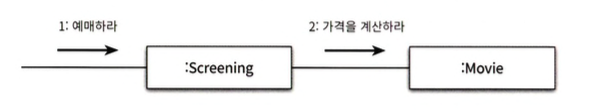
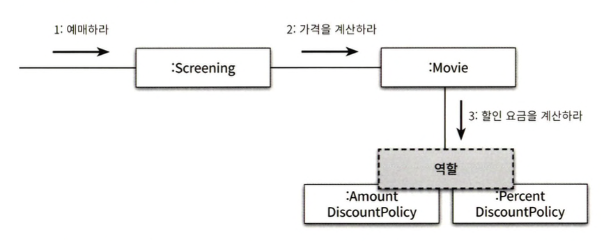

# 03. 역할 책임, 협력
객체지향 패러다임의 관점에서 핵심은 역할(role), 책임(responsibility), 협력(collaboration)이며, 클래스. 상속. 지연 바인딩이 중요하지 않은 것은 아니 지만 다분히 구현 측면에 치우쳐 있기 때문에 객체지향 패러다임의 본질과는 거리가 멀다.

<table>
    <thead>
        <tr>
            <th>용어</th>
            <th>의미</th>
        </tr>
    </thead>
    <tbody>
        <tr>
            <td>협력</td>
            <td>
                객체들이 애플리케이션의 기능을 구현하기 위해 수행하는 상호작용을 의미한다.
            </td>
        </tr>
        <tr>
            <td>책임</td>
            <td>
                객체가 협력에 참여하기 위해 수행하는 로직
            </td>
        </tr>
        <tr>
            <td>역할</td>
            <td>
                객체들이 협력 안에서 수행하는 책임들이 모여 객체가 수행
            </td>
        </tr>
    </tbody>
</table>

객체지향의 본질은 협력하는 객체들의 공동체를 창조하는 것으로 협력을 구성하기 위해 적절한 객체를 찾고 적절한 책임을 할당하는 과정에서 드러난다. 애플레케이션 기능 구현에 초점을 맞추면 변경하기 어렵고 유연하지 못한 코드를 낳는 원인이 되기 때문에 객체를 통한 설계가 중요하다.

객체지향에서 가장 중요한 것은 역할, 책임, 협력이다. 역할, 책임, 협력이 제자리를 찾지 못한 상태라면 응집도 높은 클래스와 중복 없는 상속 계층을 구현해도 문제가 발생한다.

## 01. 협력
### 영화 예매 시스템 돌아보기
객체지향 원칙을 따르는 애플리케이션의 제어 흐름은 어떤 하나의 객체에 의해 통제되는 것이 아닌 다양한 객체들 사이에 균형 있게 분배된다. 아래 다이어그램에서는 다양한 객체들이 영화 예매의 기능을 구현하기 위해서 메시지를 주고 받으면서 상호작용하고 있다.

### 협력
객체는 자율적인 존재로, 다른 객체와 협력해서 시스템 기능을 만드는 존재다. 그 중에서 협력은 객체지향의 세계에서 기능을 구현할 수 있는 유일한 방법이며, 두 객체 사이의 협력은 하나의 객체가 다른 객체에게 도움을 요청할 때 시작된다. 

객체 내부 구현은 캡슐화를 통해서 직접 접근할 수 없기 때문에 메시지 전송을 통해서 요청을 전송해야 한다. 메시지를 수신한 객체는 메서드를 실행해 요청에 응답하는데 이를 통해서 객체는 자신의 데이터를 통해서 스스로 처리하는 방법을 선택했다고 표현할 수 있다.

앞서 나온 예제의 영화 예매 요금을 계산하기 위한 로직들은 생각해본다.
* 절차지향이라면 ➔ 영화 예매 요금을 계산하기 위해서 상영(Screening)은 영화(Movie)에 인스턴스 변수에 직접 접근해서 상영(Screening)에서 영화 예매 요금을 계산한다.
* 객체지향이라면 ➔ 영화 예매 요금을 계산하기 위해서 상영(Screening)은 영화(Movie)에 calculateMovieFee 메시지를 전송해서 협력을 하게 된다.

#### 절차지향의 문제점
영화(Movie)의 자율성이 훼손된다. 자율적인 객체란 자신의 상태를 직접 관리하고 스스로의 결정에 따라 행동하는 객체지만 정보와 행동이 영화(Movie), 상영(Screening)이라는 객체로 나뉜다. 결과적으로 영화(Movie)는 수동적인 존재로 전락하고 만다.

#### 객체지향이 되기 위해선?
영화(Movie)가 자율적인 존재가 되기 위해서 자신의 정보로 직접 요금을 계산해야 한다. 결과적으로 객체를 자율적으로 만드는 가장 기본적인 방법은 내부 구현을 `캡슐화`하는 것이다.

상영(Screening)이 영화 요금을 계산하기 위해 영화(Movie)의 내부 구현에 직접 접근한다는 것은 캡슐화의 원칙을 위반하게 된다. 영화(Movie)가 변경되면 상영(Screening)은 큰 영향을 받게된다. 반대로 영화(Movie)가 자신의 정보를 바탕으로 직접 요금을 계산하면 영화(Movie)와 상영(Screening) 사이의 결합도를 느슨하게 유지하고, 영화(Movie)가 변경됬을 때 상영(Screening)의 영향을 줄일 수 있다.

#### 정리
* 할당된 책임을 수행하던 중에 필요한 정보를 알지 못하거나 외부의 도움이 필요한 경우 적절한 객체에게 메시지를 전송해서 협력을 요청한다.
* 메시지를 수신한 객체 역시 메시지를 처리하던 중에 직접 처리할 수 없는 정보나 행동이 필요한 경우 또 다른 객체에게 도움 을 요청한다.
* 객체들 사이의 협력을 구성하는 일련의 요청과 응답의 흐름을 통해 애플리케이션의 기능이 구현된다.

### 협력이 설계를 위한 문맥을 결정한다.
객체가 가질 수 있는 상태와 행동을 어떤 기준으로 결정해야 할까? 객체를 설계할 때 어떤 행동과 상태를 할당했다면 그 이유는 무엇인가? 라는 의문이 생기게 된다.

어떤 객체가 필요하다면 그 이유는 그 객체가 어떤 협력에 참여하고 있기 때문이다. 그리고 객체가 협력에 참여할 수 있는 이유는 협력에 필요한 적절한 행동을 보유하고 있기 때문이다.
* 결과적으로 객체의 행동을 결정하는 것은 객체가 참여하고 있는 협력 때문으로 협력이 바뀌면 객체가 제공해야 하는 행동 역시 바뀌어야 한다.
* 협력은 객체가 필요한 이유와 객체가 수행하는 행동의 동기를 제공한다.

예를 들어 영화(Movie) 객체는 어떤 행동을 수행할 수 있어야 할까? 라고한다면 영화를 상영하고, 영화를 시작하는 행동을 생각할 수 있지만 실제로는 요금을 계산하는 행동과 관련된 메서드를 포함하고 있을 것이다. ➔ Movie의 행동을 결정하는 것은 영화 예매를 위한 협력이다. 협력이라는 문맥을 고려하지 않고 Movie의 행동을 결정하는 것은 아무런 의미가 없다. 협력이 존재하기 때문에 객체가 존재한다.

상태는 객체가 행동하는 데 필요한 정보에 의해서 결정된다고 할수있고, 행동은 협력 안에서 객체가 처리할 메시지로 결졍된다. ➔
객체의 행동은 협력이 결정하고, 상태는 행동이 결정한다. (협력 > 행동 > 상태)

`결과적으로 객체가 참여하는 협력이 객체의 행동과 상태를 모두 결정`한다. `협력이 객체 설계의 문맥(context)를 제공`하는 것 이다.

## 02. 책임
### 책임이란 무엇인가?
협력에 참여하기 위해 객체가 수행하는 행동을 책임이라 부른다.

책임이란 객체에 의해 정의되는 응집도 있는 행위의 집합으로, 객체가 유지해야 하는 정보와 수행할 수 있는 행동에 대해 개략적으로 서술한 문장이다.

크레이그 리만(Craig Larman)은 객체의 책임을 `무엇을 알고 있는가`와 `무엇을 할 수 있는가`로 나누었다.
* 하는 것
  * 객체를 생성하거나 계산을 수행하는 등의 스스로 하는 것
  * 다른 객체의 행동을 시작시키는 것
  * 다른 객체의 활동을 제저하고 조절하는 것

* 아는 것
  * 사적인 정보에 관해 아는 것
  * 관련된 객체에 관해 아는 것
  * 자신이 유도하거나 계산할 수 있는 것에 관해 아는 것

예를 들어 하는 것과 아는 것의 예시를 들 수 있다.
* 상영(Screening)의 책임은 무엇인가?
  * 영화를 예매하는 것 ➔ 하는 것
  * 상영할 영화를 안다 ➔ 아는 것
* 영화(Movie)의 책임은 무엇인가?
  * 예매 가격을 계산하는 것 ➔ 하는 것
  * 가격과 할인 정책을 안다 ➔ 아는 것

협력 안에서 객체에게 할당한 책임이 외부의 인터페이스와 내부의 속성을 결정한다.

객체는 자신이 맡은 책임을 수행하는 데 필요한 정보를 알고 있을 책임이 있다. ➔ 만약 자기가 할수 없다면 이를 도와줄 객체를 알아야 한다.

책임의 관점에서 '아는 것'과 '하는 것'이 밀접하게 연관돼 있다는 점이다. 객체에게 얼마나 적절한 책임을 할당하느냐가 설계의 전체적인 품질을 결정한다.

사실 협력이 중요한 이유도, 객체에게 할당할 책임을 결정할 수 있는 문맥을 제공하기 때문이다.

적절한 협력이 적절한 책임을 제공하고, 적절한 책임을 적절한 객체에게 할당해야만 단순하고 유연한 설 계를 창조할 수 있다. ➔ 결국 설계는 경험에 의해서 좋은 설계가 탄생된다고 생각한다.

### 책임 할당
자율적인 객체를 만드는 가장 기본적인 방법은 책임을 수행하는 데 필요한 정보를 가장 잘 알고 있는 전문가에게 그 책임을 할당하는 것이다. 이를 책임 할당을 위한 INFORMATION EXPERT(정보 전문가) 패턴이라고 부른다.

일상 생활에서 문제가 생겼을 때 전문가에게 책임을 할당해서 도움을 요청하는 방식과 유사하게 객체들 역시 협력에 필요한 지식과 방법을 가장 잘 알고 있는 객체에게 도움을 요청한다. 요청에 응답하기 위해 필요한 이 행동이 객체가 수행할 책임으로 이어지는 것이다.

따라서 객체에게 책임을 할당하기 위해서는 먼저 협력이라는 문맥을 정의해야 한다. 협력을 설계하는 출발점은 시스템이 사용자에게 제공하는 기능을 시스템이 담당할 하나의 책임으로 바라보는 것이다.

우리의 영화 예매시스템을 예시를 들오보면 시스템이 사용자에게 제공해야 하는 기능은 영화를 예매하는 기능으로 이 기능을 시스템이 제공할 책임으로 할당하는 것이다.
* 객체가 책임을 수행하게 하는 것 ➔ 메시지 전송하는 것
* 책임을 할당한다는 것 ➔ 메시지의 이름을 결정하는 것

문맥의 흐름
1. 예매해라
   * 예매하라는 메시지를 선택했으면 메시지를 처리할 객체를 선택해야 한다.
   * 정보 전문가에게 책임을 할당하면 된다.
   * 영화 예매와 관련된 정보를 가장 많이 알고 있는 객체에게 책임을 할당하느 것이 바람직하고, 상영 시간, 기본 요금을 알아야 한다.
   * 해당 정보들의 전문가는 상영(Screening)이다.
2. 가격을 계산하라
   * 상영(Screening)은 가격을 계산하는데 필요한 정보를 충분히 알고 있지않다.
   * 예매의 전문가이지, 가격 계산의 전문가는 아니다.
   * 새로운 메시지가 필요하고, 가격을 계산하는 데 정보 전문가는 영화(Movie)이다.
3. 할인 요금을 계산하라
   * 할인 요금을 계산하는데 필요한 정보 전문가는 영화(Movie)가 아니기 때문에 또 다시 정보 전문가인 객체를 찾고 위 과정을 반복한다.

이처럼 객체지향 설계는 협력에 필요한 메시지를 찾고, 메시지에 적합한 객체를 선택하는 반복적인 과정이다. 물론 모든 책임 할당 과정이 이렇게 단순하지는 않지만, 기본적으로 책임을 수행할 정보 전문가를 찾는 것이다.

### 책임 주도 설계
협력을 설계하기 위해서는 책임에 초점을 맞춰야 한다. 어떤 책임을 선택하느냐에 따라서 전체적인 설계의 방향과 흐름을 결정한다. 이처럼 책임을 찾고 책임을 수행할 적절한 객체를 찾아 책임을 할당하는 방식으로 설계하는 방법을 RDD(책임 주도 설계)라 부른다.

#### 책임 주도 설계 방법 과정
* 시스템이 사용자에게 제공해야 하는 기능인 시스템 책임을 파악한다.
* 시스템 책임을 더 작은 책임으로 분할한다.
* 분한될 책임을 수행할 수 있는 적절한 객체 또는 역할을 찾아 책임을 할당한다.
* 객체가 책임을 수행하는 도중 다른 객체의 도움이 필요한 경우 이를 책임질 적절한 객체 또는 역할을 찾는다.
* 해당 객체 또는 역할에게 책임을 할당함으로써 두 객체가 협력하게 한다.

### 메시지가 객체를 결정한다.
객체에게 책임을 할당하는 데 필요한 메시지를 먼저 식별하고 메시지를 처리할 객체를 나중에 선택했 다는 것이 중요하다. ➔ 객체가 메시지를 선택하는 것이 아니라 메시지가 객체를 선택하게 했다는 의미이다.

메시지가 객체를 선택하게 해야 하는 두 가지 중요한 이유가 존재한다.
* 첫째, 객체가 최소한의 인터페이스를 가질 수 있게 된다.
* 둘째, 객체는 충분히 추상적인 인터페이스를 가질 수 있게 된다.

### 행동이 상태를 결정한다
객체가 존재하는 이유는 협력에 참여하기 위해서다. 따라서 객체는 협력에 필요한 행동을 제공해야 한 다. `객체를 객체답게 만드는 것은 객체의 상태가 아니라 객체가 다른 객체에게 제공하는 행동`이다.

초보자들은 먼저 객체에 필요한 상태가 무엇인지를 결정하고, 그 후에 상태에 필요한 행동을 결정한다. 이런 방식은 객체의 내부 구현이 객체의 퍼블릭 인터페이스에 노출되도록 만들기 때문에 캡슐화를 저해한다. 객체의 내부 구현에 초점을 맞춘 설계 방벙을 데이터-주도 설계(Data-Driven Design)이라고 부르기도 했다. ➔ 결국 객체의 설계를 경험을 기반을 숙련이 필요하다고 생각된다.

중요한 것은 객체의 상태가 아니라 행동이다. 객체가 가질 수 있는 상태는 행동을 결정하고 나서야 비로소 결정할 수 있다. 협력이 객체의 행동을 결정하고 행동이 상태를 결정한다. 그리고 그 행동이 바로 객체의 책임이 된다.

## 03. 역할
### 역할과 협력
객체의 목적은 협력 안에서 객체가 맡게 되는 책임의 집합으로 표시된다. 객체가 어떤 특정한 협력 안에서 수행하는 책임의 집합을 역할이라고 부른다.

영화 예매 협력을 예시로 들어본다.
1. 예매하라는 상영(Screening)이 역할을 수행할 객체로 선택됬다.
2. 가격을 계산하라는 영화(Movie)가 역할을 수행할 객체로 선태됬다.

역할에 특별한 이름을 부여하지는 않았지만 객체를 수용할 수 있는 위치로서 역할이라는 개념은 여전히 존재한다. 인스턴스를 선택했다고 역할을 사라지지 않는다. 어떤 이유로 역할이라는 개념을 이용해서 설계 과정을 더 번거롭게 만드는 것일까? 어차피 역할이 없어도 객체만으로 충분히 협력을 설계할 수 있는 것 아닌가? 라고 생각할 수 있다.

### 유연하고 재사용 가능한 협력
역할이 중요한 이유는 역할을 통해 유연하고 재사용 가능한 협력을 얻을 수 있기 때문이다. ➔ 만약 영화(Movie)에서 할인 요금을 계산하라는 메시지를 보내게 된다면 두 종류의 객체를 생성해서 개별적으로 만들어야 한다. 즉 대부분의 코드가 중복되고 만다.

문제를 해결하기 위해선 객체가 아닌 책임에 초점을 맞춰서 협력을 하나로 통합할 수 있을 것인데 그렇다고 할인 요금을 계산하라는 슬롯으로 생각할 수 있고 두 종류의 객체를 교대로 바꿔 끼울 수 있게 된다. ➔ 여기서 말하는 슬롯이 역할이다. 

물론 이러한 과정을 구현하기 위해서 인터페이스 업캐스팅, 다형성, 늦은 바인딩. 상속, 컴파일 시간 의존성과 실행 시간 의존성의 차이와 같은 다양한 기술적 메커니즘이 주겨져 있지만 중요한 것은 기술적 메커니즘들이 모여 유연하고 재사용 가능한 협력을 만들 수 있는 기반을 제공한다는 것이다.

### 객체 대 역할
역할은 객체가 참여할 수 있는 일종의 슬롯이라고 앞서 언급했지만 오직 한 종류의 객체만 협력에 참여하는 상황에서 역할이라는 개념을 고려하는 것이 유용할까? 역할이라는 개념을 생략하고 직접 객체를 이용해 협력을 설계하는 것이 더 좋지 않을까? 이런 경우에 역할을 사용하는 것은 상황을 오히려 더 복잡하게 만드는 것은 아닐까? 라는 생각을 하게 된다.

레베카 워프스브록는 협력에 참여하는 후보가 여러 종류의 객체에 의해 수행될 필요가 있다면 그 후보는 역할이 되지만 단지 한 종류의 객체만이 협력에 참여할 필요가 있다면 후보는 객체가 된다. ➔ 협력에 적합한 책임을 수행하는 대상이 한 종류라면 간단하게 객체라고 부르고 여러 종류의 객체들이 참여할 수 있다면 역할이라고 부른다.

설계 초반에는 적절한 책임과 협력의 큰 그림을 탐색하는 것이 가장 중요한 목표여야 하고 역할과 객체를 명확하게 구분하는 것은 그렇게 중요하지는 않다. ➔ 애매하다면 단순하게 객체로 시작하고 반복적으로 책임과 협력을 정제해가면서 필요한 순간에 객체로부터 역할을 분리해내는 것이 가장 좋은 방법이다.

다양한 객체들이 협력에 참여한다는 것이 확실하다면 역할로 시작하고, 정확한 결정을 내리기 어려운 상황이라면 구체적인 객체로 시작하다보면 다양한 시나리오를 탐색하고 유사한 협력들을 단순화하고 합치다 보면 자연스럽게 역할이 그 모습을 드러낼 것이다.

트리그비 린스카우는 역할을 설계의 중심 개념으로 보는 역할 모델링(Role Modding) 개념을 제안했다. ➔ 추후 우리가 많이 사용하는 UML에 역할 모델링 기법이 큰 영향을 미쳤다.

협력을 구체적인 객체가 아니라 추상적인 역할의 관점에서 설계하면 협력이 유연하고 재 사용 가능해진다는 것이다. ➔ 역할의 가장 큰 장점은 설계의 구성 요소를 추상화할 수 있다는 것이다. 

### 역할과 추상화
추상화를 이용한 설계는 두 가지 장점이 있다.
* 추상화 계층 만을 이용하면 중요한 정책을 상위 수준에서 단순화할 수 있다.
* 설계가 좀 더 유연해진다.

아래 그림은 예매 요금을 계산하기 위한 구조를 표현한 것인데 너무 많은 세부사항 때문에 객체들 사이의 핵심적인 관계와 관련된 큰 그림을 파악하는 것을 방해한다.

협력이라는 관점에서는 세부적인 사항을 무시하고 추상화에 집중하는 것이 유용하다. 협력이라는 관점으로 할인 조건을 추상화 시켜서 상황을 단순화시킬 수 있고, 추상화를 통해서 협력을 표현하면 객체 사이의 핵심적인 상호작용이 좀 더 또렷하게 드러나서 협력한다는 사실이 명확해진다는 사실을 알 수 있다.

상위 수준에서 협력을 설명하면 구체적인 객체들이 가지는 복잡성을 제거하고 단순 화해서 표현할 수 있다. 여기서 구체적인 객체로 대체 가능한 DiscountPolicy와 Discountcondition이 바로 역할이다.

* 객체에게 중요한 것은 행동이다. 
  * 역할이 중요한 이유는 동일한 협력을 수행하는 객 체들을 추상화할 수 있기 때문이다. 
* 추상화의 두 번째 장점은 설계를 유연하게 만들 수 있다는 것이다.
  * 협력 안에서 동일한 책임을 수행하는 객체들은 동일한 역할을 수행하기 때문에 서로 대체 가능하다.

협력 안에서 역할이라는 추상화를 이 용하면 기존 코드를 수정하지 않고 새로운 행동을 추가할 수 있다. 프레임워크나 디자인 패턴과 같이 재사용 가능한 코드나 설계 아이디어를 구성하는 핵심적인 요소가 바로 역할이다.

### 배우와 배역
배우는 연극에 참여하는 순간만큼은 배역이되고, 무대의 막을 내리면 연극 배우로 다시 돌아오게 된다. 연극의 배역과 배우 간의 관계에 다음과 같은 특성이 존재 한다.
* 배역은 연극 배우가 특정 연극에서 연기하는 역할이다.
* 배역은 연극이 상영되는 동안에만 존재하는 일시적인 개념이다.
* 연극이 끝나면 연극 배우는 배역이라는 역할을 벗어 버리고 원래의 연극 배우로 돌아온다.

배우는 자신이 연기해야 하는 배역의 가면을 쓴다. 사람들은 배역이 아닌 배우라는 존재로 바라본다는 것을 의미한다. 위의 사실로부터 연극의 배역과 배우간에는 다음과 같은 추가적인 특성이 존재한다는 사실을 알 수 있다.
* 서로 다른 배우들이 동일한 배역을 연기할 수 있다.
* 하나의 배우가 다양한 연극 안에서 서로 다른 배역을 연기할 수 있다.

또한 동일한 배역은 여러 명의 배우들이 연극할 수 있다. 이를 통해서 추가적인 특성이 존재한다는 것을 알 수 있다.
* 서로 다른 배우들이 동일한 배역을 연기할 수 있다.
* 하나의 배우가 다양한 연극 안에서 서로 다른 배역을 연기할 수 있다.

연극 안에서 배역을 연기하는 배우라는 은유는 협력 안에서 역할을 수행하는 객체라는 관점이 가진 입 체적 인 측면들을 훌륭하게 담아내고, 협력은 연극과 동일하고 코드는 극본과 동일하다.

협력이라는 문맥 안에서 역할은 특정한 협력에 참여해서 책임을 수행하는 객체의 일부다. 일반적으로 역할은 객체가 협력에 참여하는 잠시 동안에만 존재하는 일시적인 개념이다. 역할은 모양 이나 구조에 의해 정의될 수 없으며 오직 시스템의 문맥 안에서 무엇을 하는지에 의해서만 정의될 수 있다.

객체는 다양한 역할을 가질 수 있다. 객체는 협력에 참여할 때 협력 안에서 하나의 역할로 보여지고, 다른 협력에 참여할 때는 다른 역할로 보여지고, 협력이라는 관점에서 동일한 역할을 수행하는 객체들은 대체가 가능하다. 역할은 특정한 객체의 종류를 캡슐화하기 때문에 동일한 역할을 수행하고 계약을 준수하는 대체 가능한 객체들은 다형적이다.